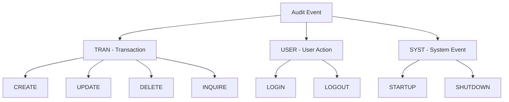
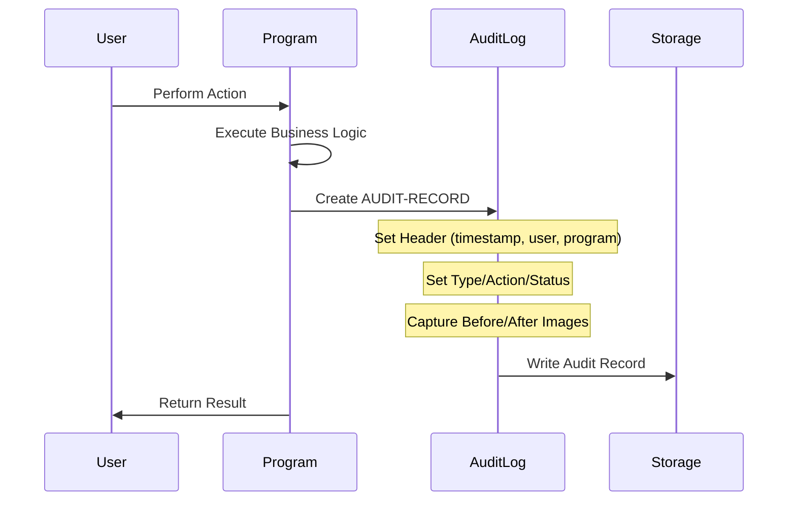

## Overview

AUDITLOG is a copybook that defines the Audit Trail Record structure used for comprehensive logging of system activities. It captures transactions, user actions, and system events with supporting context such as timestamps, user identification, and before/after data images.

The copybook provides a standardized format for audit records across the system, enabling consistent tracking of who did what, when, and from where. It supports three categories of auditable events: business transactions, user actions (like login/logout), and system events (like startup/shutdown).

This structure is essential for security compliance, troubleshooting, and maintaining a complete audit trail of all significant activities within the portfolio management system.

## Record Layout

```
+------------------------------------------------------------------+
| AUD-HEADER (58)                                                   |
+------------------------------------------------------------------+
| Timestamp | System | User | Program | Terminal |
|   (26)    |  (8)   | (8)  |   (8)   |   (8)    |
+------------------------------------------------------------------+
| AUD-TYPE | AUD-ACTION | AUD-STATUS | AUD-KEY-INFO |
|   (4)    |    (8)     |    (4)     |     (18)     |
+------------------------------------------------------------------+
| AUD-BEFORE-IMAGE | AUD-AFTER-IMAGE | AUD-MESSAGE |
|      (100)       |      (100)      |    (100)    |
+------------------------------------------------------------------+
```

**Total Record Length: 392 bytes**

## Data Structure

### AUDIT-RECORD (01 Level)

| Level | Name | Picture | Bytes | Description |
|-------|------|---------|-------|-------------|
| 01 | AUDIT-RECORD | | 392 | Complete audit trail record |

### AUD-HEADER (Context Information)

| Level | Name | Picture | Bytes | Description |
|-------|------|---------|-------|-------------|
| 05 | AUD-HEADER | | 58 | Audit context header |
| 10 | AUD-TIMESTAMP | X(26) | 26 | When the event occurred |
| 10 | AUD-SYSTEM-ID | X(8) | 8 | System/subsystem identifier |
| 10 | AUD-USER-ID | X(8) | 8 | User who performed the action |
| 10 | AUD-PROGRAM | X(8) | 8 | Program that generated the audit |
| 10 | AUD-TERMINAL | X(8) | 8 | Terminal/session identifier |

### AUD-TYPE (Event Category)

| Level | Name | Picture | Bytes | Description |
|-------|------|---------|-------|-------------|
| 05 | AUD-TYPE | X(4) | 4 | Category of auditable event |

**Type Values (88-level conditions):**

| Value | Condition Name | Description |
|-------|----------------|-------------|
| `TRAN` | AUD-TRANSACTION | Business transaction |
| `USER` | AUD-USER-ACTION | User action (login, logout) |
| `SYST` | AUD-SYSTEM-EVENT | System event (startup, shutdown) |

### AUD-ACTION (Specific Action)

| Level | Name | Picture | Bytes | Description |
|-------|------|---------|-------|-------------|
| 05 | AUD-ACTION | X(8) | 8 | Specific action performed |

**Action Values (88-level conditions):**

| Value | Condition Name | Category | Description |
|-------|----------------|----------|-------------|
| `CREATE  ` | AUD-CREATE | TRAN | Record created |
| `UPDATE  ` | AUD-UPDATE | TRAN | Record modified |
| `DELETE  ` | AUD-DELETE | TRAN | Record deleted |
| `INQUIRE ` | AUD-INQUIRE | TRAN | Record viewed |
| `LOGIN   ` | AUD-LOGIN | USER | User logged in |
| `LOGOUT  ` | AUD-LOGOUT | USER | User logged out |
| `STARTUP ` | AUD-STARTUP | SYST | System started |
| `SHUTDOWN` | AUD-SHUTDOWN | SYST | System stopped |

### AUD-STATUS (Outcome)

| Level | Name | Picture | Bytes | Description |
|-------|------|---------|-------|-------------|
| 05 | AUD-STATUS | X(4) | 4 | Outcome of the action |

**Status Values (88-level conditions):**

| Value | Condition Name | Description |
|-------|----------------|-------------|
| `SUCC` | AUD-SUCCESS | Action completed successfully |
| `FAIL` | AUD-FAILURE | Action failed |
| `WARN` | AUD-WARNING | Action completed with warnings |

### AUD-KEY-INFO (Business Context)

| Level | Name | Picture | Bytes | Description |
|-------|------|---------|-------|-------------|
| 05 | AUD-KEY-INFO | | 18 | Business key information |
| 10 | AUD-PORTFOLIO-ID | X(8) | 8 | Portfolio identifier |
| 10 | AUD-ACCOUNT-NO | X(10) | 10 | Account number |

### Data Image Fields

| Level | Name | Picture | Bytes | Description |
|-------|------|---------|-------|-------------|
| 05 | AUD-BEFORE-IMAGE | X(100) | 100 | Data state before change |
| 05 | AUD-AFTER-IMAGE | X(100) | 100 | Data state after change |
| 05 | AUD-MESSAGE | X(100) | 100 | Descriptive message |

## Event Type Hierarchy



## Audit Flow



## Usage Patterns

### Logging a Transaction (CREATE)

```cobol
INITIALIZE AUDIT-RECORD

* Set header information
MOVE FUNCTION CURRENT-DATE TO AUD-TIMESTAMP
MOVE 'PORTFOLIO'           TO AUD-SYSTEM-ID
MOVE WS-USER-ID            TO AUD-USER-ID
MOVE 'PORTADD '            TO AUD-PROGRAM
MOVE WS-TERMINAL-ID        TO AUD-TERMINAL

* Set event details
SET AUD-TRANSACTION        TO TRUE
SET AUD-CREATE             TO TRUE
SET AUD-SUCCESS            TO TRUE

* Set business context
MOVE PORT-ID               TO AUD-PORTFOLIO-ID
MOVE PORT-ACCOUNT-NO       TO AUD-ACCOUNT-NO

* Set data images
MOVE SPACES                TO AUD-BEFORE-IMAGE
MOVE PORT-RECORD           TO AUD-AFTER-IMAGE
MOVE 'New portfolio created' TO AUD-MESSAGE

CALL 'AUDPROC' USING AUDIT-RECORD
```

### Logging a User Login

```cobol
INITIALIZE AUDIT-RECORD

MOVE FUNCTION CURRENT-DATE TO AUD-TIMESTAMP
MOVE 'SECURITY'            TO AUD-SYSTEM-ID
MOVE WS-USER-ID            TO AUD-USER-ID
MOVE 'SECMGR  '            TO AUD-PROGRAM
MOVE EIBTRMID              TO AUD-TERMINAL

SET AUD-USER-ACTION        TO TRUE
SET AUD-LOGIN              TO TRUE
SET AUD-SUCCESS            TO TRUE

MOVE SPACES                TO AUD-PORTFOLIO-ID
MOVE SPACES                TO AUD-ACCOUNT-NO
MOVE SPACES                TO AUD-BEFORE-IMAGE
MOVE SPACES                TO AUD-AFTER-IMAGE
MOVE 'User login successful' TO AUD-MESSAGE

CALL 'AUDPROC' USING AUDIT-RECORD
```

### Logging a Failed Action

```cobol
INITIALIZE AUDIT-RECORD

MOVE FUNCTION CURRENT-DATE TO AUD-TIMESTAMP
MOVE 'PORTFOLIO'           TO AUD-SYSTEM-ID
MOVE WS-USER-ID            TO AUD-USER-ID
MOVE 'PORTUPDT'            TO AUD-PROGRAM
MOVE WS-TERMINAL-ID        TO AUD-TERMINAL

SET AUD-TRANSACTION        TO TRUE
SET AUD-UPDATE             TO TRUE
SET AUD-FAILURE            TO TRUE

MOVE PORT-ID               TO AUD-PORTFOLIO-ID
MOVE PORT-ACCOUNT-NO       TO AUD-ACCOUNT-NO

MOVE WS-ORIGINAL-RECORD    TO AUD-BEFORE-IMAGE
MOVE SPACES                TO AUD-AFTER-IMAGE
STRING 'Update failed: ' DELIMITED SIZE
       WS-ERROR-MESSAGE DELIMITED SIZE
  INTO AUD-MESSAGE

CALL 'AUDPROC' USING AUDIT-RECORD
```

### Logging a System Event

```cobol
INITIALIZE AUDIT-RECORD

MOVE FUNCTION CURRENT-DATE TO AUD-TIMESTAMP
MOVE 'BATCH   '            TO AUD-SYSTEM-ID
MOVE 'SYSTEM  '            TO AUD-USER-ID
MOVE 'BCHCTL00'            TO AUD-PROGRAM
MOVE 'BATCH   '            TO AUD-TERMINAL

SET AUD-SYSTEM-EVENT       TO TRUE
SET AUD-STARTUP            TO TRUE
SET AUD-SUCCESS            TO TRUE

MOVE SPACES                TO AUD-KEY-INFO
MOVE SPACES                TO AUD-BEFORE-IMAGE
MOVE SPACES                TO AUD-AFTER-IMAGE
MOVE 'Batch processing started' TO AUD-MESSAGE

CALL 'AUDPROC' USING AUDIT-RECORD
```

## Image Field Usage by Action

| Action | Before Image | After Image |
|--------|--------------|-------------|
| CREATE | Spaces | New record data |
| UPDATE | Original record | Modified record |
| DELETE | Deleted record | Spaces |
| INQUIRE | Spaces | Viewed record (optional) |
| LOGIN | Spaces | Spaces |
| LOGOUT | Spaces | Spaces |
| STARTUP | Spaces | System parameters |
| SHUTDOWN | System state | Spaces |

## Programs Using This Copybook

| Program | Description | Usage |
|---------|-------------|-------|
| RPTAUD00 | Audit Report Generator | Reads and reports on audit records |
| AUDPROC | Audit Processor | Writes audit records to storage |
| PORTTRAN | Portfolio Transaction Processing | Logs transaction audit records |

## Related Copybooks

| Copybook | Relationship |
|----------|-------------|
| HISTREC | History records (detailed before/after images) |
| ERRHAND | Error handling (logs may generate audit entries) |
| ERRHND | Online error handling (CICS programs) |

## DB2 Table Mapping

```sql
CREATE TABLE AUDIT_LOG (
    AUDIT_TIMESTAMP   TIMESTAMP     NOT NULL,
    SYSTEM_ID         CHAR(8)       NOT NULL,
    USER_ID           CHAR(8)       NOT NULL,
    PROGRAM_ID        CHAR(8)       NOT NULL,
    TERMINAL_ID       CHAR(8),
    AUDIT_TYPE        CHAR(4)       NOT NULL,
    AUDIT_ACTION      CHAR(8)       NOT NULL,
    AUDIT_STATUS      CHAR(4)       NOT NULL,
    PORTFOLIO_ID      CHAR(8),
    ACCOUNT_NO        CHAR(10),
    BEFORE_IMAGE      VARCHAR(100),
    AFTER_IMAGE       VARCHAR(100),
    MESSAGE           VARCHAR(100),
    PRIMARY KEY (AUDIT_TIMESTAMP, SYSTEM_ID, USER_ID, PROGRAM_ID)
);

CREATE INDEX AUDIT_USER_IDX ON AUDIT_LOG (USER_ID, AUDIT_TIMESTAMP);
CREATE INDEX AUDIT_PORT_IDX ON AUDIT_LOG (PORTFOLIO_ID, AUDIT_TIMESTAMP);
```

## Technical Notes

1. **Timestamp Format**: AUD-TIMESTAMP uses the 26-character format from `FUNCTION CURRENT-DATE` (YYYYMMDDHHMMSSNNNNNN±HHMM), providing microsecond precision with timezone offset.

2. **Padded Values**: Action values are padded to 8 characters (e.g., `'CREATE  '`) to ensure consistent field length. Use condition names rather than literals for comparisons.

3. **Image Size**: The 100-byte before/after image fields may truncate larger records. For complete data capture, use HISTREC which has 400-byte image fields.

4. **Inquiry Logging**: INQUIRE actions typically don't populate before/after images unless required for security compliance (tracking what data was viewed).

5. **Batch vs Online**: 
   - Online programs: AUD-TERMINAL contains CICS terminal ID (EIBTRMID)
   - Batch programs: AUD-TERMINAL typically contains 'BATCH' or job name

6. **System Events**: For STARTUP/SHUTDOWN events:
   - AUD-USER-ID may contain 'SYSTEM' or the operator ID
   - AUD-KEY-INFO is typically spaces
   - AUD-MESSAGE contains descriptive event information

7. **Audit Retention**: Audit records should be retained according to regulatory requirements. Consider:
   - Archiving old records to cheaper storage
   - Maintaining indexes for efficient querying
   - Implementing retention policies

8. **Performance**: High-volume systems should consider:
   - Asynchronous audit logging
   - Buffered writes
   - Separate audit database/tablespace
