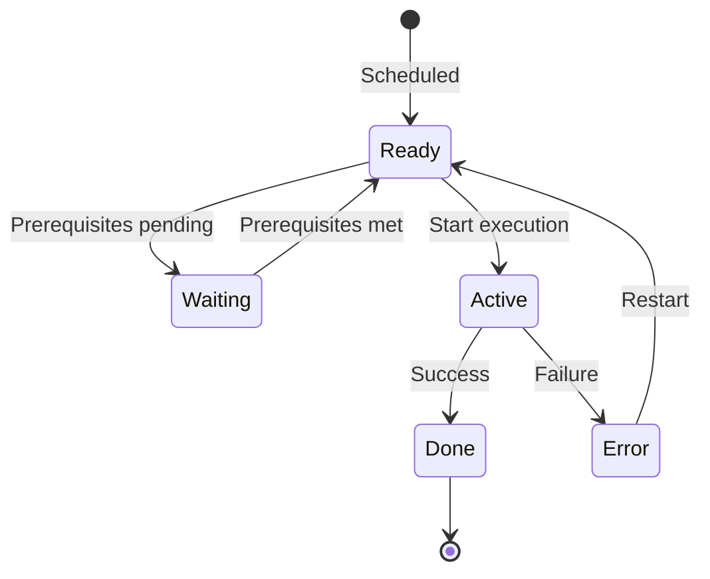

## Overview

BCHCON (Batch Control Constants) is a copybook that defines standard constant values used throughout the batch processing subsystem. It provides a centralized repository of process status codes, return code thresholds, control parameters, process type identifiers, dependency types, and standard messages.

By centralizing these constants in a single copybook, BCHCON ensures consistency across all batch programs and simplifies maintenance when values need to be changed. Programs include this copybook in their WORKING-STORAGE SECTION to access the predefined constant values.

## Data Structure

### Root Structure

```
01  BATCH-CONTROL-CONSTANTS
    05  BCT-STAT-VALUES        - Process status codes
    05  BCT-RC-THRESHOLDS      - Return code thresholds
    05  BCT-CTRL-VALUES        - Process control parameters
    05  BCT-PROC-TYPES         - Process type identifiers
    05  BCT-DEP-TYPES          - Dependency type codes
    05  BCT-PROC-NAMES         - Special process names
    05  BCT-REC-TYPES          - Control file record types
    05  BCT-MESSAGES           - Standard status messages
```

## Field Definitions

### Process Status Values (BCT-STAT-VALUES)

Status codes indicating the current state of a batch process:

| Field | Picture | Value | Description |
|-------|---------|-------|-------------|
| BCT-STAT-READY | X(1) | 'R' | Process is ready to run |
| BCT-STAT-ACTIVE | X(1) | 'A' | Process is currently executing |
| BCT-STAT-WAITING | X(1) | 'W' | Process is waiting for prerequisites |
| BCT-STAT-DONE | X(1) | 'D' | Process completed successfully |
| BCT-STAT-ERROR | X(1) | 'E' | Process ended with error |

**State Transition Diagram:**



### Return Code Thresholds (BCT-RC-THRESHOLDS)

Standard return code values aligned with mainframe conventions:

| Field | Picture | Value | Description |
|-------|---------|-------|-------------|
| BCT-RC-SUCCESS | S9(4) COMP | +0 | Successful completion |
| BCT-RC-WARNING | S9(4) COMP | +4 | Completed with warnings |
| BCT-RC-ERROR | S9(4) COMP | +8 | Error occurred |
| BCT-RC-SEVERE | S9(4) COMP | +12 | Severe error |
| BCT-RC-CRITICAL | S9(4) COMP | +16 | Critical/fatal error |

**Return Code Interpretation:**

| Range | Interpretation | Action |
|-------|----------------|--------|
| 0 | Success | Continue normal processing |
| 1-4 | Warning | Continue but review logs |
| 5-8 | Error | Dependent jobs may be held |
| 9-12 | Severe | Immediate attention required |
| 13-16 | Critical | Job stream stopped |

### Process Control Values (BCT-CTRL-VALUES)

Configurable parameters for batch process control:

| Field | Picture | Value | Description |
|-------|---------|-------|-------------|
| BCT-MAX-PREREQ | 9(2) COMP | 10 | Maximum number of prerequisites per process |
| BCT-MAX-RESTARTS | 9(2) COMP | 3 | Maximum restart attempts before manual intervention |
| BCT-WAIT-INTERVAL | 9(4) COMP | 300 | Seconds between status checks (5 minutes) |
| BCT-MAX-WAIT-TIME | 9(4) COMP | 3600 | Maximum wait time in seconds (1 hour) |

### Process Types (BCT-PROC-TYPES)

Codes identifying the category of a batch process:

| Field | Picture | Value | Description |
|-------|---------|-------|-------------|
| BCT-TYPE-INITIAL | X(3) | 'INI' | Initialization process |
| BCT-TYPE-UPDATE | X(3) | 'UPD' | Update/maintenance process |
| BCT-TYPE-REPORT | X(3) | 'RPT' | Reporting process |
| BCT-TYPE-CLEANUP | X(3) | 'CLN' | Cleanup/housekeeping process |

**Typical Execution Order:**


### Dependency Types (BCT-DEP-TYPES)

Codes defining how process dependencies are enforced:

| Field | Picture | Value | Description |
|-------|---------|-------|-------------|
| BCT-DEP-REQUIRED | X(1) | 'R' | Required - must complete successfully |
| BCT-DEP-OPTIONAL | X(1) | 'O' | Optional - proceed even if failed |
| BCT-DEP-EXCLUSIVE | X(1) | 'X' | Exclusive - cannot run concurrently |

**Dependency Rules:**

- **Required (R)**: The dependent process will not start until the prerequisite completes with RC ≤ 4
- **Optional (O)**: The dependent process starts regardless of prerequisite status
- **Exclusive (X)**: Processes with exclusive dependencies cannot run at the same time

### Special Process Names (BCT-PROC-NAMES)

Reserved process names for system-level operations:

| Field | Picture | Value | Description |
|-------|---------|-------|-------------|
| BCT-START-OF-DAY | X(8) | 'STARTDAY' | Beginning of day initialization |
| BCT-END-OF-DAY | X(8) | 'ENDDAY' | End of day processing |
| BCT-EMERGENCY | X(8) | 'EMERGENCY' | Emergency/recovery processing |

### Control File Record Types (BCT-REC-TYPES)

Record type identifiers for batch control files:

| Field | Picture | Value | Description |
|-------|---------|-------|-------------|
| BCT-REC-CONTROL | X(1) | 'C' | Control/header record |
| BCT-REC-PROCESS | X(1) | 'P' | Process definition record |
| BCT-REC-DEPEND | X(1) | 'D' | Dependency definition record |
| BCT-REC-HISTORY | X(1) | 'H' | Historical execution record |

### Standard Messages (BCT-MESSAGES)

Predefined messages for consistent status reporting:

| Field | Picture | Value | Description |
|-------|---------|-------|-------------|
| BCT-MSG-STARTING | X(30) | 'Process starting...' | Process initiation message |
| BCT-MSG-COMPLETE | X(30) | 'Process completed successfully' | Successful completion message |
| BCT-MSG-FAILED | X(30) | 'Process failed - check errors' | Failure notification message |
| BCT-MSG-WAITING | X(30) | 'Waiting for prerequisites' | Waiting status message |

## Usage

### Including the Copybook

```cobol
WORKING-STORAGE SECTION.
    COPY BCHCON.
```

### Example: Checking Return Codes

```cobol
IF WS-RETURN-CODE > BCT-RC-WARNING
    MOVE BCT-STAT-ERROR TO WS-PROCESS-STATUS
    DISPLAY BCT-MSG-FAILED
ELSE
    MOVE BCT-STAT-DONE TO WS-PROCESS-STATUS
    DISPLAY BCT-MSG-COMPLETE
END-IF
```

### Example: Setting Process Status

```cobol
EVALUATE TRUE
    WHEN PROCESS-READY
        MOVE BCT-STAT-READY TO CTL-PROCESS-STATUS
    WHEN PROCESS-RUNNING
        MOVE BCT-STAT-ACTIVE TO CTL-PROCESS-STATUS
    WHEN PROCESS-WAITING
        MOVE BCT-STAT-WAITING TO CTL-PROCESS-STATUS
        DISPLAY BCT-MSG-WAITING
END-EVALUATE
```

### Example: Checking Dependencies

```cobol
IF DEP-TYPE = BCT-DEP-REQUIRED
    IF PREREQ-STATUS NOT = BCT-STAT-DONE
        SET CANNOT-START TO TRUE
    END-IF
END-IF

IF DEP-TYPE = BCT-DEP-EXCLUSIVE
    IF PREREQ-STATUS = BCT-STAT-ACTIVE
        SET CANNOT-START TO TRUE
    END-IF
END-IF
```

## Programs Using This Copybook

| Program | Description |
|---------|-------------|
| BCHCTL00 | Batch control program - main scheduler |
| HISTLD00 | History load program |
| PRCSEQ00 | Sequential processing control |
| RCVPRC00 | Recovery processing |

## Related Copybooks

| Copybook | Relationship |
|----------|--------------|
| BCHCTL | Batch control record layout - uses BCHCON constants for status values |
| ERRHAND | Error handling - complements BCHCON return codes |

## Design Considerations

### Constant Naming Convention

All fields use the `BCT-` prefix (Batch Control) to:
- Clearly identify the source copybook
- Prevent naming conflicts with program variables
- Enable easy search across the codebase

### COMP Usage

Return code thresholds use `S9(4) COMP` (binary) format for:
- Efficient comparison operations
- Compatibility with system return codes
- Reduced storage (2 bytes vs 4 bytes for display)

### Value Standardization

The constants align with mainframe standards:
- Return codes follow IBM conventions (0, 4, 8, 12, 16)
- Wait intervals are in seconds for compatibility with system timers
- Status codes are single characters for efficient file storage

## Maintenance Notes

When modifying this copybook:

1. **Adding new status values**: Ensure single-character codes don't conflict with existing values
2. **Changing thresholds**: Update all dependent programs and documentation
3. **Adding messages**: Keep message length at 30 characters for consistent formatting
4. **Changing control values**: Consider impact on running batch schedules

## Version History

| Version | Date | Description |
|---------|------|-------------|
| 1.0 | 2024 | Initial creation |
