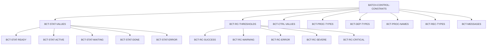
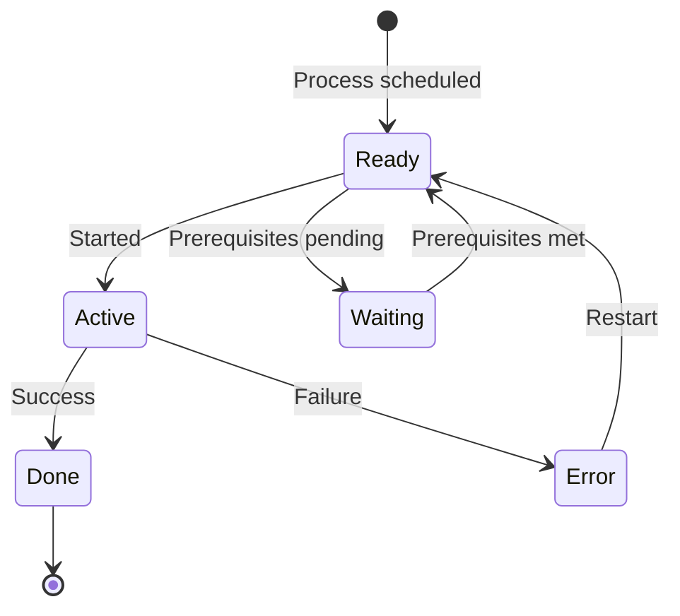

## Overview

BCHCON (Batch Control Constants) is a copybook that defines standard constants used across batch processing programs in the portfolio management system. It provides a centralized repository of constant values for process status tracking, return code thresholds, control parameters, and standard messages.

By centralizing these definitions in a copybook, the system ensures:
- **Consistency**: All batch programs use the same values for status codes and thresholds
- **Maintainability**: Changes to standard values only need to be made in one place
- **Readability**: Meaningful names instead of magic numbers throughout the code
- **Standards Compliance**: Enforced adherence to system-wide conventions

## Structure Diagram



## Data Definitions

### BATCH-CONTROL-CONSTANTS (Level 01)

The main group item containing all batch control constants.

### BCT-STAT-VALUES - Process Status Values

Status codes indicating the current state of a batch process.

| Level | Name | Picture | Value | Description |
|-------|------|---------|-------|-------------|
| 05 | BCT-STAT-VALUES | - | - | Process status group |
| 10 | BCT-STAT-READY | X(1) | 'R' | Process ready to run |
| 10 | BCT-STAT-ACTIVE | X(1) | 'A' | Process currently executing |
| 10 | BCT-STAT-WAITING | X(1) | 'W' | Process waiting for prerequisites |
| 10 | BCT-STAT-DONE | X(1) | 'D' | Process completed successfully |
| 10 | BCT-STAT-ERROR | X(1) | 'E' | Process ended with error |

**Status State Diagram:**



### BCT-RC-THRESHOLDS - Return Code Thresholds

Standard return code values following IBM z/OS conventions.

| Level | Name | Picture | Value | Description |
|-------|------|---------|-------|-------------|
| 05 | BCT-RC-THRESHOLDS | - | - | Return code group |
| 10 | BCT-RC-SUCCESS | S9(4) COMP | +0 | Successful completion |
| 10 | BCT-RC-WARNING | S9(4) COMP | +4 | Completed with warnings |
| 10 | BCT-RC-ERROR | S9(4) COMP | +8 | Error occurred |
| 10 | BCT-RC-SEVERE | S9(4) COMP | +12 | Severe error |
| 10 | BCT-RC-CRITICAL | S9(4) COMP | +16 | Critical failure |

**Return Code Decision Matrix:**

| Return Code | Continue Processing? | Requires Attention? | Typical Action |
|-------------|---------------------|---------------------|----------------|
| 0 (SUCCESS) | Yes | No | Continue normally |
| 4 (WARNING) | Yes | Optional | Log and continue |
| 8 (ERROR) | Conditional | Yes | Review and decide |
| 12 (SEVERE) | No | Yes | Stop and investigate |
| 16 (CRITICAL) | No | Immediate | Emergency response |

### BCT-CTRL-VALUES - Process Control Values

Operational parameters for batch process control.

| Level | Name | Picture | Value | Description |
|-------|------|---------|-------|-------------|
| 05 | BCT-CTRL-VALUES | - | - | Control values group |
| 10 | BCT-MAX-PREREQ | 9(2) COMP | 10 | Maximum prerequisites per process |
| 10 | BCT-MAX-RESTARTS | 9(2) COMP | 3 | Maximum restart attempts |
| 10 | BCT-WAIT-INTERVAL | 9(4) COMP | 300 | Wait interval in seconds (5 min) |
| 10 | BCT-MAX-WAIT-TIME | 9(4) COMP | 3600 | Maximum wait time in seconds (1 hr) |

### BCT-PROC-TYPES - Process Types

Classification codes for different types of batch processes.

| Level | Name | Picture | Value | Description |
|-------|------|---------|-------|-------------|
| 05 | BCT-PROC-TYPES | - | - | Process types group |
| 10 | BCT-TYPE-INITIAL | X(3) | 'INI' | Initialization process |
| 10 | BCT-TYPE-UPDATE | X(3) | 'UPD' | Update/maintenance process |
| 10 | BCT-TYPE-REPORT | X(3) | 'RPT' | Reporting process |
| 10 | BCT-TYPE-CLEANUP | X(3) | 'CLN' | Cleanup/housekeeping process |

### BCT-DEP-TYPES - Dependency Types

Classification codes for process dependencies.

| Level | Name | Picture | Value | Description |
|-------|------|---------|-------|-------------|
| 05 | BCT-DEP-TYPES | - | - | Dependency types group |
| 10 | BCT-DEP-REQUIRED | X(1) | 'R' | Required dependency (must complete) |
| 10 | BCT-DEP-OPTIONAL | X(1) | 'O' | Optional dependency (nice to have) |
| 10 | BCT-DEP-EXCLUSIVE | X(1) | 'X' | Exclusive (cannot run concurrently) |

**Dependency Type Behavior:**

| Type | Predecessor Failed | Predecessor Not Run | Predecessor Running |
|------|-------------------|---------------------|---------------------|
| Required | Block | Block | Wait |
| Optional | Continue | Continue | Continue |
| Exclusive | Continue | Continue | Wait |

### BCT-PROC-NAMES - Special Process Names

Reserved names for system-level batch processes.

| Level | Name | Picture | Value | Description |
|-------|------|---------|-------|-------------|
| 05 | BCT-PROC-NAMES | - | - | Process names group |
| 10 | BCT-START-OF-DAY | X(8) | 'STARTDAY' | Start-of-day initialization |
| 10 | BCT-END-OF-DAY | X(8) | 'ENDDAY' | End-of-day processing |
| 10 | BCT-EMERGENCY | X(8) | 'EMERGENCY' | Emergency/recovery process |

### BCT-REC-TYPES - Control File Record Types

Type codes for batch control file records.

| Level | Name | Picture | Value | Description |
|-------|------|---------|-------|-------------|
| 05 | BCT-REC-TYPES | - | - | Record types group |
| 10 | BCT-REC-CONTROL | X(1) | 'C' | Control record |
| 10 | BCT-REC-PROCESS | X(1) | 'P' | Process definition record |
| 10 | BCT-REC-DEPEND | X(1) | 'D' | Dependency definition record |
| 10 | BCT-REC-HISTORY | X(1) | 'H' | History/audit record |

### BCT-MESSAGES - Standard Messages

Pre-defined message text for consistent logging and display.

| Level | Name | Picture | Value | Description |
|-------|------|---------|-------|-------------|
| 05 | BCT-MESSAGES | - | - | Messages group |
| 10 | BCT-MSG-STARTING | X(30) | 'Process starting...' | Process initiation message |
| 10 | BCT-MSG-COMPLETE | X(30) | 'Process completed successfully' | Successful completion message |
| 10 | BCT-MSG-FAILED | X(30) | 'Process failed - check errors' | Failure message |
| 10 | BCT-MSG-WAITING | X(30) | 'Waiting for prerequisites' | Waiting status message |

## Usage

### Including the Copybook

```cobol
       WORKING-STORAGE SECTION.
           COPY BCHCON.
```

### Using Status Values

```cobol
       IF PROCESS-STATUS = BCT-STAT-READY
           PERFORM START-PROCESS
       END-IF
       
       IF PROCESS-STATUS = BCT-STAT-ERROR
           DISPLAY BCT-MSG-FAILED
           MOVE BCT-RC-ERROR TO WS-RETURN-CODE
       END-IF
```

### Checking Return Codes

```cobol
       IF WS-RETURN-CODE >= BCT-RC-ERROR
           SET PROCESS-FAILED TO TRUE
           PERFORM ERROR-HANDLING
       END-IF
       
       EVALUATE TRUE
           WHEN WS-RETURN-CODE = BCT-RC-SUCCESS
               DISPLAY BCT-MSG-COMPLETE
           WHEN WS-RETURN-CODE = BCT-RC-WARNING
               DISPLAY 'Completed with warnings'
           WHEN OTHER
               DISPLAY BCT-MSG-FAILED
       END-EVALUATE
```

### Managing Dependencies

```cobol
       IF DEP-TYPE = BCT-DEP-REQUIRED
           IF PREREQ-STATUS NOT = BCT-STAT-DONE
               SET MUST-WAIT TO TRUE
               MOVE BCT-STAT-WAITING TO PROCESS-STATUS
           END-IF
       END-IF
```

### Using Control Values

```cobol
       IF RESTART-COUNT > BCT-MAX-RESTARTS
           DISPLAY 'Maximum restarts exceeded'
           MOVE BCT-RC-CRITICAL TO WS-RETURN-CODE
           PERFORM ABORT-PROCESS
       END-IF
       
       IF WAIT-TIME > BCT-MAX-WAIT-TIME
           DISPLAY 'Maximum wait time exceeded'
           MOVE BCT-STAT-ERROR TO PROCESS-STATUS
       END-IF
```

## Programs Using This Copybook

| Program | Description |
|---------|-------------|
| BCHCTL00 | Batch control program - main scheduler |
| HISTLD00 | History load program |
| PRCSEQ00 | Process sequencing program |
| RCVPRC00 | Recovery processing program |

## Related Copybooks

| Copybook | Relationship |
|----------|--------------|
| BCHCTL | Batch control record layouts (uses BCHCON constants) |
| PRCSEQ | Process sequence definitions (uses BCHCON constants) |
| ERRHAND | Error handling definitions (complementary error codes) |

## Design Considerations

### COMP vs DISPLAY

Return code thresholds use `COMP` (binary) format for:
- Efficient comparison operations
- Compatibility with system return codes
- Proper handling of signed values

Status values use `DISPLAY` (character) format for:
- Human-readable control files
- Easy debugging and logging
- Compatibility with external systems

### Value Selection

The return code values (0, 4, 8, 12, 16) follow IBM z/OS conventions:
- Divisible by 4 for consistent threshold checking
- Allow for intermediate values if needed
- Compatible with JCL COND parameter

### Message Padding

Standard messages are padded to 30 characters:
- Ensures consistent log formatting
- Prevents truncation issues
- Allows for field overlays in reports

## Maintenance Notes

When modifying this copybook:

1. **Adding new status values**: Ensure uniqueness and update all programs checking status
2. **Changing thresholds**: Review all programs using these values for comparison logic
3. **Modifying messages**: Verify message length compatibility with display fields
4. **Adding control values**: Document defaults and ensure backward compatibility
