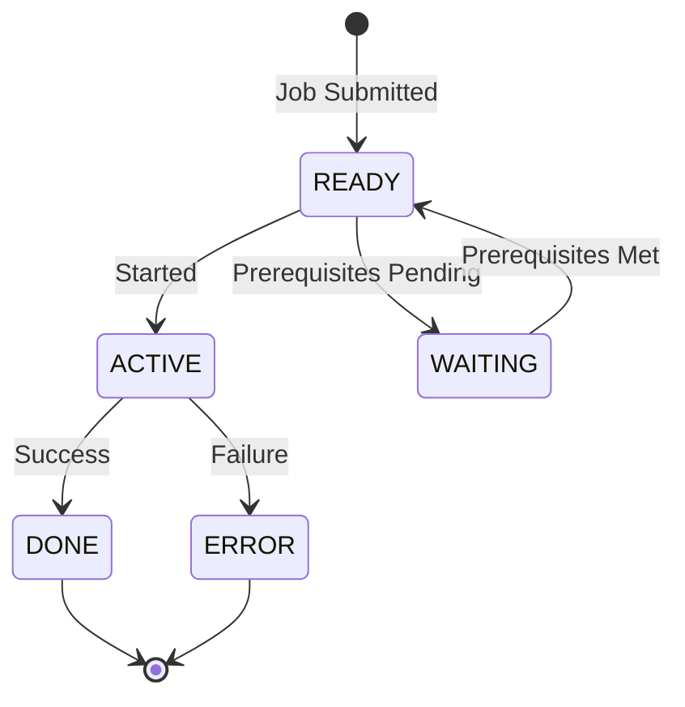
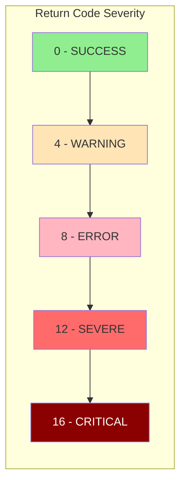

## Overview

BCHCON (Batch Control Constants) is a copybook that defines standardized constants used throughout the batch processing subsystem. It provides a centralized repository of values for process status indicators, return code thresholds, process control parameters, and standard messages.

By centralizing these constants in a single copybook, the batch processing programs maintain consistency in status codes, return values, and operational parameters. Changes to thresholds or values can be made in one place and automatically propagate to all programs that include this copybook.

## Data Structure

```
01  BATCH-CONTROL-CONSTANTS
    05  BCT-STAT-VALUES          Process status codes
    05  BCT-RC-THRESHOLDS        Return code values
    05  BCT-CTRL-VALUES          Control parameters
    05  BCT-PROC-TYPES           Process type codes
    05  BCT-DEP-TYPES            Dependency type codes
    05  BCT-PROC-NAMES           Special process names
    05  BCT-REC-TYPES            Record type codes
    05  BCT-MESSAGES             Standard messages
```

## Field Definitions

### BCT-STAT-VALUES - Process Status Codes

Status codes used to track the state of batch processes.

| Field | Picture | Value | Description |
|-------|---------|-------|-------------|
| BCT-STAT-READY | X(1) | 'R' | Process is ready to execute |
| BCT-STAT-ACTIVE | X(1) | 'A' | Process is currently executing |
| BCT-STAT-WAITING | X(1) | 'W' | Process is waiting for prerequisites |
| BCT-STAT-DONE | X(1) | 'D' | Process completed successfully |
| BCT-STAT-ERROR | X(1) | 'E' | Process completed with error |



### BCT-RC-THRESHOLDS - Return Code Values

Standard return codes aligned with IBM batch processing conventions.

| Field | Picture | Value | Description |
|-------|---------|-------|-------------|
| BCT-RC-SUCCESS | S9(4) COMP | +0 | Successful completion |
| BCT-RC-WARNING | S9(4) COMP | +4 | Completed with warnings |
| BCT-RC-ERROR | S9(4) COMP | +8 | Error occurred |
| BCT-RC-SEVERE | S9(4) COMP | +12 | Severe error |
| BCT-RC-CRITICAL | S9(4) COMP | +16 | Critical/terminal error |



### BCT-CTRL-VALUES - Process Control Parameters

Operational limits and timing parameters for batch control.

| Field | Picture | Value | Description |
|-------|---------|-------|-------------|
| BCT-MAX-PREREQ | 9(2) COMP | 10 | Maximum prerequisites per job |
| BCT-MAX-RESTARTS | 9(2) COMP | 3 | Maximum restart attempts |
| BCT-WAIT-INTERVAL | 9(4) COMP | 300 | Wait interval in seconds (5 min) |
| BCT-MAX-WAIT-TIME | 9(4) COMP | 3600 | Maximum wait time in seconds (1 hour) |

### BCT-PROC-TYPES - Process Type Codes

Codes identifying the category of batch process.

| Field | Picture | Value | Description |
|-------|---------|-------|-------------|
| BCT-TYPE-INITIAL | X(3) | 'INI' | Initialization process |
| BCT-TYPE-UPDATE | X(3) | 'UPD' | Update/maintenance process |
| BCT-TYPE-REPORT | X(3) | 'RPT' | Reporting process |
| BCT-TYPE-CLEANUP | X(3) | 'CLN' | Cleanup/housekeeping process |

### BCT-DEP-TYPES - Dependency Type Codes

Codes defining the nature of job dependencies.

| Field | Picture | Value | Description |
|-------|---------|-------|-------------|
| BCT-DEP-REQUIRED | X(1) | 'R' | Required dependency - must complete successfully |
| BCT-DEP-OPTIONAL | X(1) | 'O' | Optional dependency - proceed even if failed |
| BCT-DEP-EXCLUSIVE | X(1) | 'X' | Exclusive - cannot run concurrently |

### BCT-PROC-NAMES - Special Process Names

Reserved process names for system-level batch operations.

| Field | Picture | Value | Description |
|-------|---------|-------|-------------|
| BCT-START-OF-DAY | X(8) | 'STARTDAY' | Start-of-day initialization marker |
| BCT-END-OF-DAY | X(8) | 'ENDDAY' | End-of-day completion marker |
| BCT-EMERGENCY | X(8) | 'EMERGENCY' | Emergency/priority process marker |

### BCT-REC-TYPES - Record Type Codes

Codes identifying types of records in the batch control file.

| Field | Picture | Value | Description |
|-------|---------|-------|-------------|
| BCT-REC-CONTROL | X(1) | 'C' | Control record |
| BCT-REC-PROCESS | X(1) | 'P' | Process definition record |
| BCT-REC-DEPEND | X(1) | 'D' | Dependency definition record |
| BCT-REC-HISTORY | X(1) | 'H' | Historical/audit record |

### BCT-MESSAGES - Standard Messages

Pre-defined messages for consistent logging and display.

| Field | Picture | Value | Description |
|-------|---------|-------|-------------|
| BCT-MSG-STARTING | X(30) | 'Process starting...' | Process initiation message |
| BCT-MSG-COMPLETE | X(30) | 'Process completed successfully' | Success message |
| BCT-MSG-FAILED | X(30) | 'Process failed - check errors' | Failure message |
| BCT-MSG-WAITING | X(30) | 'Waiting for prerequisites' | Waiting status message |

## Usage Examples

### Setting Process Status

```cobol
WORKING-STORAGE SECTION.
    COPY BCHCON.

PROCEDURE DIVISION.
*   Set process to active when starting
    MOVE BCT-STAT-ACTIVE TO BCT-STATUS
    
*   Set process to done when complete
    IF process-successful
        MOVE BCT-STAT-DONE TO BCT-STATUS
    ELSE
        MOVE BCT-STAT-ERROR TO BCT-STATUS
    END-IF
```

### Checking Return Codes

```cobol
*   Evaluate return code severity
    EVALUATE TRUE
        WHEN WS-RETURN-CODE = BCT-RC-SUCCESS
            DISPLAY BCT-MSG-COMPLETE
        WHEN WS-RETURN-CODE = BCT-RC-WARNING
            DISPLAY 'Completed with warnings'
        WHEN WS-RETURN-CODE >= BCT-RC-ERROR
            DISPLAY BCT-MSG-FAILED
            PERFORM ERROR-HANDLING
    END-EVALUATE
```

### Using Control Parameters

```cobol
*   Check restart limit
    IF WS-RESTART-COUNT > BCT-MAX-RESTARTS
        MOVE BCT-STAT-ERROR TO BCT-STATUS
        MOVE 'Maximum restarts exceeded' TO ERR-TEXT
        PERFORM ERROR-ROUTINE
    END-IF
    
*   Check prerequisite count
    IF WS-PREREQ-COUNT > BCT-MAX-PREREQ
        MOVE 'Too many prerequisites defined' TO ERR-TEXT
        PERFORM ERROR-ROUTINE
    END-IF
```

### Identifying Process Types

```cobol
*   Route based on process type
    EVALUATE WS-PROCESS-TYPE
        WHEN BCT-TYPE-INITIAL
            PERFORM INITIALIZATION-PROCESSING
        WHEN BCT-TYPE-UPDATE
            PERFORM UPDATE-PROCESSING
        WHEN BCT-TYPE-REPORT
            PERFORM REPORT-PROCESSING
        WHEN BCT-TYPE-CLEANUP
            PERFORM CLEANUP-PROCESSING
    END-EVALUATE
```

## Programs Using This Copybook

| Program | Description |
|---------|-------------|
| [BCHCTL00](/docs/programs/BCHCTL00) | Batch Control Processor - Main batch control operations |
| [HISTLD00](/docs/programs/HISTLD00) | History Load - Historical data loading |
| [PRCSEQ00](/docs/programs/PRCSEQ00) | Process Sequencer - Job sequencing and scheduling |
| [RCVPRC00](/docs/programs/RCVPRC00) | Recovery Processor - Process recovery operations |

## Related Copybooks

| Copybook | Relationship |
|----------|--------------|
| [BCHCTL](/docs/copybooks/BCHCTL) | Uses status values from BCHCON for BCT-STATUS field |
| [ERRHAND](/docs/copybooks/ERRHAND) | Complementary error handling - uses similar return code patterns |
| [PRCSEQ](/docs/copybooks/PRCSEQ) | Process sequence definitions - uses process types |

## Technical Notes

### COMP Fields

The return code and control parameter fields use `COMP` (COMPUTATIONAL) format:
- Binary storage for efficient arithmetic operations
- S9(4) COMP = 2 bytes (halfword)
- 9(2) COMP = 2 bytes
- 9(4) COMP = 2 bytes

### Value Clause Initialization

All fields include VALUE clauses, so they are automatically initialized when the copybook is included. No explicit initialization is required in the using program.

### Return Code Alignment

The return codes follow IBM standard conventions:
- **0**: Success
- **4**: Warning (processing continued)
- **8**: Error (processing may have continued)
- **12**: Severe error (processing stopped)
- **16**: Critical error (immediate termination)

This alignment ensures compatibility with JCL COND parameters and standard batch job monitoring.

### Timing Values

Wait intervals are specified in seconds:
- BCT-WAIT-INTERVAL (300) = 5 minutes between checks
- BCT-MAX-WAIT-TIME (3600) = 1 hour maximum wait

These can be used with system timing facilities or polling loops.

## Best Practices

1. **Always use named constants** instead of literal values for status codes and return codes
2. **Compare against constants** rather than hardcoding values like 'R' or 8
3. **Use standard messages** for consistent logging across programs
4. **Respect control limits** (MAX-PREREQ, MAX-RESTARTS) for system stability
5. **Document deviations** if a program needs to override standard values

## Change Impact

Changes to this copybook affect all four programs that include it. When modifying:

| Change Type | Impact |
|-------------|--------|
| Adding new status value | Low - existing programs unaffected |
| Changing existing value | High - all programs need testing |
| Changing control limits | Medium - may affect runtime behavior |
| Adding new message | Low - existing programs unaffected |
