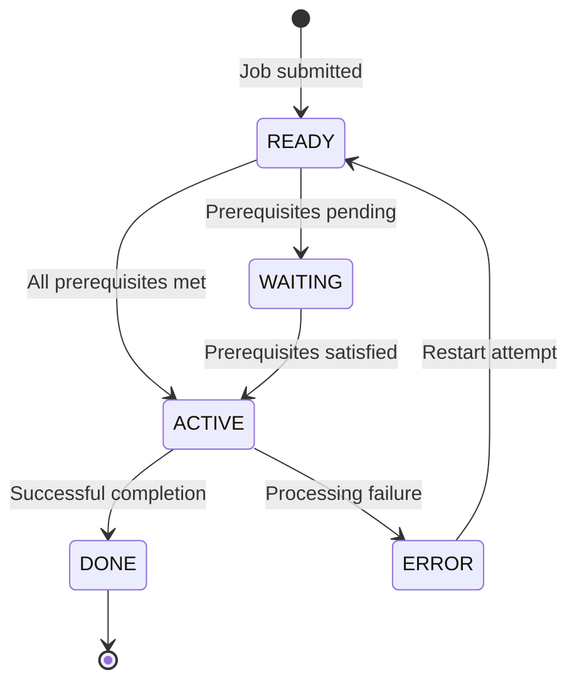

## Overview

BCHCON is a copybook that defines standardized constants used throughout the batch control system. It provides a centralized repository of constant values for process status tracking, return code thresholds, control parameters, and standard messages.

By centralizing these constants in a single copybook, the system ensures consistent values across all batch control programs and simplifies maintenance when values need to be changed.

## Data Structure

```
01  BATCH-CONTROL-CONSTANTS
    05  BCT-STAT-VALUES          - Process status constants
    05  BCT-RC-THRESHOLDS        - Return code threshold values
    05  BCT-CTRL-VALUES          - Process control parameters
    05  BCT-PROC-TYPES           - Process type identifiers
    05  BCT-DEP-TYPES            - Dependency type codes
    05  BCT-PROC-NAMES           - Special process names
    05  BCT-REC-TYPES            - Control file record types
    05  BCT-MESSAGES             - Standard status messages
```

## Field Definitions

### Process Status Values (BCT-STAT-VALUES)

Constants representing the possible states of a batch process:

| Field | Picture | Value | Description |
|-------|---------|-------|-------------|
| BCT-STAT-READY | X(1) | `'R'` | Process is ready to run |
| BCT-STAT-ACTIVE | X(1) | `'A'` | Process is currently executing |
| BCT-STAT-WAITING | X(1) | `'W'` | Process is waiting for prerequisites |
| BCT-STAT-DONE | X(1) | `'D'` | Process completed successfully |
| BCT-STAT-ERROR | X(1) | `'E'` | Process ended with error |

**Usage:** Compare against or assign to status fields in batch control records.

```cobol
IF BCT-STATUS = BCT-STAT-READY
    PERFORM START-PROCESS
END-IF

MOVE BCT-STAT-DONE TO BCT-STATUS
```

### Return Code Thresholds (BCT-RC-THRESHOLDS)

Standard return code values following mainframe conventions:

| Field | Picture | Value | Description |
|-------|---------|-------|-------------|
| BCT-RC-SUCCESS | S9(4) COMP | +0 | Successful completion |
| BCT-RC-WARNING | S9(4) COMP | +4 | Completed with warnings |
| BCT-RC-ERROR | S9(4) COMP | +8 | Error occurred |
| BCT-RC-SEVERE | S9(4) COMP | +12 | Severe error |
| BCT-RC-CRITICAL | S9(4) COMP | +16 | Critical failure |

**Usage:** Set RETURN-CODE or compare against return values.

```cobol
IF WS-ERRORS > 0
    MOVE BCT-RC-WARNING TO RETURN-CODE
ELSE
    MOVE BCT-RC-SUCCESS TO RETURN-CODE
END-IF
```

### Process Control Values (BCT-CTRL-VALUES)

Configuration parameters for batch process control:

| Field | Picture | Value | Description |
|-------|---------|-------|-------------|
| BCT-MAX-PREREQ | 9(2) COMP | 10 | Maximum prerequisite jobs allowed |
| BCT-MAX-RESTARTS | 9(2) COMP | 3 | Maximum restart attempts |
| BCT-WAIT-INTERVAL | 9(4) COMP | 300 | Wait interval in seconds (5 minutes) |
| BCT-MAX-WAIT-TIME | 9(4) COMP | 3600 | Maximum wait time in seconds (1 hour) |

**Usage:** Control loop limits and timeout values.

```cobol
IF WS-RESTART-COUNT > BCT-MAX-RESTARTS
    PERFORM TERMINATE-PROCESS
END-IF

IF WS-WAIT-TIME > BCT-MAX-WAIT-TIME
    PERFORM TIMEOUT-PROCESSING
END-IF
```

### Process Types (BCT-PROC-TYPES)

Identifiers for categorizing batch processes:

| Field | Picture | Value | Description |
|-------|---------|-------|-------------|
| BCT-TYPE-INITIAL | X(3) | `'INI'` | Initial/startup process |
| BCT-TYPE-UPDATE | X(3) | `'UPD'` | Update/maintenance process |
| BCT-TYPE-REPORT | X(3) | `'RPT'` | Report generation process |
| BCT-TYPE-CLEANUP | X(3) | `'CLN'` | Cleanup/housekeeping process |

**Usage:** Categorize processes for scheduling and prioritization.

```cobol
EVALUATE PSR-TYPE
    WHEN BCT-TYPE-INITIAL
        PERFORM PRIORITY-ONE-PROCESSING
    WHEN BCT-TYPE-REPORT
        PERFORM PRIORITY-THREE-PROCESSING
END-EVALUATE
```

### Dependency Types (BCT-DEP-TYPES)

Codes indicating the nature of job dependencies:

| Field | Picture | Value | Description |
|-------|---------|-------|-------------|
| BCT-DEP-REQUIRED | X(1) | `'R'` | Required dependency - must complete successfully |
| BCT-DEP-OPTIONAL | X(1) | `'O'` | Optional dependency - can proceed if not met |
| BCT-DEP-EXCLUSIVE | X(1) | `'X'` | Exclusive - cannot run concurrently |

**Usage:** Control prerequisite checking logic.

```cobol
IF PSR-DEP-TYPE = BCT-DEP-REQUIRED
    IF NOT PREREQ-SATISFIED
        SET CANNOT-PROCEED TO TRUE
    END-IF
END-IF
```

### Special Process Names (BCT-PROC-NAMES)

Reserved names for system-level processes:

| Field | Picture | Value | Description |
|-------|---------|-------|-------------|
| BCT-START-OF-DAY | X(8) | `'STARTDAY'` | Start-of-day initialization process |
| BCT-END-OF-DAY | X(8) | `'ENDDAY  '` | End-of-day finalization process |
| BCT-EMERGENCY | X(8) | `'EMERGENCY'` | Emergency/override process |

**Usage:** Identify special processing triggers.

```cobol
IF CTL-PROCESS-NAME = BCT-START-OF-DAY
    PERFORM DAILY-INITIALIZATION
END-IF
```

### Control File Record Types (BCT-REC-TYPES)

Identifiers for different record types in the batch control file:

| Field | Picture | Value | Description |
|-------|---------|-------|-------------|
| BCT-REC-CONTROL | X(1) | `'C'` | Control/header record |
| BCT-REC-PROCESS | X(1) | `'P'` | Process definition record |
| BCT-REC-DEPEND | X(1) | `'D'` | Dependency definition record |
| BCT-REC-HISTORY | X(1) | `'H'` | History/audit record |

**Usage:** Route processing based on record type.

```cobol
EVALUATE CTL-RECORD-TYPE
    WHEN BCT-REC-CONTROL
        PERFORM PROCESS-CONTROL-RECORD
    WHEN BCT-REC-PROCESS
        PERFORM PROCESS-DEFINITION-RECORD
    WHEN BCT-REC-DEPEND
        PERFORM PROCESS-DEPENDENCY-RECORD
    WHEN BCT-REC-HISTORY
        PERFORM PROCESS-HISTORY-RECORD
END-EVALUATE
```

### Standard Messages (BCT-MESSAGES)

Pre-defined messages for common process states:

| Field | Picture | Value | Description |
|-------|---------|-------|-------------|
| BCT-MSG-STARTING | X(30) | `'Process starting...'` | Process initiation message |
| BCT-MSG-COMPLETE | X(30) | `'Process completed successfully'` | Successful completion message |
| BCT-MSG-FAILED | X(30) | `'Process failed - check errors'` | Failure notification message |
| BCT-MSG-WAITING | X(30) | `'Waiting for prerequisites'` | Waiting state message |

**Usage:** Provide consistent status messages.

```cobol
MOVE BCT-MSG-STARTING TO WS-STATUS-MESSAGE
PERFORM WRITE-LOG-ENTRY

IF WS-PROCESS-OK
    MOVE BCT-MSG-COMPLETE TO WS-STATUS-MESSAGE
ELSE
    MOVE BCT-MSG-FAILED TO WS-STATUS-MESSAGE
END-IF
```

## Constants Summary

### Status State Diagram



### Return Code Hierarchy

```
┌─────────────────────────────────────────────────────────┐
│  Return Code Severity Levels                            │
├─────────────────────────────────────────────────────────┤
│  0  │ SUCCESS  │ ████████████████████ │ Normal         │
│  4  │ WARNING  │ ████████████████     │ Minor issues   │
│  8  │ ERROR    │ ████████████         │ Errors         │
│ 12  │ SEVERE   │ ████████             │ Severe errors  │
│ 16  │ CRITICAL │ ████                 │ Critical fail  │
└─────────────────────────────────────────────────────────┘
```

## Usage

### Including the Copybook

```cobol
WORKING-STORAGE SECTION.
    COPY BCHCON.
```

### Common Patterns

#### Setting Process Status
```cobol
* Mark process as active
MOVE BCT-STAT-ACTIVE TO BCT-STATUS

* After completion
IF WS-ERRORS = 0
    MOVE BCT-STAT-DONE TO BCT-STATUS
ELSE
    MOVE BCT-STAT-ERROR TO BCT-STATUS
END-IF
```

#### Return Code Evaluation
```cobol
EVALUATE TRUE
    WHEN RETURN-CODE = BCT-RC-SUCCESS
        CONTINUE
    WHEN RETURN-CODE <= BCT-RC-WARNING
        PERFORM LOG-WARNING
    WHEN RETURN-CODE <= BCT-RC-ERROR
        PERFORM LOG-ERROR
    WHEN OTHER
        PERFORM CRITICAL-ERROR-HANDLER
END-EVALUATE
```

#### Timeout Checking
```cobol
IF WS-ELAPSED-SECONDS > BCT-MAX-WAIT-TIME
    MOVE BCT-MSG-FAILED TO WS-STATUS-MESSAGE
    MOVE BCT-STAT-ERROR TO BCT-STATUS
    MOVE BCT-RC-ERROR TO RETURN-CODE
END-IF
```

## Programs Using This Copybook

| Program | Description |
|---------|-------------|
| [BCHCTL00](/docs/programs/BCHCTL00) | Batch Control Processor - manages job lifecycle |
| [HISTLD00](/docs/programs/HISTLD00) | History Load - loads historical data |
| [PRCSEQ00](/docs/programs/PRCSEQ00) | Process Sequencing - manages job sequences |
| [RCVPRC00](/docs/programs/RCVPRC00) | Recovery Processor - handles job recovery |

## Related Copybooks

| Copybook | Relationship |
|----------|--------------|
| BCHCTL | Batch control file record layout - uses status values from BCHCON |
| PRCSEQ | Process sequence definitions - uses process types from BCHCON |
| ERRHAND | Error handling - complements return code handling |

## Technical Notes

- All constants are defined with `VALUE` clauses, making them compile-time constants
- **COMP** (binary) format is used for numeric values for efficient comparison operations
- Status values are single characters for compact storage in control records
- Return codes follow standard IBM mainframe conventions (multiples of 4)
- Message fields are 30 characters to fit standard display widths
- The copybook defines only constants (no 88-level conditions) - consuming programs should define their own conditions if needed
