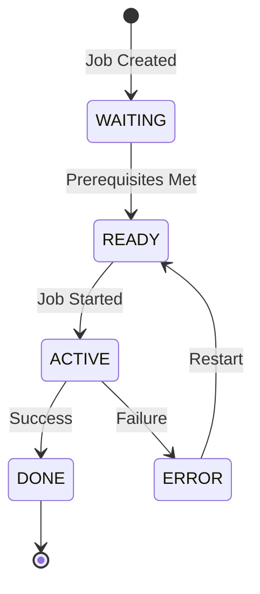
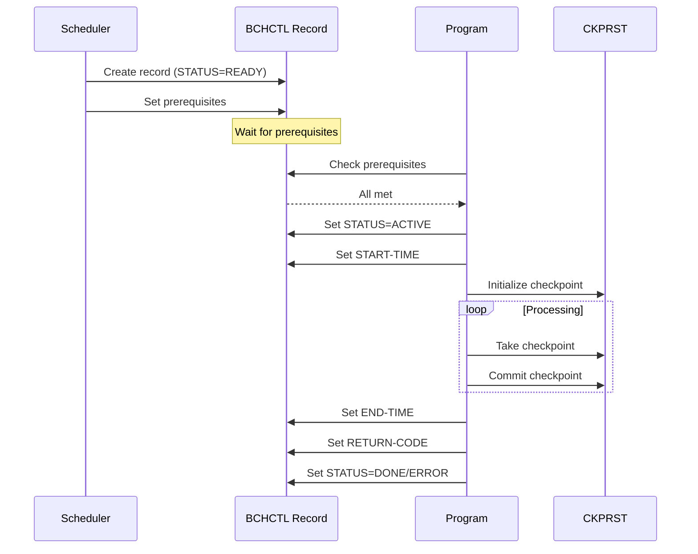

## Overview

BCHCTL is a copybook that defines the Batch Control Record structure used for managing job-level sequencing and dependencies in batch processing. It provides a standardized format for tracking job status, managing prerequisites between jobs, and recording execution statistics.

This copybook works in conjunction with CKPRST (Checkpoint/Restart) to provide a complete batch management solution:
- **BCHCTL** handles job-level control and sequencing
- **CKPRST** handles program-level checkpointing within a job

The batch control record enables sophisticated job scheduling scenarios including dependency management, restart tracking, and execution monitoring.

## Record Layout

### BATCH-CONTROL-RECORD

```
+------------------+------------------------------------------+
|     BCT-KEY      |              BCT-DATA                    |
|    (20 bytes)    |                                          |
+------------------+------------------------------------------+
| BCT-STATISTICS   |            BCT-FILLER                    |
|    (56 bytes)    |             (50 bytes)                   |
+------------------+------------------------------------------+
```

**Total Record Length:** Approximately 370 bytes

## Data Structure

### BCT-KEY (Record Key)

| Level | Name | Picture | Length | Description |
|-------|------|---------|--------|-------------|
| 05 | BCT-KEY | - | 20 | Composite record key |
| 10 | BCT-JOB-NAME | X(8) | 8 | Job name identifier |
| 10 | BCT-PROCESS-DATE | X(8) | 8 | Processing date (YYYYMMDD) |
| 10 | BCT-SEQUENCE-NO | 9(4) | 4 | Sequence number within job |

The key uniquely identifies a batch control record by combining the job name, processing date, and sequence number. This allows multiple steps within the same job to be tracked independently.

### BCT-DATA (Control Information)

#### BCT-STATUS

| Level | Name | Picture | Description |
|-------|------|---------|-------------|
| 10 | BCT-STATUS | X(1) | Current job/step status |

**Status Values (88-level conditions):**

| Condition | Value | Description |
|-----------|-------|-------------|
| BCT-STATUS-READY | R | Ready to execute, prerequisites met |
| BCT-STATUS-ACTIVE | A | Currently executing |
| BCT-STATUS-WAITING | W | Waiting for prerequisites |
| BCT-STATUS-DONE | D | Completed successfully |
| BCT-STATUS-ERROR | E | Completed with error |



#### BCT-PROCESS-CONTROL

| Level | Name | Picture | Length | Description |
|-------|------|---------|--------|-------------|
| 10 | BCT-PROCESS-CONTROL | - | 32 | Process control group |
| 15 | BCT-STEP-NAME | X(8) | 8 | JCL step name |
| 15 | BCT-PROGRAM-NAME | X(8) | 8 | Executing program name |
| 15 | BCT-START-TIME | X(8) | 8 | Execution start time (HHMMSSTH) |
| 15 | BCT-END-TIME | X(8) | 8 | Execution end time (HHMMSSTH) |

#### BCT-DEPENDENCIES

| Level | Name | Picture | Length | Description |
|-------|------|---------|--------|-------------|
| 10 | BCT-DEPENDENCIES | - | 122 | Dependencies group |
| 15 | BCT-PREREQ-COUNT | 9(2) COMP | 2 | Number of prerequisites |
| 15 | BCT-PREREQ-JOBS | OCCURS 10 | 120 | Array of prerequisite jobs |
| 20 | BCT-PREREQ-NAME | X(8) | 8 | Prerequisite job name |
| 20 | BCT-PREREQ-SEQ | 9(4) | 4 | Prerequisite sequence number |
| 20 | BCT-PREREQ-RC | S9(4) COMP | 2 | Required return code |

The dependencies structure supports up to 10 prerequisite jobs. Each prerequisite specifies:
- The job name that must complete
- The sequence number within that job
- The maximum acceptable return code

#### BCT-RETURN-INFO

| Level | Name | Picture | Length | Description |
|-------|------|---------|--------|-------------|
| 10 | BCT-RETURN-INFO | - | 82 | Return information group |
| 15 | BCT-RETURN-CODE | S9(4) COMP | 2 | Program return code |
| 15 | BCT-ERROR-DESC | X(80) | 80 | Error description text |

### BCT-STATISTICS

| Level | Name | Picture | Length | Description |
|-------|------|---------|--------|-------------|
| 05 | BCT-STATISTICS | - | 56 | Execution statistics group |
| 10 | BCT-RESTART-COUNT | 9(2) COMP | 2 | Number of restart attempts |
| 10 | BCT-ATTEMPT-TS | X(26) | 26 | Last attempt timestamp |
| 10 | BCT-COMPLETE-TS | X(26) | 26 | Completion timestamp |

### BCT-FILLER

| Level | Name | Picture | Length | Description |
|-------|------|---------|--------|-------------|
| 05 | BCT-FILLER | X(50) | 50 | Reserved for future use |

## Usage Pattern

### Typical Workflow



### Example: Checking Prerequisites

```cobol
* Check if all prerequisites are complete
PERFORM VARYING WS-IDX FROM 1 BY 1
        UNTIL WS-IDX > BCT-PREREQ-COUNT
    MOVE BCT-PREREQ-NAME(WS-IDX) TO WS-LOOKUP-JOB
    MOVE BCT-PREREQ-SEQ(WS-IDX) TO WS-LOOKUP-SEQ
    
    READ BATCH-CONTROL-FILE
        KEY IS WS-LOOKUP-KEY
        
    IF NOT BCT-STATUS-DONE
        SET BCT-STATUS-WAITING TO TRUE
        EXIT PERFORM
    END-IF
    
    IF BCT-RETURN-CODE > BCT-PREREQ-RC(WS-IDX)
        MOVE 'PREREQUISITE FAILED' TO BCT-ERROR-DESC
        SET BCT-STATUS-ERROR TO TRUE
        EXIT PERFORM
    END-IF
END-PERFORM
```

### Example: Recording Job Completion

```cobol
* Update batch control record on completion
ACCEPT WS-CURRENT-TIME FROM TIME
MOVE WS-CURRENT-TIME TO BCT-END-TIME
MOVE WS-RETURN-CODE TO BCT-RETURN-CODE

IF WS-RETURN-CODE = 0
    SET BCT-STATUS-DONE TO TRUE
    ACCEPT BCT-COMPLETE-TS FROM TIME STAMP
ELSE
    SET BCT-STATUS-ERROR TO TRUE
    MOVE WS-ERROR-MESSAGE TO BCT-ERROR-DESC
END-IF

REWRITE BATCH-CONTROL-RECORD
```

## Programs Using This Copybook

| Program | Description |
|---------|-------------|
| BCHCTL00 | Batch control management program |
| HISTLD00 | History load processing |
| PRCSEQ00 | Process sequencing utility |
| RCVPRC00 | Recovery processing |
| RPTSTA00 | Status reporting |

## Related Copybooks

- **CKPRST** - Checkpoint/restart control for program-level checkpointing within job execution

## Technical Notes

### COMP Fields

The copybook uses `COMP` (binary) format for numeric fields:
- `BCT-PREREQ-COUNT` - 9(2) COMP uses 2 bytes
- `BCT-PREREQ-RC` - S9(4) COMP uses 2 bytes
- `BCT-RETURN-CODE` - S9(4) COMP uses 2 bytes
- `BCT-RESTART-COUNT` - 9(2) COMP uses 2 bytes

Binary format provides efficient storage and faster arithmetic operations.

### OCCURS Clause

The `BCT-PREREQ-JOBS OCCURS 10 TIMES` creates an array of 10 prerequisite job entries. Access individual elements using subscripts:

```cobol
MOVE 'JOBNAME1' TO BCT-PREREQ-NAME(1)
MOVE 0001 TO BCT-PREREQ-SEQ(1)
MOVE 0 TO BCT-PREREQ-RC(1)
```

### Key Design

The composite key (JOB-NAME + PROCESS-DATE + SEQUENCE-NO) enables:
- Multiple runs of the same job on different dates
- Multiple steps within the same job
- Historical tracking of job executions

### Status Transitions

Valid status transitions:

| From | To | Trigger |
|------|----|---------|
| (new) | WAITING | Job created with unmet prerequisites |
| (new) | READY | Job created with all prerequisites met |
| WAITING | READY | All prerequisites completed |
| READY | ACTIVE | Job execution starts |
| ACTIVE | DONE | Successful completion |
| ACTIVE | ERROR | Error during execution |
| ERROR | READY | Job restart initiated |

### File Organization

The batch control file is typically organized as:
- **Organization**: Indexed (VSAM KSDS)
- **Record Key**: BCT-KEY
- **Access Mode**: Dynamic (sequential and random)

```cobol
SELECT BATCH-CONTROL-FILE
    ASSIGN TO BCHCTL
    ORGANIZATION IS INDEXED
    ACCESS MODE IS DYNAMIC
    RECORD KEY IS BCT-KEY
    FILE STATUS IS WS-BCT-STATUS.
```
