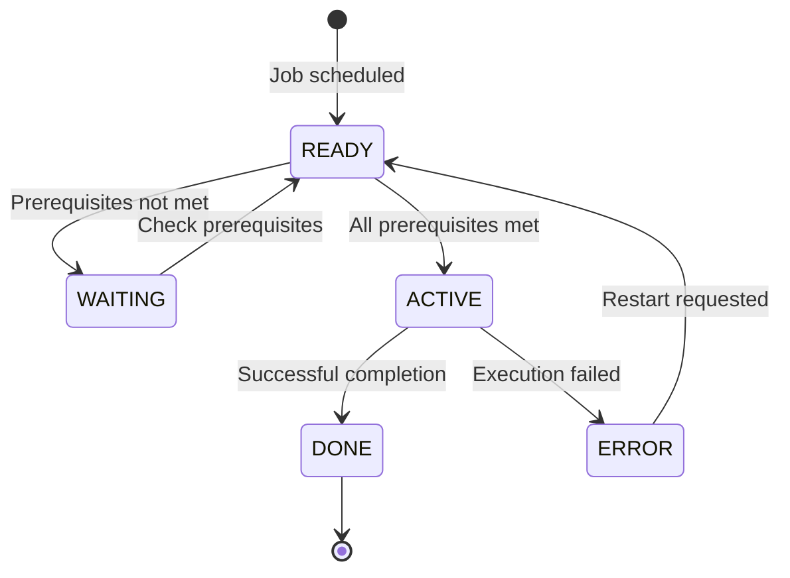

## Overview

BCHCTL is a copybook that defines the batch control file record structure used for job-level control and process sequencing. It provides the data layout for managing batch job execution, including job status tracking, prerequisite dependencies, and execution statistics.

This copybook works in conjunction with CKPRST (checkpoint/restart) to provide a complete batch job management solution:
- **BCHCTL**: Handles job-level sequencing and inter-job dependencies
- **CKPRST**: Handles program-level checkpointing within individual jobs

## Record Layout

### BATCH-CONTROL-RECORD

```
┌─────────────────────────────────────────────────────────────────┐
│                    BATCH-CONTROL-RECORD                          │
├─────────────────────────────────────────────────────────────────┤
│ BCT-KEY (20 bytes)                                              │
│ ├── BCT-JOB-NAME (8)                                            │
│ ├── BCT-PROCESS-DATE (8)                                        │
│ └── BCT-SEQUENCE-NO (4)                                         │
├─────────────────────────────────────────────────────────────────┤
│ BCT-DATA                                                        │
│ ├── BCT-STATUS (1)                                              │
│ ├── BCT-PROCESS-CONTROL (32)                                    │
│ ├── BCT-DEPENDENCIES (122)                                      │
│ └── BCT-RETURN-INFO (84)                                        │
├─────────────────────────────────────────────────────────────────┤
│ BCT-STATISTICS (56)                                             │
├─────────────────────────────────────────────────────────────────┤
│ BCT-FILLER (50)                                                 │
└─────────────────────────────────────────────────────────────────┘
```

## Data Structures

### Record Key (BCT-KEY)

| Level | Name | Picture | Description |
|-------|------|---------|-------------|
| 05 | BCT-KEY | - | Composite primary key |
| 10 | BCT-JOB-NAME | X(8) | Job name identifier |
| 10 | BCT-PROCESS-DATE | X(8) | Processing date (YYYYMMDD) |
| 10 | BCT-SEQUENCE-NO | 9(4) | Sequence number within job |

The key uniquely identifies a job step execution for a specific processing date.

### Data Section (BCT-DATA)

#### Status Field

| Level | Name | Picture | Description |
|-------|------|---------|-------------|
| 10 | BCT-STATUS | X(1) | Current job status |

##### Status Values

| Value | 88-Level Name | Meaning |
|-------|---------------|---------|
| `'R'` | BCT-STATUS-READY | Ready to execute |
| `'A'` | BCT-STATUS-ACTIVE | Currently executing |
| `'W'` | BCT-STATUS-WAITING | Waiting for prerequisites |
| `'D'` | BCT-STATUS-DONE | Completed successfully |
| `'E'` | BCT-STATUS-ERROR | Completed with error |

#### Process Control

| Level | Name | Picture | Description |
|-------|------|---------|-------------|
| 10 | BCT-PROCESS-CONTROL | - | Process control information |
| 15 | BCT-STEP-NAME | X(8) | JCL step name |
| 15 | BCT-PROGRAM-NAME | X(8) | Program being executed |
| 15 | BCT-START-TIME | X(8) | Execution start time (HHMMSSCC) |
| 15 | BCT-END-TIME | X(8) | Execution end time (HHMMSSCC) |

#### Dependencies

| Level | Name | Picture | Description |
|-------|------|---------|-------------|
| 10 | BCT-DEPENDENCIES | - | Prerequisite job information |
| 15 | BCT-PREREQ-COUNT | 9(2) COMP | Number of prerequisites (0-10) |
| 15 | BCT-PREREQ-JOBS | OCCURS 10 | Array of prerequisite jobs |
| 20 | BCT-PREREQ-NAME | X(8) | Prerequisite job name |
| 20 | BCT-PREREQ-SEQ | 9(4) | Prerequisite sequence number |
| 20 | BCT-PREREQ-RC | S9(4) COMP | Required return code threshold |

The dependency array allows up to 10 prerequisite jobs to be defined. A job step will wait (BCT-STATUS-WAITING) until all prerequisites have completed with return codes at or below their specified thresholds.

#### Return Information

| Level | Name | Picture | Description |
|-------|------|---------|-------------|
| 10 | BCT-RETURN-INFO | - | Completion information |
| 15 | BCT-RETURN-CODE | S9(4) COMP | Job step return code |
| 15 | BCT-ERROR-DESC | X(80) | Error description (if any) |

### Statistics Section (BCT-STATISTICS)

| Level | Name | Picture | Description |
|-------|------|---------|-------------|
| 05 | BCT-STATISTICS | - | Execution statistics |
| 10 | BCT-RESTART-COUNT | 9(2) COMP | Number of restart attempts |
| 10 | BCT-ATTEMPT-TS | X(26) | Last attempt timestamp |
| 10 | BCT-COMPLETE-TS | X(26) | Completion timestamp |

### Filler

| Level | Name | Picture | Description |
|-------|------|---------|-------------|
| 05 | BCT-FILLER | X(50) | Reserved for future use |

## Status Flow



## Usage Pattern

### Typical Processing Flow

1. **Job Scheduling**: Scheduler creates BCT record with READY status
2. **Prerequisite Check**: Job step checks BCT-PREREQ-JOBS array
3. **Execution**: Program runs, using CKPRST for internal checkpointing
4. **Completion**: Job updates BCT status and return information

### Example Code

```cobol
WORKING-STORAGE SECTION.
    COPY BCHCTL.
    
01  WS-PREREQ-INDEX    PIC 9(2) COMP.
01  WS-PREREQS-MET     PIC X VALUE 'Y'.
    88 ALL-PREREQS-MET         VALUE 'Y'.
    88 PREREQS-NOT-MET         VALUE 'N'.

PROCEDURE DIVISION.
    ...
    * Check all prerequisites
    MOVE 'Y' TO WS-PREREQS-MET
    PERFORM VARYING WS-PREREQ-INDEX FROM 1 BY 1
            UNTIL WS-PREREQ-INDEX > BCT-PREREQ-COUNT
               OR PREREQS-NOT-MET
        PERFORM CHECK-SINGLE-PREREQ
    END-PERFORM
    
    IF ALL-PREREQS-MET
        SET BCT-STATUS-ACTIVE TO TRUE
        PERFORM EXECUTE-JOB-STEP
    ELSE
        SET BCT-STATUS-WAITING TO TRUE
    END-IF
    ...
    
CHECK-SINGLE-PREREQ.
    * Look up prerequisite job status
    MOVE BCT-PREREQ-NAME(WS-PREREQ-INDEX) TO lookup-key
    READ BATCH-CONTROL-FILE INTO WS-PREREQ-RECORD
    
    IF NOT BCT-STATUS-DONE OF WS-PREREQ-RECORD
        SET PREREQS-NOT-MET TO TRUE
    ELSE
        IF BCT-RETURN-CODE OF WS-PREREQ-RECORD >
           BCT-PREREQ-RC(WS-PREREQ-INDEX)
            SET PREREQS-NOT-MET TO TRUE
        END-IF
    END-IF.
```

### Updating Job Status

```cobol
* Mark job as active
SET BCT-STATUS-ACTIVE TO TRUE
ACCEPT BCT-START-TIME FROM TIME
REWRITE BATCH-CONTROL-RECORD

* ... execute job logic ...

* Mark job as complete
SET BCT-STATUS-DONE TO TRUE
ACCEPT BCT-END-TIME FROM TIME
ACCEPT BCT-COMPLETE-TS FROM TIME STAMP
MOVE WS-RETURN-CODE TO BCT-RETURN-CODE
REWRITE BATCH-CONTROL-RECORD
```

## Relationship with CKPRST

| Aspect | BCHCTL | CKPRST |
|--------|--------|--------|
| **Scope** | Job/step level | Program level |
| **Purpose** | Job sequencing & dependencies | Checkpoint/restart within program |
| **Status Tracking** | Job execution status | Processing position & counters |
| **Dependencies** | Inter-job prerequisites | N/A |
| **Restart** | Job-level restart count | Record-level restart position |

Programs typically use both copybooks:
- BCHCTL for job-level coordination
- CKPRST for program-level recovery

## Programs Using This Copybook

| Program | Purpose |
|---------|---------|
| BCHCTL00 | Batch control management |
| HISTLD00 | History loading with batch control |
| PRCSEQ00 | Process sequencing |
| RCVPRC00 | Recovery processing |
| RPTSTA00 | Status reporting |

## File Organization

The batch control file is typically organized as:

| Property | Recommended Value |
|----------|-------------------|
| Organization | INDEXED (VSAM KSDS) |
| Record Key | BCT-KEY |
| Access Mode | DYNAMIC |
| Record Length | ~365 bytes |

## Technical Notes

### COBOL Constructs Used

- **OCCURS Clause**: BCT-PREREQ-JOBS OCCURS 10 TIMES creates an array for storing up to 10 prerequisite job definitions.

- **COMP Fields**: BCT-PREREQ-COUNT, BCT-PREREQ-RC, BCT-RETURN-CODE, and BCT-RESTART-COUNT use COMP (binary) format for efficient numeric storage.

- **88-Level Conditions**: Status values use 88-level condition names for readable status testing (e.g., `IF BCT-STATUS-READY`).

### Timestamp Formats

| Field | Format | Example |
|-------|--------|---------|
| BCT-PROCESS-DATE | YYYYMMDD | 20240320 |
| BCT-START-TIME | HHMMSSCC | 14352500 |
| BCT-END-TIME | HHMMSSCC | 14383042 |
| BCT-ATTEMPT-TS | ISO timestamp | 2024-03-20-14.35.25.000000 |
| BCT-COMPLETE-TS | ISO timestamp | 2024-03-20-14.38.30.420000 |

### Record Size Calculation

| Section | Size (bytes) |
|---------|--------------|
| BCT-KEY | 20 |
| BCT-STATUS | 1 |
| BCT-PROCESS-CONTROL | 32 |
| BCT-DEPENDENCIES | ~122 |
| BCT-RETURN-INFO | ~84 |
| BCT-STATISTICS | ~56 |
| BCT-FILLER | 50 |
| **Total** | ~365 |

Note: Exact size depends on COMP field sizes which vary by platform.
