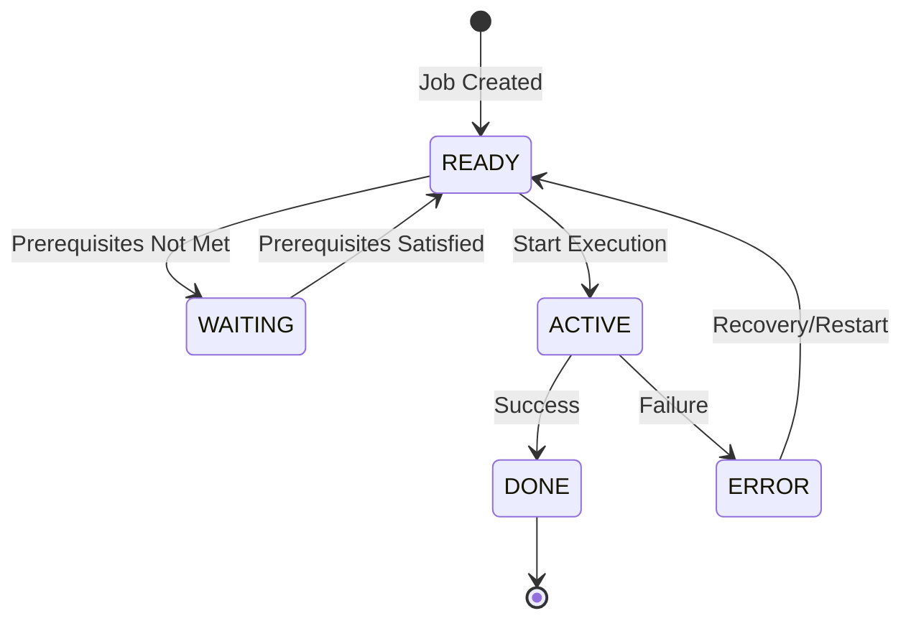

## Overview

BCHCTL is a copybook that defines the record layout for the batch control file, which manages job-level sequencing and dependencies in the batch processing system. It tracks job status, prerequisites, execution timing, and return information for batch job steps.

This copybook works in conjunction with CKPRST (Checkpoint/Restart) to provide a complete batch control framework. While BCHCTL handles job-level coordination and dependency management, CKPRST handles program-level checkpointing within individual job steps.

## Usage

```cobol
FILE SECTION.
FD  BATCH-CONTROL-FILE.
    COPY BCHCTL.
```

## Used By

| Program | Description |
|---------|-------------|
| [BCHCTL00](/docs/programs/BCHCTL00) | Batch Control Processor - primary manager of the control file |
| [HISTLD00](/docs/programs/HISTLD00) | History Load Program |
| [PRCSEQ00](/docs/programs/PRCSEQ00) | Process Sequence Manager |
| [RCVPRC00](/docs/programs/RCVPRC00) | Process Recovery Handler |
| [RPTSTA00](/docs/programs/RPTSTA00) | Status Reporting |

## Record Layout

### BATCH-CONTROL-RECORD (01 Level)

Total record structure for batch control file.

```
+------------------+------------------+------------------+
|     BCT-KEY      |     BCT-DATA     |  BCT-STATISTICS  |
|    (20 bytes)    |   (variable)     |    (54 bytes)    |
+------------------+------------------+------------------+
```

## Field Definitions

### BCT-KEY (Record Key)

The composite primary key for the batch control file:

| Level | Name | Picture | Bytes | Description |
|-------|------|---------|-------|-------------|
| 05 | BCT-KEY | - | 20 | Composite record key |
| 10 | BCT-JOB-NAME | X(8) | 8 | Batch job name |
| 10 | BCT-PROCESS-DATE | X(8) | 8 | Processing date (YYYYMMDD) |
| 10 | BCT-SEQUENCE-NO | 9(4) | 4 | Job sequence number |

**Key Structure**: The combination of job name, process date, and sequence number uniquely identifies each batch control record, allowing multiple executions of the same job on the same date.

### BCT-DATA (Main Data Area)

#### BCT-STATUS

| Level | Name | Picture | Description |
|-------|------|---------|-------------|
| 10 | BCT-STATUS | X(1) | Current job status |

**Status Values (88-Level Conditions)**:

| Condition | Value | Description |
|-----------|-------|-------------|
| BCT-STATUS-READY | 'R' | Job is ready to execute |
| BCT-STATUS-ACTIVE | 'A' | Job is currently executing |
| BCT-STATUS-WAITING | 'W' | Job is waiting for prerequisites |
| BCT-STATUS-DONE | 'D' | Job completed successfully |
| BCT-STATUS-ERROR | 'E' | Job ended with error |



#### BCT-PROCESS-CONTROL

| Level | Name | Picture | Bytes | Description |
|-------|------|---------|-------|-------------|
| 10 | BCT-PROCESS-CONTROL | - | 32 | Process control group |
| 15 | BCT-STEP-NAME | X(8) | 8 | Current JCL step name |
| 15 | BCT-PROGRAM-NAME | X(8) | 8 | Executing program name |
| 15 | BCT-START-TIME | X(8) | 8 | Execution start time (HHMMSSTH) |
| 15 | BCT-END-TIME | X(8) | 8 | Execution end time (HHMMSSTH) |

#### BCT-DEPENDENCIES

| Level | Name | Picture | Bytes | Description |
|-------|------|---------|-------|-------------|
| 10 | BCT-DEPENDENCIES | - | 142 | Dependency information |
| 15 | BCT-PREREQ-COUNT | 9(2) COMP | 2 | Number of prerequisites (0-10) |
| 15 | BCT-PREREQ-JOBS | - | 140 | Prerequisite array (10 entries) |

**BCT-PREREQ-JOBS Array** (OCCURS 10 TIMES):

| Level | Name | Picture | Bytes | Description |
|-------|------|---------|-------|-------------|
| 20 | BCT-PREREQ-NAME | X(8) | 8 | Prerequisite job name |
| 20 | BCT-PREREQ-SEQ | 9(4) | 4 | Prerequisite sequence number |
| 20 | BCT-PREREQ-RC | S9(4) COMP | 2 | Required return code threshold |

Each entry is 14 bytes × 10 occurrences = 140 bytes.

#### BCT-RETURN-INFO

| Level | Name | Picture | Bytes | Description |
|-------|------|---------|-------|-------------|
| 10 | BCT-RETURN-INFO | - | 82 | Return information |
| 15 | BCT-RETURN-CODE | S9(4) COMP | 2 | Job return code |
| 15 | BCT-ERROR-DESC | X(80) | 80 | Error description text |

### BCT-STATISTICS

| Level | Name | Picture | Bytes | Description |
|-------|------|---------|-------|-------------|
| 05 | BCT-STATISTICS | - | 54 | Execution statistics |
| 10 | BCT-RESTART-COUNT | 9(2) COMP | 2 | Number of restart attempts |
| 10 | BCT-ATTEMPT-TS | X(26) | 26 | Last attempt timestamp |
| 10 | BCT-COMPLETE-TS | X(26) | 26 | Completion timestamp |

### BCT-FILLER

| Level | Name | Picture | Bytes | Description |
|-------|------|---------|-------|-------------|
| 05 | BCT-FILLER | X(50) | 50 | Reserved for future use |

## Prerequisite Checking

The BCT-DEPENDENCIES section enables job scheduling with prerequisite checks:

```cobol
* Check all prerequisites
PERFORM VARYING WS-IDX FROM 1 BY 1
    UNTIL WS-IDX > BCT-PREREQ-COUNT
    
    MOVE BCT-PREREQ-NAME(WS-IDX) TO WS-PREREQ-KEY
    READ BATCH-CONTROL-FILE
        KEY IS WS-PREREQ-KEY
        INVALID KEY
            SET PREREQS-NOT-MET TO TRUE
    END-READ
    
    IF BCT-STATUS-DONE OF PREREQ-RECORD
        IF BCT-RETURN-CODE OF PREREQ-RECORD 
           > BCT-PREREQ-RC(WS-IDX)
            SET PREREQS-NOT-MET TO TRUE
        END-IF
    ELSE
        SET PREREQS-NOT-MET TO TRUE
    END-IF
END-PERFORM
```

## Status Workflow Example

```cobol
* 1. Initialize new job record
MOVE 'JOBNAME1' TO BCT-JOB-NAME
MOVE '20240115' TO BCT-PROCESS-DATE
MOVE 1 TO BCT-SEQUENCE-NO
SET BCT-STATUS-READY TO TRUE

* 2. Start job execution
SET BCT-STATUS-ACTIVE TO TRUE
ACCEPT BCT-START-TIME FROM TIME
MOVE 'STEP1' TO BCT-STEP-NAME
MOVE 'PROGNAME' TO BCT-PROGRAM-NAME

* 3. Complete job
SET BCT-STATUS-DONE TO TRUE
ACCEPT BCT-END-TIME FROM TIME
MOVE 0 TO BCT-RETURN-CODE
ACCEPT BCT-COMPLETE-TS FROM TIME STAMP
```

## Data Types

| Type | Format | Description |
|------|--------|-------------|
| X(n) | Alphanumeric | Character data |
| 9(n) | Numeric display | Unsigned numeric |
| S9(n) COMP | Binary | Signed binary integer |
| Timestamp | X(26) | ISO format: YYYY-MM-DD-HH.MM.SS.NNNNNN |

## Related Copybooks

| Copybook | Relationship |
|----------|-------------|
| **CKPRST** | Program-level checkpointing (complements BCHCTL's job-level control) |
| **BCHCON** | Batch control constants (status values, return codes, thresholds) |
| **PRCSEQ** | Process sequence definitions |

## Design Notes

1. **Two-Level Control**: BCHCTL provides job-level coordination while CKPRST handles program-level checkpointing. This separation allows:
   - Job scheduler to manage job dependencies
   - Individual programs to checkpoint independently
   - Recovery at either job or program level

2. **Prerequisite Model**: Up to 10 prerequisite jobs can be defined per job, each with a maximum acceptable return code threshold.

3. **Timestamp Format**: The 26-character timestamp fields use ISO format for sorting and display consistency.

4. **COMP Fields**: Binary fields are used for counts and return codes for efficient arithmetic and storage.

5. **Filler Space**: 50 bytes reserved for future enhancements without changing record length.

## File Characteristics

When defining the VSAM file for this copybook:

| Attribute | Recommended Value |
|-----------|-------------------|
| Organization | INDEXED (KSDS) |
| Access Mode | DYNAMIC |
| Record Key | BCT-KEY (20 bytes) |
| Record Size | ~350 bytes (varies by implementation) |
