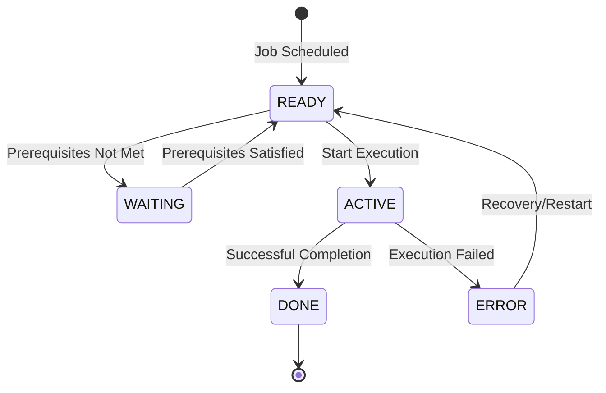
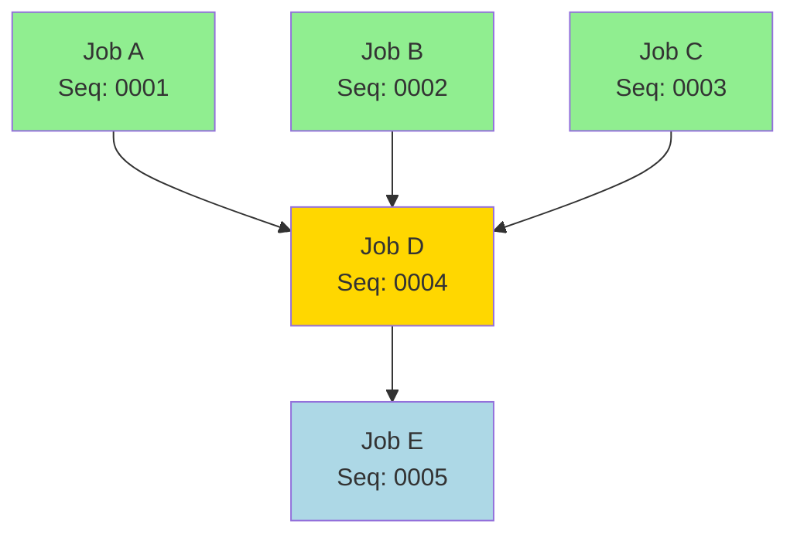

## Overview

BCHCTL is a copybook that defines the Batch Control File Record structure used for job-level control and process sequencing in the batch processing framework. It provides the data layout for tracking job status, managing prerequisites, and recording execution statistics.

The copybook is designed to work in conjunction with CKPRST (checkpoint/restart) for program-level checkpointing. While BCHCTL handles job-level sequencing and dependencies, CKPRST manages the checkpointing within individual program execution.

This record structure is typically used with a VSAM KSDS file where the composite key (job name + process date + sequence number) uniquely identifies each batch control record.

## Record Layout

```
+------------------+--------------------------------------------------+
| BCT-KEY (20)     | BCT-DATA                                         |
+------------------+--------------------------------------------------+
| Job  | Date |Seq | Status | Process Control | Dependencies | Return |
| (8)  | (8)  |(4) |  (1)   |      (32)       |    (140)     |  (84)  |
+------------------+--------------------------------------------------+
| BCT-STATISTICS (54)        | BCT-FILLER (50)                        |
+------------------+--------------------------------------------------+
```

## Data Structure

### BATCH-CONTROL-RECORD (01 Level)

| Level | Name | Picture | Bytes | Description |
|-------|------|---------|-------|-------------|
| 01 | BATCH-CONTROL-RECORD | | ~380 | Complete batch control record |

### BCT-KEY (Composite Record Key)

| Level | Name | Picture | Bytes | Description |
|-------|------|---------|-------|-------------|
| 05 | BCT-KEY | | 20 | Composite primary key |
| 10 | BCT-JOB-NAME | X(8) | 8 | Job name identifier |
| 10 | BCT-PROCESS-DATE | X(8) | 8 | Processing date (YYYYMMDD) |
| 10 | BCT-SEQUENCE-NO | 9(4) | 4 | Sequence number for ordering |

### BCT-DATA (Main Data Area)

| Level | Name | Picture | Bytes | Description |
|-------|------|---------|-------|-------------|
| 05 | BCT-DATA | | ~257 | Main data area |

#### BCT-STATUS

| Level | Name | Picture | Bytes | Description |
|-------|------|---------|-------|-------------|
| 10 | BCT-STATUS | X(1) | 1 | Current job status |

**Status Values (88-level conditions):**

| Value | Condition Name | Description |
|-------|----------------|-------------|
| `R` | BCT-STATUS-READY | Job is ready to run |
| `A` | BCT-STATUS-ACTIVE | Job is currently executing |
| `W` | BCT-STATUS-WAITING | Job is waiting for prerequisites |
| `D` | BCT-STATUS-DONE | Job completed successfully |
| `E` | BCT-STATUS-ERROR | Job ended in error |

#### BCT-PROCESS-CONTROL

| Level | Name | Picture | Bytes | Description |
|-------|------|---------|-------|-------------|
| 10 | BCT-PROCESS-CONTROL | | 32 | Process control information |
| 15 | BCT-STEP-NAME | X(8) | 8 | Current JCL step name |
| 15 | BCT-PROGRAM-NAME | X(8) | 8 | Executing program name |
| 15 | BCT-START-TIME | X(8) | 8 | Execution start time (HHMMSSTH) |
| 15 | BCT-END-TIME | X(8) | 8 | Execution end time (HHMMSSTH) |

#### BCT-DEPENDENCIES

| Level | Name | Picture | Bytes | Description |
|-------|------|---------|-------|-------------|
| 10 | BCT-DEPENDENCIES | | 140 | Prerequisite job information |
| 15 | BCT-PREREQ-COUNT | 9(2) COMP | 2 | Number of prerequisites (0-10) |
| 15 | BCT-PREREQ-JOBS | OCCURS 10 | 138 | Array of prerequisite jobs |

**BCT-PREREQ-JOBS Array Element:**

| Level | Name | Picture | Bytes | Description |
|-------|------|---------|-------|-------------|
| 20 | BCT-PREREQ-NAME | X(8) | 8 | Prerequisite job name |
| 20 | BCT-PREREQ-SEQ | 9(4) | 4 | Prerequisite sequence number |
| 20 | BCT-PREREQ-RC | S9(4) COMP | 2 | Required return code threshold |

#### BCT-RETURN-INFO

| Level | Name | Picture | Bytes | Description |
|-------|------|---------|-------|-------------|
| 10 | BCT-RETURN-INFO | | 84 | Return code and error information |
| 15 | BCT-RETURN-CODE | S9(4) COMP | 2 | Final return code |
| 15 | BCT-ERROR-DESC | X(80) | 80 | Error description text |

### BCT-STATISTICS

| Level | Name | Picture | Bytes | Description |
|-------|------|---------|-------|-------------|
| 05 | BCT-STATISTICS | | 54 | Execution statistics |
| 10 | BCT-RESTART-COUNT | 9(2) COMP | 2 | Number of restart attempts |
| 10 | BCT-ATTEMPT-TS | X(26) | 26 | Last attempt timestamp |
| 10 | BCT-COMPLETE-TS | X(26) | 26 | Completion timestamp |

### BCT-FILLER

| Level | Name | Picture | Bytes | Description |
|-------|------|---------|-------|-------------|
| 05 | BCT-FILLER | X(50) | 50 | Reserved for future use |

## Status Flow Diagram



## Dependency Management

The BCT-DEPENDENCIES structure allows each job to define up to 10 prerequisite jobs that must complete before the current job can run.



### Prerequisite Checking Logic

```cobol
* Check if all prerequisites are satisfied
PERFORM VARYING WS-IDX FROM 1 BY 1
    UNTIL WS-IDX > BCT-PREREQ-COUNT
    
    MOVE BCT-PREREQ-NAME(WS-IDX) TO BCT-JOB-NAME
    READ BATCH-CONTROL-FILE
    
    IF NOT BCT-STATUS-DONE
        OR BCT-RETURN-CODE > BCT-PREREQ-RC(WS-IDX)
        SET PREREQS-NOT-MET TO TRUE
    END-IF
END-PERFORM
```

## Usage Patterns

### Creating a Control Record

```cobol
INITIALIZE BATCH-CONTROL-RECORD

MOVE 'MYJOB001' TO BCT-JOB-NAME
MOVE '20240115' TO BCT-PROCESS-DATE
MOVE 1          TO BCT-SEQUENCE-NO
SET BCT-STATUS-READY TO TRUE

MOVE 'STEP01'   TO BCT-STEP-NAME
MOVE 'PROGNAME' TO BCT-PROGRAM-NAME
MOVE ZEROS      TO BCT-PREREQ-COUNT
MOVE ZEROS      TO BCT-RESTART-COUNT

WRITE BATCH-CONTROL-RECORD
```

### Updating Status to Active

```cobol
SET BCT-STATUS-ACTIVE TO TRUE
ACCEPT WS-TIME FROM TIME
MOVE WS-TIME TO BCT-START-TIME
ADD 1 TO BCT-RESTART-COUNT
MOVE FUNCTION CURRENT-DATE TO BCT-ATTEMPT-TS

REWRITE BATCH-CONTROL-RECORD
```

### Recording Completion

```cobol
SET BCT-STATUS-DONE TO TRUE
ACCEPT WS-TIME FROM TIME
MOVE WS-TIME TO BCT-END-TIME
MOVE FUNCTION CURRENT-DATE TO BCT-COMPLETE-TS
MOVE WS-RETURN-CODE TO BCT-RETURN-CODE

REWRITE BATCH-CONTROL-RECORD
```

### Adding Prerequisites

```cobol
MOVE 2 TO BCT-PREREQ-COUNT

MOVE 'PREJOB01' TO BCT-PREREQ-NAME(1)
MOVE 1          TO BCT-PREREQ-SEQ(1)
MOVE 4          TO BCT-PREREQ-RC(1)

MOVE 'PREJOB02' TO BCT-PREREQ-NAME(2)
MOVE 2          TO BCT-PREREQ-SEQ(2)
MOVE 0          TO BCT-PREREQ-RC(2)
```

## File Definition Example

```cobol
INPUT-OUTPUT SECTION.
FILE-CONTROL.
    SELECT BATCH-CONTROL-FILE
        ASSIGN TO BCHCTL
        ORGANIZATION IS INDEXED
        ACCESS MODE IS DYNAMIC
        RECORD KEY IS BCT-KEY
        FILE STATUS IS WS-BCT-STATUS.

DATA DIVISION.
FILE SECTION.
FD  BATCH-CONTROL-FILE.
    COPY BCHCTL.
```

## Programs Using This Copybook

| Program | Description | Usage |
|---------|-------------|-------|
| BCHCTL00 | Batch Control Processor | Primary handler for batch control operations |
| HISTLD00 | History Data Loader | Uses batch control for job coordination |
| PRCSEQ00 | Process Sequencing | Manages process execution order |
| RCVPRC00 | Recovery Processing | Handles recovery and restart operations |
| RPTSTA00 | Status Reporting | Reports on batch job status |

## Related Copybooks

| Copybook | Relationship |
|----------|-------------|
| BCHCON | Batch control constants (status values, return codes) |
| CKPRST | Program-level checkpoint/restart (complements BCHCTL) |
| PRCSEQ | Process sequence definitions |

## Technical Notes

1. **Composite Key**: The 20-byte key (BCT-JOB-NAME + BCT-PROCESS-DATE + BCT-SEQUENCE-NO) allows multiple runs of the same job on different dates and supports multiple sequences within a single date.

2. **COMP Fields**: BCT-PREREQ-COUNT, BCT-PREREQ-RC, BCT-RETURN-CODE, and BCT-RESTART-COUNT use binary (COMP) format for efficient numeric processing.

3. **OCCURS 10 TIMES**: The BCT-PREREQ-JOBS array supports up to 10 prerequisites. For jobs requiring more dependencies, consider using a separate dependency table.

4. **Timestamp Format**: BCT-ATTEMPT-TS and BCT-COMPLETE-TS use 26-character timestamps compatible with COBOL `FUNCTION CURRENT-DATE` output (YYYYMMDDHHMMSSNNNNNN format).

5. **Time Format**: BCT-START-TIME and BCT-END-TIME use 8-character time format (HHMMSSTH) where TH represents hundredths of seconds.

6. **BCT-FILLER**: The 50-byte filler allows for future field additions without changing the record length or requiring file conversion.

7. **Status Transitions**: Status changes should follow the state diagram. Direct transitions from READY to DONE or ERROR to DONE should be avoided to maintain audit integrity.

8. **Restart Count**: BCT-RESTART-COUNT tracks how many times a job has been attempted. This can be used with BCT-MAX-RESTARTS (from BCHCON) to prevent infinite restart loops.
