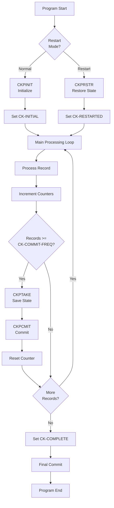

## Overview

CKPRST is a copybook that defines the data structures required for implementing checkpoint/restart functionality in batch COBOL programs. It provides a standardized framework for saving program state at regular intervals, enabling recovery from failures without reprocessing all data from the beginning.

The copybook contains two main structures:
- **CHECKPOINT-CONTROL** - Working storage structure for managing checkpoint state during execution
- **CHECKPOINT-RECORD** - VSAM file record structure for persisting checkpoint data

Key capabilities include:
- **Program state tracking** - Captures program ID, run date/time, and processing status
- **Progress counters** - Tracks records read, processed, and errors encountered
- **Position management** - Stores last processed key and processing phase
- **Multi-file support** - Tracks status and position for up to 5 files
- **Configurable thresholds** - Commit frequency, max errors, and max restart attempts

This copybook works in conjunction with BCHCTL (Batch Control) which handles job-level sequencing, while CKPRST manages program-level checkpointing within individual job steps.

## Data Structures

### CHECKPOINT-CONTROL (Working Storage)

The main checkpoint control structure used during program execution.

#### CK-HEADER

| Level | Name | Picture | Description |
|-------|------|---------|-------------|
| 05 | CK-HEADER | - | Header information group |
| 10 | CK-PROGRAM-ID | PIC X(8) | Program identifier |
| 10 | CK-RUN-DATE | PIC X(8) | Run date (YYYYMMDD) |
| 10 | CK-RUN-TIME | PIC X(6) | Run time (HHMMSS) |
| 10 | CK-STATUS | PIC X(1) | Current processing status |

##### CK-STATUS Values (88-Level Conditions)

| Condition Name | Value | Description |
|----------------|-------|-------------|
| CK-INITIAL | `I` | Initial state - program starting |
| CK-ACTIVE | `A` | Active - processing in progress |
| CK-COMPLETE | `C` | Complete - successful completion |
| CK-FAILED | `F` | Failed - processing aborted |
| CK-RESTARTED | `R` | Restarted - resumed from checkpoint |

#### CK-COUNTERS

| Level | Name | Picture | Description |
|-------|------|---------|-------------|
| 05 | CK-COUNTERS | - | Processing counters group |
| 10 | CK-RECORDS-READ | PIC 9(9) COMP | Total records read from input |
| 10 | CK-RECORDS-PROC | PIC 9(9) COMP | Records successfully processed |
| 10 | CK-RECORDS-ERROR | PIC 9(9) COMP | Records with errors |
| 10 | CK-RESTART-COUNT | PIC 9(2) COMP | Number of restart attempts |

#### CK-POSITION

| Level | Name | Picture | Description |
|-------|------|---------|-------------|
| 05 | CK-POSITION | - | Current position tracking group |
| 10 | CK-LAST-KEY | PIC X(50) | Last successfully processed record key |
| 10 | CK-LAST-TIME | PIC X(26) | Timestamp of last checkpoint |
| 10 | CK-PHASE | PIC X(2) | Current processing phase |

##### CK-PHASE Values (88-Level Conditions)

| Condition Name | Value | Description |
|----------------|-------|-------------|
| CK-PHASE-INIT | `00` | Initialization phase |
| CK-PHASE-READ | `10` | Reading input phase |
| CK-PHASE-PROC | `20` | Processing phase |
| CK-PHASE-UPDT | `30` | Update/write phase |
| CK-PHASE-TERM | `40` | Termination phase |

#### CK-RESOURCES

| Level | Name | Picture | Occurs | Description |
|-------|------|---------|--------|-------------|
| 05 | CK-RESOURCES | - | - | File tracking group |
| 10 | CK-FILE-STATUS | - | 5 | File status entry (repeats 5 times) |
| 15 | CK-FILE-NAME | PIC X(8) | - | Logical file name |
| 15 | CK-FILE-POS | PIC X(50) | - | Current file position/key |
| 15 | CK-FILE-STATUS | PIC X(2) | - | File status code |

#### CK-CONTROL-INFO

| Level | Name | Picture | Default | Description |
|-------|------|---------|---------|-------------|
| 05 | CK-CONTROL-INFO | - | - | Control parameters group |
| 10 | CK-COMMIT-FREQ | PIC 9(5) COMP | 1000 | Commit/checkpoint every N records |
| 10 | CK-MAX-ERRORS | PIC 9(3) COMP | 100 | Maximum errors before abort |
| 10 | CK-MAX-RESTARTS | PIC 9(2) COMP | 3 | Maximum restart attempts allowed |
| 10 | CK-RESTART-MODE | PIC X(1) | - | Current restart mode |

##### CK-RESTART-MODE Values (88-Level Conditions)

| Condition Name | Value | Description |
|----------------|-------|-------------|
| CK-MODE-NORMAL | `N` | Normal processing (no restart) |
| CK-MODE-RESTART | `R` | Restart from last checkpoint |
| CK-MODE-RECOVER | `C` | Recovery mode (manual intervention) |

### CHECKPOINT-RECORD (File Record)

The VSAM file record structure for persisting checkpoint data.

| Level | Name | Picture | Description |
|-------|------|---------|-------------|
| 01 | CHECKPOINT-RECORD | - | Checkpoint VSAM record |
| 05 | CKR-KEY | - | Record key group |
| 10 | CKR-PROGRAM-ID | PIC X(8) | Program identifier |
| 10 | CKR-RUN-DATE | PIC X(8) | Run date (YYYYMMDD) |
| 05 | CKR-DATA | PIC X(400) | Checkpoint data payload |

## Standard Processing Routines

The copybook documents four standard checkpoint processing routines that programs should call:

| Routine | Called Program | Purpose |
|---------|----------------|---------|
| PROC-CHECKPOINT-INIT | CKPINIT | Initialize checkpoint processing at program start |
| PROC-CHECKPOINT-TAKE | CKPTAKE | Take a checkpoint (save current state) |
| PROC-CHECKPOINT-COMMIT | CKPCMIT | Commit checkpoint to permanent storage |
| PROC-CHECKPOINT-RESTART | CKPRSTR | Restore state from checkpoint for restart |

### Calling Convention

```cobol
* Initialize checkpoint at program start
CALL 'CKPINIT' USING CHECKPOINT-CONTROL
                     RETURN-STATUS

* Take checkpoint during processing
CALL 'CKPTAKE' USING CHECKPOINT-CONTROL
                     RETURN-STATUS

* Commit checkpoint to storage
CALL 'CKPCMIT' USING CHECKPOINT-CONTROL
                     RETURN-STATUS

* Restart from checkpoint
CALL 'CKPRSTR' USING CHECKPOINT-CONTROL
                     RETURN-STATUS
```

## Usage Pattern

### Typical Checkpoint/Restart Flow



### Implementation Example

```cobol
WORKING-STORAGE SECTION.
    COPY CKPRST.
    
01  WS-RECORD-COUNT        PIC 9(9) COMP VALUE 0.

PROCEDURE DIVISION.
0000-MAIN.
    PERFORM 1000-INITIALIZE
    PERFORM 2000-PROCESS UNTIL END-OF-FILE
    PERFORM 3000-TERMINATE
    GOBACK.

1000-INITIALIZE.
    IF CK-MODE-RESTART
        CALL 'CKPRSTR' USING CHECKPOINT-CONTROL
                             RETURN-STATUS
        SET CK-RESTARTED TO TRUE
    ELSE
        CALL 'CKPINIT' USING CHECKPOINT-CONTROL
                             RETURN-STATUS
        SET CK-INITIAL TO TRUE
        MOVE 0 TO CK-RECORDS-READ
        MOVE 0 TO CK-RECORDS-PROC
    END-IF
    
    SET CK-ACTIVE TO TRUE.

2000-PROCESS.
    READ INPUT-FILE
    ADD 1 TO CK-RECORDS-READ
    
    PERFORM 2100-PROCESS-RECORD
    ADD 1 TO CK-RECORDS-PROC
    ADD 1 TO WS-RECORD-COUNT
    
    IF WS-RECORD-COUNT >= CK-COMMIT-FREQ
        MOVE INPUT-KEY TO CK-LAST-KEY
        CALL 'CKPTAKE' USING CHECKPOINT-CONTROL
                             RETURN-STATUS
        CALL 'CKPCMIT' USING CHECKPOINT-CONTROL
                             RETURN-STATUS
        MOVE 0 TO WS-RECORD-COUNT
    END-IF.

3000-TERMINATE.
    SET CK-COMPLETE TO TRUE
    CALL 'CKPCMIT' USING CHECKPOINT-CONTROL
                         RETURN-STATUS.
```

## Relationship with BCHCTL

The CKPRST and BCHCTL copybooks work together to provide comprehensive batch processing control:

| Aspect | BCHCTL | CKPRST |
|--------|--------|--------|
| Scope | Job-level | Program-level |
| Purpose | Job sequencing & dependencies | Program checkpointing |
| Persistence | Batch control file | Checkpoint VSAM file |
| Key | Job name + Date + Sequence | Program ID + Run date |
| Status tracking | Job status | Processing phase |
| Recovery | Job restart | Position-based restart |

### Typical Integration

1. Job scheduler creates BCHCTL record with READY status
2. Job step checks prerequisites using BCHCTL
3. Program uses CKPRST for checkpointing during execution
4. On completion, updates both CKPRST and BCHCTL status
5. On failure, CKPRST enables position-based restart

## Programs Using This Copybook

- **CKPRST** - Checkpoint/restart service program that implements the checkpoint processing logic

## File Requirements

### Checkpoint VSAM File

Programs using this copybook require a VSAM KSDS file for checkpoint storage:

| Attribute | Value |
|-----------|-------|
| Organization | Indexed (KSDS) |
| Key Position | 1 |
| Key Length | 16 (8 + 8) |
| Record Length | 416 (16 key + 400 data) |
| Access Mode | Dynamic |

### JCL DD Statement

```jcl
//CKPTFILE DD DSN=your.checkpoint.file,DISP=SHR
```

## Best Practices

1. **Checkpoint Frequency**: Set `CK-COMMIT-FREQ` based on:
   - Record processing time
   - Acceptable reprocessing time on restart
   - System commit overhead

2. **Error Thresholds**: Configure `CK-MAX-ERRORS` to:
   - Allow for data quality issues
   - Prevent runaway error conditions
   - Match business requirements

3. **Restart Limits**: Set `CK-MAX-RESTARTS` to:
   - Prevent infinite restart loops
   - Allow for transient failures
   - Trigger manual intervention when exceeded

4. **Key Storage**: Ensure `CK-LAST-KEY` is large enough for your largest file key (50 bytes provided)

5. **Phase Tracking**: Update `CK-PHASE` at each processing stage for precise restart positioning
