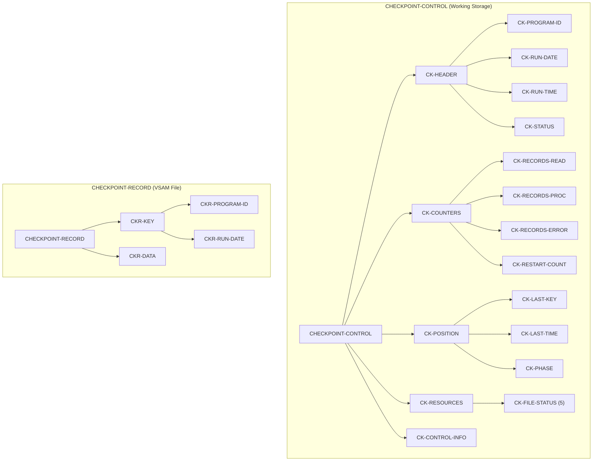
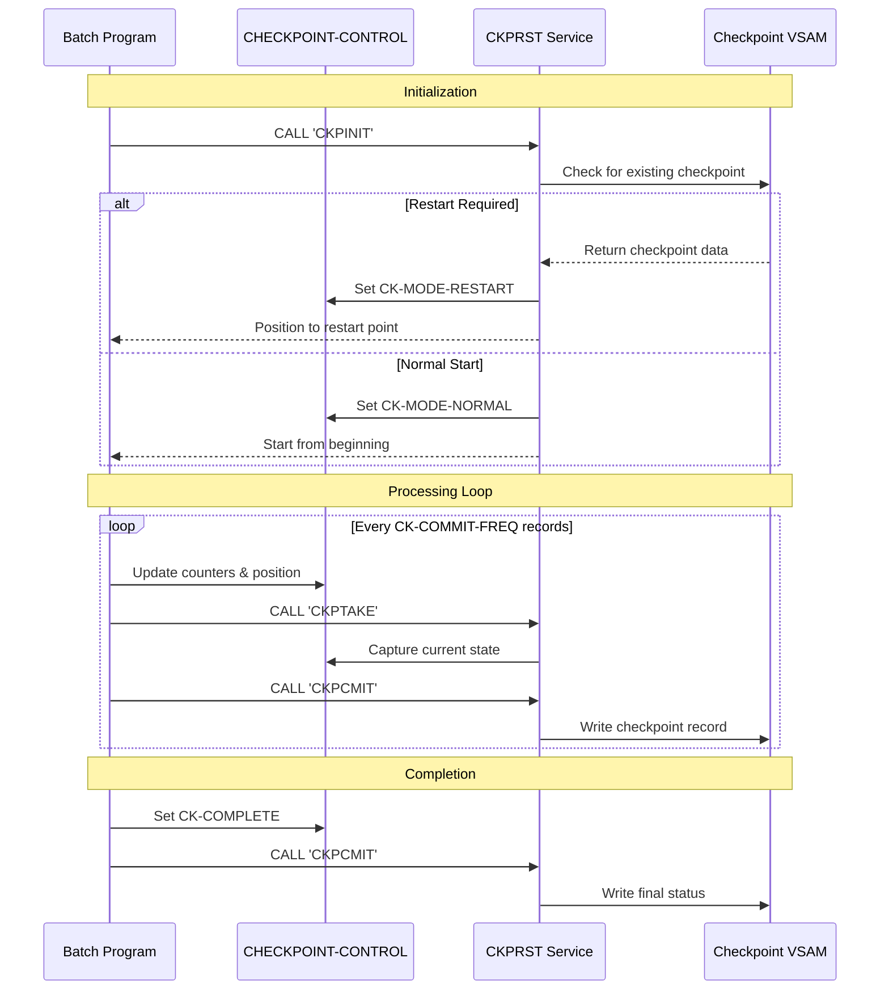

## Overview

CKPRST is a copybook that defines the data structures for checkpoint/restart functionality in batch programs. It enables long-running batch jobs to save their processing state at regular intervals, allowing them to resume from the last checkpoint after a failure rather than restarting from the beginning.

The copybook provides:
- **Checkpoint Control Structure**: Working storage area for tracking program state
- **Checkpoint Record Layout**: VSAM file record for persisting checkpoint data
- **Processing Phase Tracking**: Standardized phases for program execution
- **Resource State Management**: File position tracking for multiple files
- **Configurable Parameters**: Commit frequency, error limits, and restart controls

CKPRST works in conjunction with BCHCTL (Batch Control) which handles job-level sequencing and dependencies, while CKPRST manages program-level checkpointing within individual job steps.

## Copybook Location

```
/src/copybook/batch/CKPRST.cpy
```

## Data Structure Diagram



## Record Layouts

### CHECKPOINT-CONTROL (Working Storage)

The main control structure used by programs for checkpoint management:

#### CK-HEADER - Program Identification

| Level | Name | Picture | Description |
|-------|------|---------|-------------|
| 05 | CK-HEADER | - | Header information group |
| 10 | CK-PROGRAM-ID | X(8) | Program identifier |
| 10 | CK-RUN-DATE | X(8) | Run date (YYYYMMDD) |
| 10 | CK-RUN-TIME | X(6) | Run time (HHMMSS) |
| 10 | CK-STATUS | X(1) | Processing status |

**CK-STATUS Values (88-level conditions):**

| Condition | Value | Description |
|-----------|-------|-------------|
| CK-INITIAL | 'I' | Initial state, not yet started |
| CK-ACTIVE | 'A' | Processing is active |
| CK-COMPLETE | 'C' | Processing completed successfully |
| CK-FAILED | 'F' | Processing failed |
| CK-RESTARTED | 'R' | Restarted from checkpoint |

#### CK-COUNTERS - Processing Statistics

| Level | Name | Picture | Description |
|-------|------|---------|-------------|
| 05 | CK-COUNTERS | - | Counter group |
| 10 | CK-RECORDS-READ | 9(9) COMP | Total records read |
| 10 | CK-RECORDS-PROC | 9(9) COMP | Records successfully processed |
| 10 | CK-RECORDS-ERROR | 9(9) COMP | Records with errors |
| 10 | CK-RESTART-COUNT | 9(2) COMP | Number of restart attempts |

#### CK-POSITION - Processing Position

| Level | Name | Picture | Description |
|-------|------|---------|-------------|
| 05 | CK-POSITION | - | Position tracking group |
| 10 | CK-LAST-KEY | X(50) | Last processed record key |
| 10 | CK-LAST-TIME | X(26) | Timestamp of last checkpoint |
| 10 | CK-PHASE | X(2) | Current processing phase |

**CK-PHASE Values (88-level conditions):**

| Condition | Value | Description |
|-----------|-------|-------------|
| CK-PHASE-INIT | '00' | Initialization phase |
| CK-PHASE-READ | '10' | Reading input phase |
| CK-PHASE-PROC | '20' | Processing phase |
| CK-PHASE-UPDT | '30' | Update/output phase |
| CK-PHASE-TERM | '40' | Termination phase |

#### CK-RESOURCES - File State Tracking

| Level | Name | Picture | Occurs | Description |
|-------|------|---------|--------|-------------|
| 05 | CK-RESOURCES | - | - | Resource tracking group |
| 10 | CK-FILE-STATUS | - | 5 | File status entry (array) |
| 15 | CK-FILE-NAME | X(8) | - | DD name of file |
| 15 | CK-FILE-POS | X(50) | - | Current position/key in file |
| 15 | CK-FILE-STATUS | X(2) | - | VSAM file status |

#### CK-CONTROL-INFO - Configuration Parameters

| Level | Name | Picture | Default | Description |
|-------|------|---------|---------|-------------|
| 05 | CK-CONTROL-INFO | - | - | Control parameters group |
| 10 | CK-COMMIT-FREQ | 9(5) COMP | 1000 | Records between checkpoints |
| 10 | CK-MAX-ERRORS | 9(3) COMP | 100 | Maximum errors before abort |
| 10 | CK-MAX-RESTARTS | 9(2) COMP | 3 | Maximum restart attempts |
| 10 | CK-RESTART-MODE | X(1) | - | Current restart mode |

**CK-RESTART-MODE Values (88-level conditions):**

| Condition | Value | Description |
|-----------|-------|-------------|
| CK-MODE-NORMAL | 'N' | Normal processing (no restart) |
| CK-MODE-RESTART | 'R' | Restart from last checkpoint |
| CK-MODE-RECOVER | 'C' | Recovery mode (special handling) |

### CHECKPOINT-RECORD (VSAM File Record)

The record layout for persisting checkpoint data:

| Level | Name | Picture | Description |
|-------|------|---------|-------------|
| 01 | CHECKPOINT-RECORD | - | VSAM checkpoint record |
| 05 | CKR-KEY | - | Record key group |
| 10 | CKR-PROGRAM-ID | X(8) | Program identifier (part of key) |
| 10 | CKR-RUN-DATE | X(8) | Run date (part of key) |
| 05 | CKR-DATA | X(400) | Checkpoint data (serialized CHECKPOINT-CONTROL) |

## Standard Processing Routines

The copybook documents four standard checkpoint processing routines:

| Routine | Program | Purpose |
|---------|---------|---------|
| PROC-CHECKPOINT-INIT | CKPINIT | Initialize checkpoint processing |
| PROC-CHECKPOINT-TAKE | CKPTAKE | Take a checkpoint (save state) |
| PROC-CHECKPOINT-COMMIT | CKPCMIT | Commit checkpoint to VSAM |
| PROC-CHECKPOINT-RESTART | CKPRSTR | Restart from last checkpoint |

### Usage Pattern

```cobol
* Initialize checkpoint at program start
CALL 'CKPINIT' USING CHECKPOINT-CONTROL
                     RETURN-STATUS

* Take checkpoint at commit intervals
IF CK-RECORDS-PROC >= CK-COMMIT-FREQ
    CALL 'CKPTAKE' USING CHECKPOINT-CONTROL
                         RETURN-STATUS
    CALL 'CKPCMIT' USING CHECKPOINT-CONTROL
                         RETURN-STATUS
END-IF

* Restart processing (if needed)
IF CK-MODE-RESTART
    CALL 'CKPRSTR' USING CHECKPOINT-CONTROL
                         RETURN-STATUS
END-IF
```

## Programs Using This Copybook

| Program | Description |
|---------|-------------|
| CKPRST | Checkpoint/Restart service program - implements checkpoint logic |

## Related Copybooks

| Copybook | Relationship | Description |
|----------|--------------|-------------|
| BCHCTL | Complementary | Job-level batch control and sequencing |
| BCHCON | Related | Batch control constants |
| RETHND | Used with | Return handling for checkpoint calls |
| ERRHAND | Related | Error handling for checkpoint failures |

## Checkpoint Flow



## VSAM File Definition

The checkpoint file is a VSAM KSDS with the following characteristics:

```
//CKPTFILE DD DSN=your.checkpoint.file,DISP=SHR
```

| Attribute | Value | Description |
|-----------|-------|-------------|
| Organization | KSDS | Key-Sequenced Data Set |
| Record Key | CKR-KEY | Program ID + Run Date |
| Record Length | 416 | Key (16) + Data (400) |
| Access Mode | DYNAMIC | Random and sequential access |

## Usage Example

### Including the Copybook

```cobol
WORKING-STORAGE SECTION.
    COPY CKPRST.

FILE SECTION.
FD  CHECKPOINT-FILE.
    COPY CKPRST.
```

### Implementing Checkpoint Logic

```cobol
PROCEDURE DIVISION.
0000-MAIN.
    PERFORM 1000-INITIALIZE
    PERFORM 2000-PROCESS UNTIL END-OF-FILE
    PERFORM 3000-TERMINATE
    GOBACK.

1000-INITIALIZE.
    MOVE 'MYPROG01' TO CK-PROGRAM-ID
    ACCEPT CK-RUN-DATE FROM DATE YYYYMMDD
    ACCEPT CK-RUN-TIME FROM TIME
    
    CALL 'CKPINIT' USING CHECKPOINT-CONTROL
                         RETURN-STATUS
    
    IF CK-MODE-RESTART
        PERFORM 1100-POSITION-FOR-RESTART
    ELSE
        SET CK-INITIAL TO TRUE
        SET CK-PHASE-INIT TO TRUE
    END-IF.

2000-PROCESS.
    READ INPUT-FILE
    ADD 1 TO CK-RECORDS-READ
    
    PERFORM 2100-PROCESS-RECORD
    
    IF CK-RECORDS-PROC >= CK-COMMIT-FREQ
        PERFORM 2900-TAKE-CHECKPOINT
        MOVE ZERO TO CK-RECORDS-PROC
    END-IF.

2900-TAKE-CHECKPOINT.
    MOVE INPUT-KEY TO CK-LAST-KEY
    ACCEPT CK-LAST-TIME FROM TIME STAMP
    SET CK-PHASE-PROC TO TRUE
    
    CALL 'CKPTAKE' USING CHECKPOINT-CONTROL
                         RETURN-STATUS
    CALL 'CKPCMIT' USING CHECKPOINT-CONTROL
                         RETURN-STATUS.
```

## Design Considerations

### Checkpoint Frequency

The `CK-COMMIT-FREQ` value balances:
- **Lower values**: More frequent checkpoints, less rework on restart, but more I/O overhead
- **Higher values**: Less overhead, but more rework if restart is needed

Typical values range from 1000-10000 records depending on processing complexity.

### Multi-File Processing

The `CK-FILE-STATUS` array supports up to 5 files. For each file:
1. Store the DD name in `CK-FILE-NAME`
2. Save current position/key in `CK-FILE-POS`
3. Track file status in `CK-FILE-STATUS`

### Error Handling

The `CK-MAX-ERRORS` threshold prevents infinite error loops. When exceeded:
1. Set `CK-FAILED` status
2. Take final checkpoint
3. Terminate with error return code

### Restart Validation

On restart, validate:
1. Checkpoint record exists for program/date
2. `CK-RESTART-COUNT` < `CK-MAX-RESTARTS`
3. Files can be repositioned to saved positions

## Issues

:::note Implementation Notes
- The CKPRST service program (implementing CKPINIT, CKPTAKE, CKPCMIT, CKPRSTR) has stub implementations in the codebase that need to be completed
- The `CKR-DATA` field (400 bytes) should be large enough to contain the serialized `CHECKPOINT-CONTROL` structure
- Coordinate with BCHCTL for job-level restart requirements beyond program-level checkpointing
- Consider DB2 commit synchronization if the program uses both VSAM and DB2
:::
