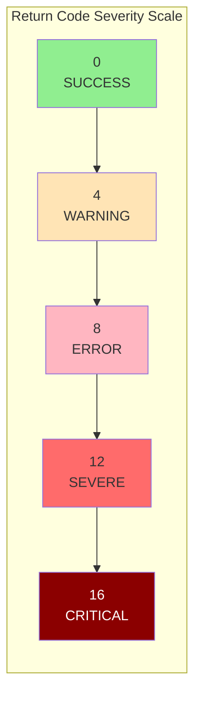
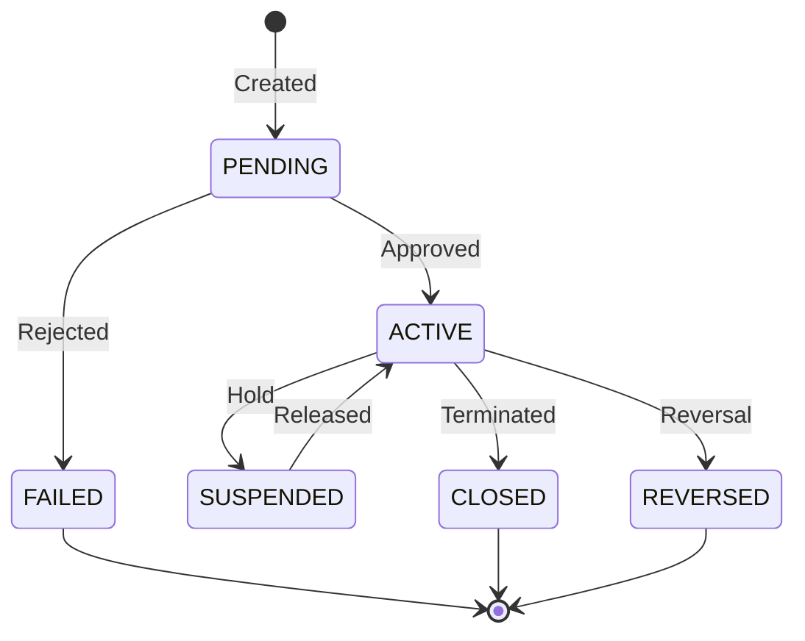

## Overview

COMMON is a foundational copybook that provides standardized definitions and constants used across the application. It serves as a central repository for frequently used data structures including return codes, status indicators, transaction types, date/time fields, error handling areas, audit tracking fields, and currency codes.

This copybook promotes consistency and maintainability by defining common values in a single location. Programs including this copybook benefit from standardized field layouts and pre-defined constants that align with system-wide conventions.

## Data Structure Summary

```
01  RETURN-CODES             Standard return code values
01  STATUS-CODES             Entity status indicators  
01  TRANSACTION-TYPES        Financial transaction type codes
01  COMMON-DATETIME          Date and time work fields
01  ERROR-HANDLING           Error tracking fields
01  AUDIT-FIELDS             Audit trail information
01  CURRENCY-CODES           ISO currency code constants
```

## Field Definitions

### RETURN-CODES - Standard Return Code Values

Defines the standard return codes aligned with IBM batch processing conventions.

| Field | Picture | Value | Description |
|-------|---------|-------|-------------|
| RC-SUCCESS | S9(4) | +0 | Successful completion |
| RC-WARNING | S9(4) | +4 | Completed with warnings |
| RC-ERROR | S9(4) | +8 | Error occurred |
| RC-SEVERE | S9(4) | +12 | Severe error |
| RC-CRITICAL | S9(4) | +16 | Critical/terminal failure |



### STATUS-CODES - Entity Status Indicators

Generic status codes applicable to various business entities (accounts, transactions, processes).

| Field | Picture | Value | Description |
|-------|---------|-------|-------------|
| STATUS-ACTIVE | X(1) | 'A' | Entity is active and operational |
| STATUS-CLOSED | X(1) | 'C' | Entity is closed/terminated |
| STATUS-PENDING | X(1) | 'P' | Entity is pending approval/action |
| STATUS-SUSPENDED | X(1) | 'S' | Entity is temporarily suspended |
| STATUS-FAILED | X(1) | 'F' | Entity processing failed |
| STATUS-REVERSED | X(1) | 'R' | Entity/transaction has been reversed |



### TRANSACTION-TYPES - Financial Transaction Codes

Standard codes for financial transaction processing.

| Field | Picture | Value | Description |
|-------|---------|-------|-------------|
| TRN-TYPE-BUY | X(2) | 'BU' | Purchase/buy transaction |
| TRN-TYPE-SELL | X(2) | 'SL' | Sale/sell transaction |
| TRN-TYPE-TRANSFER | X(2) | 'TR' | Transfer between accounts |
| TRN-TYPE-FEE | X(2) | 'FE' | Fee/charge transaction |

### COMMON-DATETIME - Date and Time Fields

Work area for capturing and manipulating date/time values.

| Level | Field | Picture | Description |
|-------|-------|---------|-------------|
| 01 | COMMON-DATETIME | - | Date/time group |
| 05 | CURRENT-DATE | - | Date subgroup |
| 10 | CURR-YEAR | X(4) | 4-digit year (YYYY) |
| 10 | CURR-MONTH | X(2) | 2-digit month (MM) |
| 10 | CURR-DAY | X(2) | 2-digit day (DD) |
| 05 | CURRENT-TIME | - | Time subgroup |
| 10 | CURR-HOUR | X(2) | Hour (HH) 00-23 |
| 10 | CURR-MINUTE | X(2) | Minute (MM) 00-59 |
| 10 | CURR-SECOND | X(2) | Second (SS) 00-59 |
| 10 | CURR-MSEC | X(2) | Milliseconds (hundredths) |

**Format:** `YYYYMMDDHHMMSSMS`

**Usage with ACCEPT:**
```cobol
ACCEPT COMMON-DATETIME FROM DATE YYYYMMDD
ACCEPT CURRENT-TIME FROM TIME
```

### ERROR-HANDLING - Error Tracking Fields

Fields for capturing and propagating error information.

| Field | Picture | Description |
|-------|---------|-------------|
| ERROR-CODE | X(4) | Application-specific error code |
| ERROR-MODULE | X(8) | Module/program where error occurred |
| ERROR-ROUTINE | X(8) | Paragraph/routine where error occurred |
| ERROR-MESSAGE | X(80) | Descriptive error message |

### AUDIT-FIELDS - Audit Trail Information

Standard fields for audit tracking across all transactions and updates.

| Field | Picture | Description |
|-------|---------|-------------|
| AUDIT-TIMESTAMP | X(26) | Full timestamp of action |
| AUDIT-USER | X(8) | User ID who performed action |
| AUDIT-TERMINAL | X(8) | Terminal/workstation ID |
| AUDIT-PROGRAM | X(8) | Program that made the change |

**Timestamp Format:** `YYYY-MM-DD-HH.MM.SS.MMMMMM` (DB2 compatible)

### CURRENCY-CODES - ISO Currency Constants

ISO 4217 currency codes for international financial processing.

| Field | Picture | Value | Description |
|-------|---------|-------|-------------|
| CURR-USD | X(3) | 'USD' | United States Dollar |
| CURR-EUR | X(3) | 'EUR' | Euro |
| CURR-GBP | X(3) | 'GBP' | British Pound Sterling |
| CURR-JPY | X(3) | 'JPY' | Japanese Yen |
| CURR-CAD | X(3) | 'CAD' | Canadian Dollar |

## Usage Examples

### Using Return Codes

```cobol
WORKING-STORAGE SECTION.
    COPY COMMON.

PROCEDURE DIVISION.
    PERFORM PROCESS-TRANSACTION
    
    EVALUATE TRUE
        WHEN WS-RESULT = RC-SUCCESS
            DISPLAY 'Transaction completed successfully'
        WHEN WS-RESULT = RC-WARNING
            DISPLAY 'Transaction completed with warnings'
            PERFORM LOG-WARNING
        WHEN WS-RESULT >= RC-ERROR
            DISPLAY 'Transaction failed'
            PERFORM ERROR-HANDLING-ROUTINE
    END-EVALUATE
    
    MOVE WS-RESULT TO RETURN-CODE
    GOBACK.
```

### Using Status Codes

```cobol
*   Check account status before processing
    IF ACCT-STATUS = STATUS-ACTIVE
        PERFORM PROCESS-ACCOUNT
    ELSE
        EVALUATE ACCT-STATUS
            WHEN STATUS-SUSPENDED
                MOVE 'Account is suspended' TO ERROR-MESSAGE
            WHEN STATUS-CLOSED
                MOVE 'Account is closed' TO ERROR-MESSAGE
            WHEN STATUS-PENDING
                MOVE 'Account is pending approval' TO ERROR-MESSAGE
        END-EVALUATE
        PERFORM REJECT-TRANSACTION
    END-IF
```

### Using Transaction Types

```cobol
*   Route transaction based on type
    EVALUATE TXN-TYPE
        WHEN TRN-TYPE-BUY
            PERFORM PROCESS-BUY-ORDER
        WHEN TRN-TYPE-SELL
            PERFORM PROCESS-SELL-ORDER
        WHEN TRN-TYPE-TRANSFER
            PERFORM PROCESS-TRANSFER
        WHEN TRN-TYPE-FEE
            PERFORM PROCESS-FEE-CHARGE
        WHEN OTHER
            MOVE 'Invalid transaction type' TO ERROR-MESSAGE
            PERFORM ERROR-HANDLING-ROUTINE
    END-EVALUATE
```

### Capturing Date/Time

```cobol
*   Get current date and time
    ACCEPT CURRENT-DATE FROM DATE YYYYMMDD
    ACCEPT CURRENT-TIME FROM TIME
    
*   Format for display
    STRING CURR-YEAR '-' CURR-MONTH '-' CURR-DAY
           ' ' CURR-HOUR ':' CURR-MINUTE ':' CURR-SECOND
           DELIMITED BY SIZE
           INTO WS-FORMATTED-DATETIME
```

### Using Audit Fields

```cobol
*   Populate audit trail before update
    MOVE FUNCTION CURRENT-DATE TO AUDIT-TIMESTAMP
    ACCEPT AUDIT-USER FROM USER-ID
    ACCEPT AUDIT-TERMINAL FROM TERMINAL-ID
    MOVE 'UPDTACCT' TO AUDIT-PROGRAM
    
    PERFORM UPDATE-WITH-AUDIT
```

### Using Currency Codes

```cobol
*   Validate currency and set defaults
    IF TXN-CURRENCY = SPACES
        MOVE CURR-USD TO TXN-CURRENCY
    END-IF
    
    EVALUATE TXN-CURRENCY
        WHEN CURR-USD
        WHEN CURR-EUR
        WHEN CURR-GBP
        WHEN CURR-JPY
        WHEN CURR-CAD
            CONTINUE
        WHEN OTHER
            MOVE 'Invalid currency code' TO ERROR-MESSAGE
            PERFORM REJECT-TRANSACTION
    END-EVALUATE
```

## Programs Using This Copybook

This copybook provides foundational definitions that can be used by any program in the system. It is designed as a base-level copybook for common constants and work areas.

:::info Reference Copybook
COMMON serves as a reference implementation and template. Individual subsystems may have their own specialized copybooks (like BCHCON for batch control or TRNREC for transactions) that provide more specific definitions for their domain.
:::

## Related Copybooks

| Copybook | Relationship |
|----------|--------------|
| [BCHCON](/docs/copybooks/BCHCON) | Batch-specific constants (extends return code patterns) |
| [ERRHAND](/docs/copybooks/ERRHAND) | Detailed error handling (extends ERROR-HANDLING) |
| [TRNREC](/docs/copybooks/TRNREC) | Transaction records (uses transaction types) |
| [AUDITLOG](/docs/copybooks/AUDITLOG) | Audit logging (extends AUDIT-FIELDS) |
| [RTNCODE](/docs/copybooks/RTNCODE) | Return code management (similar to RETURN-CODES) |

## Technical Notes

### Field Storage

| Field Type | Storage | Notes |
|------------|---------|-------|
| S9(4) | 4 bytes display | Signed numeric, DISPLAY format |
| X(n) | n bytes | Alphanumeric |

**Note:** Unlike BCHCON, this copybook uses `DISPLAY` format (not `COMP`) for return codes. This provides easier debugging but less efficient arithmetic.

### No COMP Fields

The return codes in this copybook use standard DISPLAY format (`PIC S9(4)`) rather than COMP. This means:
- Values are stored as EBCDIC characters
- Easier to view in dumps and traces
- Less efficient for arithmetic operations
- 4 bytes storage vs 2 bytes for COMP

### Value Clause Initialization

All constant fields include VALUE clauses and are automatically initialized when the copybook is included:
- Return codes: Pre-set to standard values
- Status codes: Pre-set to character values
- Transaction types: Pre-set to standard codes
- Currency codes: Pre-set to ISO codes

Work area fields (COMMON-DATETIME, ERROR-HANDLING, AUDIT-FIELDS) should be explicitly initialized or populated before use.

### Date/Time Compatibility

The COMMON-DATETIME structure is designed to work with:
- `ACCEPT FROM DATE YYYYMMDD`
- `ACCEPT FROM TIME`
- Manual population from system calls

The AUDIT-TIMESTAMP field (26 characters) is compatible with DB2 TIMESTAMP format.

## Best Practices

1. **Use named constants** - Always reference RC-SUCCESS, STATUS-ACTIVE, etc. instead of literal values
2. **Initialize work areas** - Explicitly initialize ERROR-HANDLING and AUDIT-FIELDS before use
3. **Validate transaction types** - Always validate incoming transaction types against defined constants
4. **Default currency** - Consider USD as the default when currency is not specified
5. **Complete audit fields** - Populate all audit fields for compliance and traceability
6. **Consistent status usage** - Use the same status codes across all entities for consistency

## Extension Guidelines

When extending this copybook for specialized needs:

```cobol
*   In your program's WORKING-STORAGE:
    COPY COMMON.
    
*   Add program-specific extensions:
    01  WS-EXTENDED-STATUS.
        05  WS-STATUS-REVIEW    PIC X(1) VALUE 'V'.
        05  WS-STATUS-APPROVED  PIC X(1) VALUE 'Y'.
```

This approach preserves the standard definitions while adding domain-specific values.
