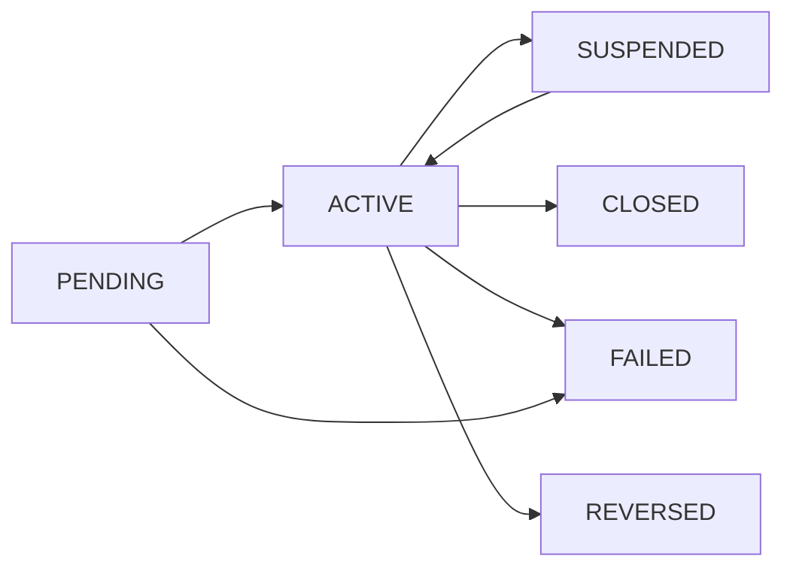

:::info General Utility Copybook
This is a **general utility copybook** containing common definitions and constants used throughout the portfolio management system. It provides standardized values that ensure consistency across all programs.
:::

## Overview

COMMON is a foundational utility copybook that defines standard constants, codes, and data structures used across the portfolio management system. It establishes a single source of truth for commonly used values, promoting consistency and maintainability.

The copybook includes:
- **Return Codes**: Standard program return codes (0, 4, 8, 12, 16)
- **Status Codes**: Record status indicators (Active, Closed, Pending, etc.)
- **Transaction Types**: Financial transaction type codes (Buy, Sell, Transfer, Fee)
- **Date/Time Fields**: Common timestamp structures
- **Error Handling**: Standard error message structure
- **Audit Fields**: Common audit trail fields
- **Currency Codes**: ISO currency code constants

By including this copybook, programs automatically gain access to these standard definitions, ensuring consistent behavior and making code more readable and maintainable.

## Data Structures

### RETURN-CODES (Level 01)

Standard program return codes aligned with mainframe conventions.

| Level | Name | Picture | Value | Description |
|-------|------|---------|-------|-------------|
| 01 | RETURN-CODES | - | - | Return code constants |
| 05 | RC-SUCCESS | S9(4) | +0 | Successful completion |
| 05 | RC-WARNING | S9(4) | +4 | Warning condition |
| 05 | RC-ERROR | S9(4) | +8 | Error condition |
| 05 | RC-SEVERE | S9(4) | +12 | Severe error |
| 05 | RC-CRITICAL | S9(4) | +16 | Critical error / abend |

**Usage Guidelines:**

| Code | When to Use |
|------|-------------|
| 0 | Normal completion, all processing successful |
| 4 | Minor issues encountered but processing completed |
| 8 | Errors occurred, results may be incomplete |
| 12 | Severe errors, processing likely incomplete |
| 16 | Critical failure, immediate termination |

### STATUS-CODES (Level 01)

Standard record status indicators.

| Level | Name | Picture | Value | Description |
|-------|------|---------|-------|-------------|
| 01 | STATUS-CODES | - | - | Status code constants |
| 05 | STATUS-ACTIVE | X(1) | 'A' | Record is active |
| 05 | STATUS-CLOSED | X(1) | 'C' | Record is closed |
| 05 | STATUS-PENDING | X(1) | 'P' | Record is pending |
| 05 | STATUS-SUSPENDED | X(1) | 'S' | Record is suspended |
| 05 | STATUS-FAILED | X(1) | 'F' | Record processing failed |
| 05 | STATUS-REVERSED | X(1) | 'R' | Record has been reversed |

**Status Lifecycle:**



### TRANSACTION-TYPES (Level 01)

Standard financial transaction type codes.

| Level | Name | Picture | Value | Description |
|-------|------|---------|-------|-------------|
| 01 | TRANSACTION-TYPES | - | - | Transaction type codes |
| 05 | TRN-TYPE-BUY | X(2) | 'BU' | Buy/purchase transaction |
| 05 | TRN-TYPE-SELL | X(2) | 'SL' | Sell transaction |
| 05 | TRN-TYPE-TRANSFER | X(2) | 'TR' | Transfer between accounts |
| 05 | TRN-TYPE-FEE | X(2) | 'FE' | Fee/charge transaction |

**Transaction Type Details:**

| Code | Name | Effect on Position | Effect on Cash |
|------|------|-------------------|----------------|
| BU | Buy | Increase quantity | Decrease balance |
| SL | Sell | Decrease quantity | Increase balance |
| TR | Transfer | Move between portfolios | No change |
| FE | Fee | No change | Decrease balance |

### COMMON-DATETIME (Level 01)

Standard date and time structure for system timestamps.

| Level | Name | Picture | Description |
|-------|------|---------|-------------|
| 01 | COMMON-DATETIME | - | Date/time structure |
| 05 | CURRENT-DATE | - | Date group |
| 10 | CURR-YEAR | X(4) | Year (YYYY) |
| 10 | CURR-MONTH | X(2) | Month (MM) |
| 10 | CURR-DAY | X(2) | Day (DD) |
| 05 | CURRENT-TIME | - | Time group |
| 10 | CURR-HOUR | X(2) | Hour (HH) |
| 10 | CURR-MINUTE | X(2) | Minute (MM) |
| 10 | CURR-SECOND | X(2) | Second (SS) |
| 10 | CURR-MSEC | X(2) | Centiseconds (CC) |

**Populating COMMON-DATETIME:**

```cobol
MOVE FUNCTION CURRENT-DATE TO COMMON-DATETIME
```

This maps the 16-character result of FUNCTION CURRENT-DATE directly to the structure.

### ERROR-HANDLING (Level 01)

Standard error message structure.

| Level | Name | Picture | Description |
|-------|------|---------|-------------|
| 01 | ERROR-HANDLING | - | Error handling fields |
| 05 | ERROR-CODE | X(4) | Error code identifier |
| 05 | ERROR-MODULE | X(8) | Module/program name |
| 05 | ERROR-ROUTINE | X(8) | Paragraph/routine name |
| 05 | ERROR-MESSAGE | X(80) | Error description |

**Error Code Convention:**

```
XXXX - 4-character error code
  |
  +-- First 2 chars: Category (e.g., FL=File, DB=Database, VL=Validation)
  +-- Last 2 chars: Sequence number within category
```

### AUDIT-FIELDS (Level 01)

Standard audit trail fields for record tracking.

| Level | Name | Picture | Description |
|-------|------|---------|-------------|
| 01 | AUDIT-FIELDS | - | Audit information |
| 05 | AUDIT-TIMESTAMP | X(26) | Full timestamp |
| 05 | AUDIT-USER | X(8) | User who made change |
| 05 | AUDIT-TERMINAL | X(8) | Terminal ID (online) |
| 05 | AUDIT-PROGRAM | X(8) | Program that made change |

### CURRENCY-CODES (Level 01)

ISO 4217 currency code constants.

| Level | Name | Picture | Value | Description |
|-------|------|---------|-------|-------------|
| 01 | CURRENCY-CODES | - | - | Currency constants |
| 05 | CURR-USD | X(3) | 'USD' | US Dollar |
| 05 | CURR-EUR | X(3) | 'EUR' | Euro |
| 05 | CURR-GBP | X(3) | 'GBP' | British Pound Sterling |
| 05 | CURR-JPY | X(3) | 'JPY' | Japanese Yen |
| 05 | CURR-CAD | X(3) | 'CAD' | Canadian Dollar |

## Usage Examples

### Using Return Codes

```cobol
WORKING-STORAGE SECTION.
    COPY COMMON.

PROCEDURE DIVISION.
    ...
    IF WS-ERROR-OCCURRED
        MOVE RC-ERROR TO RETURN-CODE
    ELSE
        MOVE RC-SUCCESS TO RETURN-CODE
    END-IF
    
    GOBACK.
```

### Checking Status Codes

```cobol
    COPY COMMON.
    
    ...
    
    IF PORT-STATUS = STATUS-ACTIVE
        PERFORM PROCESS-ACTIVE-PORTFOLIO
    ELSE
        IF PORT-STATUS = STATUS-SUSPENDED
            PERFORM PROCESS-SUSPENDED-PORTFOLIO
        ELSE
            IF PORT-STATUS = STATUS-CLOSED
                MOVE 'Portfolio is closed' TO ERROR-MESSAGE
                PERFORM ERROR-ROUTINE
            END-IF
        END-IF
    END-IF
```

### Validating Transaction Types

```cobol
    COPY COMMON.
    
    ...
    
    EVALUATE TRN-TYPE
        WHEN TRN-TYPE-BUY
            PERFORM PROCESS-BUY
        WHEN TRN-TYPE-SELL
            PERFORM PROCESS-SELL
        WHEN TRN-TYPE-TRANSFER
            PERFORM PROCESS-TRANSFER
        WHEN TRN-TYPE-FEE
            PERFORM PROCESS-FEE
        WHEN OTHER
            MOVE 'VL01' TO ERROR-CODE
            MOVE 'Invalid transaction type' TO ERROR-MESSAGE
            PERFORM ERROR-ROUTINE
    END-EVALUATE
```

### Populating Audit Fields

```cobol
    COPY COMMON.
    
    ...
    
    ACCEPT AUDIT-TIMESTAMP FROM TIME STAMP
    MOVE WS-USER-ID TO AUDIT-USER
    MOVE WS-TERMINAL-ID TO AUDIT-TERMINAL
    MOVE 'MYPROGRAM' TO AUDIT-PROGRAM
```

### Working with Date/Time

```cobol
    COPY COMMON.
    
    ...
    
    MOVE FUNCTION CURRENT-DATE TO COMMON-DATETIME
    
    STRING CURR-YEAR '-' CURR-MONTH '-' CURR-DAY
        DELIMITED BY SIZE
        INTO WS-FORMATTED-DATE
    
    STRING CURR-HOUR ':' CURR-MINUTE ':' CURR-SECOND
        DELIMITED BY SIZE
        INTO WS-FORMATTED-TIME
```

### Currency Validation

```cobol
    COPY COMMON.
    
    ...
    
    EVALUATE WS-INPUT-CURRENCY
        WHEN CURR-USD
        WHEN CURR-EUR
        WHEN CURR-GBP
        WHEN CURR-JPY
        WHEN CURR-CAD
            CONTINUE
        WHEN OTHER
            MOVE 'VL02' TO ERROR-CODE
            MOVE 'Unsupported currency code' TO ERROR-MESSAGE
            PERFORM ERROR-ROUTINE
    END-EVALUATE
```

### Complete Error Handling Example

```cobol
WORKING-STORAGE SECTION.
    COPY COMMON.
    
01  WS-PROCESSING-ERRORS PIC S9(4) COMP VALUE 0.

PROCEDURE DIVISION.
0000-MAIN.
    PERFORM 1000-INITIALIZE
    PERFORM 2000-PROCESS
    PERFORM 3000-TERMINATE
    
    EVALUATE TRUE
        WHEN WS-PROCESSING-ERRORS = 0
            MOVE RC-SUCCESS TO RETURN-CODE
        WHEN WS-PROCESSING-ERRORS < 10
            MOVE RC-WARNING TO RETURN-CODE
        WHEN WS-PROCESSING-ERRORS < 100
            MOVE RC-ERROR TO RETURN-CODE
        WHEN OTHER
            MOVE RC-SEVERE TO RETURN-CODE
    END-EVALUATE
    
    GOBACK.

9000-ERROR-ROUTINE.
    ADD 1 TO WS-PROCESSING-ERRORS
    DISPLAY ERROR-MODULE '-' ERROR-ROUTINE ': ' 
            ERROR-CODE
    DISPLAY ERROR-MESSAGE.
```

## Integration with Other Copybooks

The COMMON copybook complements other copybooks in the system:

| Copybook | Relationship |
|----------|--------------|
| ERRHAND | Extended error handling with categories and VSAM status |
| RTNCODE | Return code management with logging capabilities |
| AUDITLOG | Full audit trail record using AUDIT-FIELDS |
| POSREC | Position records using STATUS-CODES |
| TRNREC | Transaction records using TRANSACTION-TYPES |

## Best Practices

### Do's

- ✅ Use named constants instead of literal values
- ✅ Include COMMON in all new programs for consistency
- ✅ Use EVALUATE with constants for readable code
- ✅ Populate AUDIT-FIELDS for all data modifications
- ✅ Set appropriate return codes before GOBACK

### Don'ts

- ❌ Don't use literal values like 'A' instead of STATUS-ACTIVE
- ❌ Don't redefine constants in individual programs
- ❌ Don't skip error handling structures
- ❌ Don't ignore return codes from called programs

## Extending COMMON

When adding new constants to COMMON:

1. **Add to appropriate section** - Group related values together
2. **Use consistent naming** - Follow existing prefix conventions
3. **Document the values** - Add comments explaining usage
4. **Update all copies** - Ensure all environments have updated copybook
5. **Test thoroughly** - Verify existing programs still compile

## Technical Notes

- **VALUE Clauses**: All constants have VALUE clauses for automatic initialization
- **PIC S9(4)**: Return codes are signed to match RETURN-CODE register
- **PIC X(n)**: Character fields match standard mainframe field sizes
- **26-byte Timestamp**: AUDIT-TIMESTAMP matches DB2 TIMESTAMP format
- **No COMP/COMP-3**: Character constants avoid binary representation issues
- **FUNCTION CURRENT-DATE**: Returns 16 chars (YYYYMMDDHHMMSSCC) + 5 for offset

## Related Copybooks

| Copybook | Description |
|----------|-------------|
| ERRHAND | Extended error handling definitions |
| RTNCODE | Return code management structures |
| AUDITLOG | Complete audit trail record |
| BCHCON | Batch control constants |
