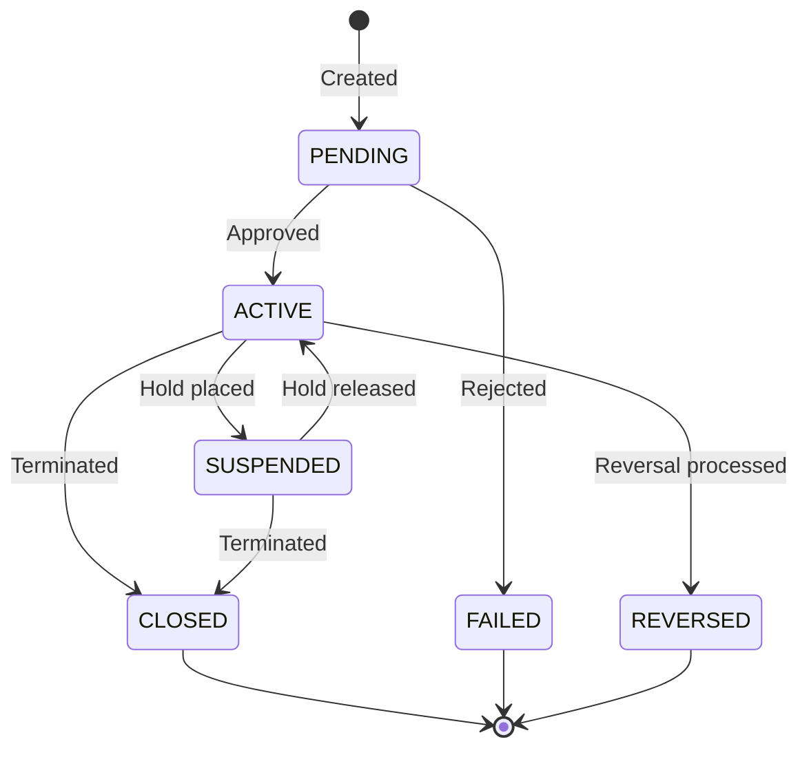

## Overview

COMMON is a foundational copybook that provides standardized definitions and constants used across the system. It establishes consistent data structures for return codes, status indicators, transaction types, date/time handling, error management, audit trails, and currency codes.

This copybook serves as a central reference for common data elements, ensuring uniformity across programs and reducing redundancy. By including COMMON, programs gain access to pre-defined constants and standardized field layouts.

## Data Structure

```
01  RETURN-CODES              - Standard return code constants
01  STATUS-CODES              - Entity status indicators  
01  TRANSACTION-TYPES         - Transaction type codes
01  COMMON-DATETIME           - Date and time work areas
01  ERROR-HANDLING            - Error context fields
01  AUDIT-FIELDS              - Audit trail information
01  CURRENCY-CODES            - ISO currency codes
```

## Field Definitions

### Return Codes (RETURN-CODES)

Standard return code values following IBM mainframe conventions:

| Field | Picture | Value | Description |
|-------|---------|-------|-------------|
| RC-SUCCESS | S9(4) | +0 | Successful completion |
| RC-WARNING | S9(4) | +4 | Completed with warnings |
| RC-ERROR | S9(4) | +8 | Error occurred |
| RC-SEVERE | S9(4) | +12 | Severe error |
| RC-CRITICAL | S9(4) | +16 | Critical failure |

**Usage:** Set or compare RETURN-CODE values.

```cobol
IF WS-ERRORS > 0
    MOVE RC-WARNING TO RETURN-CODE
ELSE
    MOVE RC-SUCCESS TO RETURN-CODE
END-IF
```

**Return Code Hierarchy:**

```
┌──────────────────────────────────────────────────┐
│  Severity │ Code │ Description                   │
├──────────────────────────────────────────────────┤
│  SUCCESS  │   0  │ Normal completion             │
│  WARNING  │   4  │ Minor issues, can continue    │
│  ERROR    │   8  │ Significant errors occurred   │
│  SEVERE   │  12  │ Major errors, partial failure │
│  CRITICAL │  16  │ Complete failure              │
└──────────────────────────────────────────────────┘
```

### Status Codes (STATUS-CODES)

Constants for tracking entity lifecycle status:

| Field | Picture | Value | Description |
|-------|---------|-------|-------------|
| STATUS-ACTIVE | X(1) | `'A'` | Entity is active |
| STATUS-CLOSED | X(1) | `'C'` | Entity is closed |
| STATUS-PENDING | X(1) | `'P'` | Entity is pending |
| STATUS-SUSPENDED | X(1) | `'S'` | Entity is suspended |
| STATUS-FAILED | X(1) | `'F'` | Entity has failed |
| STATUS-REVERSED | X(1) | `'R'` | Entity has been reversed |

**Usage:** Track and compare entity states.

```cobol
IF ACCT-STATUS = STATUS-ACTIVE
    PERFORM PROCESS-ACCOUNT
ELSE
    IF ACCT-STATUS = STATUS-SUSPENDED
        PERFORM HANDLE-SUSPENSION
    END-IF
END-IF
```

**Status State Diagram:**



### Transaction Types (TRANSACTION-TYPES)

Codes identifying financial transaction types:

| Field | Picture | Value | Description |
|-------|---------|-------|-------------|
| TRN-TYPE-BUY | X(2) | `'BU'` | Buy/purchase transaction |
| TRN-TYPE-SELL | X(2) | `'SL'` | Sell/liquidation transaction |
| TRN-TYPE-TRANSFER | X(2) | `'TR'` | Transfer between accounts |
| TRN-TYPE-FEE | X(2) | `'FE'` | Fee or charge transaction |

**Usage:** Identify and route transactions by type.

```cobol
EVALUATE TRN-TYPE
    WHEN TRN-TYPE-BUY
        PERFORM PROCESS-PURCHASE
    WHEN TRN-TYPE-SELL
        PERFORM PROCESS-SALE
    WHEN TRN-TYPE-TRANSFER
        PERFORM PROCESS-TRANSFER
    WHEN TRN-TYPE-FEE
        PERFORM PROCESS-FEE
END-EVALUATE
```

### Common Date/Time Fields (COMMON-DATETIME)

Work areas for date and time handling:

| Level | Field | Picture | Description |
|-------|-------|---------|-------------|
| 05 | CURRENT-DATE | - | Date group |
| 10 | CURR-YEAR | X(4) | Year (YYYY) |
| 10 | CURR-MONTH | X(2) | Month (MM) |
| 10 | CURR-DAY | X(2) | Day (DD) |
| 05 | CURRENT-TIME | - | Time group |
| 10 | CURR-HOUR | X(2) | Hour (HH) |
| 10 | CURR-MINUTE | X(2) | Minute (MM) |
| 10 | CURR-SECOND | X(2) | Second (SS) |
| 10 | CURR-MSEC | X(2) | Milliseconds (hundredths) |

**Usage:** Capture and format timestamps.

```cobol
MOVE FUNCTION CURRENT-DATE TO COMMON-DATETIME

DISPLAY 'Processing date: ' 
        CURR-YEAR '-' CURR-MONTH '-' CURR-DAY
        ' ' CURR-HOUR ':' CURR-MINUTE ':' CURR-SECOND
```

**Date/Time Format:**
```
CURRENT-DATE: YYYYMMDD
              ├──┘├─┘├─┘
              Year Month Day

CURRENT-TIME: HHMMSSMS
              ├─┘├─┘├─┘├─┘
              Hour Min Sec Ms
```

### Error Handling (ERROR-HANDLING)

Fields for capturing error context:

| Field | Picture | Description |
|-------|---------|-------------|
| ERROR-CODE | X(4) | Application error code |
| ERROR-MODULE | X(8) | Module where error occurred |
| ERROR-ROUTINE | X(8) | Routine/paragraph name |
| ERROR-MESSAGE | X(80) | Descriptive error message |

**Usage:** Build error context for logging and debugging.

```cobol
MOVE 'E001'      TO ERROR-CODE
MOVE 'VALACCT'   TO ERROR-MODULE
MOVE 'CHK-BAL'   TO ERROR-ROUTINE
MOVE 'Insufficient balance for transaction' 
                 TO ERROR-MESSAGE

PERFORM LOG-ERROR
```

### Audit Fields (AUDIT-FIELDS)

Standard fields for audit trail records:

| Field | Picture | Description |
|-------|---------|-------------|
| AUDIT-TIMESTAMP | X(26) | ISO timestamp (YYYY-MM-DD-HH.MM.SS.FFFFFF) |
| AUDIT-USER | X(8) | User ID who performed action |
| AUDIT-TERMINAL | X(8) | Terminal/workstation ID |
| AUDIT-PROGRAM | X(8) | Program name |

**Usage:** Populate audit information for tracking changes.

```cobol
MOVE FUNCTION CURRENT-DATE TO AUDIT-TIMESTAMP
ACCEPT AUDIT-USER FROM ENVIRONMENT 'USER'
MOVE 'TERM0001' TO AUDIT-TERMINAL
MOVE 'PORTUPDT' TO AUDIT-PROGRAM

PERFORM WRITE-AUDIT-RECORD
```

### Currency Codes (CURRENCY-CODES)

ISO 4217 currency code constants:

| Field | Picture | Value | Description |
|-------|---------|-------|-------------|
| CURR-USD | X(3) | `'USD'` | United States Dollar |
| CURR-EUR | X(3) | `'EUR'` | Euro |
| CURR-GBP | X(3) | `'GBP'` | British Pound Sterling |
| CURR-JPY | X(3) | `'JPY'` | Japanese Yen |
| CURR-CAD | X(3) | `'CAD'` | Canadian Dollar |

**Usage:** Validate and compare currency codes.

```cobol
IF TRN-CURRENCY = CURR-USD
    PERFORM PROCESS-USD-TRANSACTION
ELSE
    PERFORM CONVERT-CURRENCY
END-IF
```

## Usage

### Including the Copybook

```cobol
WORKING-STORAGE SECTION.
    COPY COMMON.
```

### Common Patterns

#### Setting Return Code Based on Errors
```cobol
EVALUATE TRUE
    WHEN WS-ERROR-COUNT = 0
        MOVE RC-SUCCESS TO RETURN-CODE
    WHEN WS-ERROR-COUNT < 10
        MOVE RC-WARNING TO RETURN-CODE
    WHEN WS-ERROR-COUNT < 100
        MOVE RC-ERROR TO RETURN-CODE
    WHEN OTHER
        MOVE RC-SEVERE TO RETURN-CODE
END-EVALUATE
```

#### Capturing Current Timestamp
```cobol
* Get system date/time into COMMON-DATETIME
ACCEPT COMMON-DATETIME FROM DATE YYYYMMDD
ACCEPT CURRENT-TIME FROM TIME

* Format for display
STRING CURR-YEAR '-' CURR-MONTH '-' CURR-DAY
       ' ' CURR-HOUR ':' CURR-MINUTE ':' CURR-SECOND
       DELIMITED BY SIZE
       INTO WS-FORMATTED-TIMESTAMP
```

#### Building Error Context
```cobol
9000-ERROR-HANDLER.
    MOVE 'ACCT' TO ERROR-CODE
    MOVE WS-PROGRAM-NAME TO ERROR-MODULE
    MOVE WS-CURRENT-PARA TO ERROR-ROUTINE
    
    STRING 'Error processing account ' DELIMITED SIZE
           ACCT-NUMBER DELIMITED SPACE
           ': ' DELIMITED SIZE
           WS-ERROR-DESC DELIMITED SIZE
           INTO ERROR-MESSAGE
    
    PERFORM WRITE-ERROR-LOG
    .
```

#### Transaction Type Validation
```cobol
IF TRN-TYPE NOT = TRN-TYPE-BUY   AND
   TRN-TYPE NOT = TRN-TYPE-SELL  AND
   TRN-TYPE NOT = TRN-TYPE-TRANSFER AND
   TRN-TYPE NOT = TRN-TYPE-FEE
    MOVE 'Invalid transaction type' TO ERROR-MESSAGE
    PERFORM ERROR-HANDLER
END-IF
```

## Complete Field Reference

| Group | Field | PIC | Value | Purpose |
|-------|-------|-----|-------|---------|
| RETURN-CODES | RC-SUCCESS | S9(4) | +0 | Success |
| RETURN-CODES | RC-WARNING | S9(4) | +4 | Warning |
| RETURN-CODES | RC-ERROR | S9(4) | +8 | Error |
| RETURN-CODES | RC-SEVERE | S9(4) | +12 | Severe |
| RETURN-CODES | RC-CRITICAL | S9(4) | +16 | Critical |
| STATUS-CODES | STATUS-ACTIVE | X(1) | 'A' | Active |
| STATUS-CODES | STATUS-CLOSED | X(1) | 'C' | Closed |
| STATUS-CODES | STATUS-PENDING | X(1) | 'P' | Pending |
| STATUS-CODES | STATUS-SUSPENDED | X(1) | 'S' | Suspended |
| STATUS-CODES | STATUS-FAILED | X(1) | 'F' | Failed |
| STATUS-CODES | STATUS-REVERSED | X(1) | 'R' | Reversed |
| TRANSACTION-TYPES | TRN-TYPE-BUY | X(2) | 'BU' | Buy |
| TRANSACTION-TYPES | TRN-TYPE-SELL | X(2) | 'SL' | Sell |
| TRANSACTION-TYPES | TRN-TYPE-TRANSFER | X(2) | 'TR' | Transfer |
| TRANSACTION-TYPES | TRN-TYPE-FEE | X(2) | 'FE' | Fee |
| CURRENCY-CODES | CURR-USD | X(3) | 'USD' | US Dollar |
| CURRENCY-CODES | CURR-EUR | X(3) | 'EUR' | Euro |
| CURRENCY-CODES | CURR-GBP | X(3) | 'GBP' | British Pound |
| CURRENCY-CODES | CURR-JPY | X(3) | 'JPY' | Japanese Yen |
| CURRENCY-CODES | CURR-CAD | X(3) | 'CAD' | Canadian Dollar |

## Related Copybooks

| Copybook | Relationship |
|----------|--------------|
| ERRHAND | Extended error handling - builds on ERROR-HANDLING structure |
| RTNCODE | Return code management - provides similar RC constants with additional features |
| AUDITLOG | Audit trail records - extends AUDIT-FIELDS with full record layout |
| TRNREC | Transaction records - uses TRANSACTION-TYPES for TRN-TYPE field |
| BCHCON | Batch constants - provides similar status/return code constants for batch control |

## Technical Notes

- Return code constants use **S9(4)** without COMP for compatibility with the RETURN-CODE special register
- Status codes are single characters for compact storage in record layouts
- The COMMON-DATETIME structure aligns with the output of `FUNCTION CURRENT-DATE`
- Currency codes follow **ISO 4217** standard 3-character alphabetic codes
- All constants include `VALUE` clauses for compile-time initialization
- The ERROR-MESSAGE field at 80 characters fits standard display widths
- AUDIT-TIMESTAMP at 26 characters accommodates the full ISO timestamp format with microseconds
- This copybook defines multiple level-01 items, allowing selective use of only needed structures
