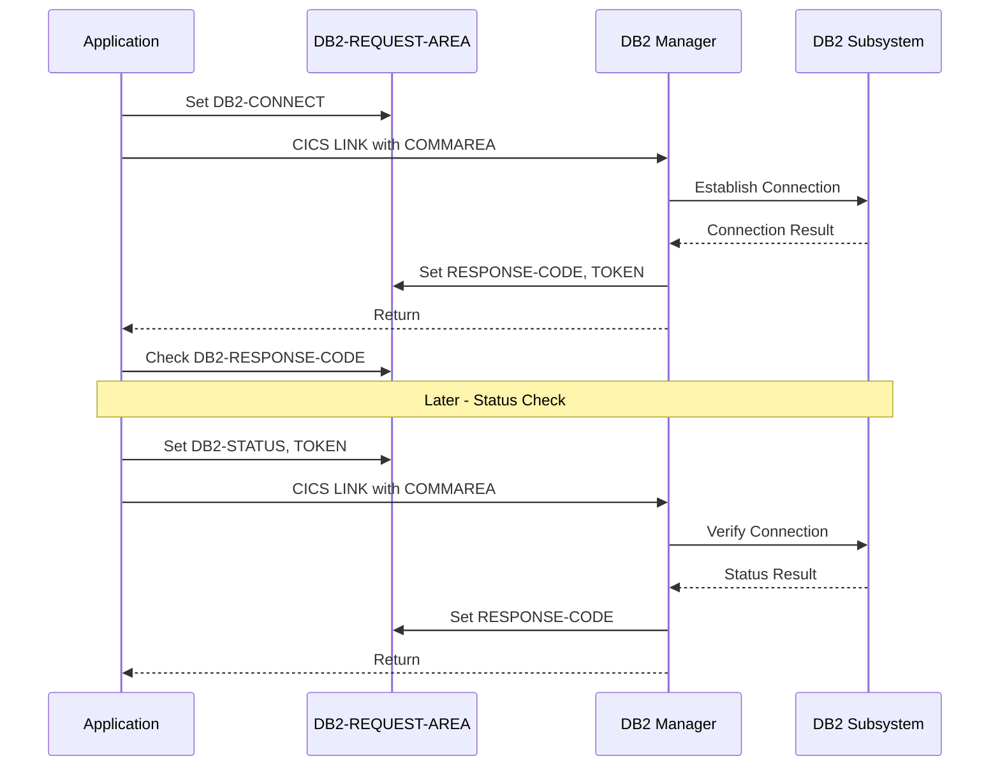

## Overview

DB2REQ is a copybook that defines the standard request/response area for DB2 connection management in CICS online programs. It provides a communication interface between application programs and DB2 connection management services.

The copybook supports three primary operations:
- **Connect** - Establish a connection to DB2
- **Disconnect** - Terminate a DB2 connection
- **Status** - Check current connection status

This structure is typically used as a COMMAREA when calling DB2 connection management programs via `EXEC CICS LINK`, enabling centralized connection handling and error management.

## Record Structure

```
+------------------------------------------------------------------+
|                       DB2-REQUEST-AREA                            |
+------------------------------------------------------------------+
| DB2-REQUEST-TYPE (1)        - Operation to perform               |
|   'C' = Connect                                                  |
|   'D' = Disconnect                                               |
|   'S' = Status check                                             |
+------------------------------------------------------------------+
| DB2-RESPONSE-CODE (4)       - Result of operation                |
+------------------------------------------------------------------+
| DB2-CONNECTION-TOKEN (16)   - Connection identifier              |
+------------------------------------------------------------------+
| DB2-ERROR-INFO (89 bytes)                                        |
|   +-- DB2-SQLCODE (4)       - SQL return code                    |
|   +-- DB2-ERROR-MSG (80)    - Error description                  |
+------------------------------------------------------------------+
Total Structure Length: 110 bytes
```

## Field Definitions

### Request Type

| Field | Picture | Description |
|-------|---------|-------------|
| DB2-REQUEST-TYPE | X | Single-character operation code |

**Condition Names:**

| Level-88 | Value | Description |
|----------|-------|-------------|
| DB2-CONNECT | 'C' | Request DB2 connection |
| DB2-DISCONNECT | 'D' | Request DB2 disconnection |
| DB2-STATUS | 'S' | Request connection status check |

### Response Fields

| Field | Picture | Description |
|-------|---------|-------------|
| DB2-RESPONSE-CODE | S9(8) COMP | Operation result code (0 = success) |
| DB2-CONNECTION-TOKEN | X(16) | Unique identifier for the DB2 connection |

### Error Information (DB2-ERROR-INFO)

| Field | Picture | Description |
|-------|---------|-------------|
| DB2-SQLCODE | S9(9) COMP | SQL return code from DB2 |
| DB2-ERROR-MSG | X(80) | Human-readable error description |

## Usage Examples

### Requesting a DB2 Connection

```cobol
WORKING-STORAGE SECTION.
01  WS-DB2-REQUEST.
    COPY DB2REQ.

PROCEDURE DIVISION.
    INITIALIZE DB2-REQUEST-AREA
    SET DB2-CONNECT TO TRUE
    
    EXEC CICS LINK PROGRAM('DB2ONLN')
              COMMAREA(DB2-REQUEST-AREA)
              LENGTH(LENGTH OF DB2-REQUEST-AREA)
    END-EXEC
    
    IF DB2-RESPONSE-CODE = 0
        MOVE DB2-CONNECTION-TOKEN TO WS-SAVED-TOKEN
        PERFORM PROCESS-WITH-DB2
    ELSE
        DISPLAY 'Connection failed: ' DB2-ERROR-MSG
        DISPLAY 'SQLCODE: ' DB2-SQLCODE
        PERFORM HANDLE-CONNECTION-ERROR
    END-IF
```

### Checking Connection Status

```cobol
    INITIALIZE DB2-REQUEST-AREA
    SET DB2-STATUS TO TRUE
    MOVE WS-SAVED-TOKEN TO DB2-CONNECTION-TOKEN
    
    EXEC CICS LINK PROGRAM('DB2ONLN')
              COMMAREA(DB2-REQUEST-AREA)
              LENGTH(LENGTH OF DB2-REQUEST-AREA)
    END-EXEC
    
    IF DB2-RESPONSE-CODE = 0
        CONTINUE
    ELSE
        PERFORM RECONNECT-TO-DB2
    END-IF
```

### Disconnecting from DB2

```cobol
    INITIALIZE DB2-REQUEST-AREA
    SET DB2-DISCONNECT TO TRUE
    MOVE WS-SAVED-TOKEN TO DB2-CONNECTION-TOKEN
    
    EXEC CICS LINK PROGRAM('DB2ONLN')
              COMMAREA(DB2-REQUEST-AREA)
              LENGTH(LENGTH OF DB2-REQUEST-AREA)
    END-EXEC
    
    IF DB2-RESPONSE-CODE NOT = 0
        DISPLAY 'Disconnect warning: ' DB2-ERROR-MSG
    END-IF
```

### Using with DB2RECV for Recovery

```cobol
*   After a DB2 error, attempt recovery
    INITIALIZE DB2-REQUEST-AREA
    SET DB2-CONNECT TO TRUE
    
    EXEC CICS LINK PROGRAM('DB2RECV')
              COMMAREA(DB2-REQUEST-AREA)
              LENGTH(LENGTH OF DB2-REQUEST-AREA)
    END-EXEC
    
    EVALUATE DB2-RESPONSE-CODE
        WHEN 0
            DISPLAY 'Recovery successful'
        WHEN OTHER
            DISPLAY 'Recovery failed - SQLCODE: ' DB2-SQLCODE
    END-EVALUATE
```

## Programs Using This Copybook

| Program | Description |
|---------|-------------|
| DB2RECV | DB2 Recovery Manager - handles connection failures and retry logic |

## Response Code Values

### DB2-RESPONSE-CODE

| Value | Description |
|-------|-------------|
| 0 | Operation completed successfully |
| Non-zero | Operation failed - check DB2-ERROR-INFO for details |

### Common DB2-SQLCODE Values

| SQLCODE | Description |
|---------|-------------|
| 0 | Successful execution |
| 100 | No data found (not typically an error) |
| -803 | Duplicate key violation |
| -805 | Package not found |
| -811 | Multiple rows returned for singleton SELECT |
| -904 | Resource unavailable |
| -911 | Deadlock or timeout |
| -913 | Deadlock victim |
| -30081 | Communication error |

## Connection Token

The `DB2-CONNECTION-TOKEN` field serves as a unique identifier for the DB2 connection:

- **Length**: 16 characters provides sufficient uniqueness
- **Generation**: Created by the connection manager during CONNECT
- **Persistence**: Should be saved by the calling program
- **Usage**: Required for STATUS and DISCONNECT operations
- **Scope**: Valid for the duration of the CICS task or until DISCONNECT

## Request/Response Flow



## Design Considerations

### COMMAREA Usage

This structure is designed for CICS COMMAREA communication:
- Fixed length (110 bytes) fits within COMMAREA limits
- All fields are contiguous for efficient data transfer
- No pointers or addresses that wouldn't survive the LINK

### Error Information

The error information section provides:
- `DB2-SQLCODE`: Precise technical error code for programmatic handling
- `DB2-ERROR-MSG`: Human-readable text for logging and display

### Token-Based Design

The connection token approach provides:
- **Stateless Operations**: Each request is self-contained
- **Connection Tracking**: Multiple connections can be managed
- **Validation**: Invalid tokens can be detected

## Technical Notes

1. **S9(8) COMP for Response Code**: The 4-byte binary format handles the full range of possible response codes and aligns well on word boundaries.

2. **S9(9) COMP for SQLCODE**: DB2 SQLCODEs range from -99999 to +99999, so S9(9) provides ample capacity including sign handling.

3. **80-Character Error Message**: Matches standard terminal line width and provides sufficient space for meaningful error descriptions.

4. **16-Character Token**: Long enough for:
   - Timestamp-based tokens
   - CICS task number combinations
   - Hashed identifiers
   - UUID-style shortened tokens

5. **Structure Initialization**: Always `INITIALIZE DB2-REQUEST-AREA` before use to clear previous values, especially the error fields.

6. **COMMAREA Length**: When using `EXEC CICS LINK`, specify `LENGTH(LENGTH OF DB2-REQUEST-AREA)` to ensure the complete structure is passed.

7. **Condition Name Usage**: Use the level-88 condition names for clarity:
   ```cobol
   SET DB2-CONNECT TO TRUE    (preferred)
   vs
   MOVE 'C' TO DB2-REQUEST-TYPE    (less clear)
   ```
