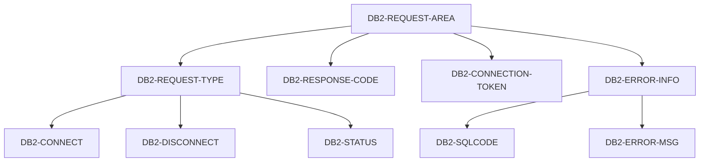
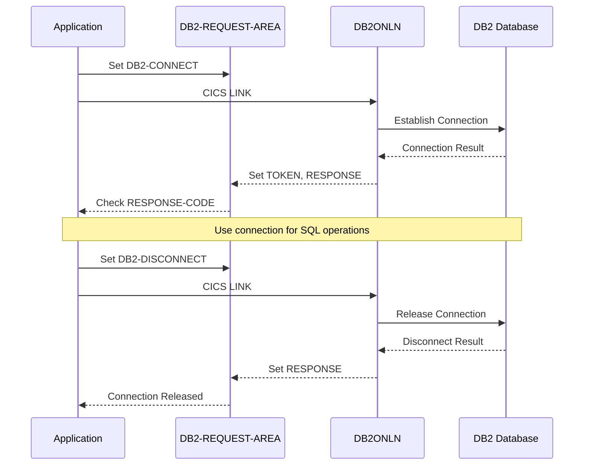

## Overview

DB2REQ (DB2 Request) is a copybook that defines the communication structure for DB2 database connection management in CICS online programs. It provides a standardized interface for requesting database connections, disconnections, and status checks, along with capturing response information and error details.

This copybook is essential for:
- **Connection Management**: Establishing and releasing DB2 connections in online transactions
- **Error Handling**: Capturing SQLCODE and error messages for recovery processing
- **Connection Tracking**: Managing connection tokens for session continuity
- **Status Monitoring**: Checking database connection status

## Structure Diagram



## Data Definitions

### DB2-REQUEST-AREA (Level 01)

The main structure for DB2 connection request operations.

| Level | Name | Picture | Description |
|-------|------|---------|-------------|
| 01 | DB2-REQUEST-AREA | - | DB2 request communication area |

### DB2-REQUEST-TYPE - Operation Type

Specifies the DB2 operation to perform.

| Level | Name | Picture | Description |
|-------|------|---------|-------------|
| 05 | DB2-REQUEST-TYPE | X | Request operation code |

**Request Type Values (88-levels):**

| Condition | Value | Description |
|-----------|-------|-------------|
| DB2-CONNECT | 'C' | Establish DB2 connection |
| DB2-DISCONNECT | 'D' | Release DB2 connection |
| DB2-STATUS | 'S' | Check connection status |

### DB2-RESPONSE-CODE - Response Code

| Level | Name | Picture | Description |
|-------|------|---------|-------------|
| 05 | DB2-RESPONSE-CODE | S9(8) COMP | Response from DB2 operation |

**Common Response Code Values:**

| Value | Meaning |
|-------|---------|
| 0 | Successful operation |
| 4 | Warning condition |
| 8 | Error occurred |
| 12 | Severe error |
| -1 | Connection not available |

### DB2-CONNECTION-TOKEN - Connection Token

| Level | Name | Picture | Description |
|-------|------|---------|-------------|
| 05 | DB2-CONNECTION-TOKEN | X(16) | Unique connection identifier |

The connection token is:
- Returned on successful CONNECT
- Required for subsequent DB2 operations
- Used to track connection state
- Passed to DISCONNECT to release resources

### DB2-ERROR-INFO - Error Information

Contains detailed error information when operations fail.

| Level | Name | Picture | Description |
|-------|------|---------|-------------|
| 05 | DB2-ERROR-INFO | - | Error information group |
| 10 | DB2-SQLCODE | S9(9) COMP | SQL return code |
| 10 | DB2-ERROR-MSG | X(80) | Error message text |

**Common SQLCODE Values:**

| SQLCODE | Meaning |
|---------|---------|
| 0 | Successful execution |
| 100 | Row not found / End of data |
| -803 | Duplicate key |
| -805 | Package not found |
| -811 | Multiple rows returned |
| -818 | Timestamp mismatch |
| -904 | Resource unavailable |
| -911 | Deadlock / timeout |
| -913 | Deadlock detected |

## Record Layout

```
Position  Length  Field Name             Format       Description
--------  ------  --------------------   -----------  ----------------------
1         1       DB2-REQUEST-TYPE       X            Operation type
2-5       4       DB2-RESPONSE-CODE      S9(8) COMP   Response code
6-21      16      DB2-CONNECTION-TOKEN   X(16)        Connection token
22-25     4       DB2-SQLCODE            S9(9) COMP   SQL return code
26-105    80      DB2-ERROR-MSG          X(80)        Error message
```

**Total Structure Length: 105 bytes**

## Usage

### Including the Copybook

```cobol
       WORKING-STORAGE SECTION.
           COPY DB2REQ.
```

### Requesting a DB2 Connection

```cobol
       REQUEST-DB2-CONNECT.
           INITIALIZE DB2-REQUEST-AREA
           SET DB2-CONNECT TO TRUE
           
           EXEC CICS LINK PROGRAM('DB2ONLN')
                     COMMAREA(DB2-REQUEST-AREA)
                     LENGTH(LENGTH OF DB2-REQUEST-AREA)
           END-EXEC
           
           IF DB2-RESPONSE-CODE = 0
               MOVE DB2-CONNECTION-TOKEN TO WS-SAVED-TOKEN
               DISPLAY 'DB2 Connected: ' DB2-CONNECTION-TOKEN
           ELSE
               DISPLAY 'DB2 Connect failed: ' DB2-ERROR-MSG
               PERFORM HANDLE-DB2-ERROR
           END-IF.
```

### Checking Connection Status

```cobol
       CHECK-DB2-STATUS.
           SET DB2-STATUS TO TRUE
           MOVE WS-SAVED-TOKEN TO DB2-CONNECTION-TOKEN
           
           EXEC CICS LINK PROGRAM('DB2ONLN')
                     COMMAREA(DB2-REQUEST-AREA)
                     LENGTH(LENGTH OF DB2-REQUEST-AREA)
           END-EXEC
           
           EVALUATE DB2-RESPONSE-CODE
               WHEN 0
                   SET CONNECTION-ACTIVE TO TRUE
               WHEN OTHER
                   SET CONNECTION-INACTIVE TO TRUE
                   PERFORM RECONNECT-DB2
           END-EVALUATE.
```

### Disconnecting from DB2

```cobol
       REQUEST-DB2-DISCONNECT.
           SET DB2-DISCONNECT TO TRUE
           MOVE WS-SAVED-TOKEN TO DB2-CONNECTION-TOKEN
           
           EXEC CICS LINK PROGRAM('DB2ONLN')
                     COMMAREA(DB2-REQUEST-AREA)
                     LENGTH(LENGTH OF DB2-REQUEST-AREA)
           END-EXEC
           
           IF DB2-RESPONSE-CODE = 0
               INITIALIZE WS-SAVED-TOKEN
               DISPLAY 'DB2 Disconnected successfully'
           ELSE
               DISPLAY 'DB2 Disconnect warning: ' DB2-ERROR-MSG
           END-IF.
```

### Error Recovery Pattern

```cobol
       HANDLE-DB2-ERROR.
           EVALUATE TRUE
               WHEN DB2-SQLCODE = -904
                   DISPLAY 'DB2 Resource unavailable'
                   PERFORM WAIT-AND-RETRY
               WHEN DB2-SQLCODE = -911 OR -913
                   DISPLAY 'DB2 Deadlock detected'
                   PERFORM ROLLBACK-AND-RETRY
               WHEN DB2-SQLCODE = -805
                   DISPLAY 'DB2 Package not found'
                   SET FATAL-ERROR TO TRUE
               WHEN OTHER
                   DISPLAY 'DB2 Error: ' DB2-SQLCODE
                   DISPLAY 'Message: ' DB2-ERROR-MSG
                   SET FATAL-ERROR TO TRUE
           END-EVALUATE.
```

### Complete Connection Management Example

```cobol
       WORKING-STORAGE SECTION.
           COPY DB2REQ.
           
       01  WS-CONNECTION-STATE.
           05  WS-SAVED-TOKEN      PIC X(16).
           05  WS-CONNECTED-SW     PIC X VALUE 'N'.
               88 DB2-IS-CONNECTED     VALUE 'Y'.
               88 DB2-NOT-CONNECTED    VALUE 'N'.
           05  WS-RETRY-COUNT      PIC 9(2) VALUE 0.
           05  WS-MAX-RETRIES      PIC 9(2) VALUE 3.
       
       PROCEDURE DIVISION.
       
       ESTABLISH-CONNECTION.
           PERFORM UNTIL DB2-IS-CONNECTED 
                      OR WS-RETRY-COUNT >= WS-MAX-RETRIES
               
               INITIALIZE DB2-REQUEST-AREA
               SET DB2-CONNECT TO TRUE
               
               EXEC CICS LINK PROGRAM('DB2ONLN')
                         COMMAREA(DB2-REQUEST-AREA)
                         LENGTH(LENGTH OF DB2-REQUEST-AREA)
               END-EXEC
               
               IF DB2-RESPONSE-CODE = 0
                   SET DB2-IS-CONNECTED TO TRUE
                   MOVE DB2-CONNECTION-TOKEN TO WS-SAVED-TOKEN
               ELSE
                   ADD 1 TO WS-RETRY-COUNT
                   IF WS-RETRY-COUNT < WS-MAX-RETRIES
                       EXEC CICS DELAY INTERVAL(5) END-EXEC
                   END-IF
               END-IF
           END-PERFORM
           
           IF DB2-NOT-CONNECTED
               MOVE 'Unable to connect to DB2' 
                 TO WS-ERROR-MESSAGE
               PERFORM ABORT-TRANSACTION
           END-IF.
           
       RELEASE-CONNECTION.
           IF DB2-IS-CONNECTED
               SET DB2-DISCONNECT TO TRUE
               MOVE WS-SAVED-TOKEN TO DB2-CONNECTION-TOKEN
               
               EXEC CICS LINK PROGRAM('DB2ONLN')
                         COMMAREA(DB2-REQUEST-AREA)
                         LENGTH(LENGTH OF DB2-REQUEST-AREA)
               END-EXEC
               
               SET DB2-NOT-CONNECTED TO TRUE
               INITIALIZE WS-SAVED-TOKEN
           END-IF.
```

## Programs Using This Copybook

| Program | Description |
|---------|-------------|
| DB2RECV | DB2 error recovery program |

## Related Copybooks

| Copybook | Relationship |
|----------|--------------|
| ERRHND | Error handling for online programs |
| SQLCA | SQL Communication Area (standard DB2 copybook) |
| INQCOM | Online inquiry communication area |

## Connection Flow



## Design Considerations

### Connection Token

The 16-character connection token:
- Uniquely identifies the DB2 connection
- Must be preserved across CICS pseudo-conversational transactions
- Should be stored in COMMAREA or temporary storage
- Is invalidated on disconnect or timeout

### COMP Fields

Numeric fields use `COMP` (binary) format for:
- Efficient comparison with system return codes
- Compatibility with DB2 SQLCODE values
- Compact storage in COMMAREA

### Error Message Length

The 80-character error message:
- Accommodates most DB2 error descriptions
- Fits standard terminal display width
- Can be logged or displayed directly

### Response Code vs SQLCODE

- **DB2-RESPONSE-CODE**: High-level operation result from connection handler
- **DB2-SQLCODE**: Specific DB2 SQL return code when errors occur

Both should be checked for comprehensive error handling.

## CICS Considerations

### COMMAREA Usage

When using this copybook with CICS LINK:
- Structure is passed as COMMAREA
- Length must be specified correctly
- Data is returned in the same area

### Pseudo-Conversational Design

For pseudo-conversational transactions:
- Save connection token between interactions
- Check connection status at start of each transaction
- Handle connection timeout gracefully

### Thread Safety

Each CICS task should:
- Obtain its own connection
- Not share connection tokens between tasks
- Release connection when transaction ends

## Maintenance Notes

When modifying this copybook:

1. **Adding request types**: Update DB2ONLN handler program
2. **Changing token size**: Coordinate with all using programs
3. **Extending error info**: Ensure COMMAREA length is updated
4. **Adding fields**: Add to end to maintain compatibility
