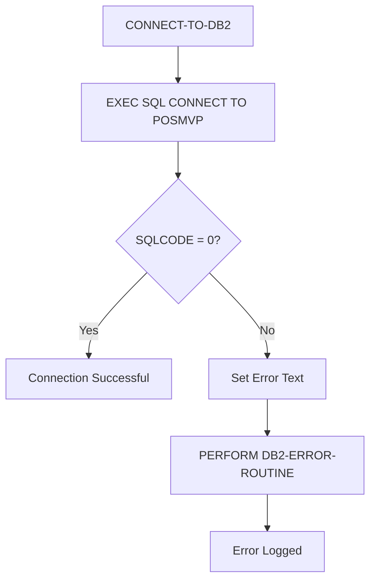
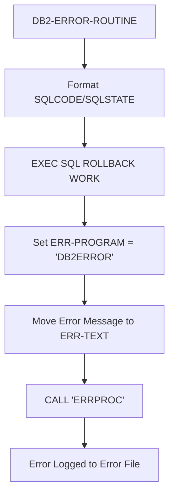
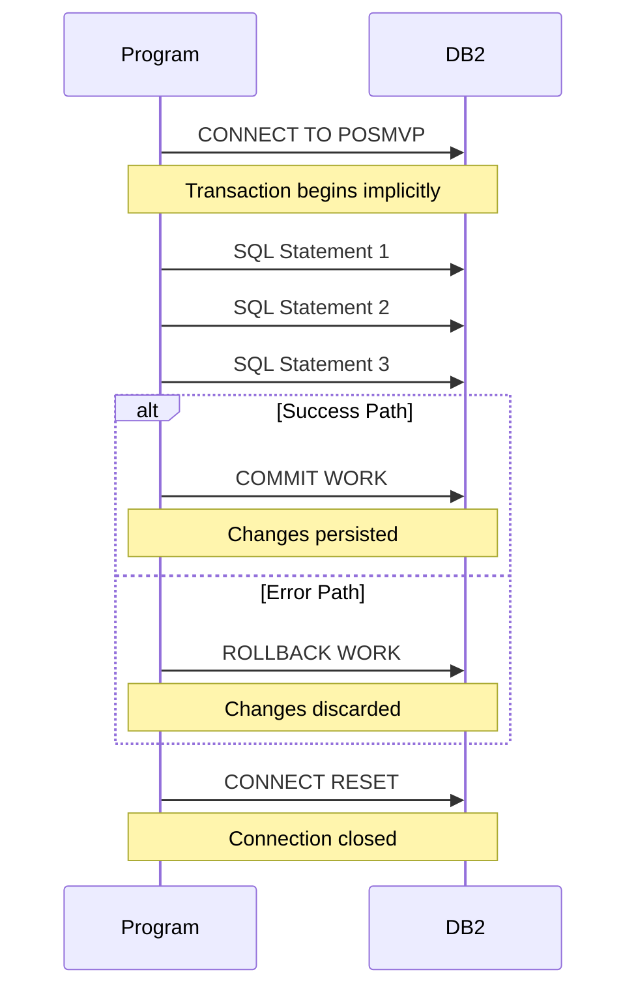

## Overview

DBPROC is a copybook that provides standardized DB2 database procedures for use across the application. It includes both data definitions for error handling and reusable procedure paragraphs for common database operations.

This copybook establishes consistent patterns for:
- DB2 connection and disconnection
- SQL error handling and retry logic
- Transaction management (commit/rollback)
- Error message formatting and logging

By centralizing these procedures, the application ensures uniform database handling across all DB2-enabled programs.

## Data Structures

### DB2-ERROR-HANDLING

Contains fields for capturing and formatting SQL errors, plus retry control parameters.

| Level | Name | Picture | Value | Description |
|-------|------|---------|-------|-------------|
| 01 | DB2-ERROR-HANDLING | - | - | Error handling group |
| 05 | DB2-ERROR-MESSAGE | - | - | Formatted error message |
| 10 | FILLER | X(9) | 'SQLCODE: ' | Label |
| 10 | DB2-SQLCODE-TXT | X(6) | - | SQLCODE as text |
| 10 | FILLER | X(9) | ' STATE: ' | Label |
| 10 | DB2-STATE | X(5) | - | SQLSTATE value |
| 10 | FILLER | X(8) | ' ERROR: ' | Label |
| 10 | DB2-ERROR-TEXT | X(70) | - | Error description |
| 05 | DB2-SAVE-STATUS | X(5) | - | Saved SQLSTATE |
| 05 | DB2-RETRY-COUNT | S9(4) COMP | 0 | Current retry attempt |
| 05 | DB2-MAX-RETRIES | S9(4) COMP | 3 | Maximum retry attempts |
| 05 | DB2-RETRY-WAIT | S9(4) COMP | 100 | Wait time between retries |

#### Error Message Layout

The DB2-ERROR-MESSAGE field produces formatted output like:

```
SQLCODE: -803   STATE: 23505 ERROR: Duplicate key value violates unique constraint
```

**Total length:** 107 characters

```
+----------+--------+----------+-------+---------+----------------------+
| SQLCODE: | -803   |  STATE:  | 23505 | ERROR:  | Duplicate key value  |
|  (9)     |  (6)   |   (9)    |  (5)  |   (8)   |       (70)           |
+----------+--------+----------+-------+---------+----------------------+
```

## Procedures

### CONNECT-TO-DB2

Establishes a connection to the DB2 database.

```cobol
CONNECT-TO-DB2.
    EXEC SQL
        CONNECT TO POSMVP
    END-EXEC
    IF SQLCODE NOT = 0
        MOVE 'Connection failed' TO DB2-ERROR-TEXT
        PERFORM DB2-ERROR-ROUTINE
    END-IF
    .
```

**Behavior:**
- Connects to the POSMVP database
- On failure, sets error text and invokes error routine
- Should be called at program initialization



### DISCONNECT-FROM-DB2

Cleanly disconnects from the DB2 database.

```cobol
DISCONNECT-FROM-DB2.
    EXEC SQL
        COMMIT WORK
    END-EXEC
    
    EXEC SQL
        CONNECT RESET
    END-EXEC
    .
```

**Behavior:**
- Commits any pending work
- Resets (closes) the database connection
- Should be called at program termination

:::note
This procedure always commits before disconnecting. If you need to rollback instead, perform the rollback before calling DISCONNECT-FROM-DB2.
:::

### DB2-ERROR-ROUTINE

Handles SQL errors by formatting the error message, rolling back the transaction, and logging the error.

```cobol
DB2-ERROR-ROUTINE.
    MOVE SQLCODE TO DB2-SQLCODE-TXT
    MOVE SQLSTATE TO DB2-STATE
    
    EXEC SQL
        ROLLBACK WORK
    END-EXEC
    
    MOVE 'DB2ERROR' TO ERR-PROGRAM
    MOVE DB2-ERROR-MESSAGE TO ERR-TEXT
    CALL 'ERRPROC' USING ERR-MESSAGE
    .
```

**Behavior:**
1. Captures SQLCODE and SQLSTATE into formatted message
2. Rolls back the current transaction
3. Sets ERR-PROGRAM to 'DB2ERROR'
4. Calls ERRPROC to log the error



### CHECK-SQL-STATUS

Checks the current SQLCODE and invokes error handling if non-zero.

```cobol
CHECK-SQL-STATUS.
    IF SQLCODE NOT = 0
        PERFORM DB2-ERROR-ROUTINE
    END-IF
    .
```

**Behavior:**
- Examines SQLCODE from the most recent SQL statement
- If non-zero, performs the error routine
- Simple wrapper for consistent status checking

## Usage Examples

### Basic Program Structure

```cobol
WORKING-STORAGE SECTION.
    COPY SQLCA.
    COPY DBPROC.
    COPY ERRHAND.

PROCEDURE DIVISION.
0000-MAIN.
    PERFORM CONNECT-TO-DB2
    PERFORM 1000-PROCESS-DATA
    PERFORM DISCONNECT-FROM-DB2
    GOBACK.

1000-PROCESS-DATA.
    EXEC SQL
        SELECT COL1, COL2
        INTO :WS-COL1, :WS-COL2
        FROM MY_TABLE
        WHERE KEY_COL = :WS-KEY
    END-EXEC
    PERFORM CHECK-SQL-STATUS.
```

### Using Retry Logic

```cobol
* Implement retry logic for deadlock situations
MOVE 0 TO DB2-RETRY-COUNT

PERFORM UNTIL DB2-RETRY-COUNT >= DB2-MAX-RETRIES
    EXEC SQL
        UPDATE ACCOUNTS
        SET BALANCE = BALANCE + :WS-AMOUNT
        WHERE ACCOUNT_ID = :WS-ACCOUNT-ID
    END-EXEC
    
    EVALUATE SQLCODE
        WHEN 0
            EXIT PERFORM
        WHEN -911
        WHEN -913
            * Deadlock or timeout - retry
            ADD 1 TO DB2-RETRY-COUNT
            CALL 'ILBOABN0' USING DB2-RETRY-WAIT
        WHEN OTHER
            PERFORM DB2-ERROR-ROUTINE
            EXIT PERFORM
    END-EVALUATE
END-PERFORM

IF DB2-RETRY-COUNT >= DB2-MAX-RETRIES
    MOVE 'Max retries exceeded' TO DB2-ERROR-TEXT
    PERFORM DB2-ERROR-ROUTINE
END-IF
```

### Custom Error Handling

```cobol
* Handle specific SQL conditions
EXEC SQL
    INSERT INTO TRANSACTIONS
    (TRANS_ID, AMOUNT, TRANS_DATE)
    VALUES
    (:WS-TRANS-ID, :WS-AMOUNT, CURRENT DATE)
END-EXEC

EVALUATE SQLCODE
    WHEN 0
        CONTINUE
    WHEN -803
        * Duplicate key - may be acceptable
        MOVE 'Duplicate transaction ID' TO DB2-ERROR-TEXT
        MOVE SQLCODE TO DB2-SQLCODE-TXT
        MOVE SQLSTATE TO DB2-STATE
        DISPLAY DB2-ERROR-MESSAGE
    WHEN OTHER
        PERFORM DB2-ERROR-ROUTINE
END-EVALUATE
```

### Batch Commit Pattern

```cobol
* Commit every N records in batch processing
MOVE 0 TO WS-COMMIT-COUNT

PERFORM UNTIL END-OF-FILE
    READ INPUT-FILE
        AT END
            SET END-OF-FILE TO TRUE
        NOT AT END
            PERFORM PROCESS-RECORD
            ADD 1 TO WS-COMMIT-COUNT
            
            IF WS-COMMIT-COUNT >= 1000
                EXEC SQL COMMIT WORK END-EXEC
                PERFORM CHECK-SQL-STATUS
                MOVE 0 TO WS-COMMIT-COUNT
            END-IF
    END-READ
END-PERFORM

* Final commit
EXEC SQL COMMIT WORK END-EXEC
PERFORM CHECK-SQL-STATUS
```

## Programs Using This Copybook

| Program | Description | Primary Usage |
|---------|-------------|---------------|
| HISTLD00 | History Load Processing | Batch DB2 data loading |
| DB2CMT | DB2 Commit Processing | Transaction commit management |
| DB2CONN | DB2 Connection Management | Connection pool/management |
| DB2ERR | DB2 Error Handling | Centralized error processing |
| DB2STAT | DB2 Statistics Collection | Performance monitoring |

## Related Copybooks

- **SQLCA** - SQL Communication Area (required for SQLCODE/SQLSTATE)
- **ERRHAND** - Standard error handling definitions (used by DB2-ERROR-ROUTINE)
- **DBTBLS** - Database table definitions

## Technical Notes

### Prerequisites

This copybook requires:
1. **SQLCA** must be included for SQLCODE and SQLSTATE variables
2. **ERRHAND** must be included for ERR-PROGRAM, ERR-TEXT, and ERR-MESSAGE
3. **ERRPROC** program must be available for error logging

### Database Name

The copybook connects to database `POSMVP`. To use a different database:
- Modify the CONNECT statement, or
- Use a host variable for the database name

```cobol
* Alternative: Use host variable for database name
01  WS-DB-NAME    PIC X(8) VALUE 'POSMVP'.

EXEC SQL
    CONNECT TO :WS-DB-NAME
END-EXEC
```

### SQLCODE Reference

Common SQLCODE values handled by these procedures:

| SQLCODE | SQLSTATE | Meaning |
|---------|----------|---------|
| 0 | 00000 | Successful execution |
| 100 | 02000 | No data found |
| -803 | 23505 | Duplicate key |
| -811 | 21000 | Multiple rows returned |
| -904 | 57011 | Resource unavailable |
| -911 | 40001 | Deadlock or timeout |
| -913 | 57033 | Deadlock victim |

### Retry Configuration

The default retry settings can be modified:

| Field | Default | Purpose |
|-------|---------|---------|
| DB2-RETRY-COUNT | 0 | Current attempt counter |
| DB2-MAX-RETRIES | 3 | Maximum retry attempts |
| DB2-RETRY-WAIT | 100 | Wait time (centiseconds) |

### Transaction Scope



### Best Practices

1. **Always check SQLCODE** after each SQL statement
2. **Use CHECK-SQL-STATUS** for consistent error handling
3. **Commit periodically** in batch processing to avoid lock contention
4. **Implement retry logic** for deadlock-prone operations
5. **Call DISCONNECT-FROM-DB2** in termination routines
6. **Save SQLCODE/SQLSTATE** immediately if needed for later analysis
