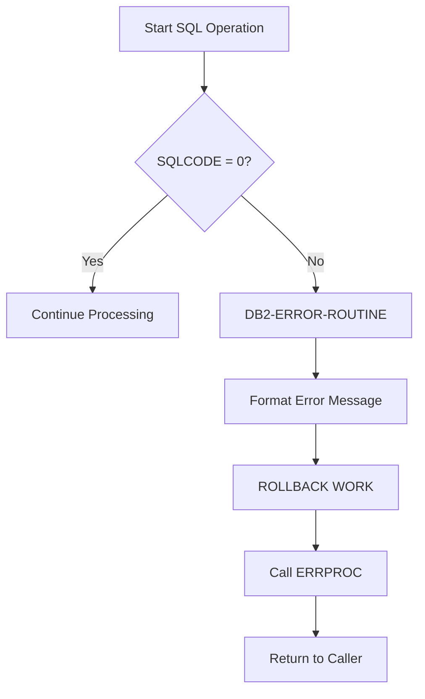

# DBPROC Copybook

## Overview

**DBPROC** (DB2 Procedures) is a copybook that provides standardized DB2 connection management, error handling, and retry logic. Unlike most copybooks that only define data structures, DBPROC includes both data definitions and procedure division code paragraphs that can be copied into programs.

This copybook is used by all DB2-enabled batch programs including [HISTLD00](/docs/programs/HISTLD00), [DB2CMT](/docs/programs/DB2CMT), [DB2CONN](/docs/programs/DB2CONN), [DB2ERR](/docs/programs/DB2ERR), and [DB2STAT](/docs/programs/DB2STAT).

## Data Structures

### DB2 Error Handling Area

```
DB2-ERROR-HANDLING
├── DB2-ERROR-MESSAGE (107 bytes)
│   ├── 'SQLCODE: '     (9 bytes, literal)
│   ├── DB2-SQLCODE-TXT (6 bytes, edited SQLCODE)
│   ├── ' STATE: '      (9 bytes, literal)
│   ├── DB2-STATE       (5 bytes, SQLSTATE)
│   ├── ' ERROR: '      (8 bytes, literal)
│   └── DB2-ERROR-TEXT  (70 bytes, error description)
├── DB2-SAVE-STATUS     (5 bytes, saved SQLSTATE)
├── DB2-RETRY-COUNT     (2 bytes, COMP)
├── DB2-MAX-RETRIES     (2 bytes, COMP, default 3)
└── DB2-RETRY-WAIT      (2 bytes, COMP, default 100ms)
```

### Field Definitions

| Field | Picture | Value | Description |
|-------|---------|-------|-------------|
| DB2-SQLCODE-TXT | X(6) | - | Formatted SQLCODE for display |
| DB2-STATE | X(5) | - | SQLSTATE value |
| DB2-ERROR-TEXT | X(70) | - | Error description text |
| DB2-SAVE-STATUS | X(5) | - | Saved SQLSTATE for recovery |
| DB2-RETRY-COUNT | S9(4) COMP | 0 | Current retry attempt |
| DB2-MAX-RETRIES | S9(4) COMP | 3 | Maximum retry attempts |
| DB2-RETRY-WAIT | S9(4) COMP | 100 | Wait time between retries (ms) |

## Standard Procedures

### CONNECT-TO-DB2

Establishes a connection to the POSMVP database:

```cobol
       CONNECT-TO-DB2.
           EXEC SQL
               CONNECT TO POSMVP
           END-EXEC
           IF SQLCODE NOT = 0
               MOVE 'Connection failed' TO DB2-ERROR-TEXT
               PERFORM DB2-ERROR-ROUTINE
           END-IF
           .
```

### DISCONNECT-FROM-DB2

Commits pending work and disconnects:

```cobol
       DISCONNECT-FROM-DB2.
           EXEC SQL
               COMMIT WORK
           END-EXEC
           
           EXEC SQL
               CONNECT RESET
           END-EXEC
           .
```

### DB2-ERROR-ROUTINE

Handles DB2 errors with rollback and logging:

```cobol
       DB2-ERROR-ROUTINE.
           MOVE SQLCODE TO DB2-SQLCODE-TXT
           MOVE SQLSTATE TO DB2-STATE
           
           EXEC SQL
               ROLLBACK WORK
           END-EXEC
           
           MOVE 'DB2ERROR' TO ERR-PROGRAM
           MOVE DB2-ERROR-MESSAGE TO ERR-TEXT
           CALL 'ERRPROC' USING ERR-MESSAGE
           .
```

### CHECK-SQL-STATUS

Quick status check after SQL operations:

```cobol
       CHECK-SQL-STATUS.
           IF SQLCODE NOT = 0
               PERFORM DB2-ERROR-ROUTINE
           END-IF
           .
```

## Control Flow



## Usage Example

```cobol
       WORKING-STORAGE SECTION.
           COPY SQLCA.
           COPY DBPROC.
           COPY ERRHAND.
       
       PROCEDURE DIVISION.
       MAIN-PROCESS.
           PERFORM CONNECT-TO-DB2
           
           EXEC SQL
               INSERT INTO PORTFOLIO 
               VALUES (:HV-PORTFOLIO)
           END-EXEC
           PERFORM CHECK-SQL-STATUS
           
           PERFORM DISCONNECT-FROM-DB2
           STOP RUN.
           
           COPY DBPROC REPLACING ==:1== BY ==CONNECT-TO-DB2==.
```

## Programs Using This Copybook

| Program | Description |
|---------|-------------|
| [HISTLD00](/docs/programs/HISTLD00) | History Data Loader |
| [DB2CMT](/docs/programs/DB2CMT) | DB2 Commit Controller |
| [DB2CONN](/docs/programs/DB2CONN) | DB2 Connection Manager |
| [DB2ERR](/docs/programs/DB2ERR) | DB2 Error Handler |
| [DB2STAT](/docs/programs/DB2STAT) | DB2 Statistics Collector |

## Related Copybooks

- [SQLCA](/docs/copybooks/SQLCA) - SQL Communication Area
- [DBTBLS](/docs/copybooks/DBTBLS) - DB2 Table Definitions
- [ERRHAND](/docs/copybooks/ERRHAND) - Error Handling

## Technical Notes

1. **Database Name**: Hardcoded to `POSMVP` - modify for different environments
2. **Retry Logic**: Default 3 retries with 100ms wait between attempts
3. **Error Message Format**: Creates a formatted 107-byte message suitable for logging
4. **SQLSTATE Preservation**: `DB2-SAVE-STATUS` allows preserving state across operations
5. **ERRPROC Integration**: Automatically calls ERRPROC for centralized error logging
6. **Procedure Copy**: This copybook includes PROCEDURE DIVISION code; use COPY REPLACING to customize paragraph names if needed
