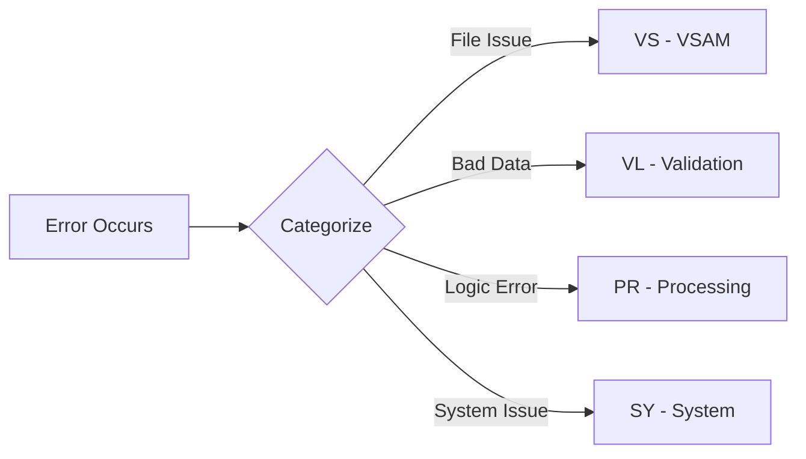
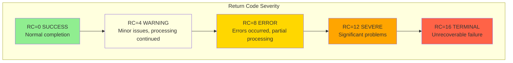

## Overview

ERRHAND is a foundational copybook that provides standardized error handling definitions used throughout the application. It establishes consistent patterns for error categorization, return codes, error message formatting, and VSAM file status handling.

This copybook is one of the most widely used in the system, included by 19 programs across batch processing, database operations, reporting, testing, and utility functions. Its consistent error handling approach enables:

- Uniform error categorization across all programs
- Standard return code values for job control
- Structured error messages for logging and debugging
- Pre-defined VSAM status codes and messages

## Data Structures

### ERR-CATEGORIES

Defines standard two-character category codes for classifying errors by their source or type.

| Level | Name | Picture | Value | Description |
|-------|------|---------|-------|-------------|
| 01 | ERR-CATEGORIES | - | - | Error category constants |
| 05 | ERR-CAT-VSAM | X(2) | 'VS' | VSAM file operation error |
| 05 | ERR-CAT-VALID | X(2) | 'VL' | Data validation error |
| 05 | ERR-CAT-PROC | X(2) | 'PR' | Processing/business logic error |
| 05 | ERR-CAT-SYSTEM | X(2) | 'SY' | System-level error |



### ERR-RETURN-CODES

Defines standard return code values following IBM mainframe conventions. These values are used to communicate program completion status to the operating system and job control.

| Level | Name | Picture | Value | Description |
|-------|------|---------|-------|-------------|
| 01 | ERR-RETURN-CODES | - | - | Return code constants |
| 05 | ERR-SUCCESS | S9(4) COMP | +0 | Successful completion |
| 05 | ERR-WARNING | S9(4) COMP | +4 | Warning - minor issues |
| 05 | ERR-ERROR | S9(4) COMP | +8 | Error - recoverable problem |
| 05 | ERR-SEVERE | S9(4) COMP | +12 | Severe - significant problem |
| 05 | ERR-TERMINAL | S9(4) COMP | +16 | Terminal - unrecoverable |

#### Return Code Severity Pyramid



#### Return Code Usage Guidelines

| Return Code | JCL Condition | Typical Use |
|-------------|---------------|-------------|
| 0 | COND=(0,EQ) | All processing successful |
| 4 | COND=(4,LE) | Warnings issued but processing complete |
| 8 | COND=(8,LE) | Some records failed, others processed |
| 12 | COND=(12,LT) | Major failure, job should stop |
| 16 | COND=(16,LT) | Critical failure, immediate termination |

### ERR-MESSAGE

Defines the structure for detailed error messages used in logging and error reporting.

| Level | Name | Picture | Length | Description |
|-------|------|---------|--------|-------------|
| 01 | ERR-MESSAGE | - | ~370 | Complete error message structure |
| 05 | ERR-TIMESTAMP | - | 18 | When the error occurred |
| 10 | ERR-DATE | X(10) | 10 | Date (YYYY-MM-DD) |
| 10 | ERR-TIME | X(8) | 8 | Time (HH:MM:SS) |
| 05 | ERR-PROGRAM | X(8) | 8 | Program that detected error |
| 05 | ERR-CATEGORY | X(2) | 2 | Error category code |
| 05 | ERR-CODE | X(4) | 4 | Specific error code |
| 05 | ERR-SEVERITY | S9(4) COMP | 2 | Severity level |
| 05 | ERR-TEXT | X(80) | 80 | Short error description |
| 05 | ERR-DETAILS | X(256) | 256 | Detailed error information |

#### Error Message Layout

```
+------------------+----------+------+------+----------+
|   ERR-TIMESTAMP  |  ERR-    | ERR- | ERR- |   ERR-   |
|  DATE  |  TIME   | PROGRAM  | CAT  | CODE | SEVERITY |
+--------+---------+----------+------+------+----------+
|                    ERR-TEXT (80 bytes)               |
+------------------------------------------------------+
|                  ERR-DETAILS (256 bytes)             |
+------------------------------------------------------+
```

### ERR-VSAM-STATUSES

Pre-defined VSAM file status codes for common conditions.

| Level | Name | Picture | Value | Description |
|-------|------|---------|-------|-------------|
| 01 | ERR-VSAM-STATUSES | - | - | VSAM status constants |
| 05 | ERR-VSAM-SUCCESS | X(2) | '00' | Successful operation |
| 05 | ERR-VSAM-DUPKEY | X(2) | '22' | Duplicate key on write |
| 05 | ERR-VSAM-NOTFND | X(2) | '23' | Record not found |
| 05 | ERR-VSAM-EOF | X(2) | '10' | End of file reached |

### ERR-VSAM-MSGS

Pre-defined error messages for common VSAM status codes.

| Level | Name | Picture | Value | Description |
|-------|------|---------|-------|-------------|
| 01 | ERR-VSAM-MSGS | - | - | VSAM error messages |
| 05 | ERR-VSAM-22 | X(80) | 'Duplicate record key' | Message for status 22 |
| 05 | ERR-VSAM-23 | X(80) | 'Record not found' | Message for status 23 |
| 05 | ERR-OTHER | X(80) | 'Unexpected VSAM error' | Default error message |

## Usage Examples

### Setting Up an Error Message

```cobol
* Record an error condition
MOVE FUNCTION CURRENT-DATE TO WS-CURRENT-DATE
MOVE WS-CURRENT-DATE(1:10) TO ERR-DATE
MOVE WS-CURRENT-DATE(12:8) TO ERR-TIME
MOVE 'MYPROG00' TO ERR-PROGRAM
MOVE ERR-CAT-VSAM TO ERR-CATEGORY
MOVE 'E001' TO ERR-CODE
MOVE ERR-ERROR TO ERR-SEVERITY
MOVE 'File read operation failed' TO ERR-TEXT
STRING 'File: CUSTFILE, Key: ' DELIMITED SIZE
       WS-CUSTOMER-KEY DELIMITED SIZE
       INTO ERR-DETAILS
END-STRING
```

### Handling VSAM Errors

```cobol
* Check VSAM status and set appropriate message
EVALUATE WS-FILE-STATUS
    WHEN ERR-VSAM-SUCCESS
        CONTINUE
    WHEN ERR-VSAM-DUPKEY
        MOVE ERR-VSAM-22 TO ERR-TEXT
        MOVE ERR-CAT-VSAM TO ERR-CATEGORY
        MOVE ERR-ERROR TO ERR-SEVERITY
    WHEN ERR-VSAM-NOTFND
        MOVE ERR-VSAM-23 TO ERR-TEXT
        MOVE ERR-CAT-VSAM TO ERR-CATEGORY
        MOVE ERR-WARNING TO ERR-SEVERITY
    WHEN ERR-VSAM-EOF
        SET END-OF-FILE TO TRUE
    WHEN OTHER
        MOVE ERR-OTHER TO ERR-TEXT
        MOVE ERR-CAT-VSAM TO ERR-CATEGORY
        MOVE ERR-SEVERE TO ERR-SEVERITY
END-EVALUATE
```

### Setting Return Codes

```cobol
* Set return code based on processing results
EVALUATE TRUE
    WHEN WS-ERROR-COUNT = 0
        MOVE ERR-SUCCESS TO RETURN-CODE
    WHEN WS-ERROR-COUNT < 10
        MOVE ERR-WARNING TO RETURN-CODE
    WHEN WS-ERROR-COUNT < 100
        MOVE ERR-ERROR TO RETURN-CODE
    WHEN OTHER
        MOVE ERR-SEVERE TO RETURN-CODE
END-EVALUATE
```

### Calling ERRPROC for Centralized Logging

```cobol
* Prepare error request for ERRPROC
MOVE 'MYPROG00' TO LS-PROGRAM-ID
MOVE ERR-CAT-PROC TO LS-CATEGORY
MOVE 'E042' TO LS-ERROR-CODE
MOVE ERR-ERROR TO LS-SEVERITY
MOVE 'Invalid account status' TO LS-ERROR-TEXT
MOVE 'Account 12345 has status X, expected A or S'
    TO LS-ERROR-DETAILS

CALL 'ERRPROC' USING LS-ERROR-REQUEST
```

## Programs Using This Copybook

### Batch Processing Programs

| Program | Description |
|---------|-------------|
| BCHCTL00 | Batch control management |
| HISTLD00 | History load processing |
| PRCSEQ00 | Process sequencing utility |
| RCVPRC00 | Recovery processing |

### Reporting Programs

| Program | Description |
|---------|-------------|
| RPTAUD00 | Audit report generator |
| RPTPOS00 | Position report generator |
| RPTSTA00 | Status report generator |

### Database Programs

| Program | Description |
|---------|-------------|
| DB2CMT | DB2 commit processing |
| DB2CONN | DB2 connection management |
| DB2ERR | DB2 error handling |
| DB2STAT | DB2 statistics collection |

### Common/Utility Programs

| Program | Description |
|---------|-------------|
| ERRPROC | Centralized error processing subroutine |
| UTLMNT00 | Maintenance utility |
| UTLMON00 | System monitoring utility |
| UTLVAL00 | Validation utility |

### Portfolio/Transaction Programs

| Program | Description |
|---------|-------------|
| PORTTEST | Portfolio testing |
| PORTTRAN | Portfolio transaction processing |

### Test Programs

| Program | Description |
|---------|-------------|
| TSTGEN00 | Test data generation |
| TSTVAL00 | Test validation |

## Related Copybooks

- **RTNCODE** - Return code management (complements ERRHAND for detailed return code tracking)
- **ERRHND** - Online error handling (similar structure for CICS programs)

## Technical Notes

### COMP Fields

The return codes and severity use `S9(4) COMP` format:
- Signed 4-digit binary integers
- Occupy 2 bytes of storage
- Efficient for arithmetic comparisons
- Compatible with RETURN-CODE special register

### Error Code Conventions

The ERR-CODE field (4 characters) typically follows this convention:

| Format | Example | Meaning |
|--------|---------|---------|
| Ennnn | E001 | General error |
| Wnnnn | W001 | Warning condition |
| Innnn | I001 | Informational message |

### Best Practices

1. **Always set ERR-PROGRAM** - Identifies the source of the error
2. **Use appropriate category** - Helps with error routing and handling
3. **Include key data in ERR-DETAILS** - Aids debugging
4. **Match ERR-SEVERITY with return code** - Maintain consistency
5. **Use pre-defined VSAM messages** - Ensures consistent messaging

### Integration with ERRPROC

The ERRPROC program expects error information in a format compatible with ERR-MESSAGE. When calling ERRPROC:

```cobol
* ERRPROC expects this structure:
01  LS-ERROR-REQUEST.
    05  LS-PROGRAM-ID      PIC X(8).      * Maps to ERR-PROGRAM
    05  LS-CATEGORY        PIC X(2).      * Maps to ERR-CATEGORY
    05  LS-ERROR-CODE      PIC X(4).      * Maps to ERR-CODE
    05  LS-SEVERITY        PIC S9(4) COMP.* Maps to ERR-SEVERITY
    05  LS-ERROR-TEXT      PIC X(80).     * Maps to ERR-TEXT
    05  LS-ERROR-DETAILS   PIC X(256).    * Maps to ERR-DETAILS
    05  LS-RETURN-CODE     PIC S9(4) COMP.* Output return code
```

### Extended VSAM Status Codes

While ERRHAND defines the most common VSAM status codes, here are additional codes you may encounter:

| Status | Meaning | Suggested Action |
|--------|---------|------------------|
| 00 | Success | Continue |
| 02 | Duplicate alternate key | May be acceptable |
| 10 | End of file | Normal for sequential read |
| 21 | Invalid key sequence | Check key order |
| 22 | Duplicate primary key | Handle as error |
| 23 | Record not found | May be warning or error |
| 24 | Key outside boundaries | Check key value |
| 35 | File not found | Check JCL/file definition |
| 39 | File attribute conflict | Check file definition |
| 41 | File already open | Check program logic |
| 42 | File already closed | Check program logic |
| 46 | Read after end of file | Check program logic |
| 47 | Read on file not open | Check file open |
