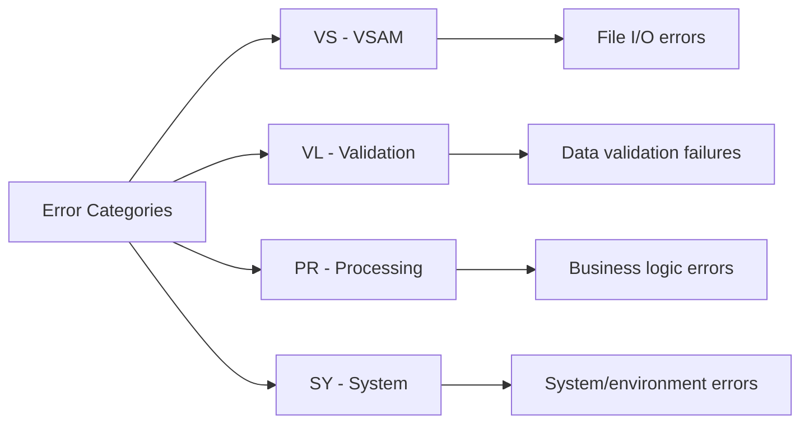
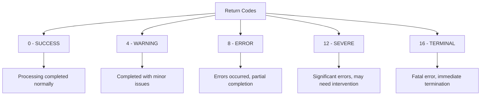

## Overview

ERRHAND is a foundational copybook that provides standardized error handling definitions used throughout the batch and online systems. It defines error categories, standard return codes, a structured error message format, and VSAM file status handling constants.

This copybook is one of the most widely used in the system, included by 19 programs across batch processing, reporting, database operations, utilities, and testing components. It ensures consistent error handling, messaging, and return code conventions across the entire application.

## Usage

```cobol
WORKING-STORAGE SECTION.
    COPY ERRHAND.
```

## Used By

### Batch Programs

| Program | Description |
|---------|-------------|
| [BCHCTL00](/docs/programs/BCHCTL00) | Batch Control Processor |
| [HISTLD00](/docs/programs/HISTLD00) | History Load Program |
| [PRCSEQ00](/docs/programs/PRCSEQ00) | Process Sequence Manager |
| [RCVPRC00](/docs/programs/RCVPRC00) | Process Recovery Handler |

### Reporting Programs

| Program | Description |
|---------|-------------|
| [RPTAUD00](/docs/programs/RPTAUD00) | Audit Reporting |
| [RPTPOS00](/docs/programs/RPTPOS00) | Position Reporting |
| [RPTSTA00](/docs/programs/RPTSTA00) | Status Reporting |

### Database Programs

| Program | Description |
|---------|-------------|
| [DB2CMT](/docs/programs/DB2CMT) | DB2 Commit Handler |
| [DB2CONN](/docs/programs/DB2CONN) | DB2 Connection Manager |
| [DB2ERR](/docs/programs/DB2ERR) | DB2 Error Handler |
| [DB2STAT](/docs/programs/DB2STAT) | DB2 Statistics Collector |

### Common Programs

| Program | Description |
|---------|-------------|
| [ERRPROC](/docs/programs/ERRPROC) | Error Processing Routine |
| [PORTTEST](/docs/programs/PORTTEST) | Portfolio Testing |
| [PORTTRAN](/docs/programs/PORTTRAN) | Portfolio Transaction Processing |

### Utility Programs

| Program | Description |
|---------|-------------|
| [TSTGEN00](/docs/programs/TSTGEN00) | Test Data Generation |
| [TSTVAL00](/docs/programs/TSTVAL00) | Test Validation |
| [UTLMNT00](/docs/programs/UTLMNT00) | File Maintenance Utility |
| [UTLMON00](/docs/programs/UTLMON00) | Monitoring Utility |
| [UTLVAL00](/docs/programs/UTLVAL00) | Validation Utility |

## Data Structures

### ERR-CATEGORIES

Predefined error category codes for classifying errors:

| Level | Name | Picture | Value | Description |
|-------|------|---------|-------|-------------|
| 01 | ERR-CATEGORIES | - | - | Error category constants |
| 05 | ERR-CAT-VSAM | X(2) | 'VS' | VSAM file errors |
| 05 | ERR-CAT-VALID | X(2) | 'VL' | Validation errors |
| 05 | ERR-CAT-PROC | X(2) | 'PR' | Processing errors |
| 05 | ERR-CAT-SYSTEM | X(2) | 'SY' | System errors |



### ERR-RETURN-CODES

Standard return code values following IBM conventions:

| Level | Name | Picture | Value | Description |
|-------|------|---------|-------|-------------|
| 01 | ERR-RETURN-CODES | - | - | Return code constants |
| 05 | ERR-SUCCESS | S9(4) COMP | +0 | Successful completion |
| 05 | ERR-WARNING | S9(4) COMP | +4 | Warning condition |
| 05 | ERR-ERROR | S9(4) COMP | +8 | Error condition |
| 05 | ERR-SEVERE | S9(4) COMP | +12 | Severe error |
| 05 | ERR-TERMINAL | S9(4) COMP | +16 | Terminal/fatal error |

**Return Code Hierarchy:**



### ERR-MESSAGE

Structured error message record for logging and display:

| Level | Name | Picture | Bytes | Description |
|-------|------|---------|-------|-------------|
| 01 | ERR-MESSAGE | - | 362 | Complete error message structure |
| 05 | ERR-TIMESTAMP | - | 18 | Error timestamp group |
| 10 | ERR-DATE | X(10) | 10 | Error date (YYYY-MM-DD) |
| 10 | ERR-TIME | X(8) | 8 | Error time (HH:MM:SS) |
| 05 | ERR-PROGRAM | X(8) | 8 | Program name where error occurred |
| 05 | ERR-CATEGORY | X(2) | 2 | Error category code |
| 05 | ERR-CODE | X(4) | 4 | Specific error code |
| 05 | ERR-SEVERITY | S9(4) COMP | 2 | Severity level (0/4/8/12/16) |
| 05 | ERR-TEXT | X(80) | 80 | Short error message |
| 05 | ERR-DETAILS | X(256) | 256 | Detailed error information |

**Message Structure Diagram:**

```
+------------+----------+----------+----------+------+----------+------------+---------------+
| ERR-DATE   | ERR-TIME | ERR-     | ERR-     | ERR- | ERR-     | ERR-TEXT   | ERR-DETAILS   |
|            |          | PROGRAM  | CATEGORY | CODE | SEVERITY |            |               |
+------------+----------+----------+----------+------+----------+------------+---------------+
|  10 bytes  | 8 bytes  | 8 bytes  | 2 bytes  |4 byte| 2 bytes  | 80 bytes   | 256 bytes     |
+------------+----------+----------+----------+------+----------+------------+---------------+
```

### ERR-VSAM-STATUSES

Common VSAM file status codes:

| Level | Name | Picture | Value | Description |
|-------|------|---------|-------|-------------|
| 01 | ERR-VSAM-STATUSES | - | - | VSAM status constants |
| 05 | ERR-VSAM-SUCCESS | X(2) | '00' | Successful operation |
| 05 | ERR-VSAM-DUPKEY | X(2) | '22' | Duplicate key on WRITE |
| 05 | ERR-VSAM-NOTFND | X(2) | '23' | Record not found |
| 05 | ERR-VSAM-EOF | X(2) | '10' | End of file |

### ERR-VSAM-MSGS

Predefined error messages for common VSAM errors:

| Level | Name | Picture | Value | Description |
|-------|------|---------|-------|-------------|
| 01 | ERR-VSAM-MSGS | - | - | VSAM error messages |
| 05 | ERR-VSAM-22 | X(80) | 'Duplicate record key' | Message for status 22 |
| 05 | ERR-VSAM-23 | X(80) | 'Record not found' | Message for status 23 |
| 05 | ERR-OTHER | X(80) | 'Unexpected VSAM error' | Default error message |

## Usage Examples

### Setting Up an Error Message

```cobol
* Populate error message structure
MOVE FUNCTION CURRENT-DATE TO WS-CURRENT-DATE
MOVE WS-CURRENT-DATE(1:10) TO ERR-DATE
MOVE WS-CURRENT-DATE(12:8) TO ERR-TIME
MOVE 'MYPROG00' TO ERR-PROGRAM
MOVE ERR-CAT-PROC TO ERR-CATEGORY
MOVE '0001' TO ERR-CODE
MOVE ERR-ERROR TO ERR-SEVERITY
MOVE 'Customer record validation failed' TO ERR-TEXT
MOVE 'Customer ID: 12345 - Missing required field: NAME'
    TO ERR-DETAILS

* Call error processor
CALL 'ERRPROC' USING ERR-MESSAGE
```

### Checking VSAM Status

```cobol
READ CUSTOMER-FILE
    INVALID KEY
        EVALUATE WS-FILE-STATUS
            WHEN ERR-VSAM-NOTFND
                MOVE ERR-VSAM-23 TO ERR-TEXT
                MOVE ERR-CAT-VSAM TO ERR-CATEGORY
            WHEN ERR-VSAM-DUPKEY
                MOVE ERR-VSAM-22 TO ERR-TEXT
                MOVE ERR-CAT-VSAM TO ERR-CATEGORY
            WHEN OTHER
                MOVE ERR-OTHER TO ERR-TEXT
                MOVE ERR-CAT-VSAM TO ERR-CATEGORY
        END-EVALUATE
        PERFORM 9000-ERROR-HANDLER
END-READ
```

### Setting Return Codes

```cobol
* Set appropriate return code based on processing results
EVALUATE TRUE
    WHEN WS-ERROR-COUNT = 0
        MOVE ERR-SUCCESS TO RETURN-CODE
    WHEN WS-ERROR-COUNT < 10
        MOVE ERR-WARNING TO RETURN-CODE
    WHEN WS-ERROR-COUNT < 100
        MOVE ERR-ERROR TO RETURN-CODE
    WHEN OTHER
        MOVE ERR-SEVERE TO RETURN-CODE
END-EVALUATE
```

### Categorizing Errors

```cobol
* Set error category based on error type
EVALUATE TRUE
    WHEN WS-FILE-ERROR
        MOVE ERR-CAT-VSAM TO ERR-CATEGORY
    WHEN WS-DATA-INVALID
        MOVE ERR-CAT-VALID TO ERR-CATEGORY
    WHEN WS-PROCESS-ERROR
        MOVE ERR-CAT-PROC TO ERR-CATEGORY
    WHEN OTHER
        MOVE ERR-CAT-SYSTEM TO ERR-CATEGORY
END-EVALUATE
```

## Return Code Guidelines

| Code | When to Use | JCL COND Parameter |
|------|-------------|-------------------|
| 0 | All processing completed successfully | COND=(0,NE) |
| 4 | Minor issues, processing completed | COND=(4,LT) |
| 8 | Errors occurred, may need review | COND=(8,LT) |
| 12 | Serious errors, manual intervention needed | COND=(12,LT) |
| 16 | Fatal error, job should stop | COND=(16,LT) |

## VSAM Status Code Reference

| Status | Meaning | Typical Cause |
|--------|---------|---------------|
| 00 | Success | Normal operation |
| 02 | Duplicate alternate key | Non-unique AIX |
| 10 | End of file | Sequential read past last record |
| 21 | Sequence error | Key out of order |
| 22 | Duplicate primary key | WRITE with existing key |
| 23 | Record not found | READ/DELETE with non-existent key |
| 24 | Key outside boundary | Key value too large |
| 35 | File not found | Missing DD or dataset |
| 39 | Attribute mismatch | DCB doesn't match file |
| 41 | File already open | Duplicate OPEN |
| 42 | File not open | I/O before OPEN |
| 46 | No current record | READ NEXT without position |
| 47 | READ not permitted | Wrong open mode |
| 48 | WRITE not permitted | Wrong open mode |

## Related Copybooks

| Copybook | Relationship |
|----------|-------------|
| **RTNCODE** | Extended return code management with logging |
| **ERRHND** | Online error handling (CICS) |
| **DBPROC** | DB2 error handling procedures |

## Design Notes

1. **Centralized Constants**: All error-related constants are defined once, ensuring consistency across programs.

2. **COMP Fields**: Return codes use `S9(4) COMP` (binary) for efficient comparison and assignment to RETURN-CODE.

3. **Fixed-Length Messages**: ERR-TEXT (80) and ERR-DETAILS (256) provide standardized lengths for logging and display.

4. **IBM Conventions**: Return code values follow IBM standard conventions (0, 4, 8, 12, 16) for JCL COND parameter compatibility.

5. **Extensible Categories**: The two-character category code allows for additional categories without changing the structure.

6. **VSAM Focus**: Common VSAM status codes are included as they are the most frequently encountered file errors.

## Best Practices

1. **Always Initialize**: Clear ERR-MESSAGE before populating to avoid residual data.

2. **Set All Fields**: Populate program name, category, and timestamp for every error.

3. **Use Constants**: Reference ERR-CAT-* and ERR-SUCCESS/WARNING/ERROR instead of literals.

4. **Meaningful Details**: Use ERR-DETAILS for diagnostic information (key values, record contents, etc.).

5. **Consistent Severity**: Match ERR-SEVERITY to the actual RETURN-CODE being set.
