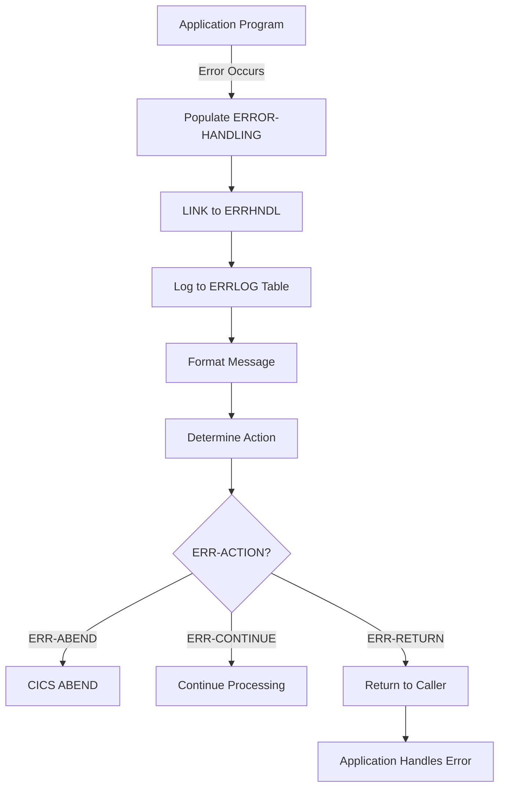

## Overview

ERRHND is a copybook that defines the standard error handling structure for CICS online programs. It provides a consistent format for capturing, communicating, and processing error information across the online transaction processing environment.

This copybook is fundamental to the online error handling infrastructure, containing:
- **Error Identification** - Program and paragraph where error occurred
- **Response Codes** - SQLCODE for DB2 errors and CICS RESP/RESP2 codes
- **Severity Classification** - Fatal, Warning, and Informational levels
- **Action Directives** - Return, Continue, or Abend instructions
- **Trace Information** - Unique trace ID and timestamp for debugging

## Record Layout

```
+------------------------------------------------------------------+
|                       ERROR-HANDLING                              |
+------------------------------------------------------------------+
| ERR-PROGRAM (8) + ERR-PARAGRAPH (30)                             |
+------------------------------------------------------------------+
| ERR-SQLCODE (4) + ERR-CICS-RESP (4) + ERR-CICS-RESP2 (4)        |
+------------------------------------------------------------------+
| ERR-SEVERITY (1) + ERR-MESSAGE (80) + ERR-ACTION (1)             |
+------------------------------------------------------------------+
| ERR-TRACE                                                         |
|   +-- ERR-TRACE-ID (16) + ERR-TIMESTAMP (26)                     |
+------------------------------------------------------------------+
| Total: ~173 bytes                                                 |
+------------------------------------------------------------------+
```

## Data Structures

### Error Handling Record (ERROR-HANDLING)

The top-level structure containing all error information:

| Level | Name | Picture | Description |
|-------|------|---------|-------------|
| 01 | ERROR-HANDLING | - | Complete error handling record |

### Error Location

Fields identifying where the error occurred:

| Level | Name | Picture | Description |
|-------|------|---------|-------------|
| 05 | ERR-PROGRAM | X(8) | Program name where error occurred |
| 05 | ERR-PARAGRAPH | X(30) | Paragraph or section name |

### Response Codes

System response codes for diagnosis:

| Level | Name | Picture | Description |
|-------|------|---------|-------------|
| 05 | ERR-SQLCODE | S9(9) COMP | DB2 SQL return code |
| 05 | ERR-CICS-RESP | S9(8) COMP | CICS RESP value (EIBRESP) |
| 05 | ERR-CICS-RESP2 | S9(8) COMP | CICS RESP2 value (EIBRESP2) |

### Severity Level (ERR-SEVERITY)

Classification of error severity:

| Level | Name | Picture | Description |
|-------|------|---------|-------------|
| 05 | ERR-SEVERITY | X(1) | Severity level code |
| 88 | ERR-FATAL | VALUE 'F' | Fatal error - cannot continue |
| 88 | ERR-WARNING | VALUE 'W' | Warning - can continue with caution |
| 88 | ERR-INFO | VALUE 'I' | Informational - no action required |

**Severity Levels:**

| Code | Condition | Description | Typical Use |
|------|-----------|-------------|-------------|
| F | ERR-FATAL | Fatal error | Database unavailable, security violation |
| W | ERR-WARNING | Warning | Validation failed, data not found |
| I | ERR-INFO | Information | Audit logging, status messages |

### Error Message

| Level | Name | Picture | Description |
|-------|------|---------|-------------|
| 05 | ERR-MESSAGE | X(80) | Human-readable error description |

### Action Directive (ERR-ACTION)

Instruction for how the calling program should respond:

| Level | Name | Picture | Description |
|-------|------|---------|-------------|
| 05 | ERR-ACTION | X(1) | Recommended action code |
| 88 | ERR-RETURN | VALUE 'R' | Return to caller with error |
| 88 | ERR-CONTINUE | VALUE 'C' | Continue processing |
| 88 | ERR-ABEND | VALUE 'A' | Abend the transaction |

**Action Codes:**

| Code | Condition | Description | When Used |
|------|-----------|-------------|-----------|
| R | ERR-RETURN | Return | Normal error return to calling program |
| C | ERR-CONTINUE | Continue | Warning or info - processing can proceed |
| A | ERR-ABEND | Abend | Fatal error - terminate transaction |

### Trace Information (ERR-TRACE)

Debugging and tracking information:

| Level | Name | Picture | Description |
|-------|------|---------|-------------|
| 05 | ERR-TRACE | - | Trace information group |
| 10 | ERR-TRACE-ID | X(16) | Unique identifier for error tracking |
| 10 | ERR-TIMESTAMP | X(26) | ISO format timestamp (YYYY-MM-DD-HH.MM.SS.FFFFFF) |

## Usage

### Working-Storage Declaration

```cobol
WORKING-STORAGE SECTION.
01  WS-ERROR-AREA.
    COPY ERRHND.
```

### Linkage Section (for Error Handler)

```cobol
LINKAGE SECTION.
01  DFHCOMMAREA.
    COPY ERRHND.
```

### Populating Error Information

```cobol
* Capture error details
MOVE 'MYPROG01' TO ERR-PROGRAM
MOVE 'P200-PROCESS-DATA' TO ERR-PARAGRAPH
MOVE SQLCODE TO ERR-SQLCODE
MOVE EIBRESP TO ERR-CICS-RESP
MOVE EIBRESP2 TO ERR-CICS-RESP2
SET ERR-WARNING TO TRUE
MOVE 'Record not found for account' TO ERR-MESSAGE

* Generate trace information
MOVE FUNCTION CURRENT-DATE TO ERR-TIMESTAMP
```

### Calling the Error Handler

```cobol
P900-ERROR-ROUTINE.
    MOVE 'INQONLN' TO ERR-PROGRAM
    MOVE 'P900-ERROR-ROUTINE' TO ERR-PARAGRAPH
    MOVE EIBRESP TO ERR-CICS-RESP
    MOVE EIBRESP2 TO ERR-CICS-RESP2
    SET ERR-WARNING TO TRUE
    
    EXEC CICS LINK PROGRAM('ERRHNDL')
              COMMAREA(WS-ERROR-AREA)
              LENGTH(LENGTH OF WS-ERROR-AREA)
    END-EXEC
    
    * Check recommended action
    IF ERR-ABEND
       EXEC CICS ABEND ABCODE('IERR') END-EXEC
    END-IF
    
    MOVE ERR-MESSAGE TO WS-DISPLAY-MESSAGE.
P900-EXIT.
    EXIT.
```

### Handling Different Severity Levels

```cobol
EVALUATE TRUE
    WHEN ERR-FATAL
        * Log and terminate
        PERFORM LOG-FATAL-ERROR
        EXEC CICS ABEND ABCODE('FERR') END-EXEC
    WHEN ERR-WARNING
        * Log and continue with caution
        PERFORM LOG-WARNING
        IF ERR-CONTINUE
            CONTINUE
        ELSE
            EXEC CICS RETURN END-EXEC
        END-IF
    WHEN ERR-INFO
        * Just log for audit
        PERFORM LOG-INFO
END-EVALUATE
```

### Using Trace ID for Debugging

```cobol
* Generate unique trace ID if not already set
IF ERR-TRACE-ID = SPACES
    STRING EIBTRNID DELIMITED BY SIZE
           EIBTIME DELIMITED BY SIZE
           INTO ERR-TRACE-ID
END-IF

* Display trace ID to user for support calls
STRING 'Error occurred. Reference: '
       ERR-TRACE-ID
       DELIMITED BY SIZE
       INTO WS-USER-MESSAGE
```

## Programs Using This Copybook

### ERRHNDL - Centralized Error Handler

**Purpose:** Processes all online errors, logs to DB2, formats messages, and determines recovery action

**Usage:**
- Receives ERROR-HANDLING structure in DFHCOMMAREA
- Populates ERR-TIMESTAMP if not set
- Generates ERR-TRACE-ID using FUNCTION RANDOM if blank
- Inserts error record into ERRLOG DB2 table
- Formats ERR-MESSAGE with program name and trace ID
- Sets ERR-ACTION based on ERR-SEVERITY:
  - Fatal → Abend
  - Warning → Continue
  - Info → Continue
- Returns updated structure to caller

**Key Code Pattern:**
```cobol
EVALUATE TRUE
    WHEN ERR-FATAL
         SET ERR-ABEND TO TRUE
    WHEN ERR-WARNING
         SET ERR-CONTINUE TO TRUE
    WHEN ERR-INFO
         SET ERR-CONTINUE TO TRUE
    WHEN OTHER
         SET ERR-RETURN TO TRUE
END-EVALUATE
```

### DB2ONLN - Online DB2 Connection Manager

**Purpose:** Manages DB2 connection pool with error handling support

**Usage:**
- Includes ERRHND in WS-ERROR-AREA
- Uses error structure for connection failure reporting

### DB2RECV - DB2 Recovery Manager

**Purpose:** Handles DB2 connection failures with retry logic

**Usage:**
- Populates ERR-PROGRAM with failing program name
- Populates ERR-PARAGRAPH with cursor name for cursor recovery
- Sets ERR-SQLCODE from failed SQL operation
- Calls ERRHNDL to log and determine action
- Checks ERR-CONTINUE to decide on retry
- Copies ERR-MESSAGE to recovery response

**Key Code Pattern:**
```cobol
MOVE RECV-PROGRAM TO ERR-PROGRAM
MOVE RECV-CURSOR TO ERR-PARAGRAPH
MOVE RECV-SQLCODE TO ERR-SQLCODE
SET ERR-WARNING TO TRUE

EXEC CICS LINK PROGRAM('ERRHNDL')
          COMMAREA(WS-ERROR-AREA)
          LENGTH(LENGTH OF WS-ERROR-AREA)
END-EXEC

IF ERR-CONTINUE
   SET RECV-RETRY TO TRUE
ELSE
   SET RECV-FAILED TO TRUE
END-IF
```

### INQONLN - Portfolio Online Inquiry

**Purpose:** Main inquiry handler with comprehensive error handling

**Usage:**
- Stores EIBRESP and EIBRESP2 in error structure
- Links to ERRHNDL for centralized error processing
- Checks ERR-ABEND to decide on transaction termination
- Displays ERR-MESSAGE to user

**Key Code Pattern:**
```cobol
MOVE 'INQONLN' TO ERR-PROGRAM
MOVE 'P900-ERROR-ROUTINE' TO ERR-PARAGRAPH
MOVE EIBRESP TO ERR-CICS-RESP
MOVE EIBRESP2 TO ERR-CICS-RESP2
SET ERR-WARNING TO TRUE

EXEC CICS LINK PROGRAM('ERRHNDL')
          COMMAREA(WS-ERROR-AREA)
          LENGTH(LENGTH OF WS-ERROR-AREA)
END-EXEC

IF ERR-ABEND
   EXEC CICS ABEND ABCODE('IERR') END-EXEC
END-IF
```

### SECMGR - Security Manager

**Purpose:** Validates credentials and manages access control

**Usage:**
- Includes ERRHND for potential error handling
- Available for logging security violations and access denials

## Error Flow Architecture



## Common SQLCODE Values

| SQLCODE | Description | Typical Severity |
|---------|-------------|------------------|
| 0 | Success | N/A |
| +100 | No data found | Warning |
| -803 | Duplicate key | Warning |
| -811 | Multiple rows | Warning |
| -904 | Resource unavailable | Fatal |
| -911 | Deadlock/timeout | Warning (retry) |
| -30081 | Connection failed | Fatal |

## Common CICS RESP Values

| RESP | Constant | Description | Typical Severity |
|------|----------|-------------|------------------|
| 0 | NORMAL | Success | N/A |
| 13 | NOTFND | Record not found | Warning |
| 14 | DUPREC | Duplicate record | Warning |
| 16 | INVREQ | Invalid request | Warning |
| 22 | PGMIDERR | Program not found | Fatal |
| 27 | SYSIDERR | System ID error | Fatal |

## Best Practices

1. **Always Populate Program/Paragraph**: Set ERR-PROGRAM and ERR-PARAGRAPH before calling error handler for accurate diagnostics

2. **Preserve Original Codes**: Copy SQLCODE and EIBRESP immediately when error occurs before they're overwritten

3. **Use Appropriate Severity**: 
   - Fatal: Unrecoverable errors requiring transaction termination
   - Warning: Recoverable errors that need user attention
   - Info: Audit/logging purposes only

4. **Generate Trace IDs Early**: Create ERR-TRACE-ID at the start of transaction for consistent tracking across multiple errors

5. **Meaningful Messages**: Include relevant data in ERR-MESSAGE (account number, key values) while avoiding sensitive information

6. **Check Action on Return**: Always check ERR-ACTION after calling error handler to take appropriate action

7. **Consistent Error Routine**: Use a standard error routine paragraph (e.g., P900-ERROR-ROUTINE) across all programs

## Related Copybooks

| Copybook | Relationship |
|----------|--------------|
| ERRHAND | Batch error handling (different structure for batch programs) |
| INQCOM | Contains error message field for inquiry programs |
| DB2REQ | Contains error info for DB2 operations |
| AUDITLOG | May receive error records for audit trail |
