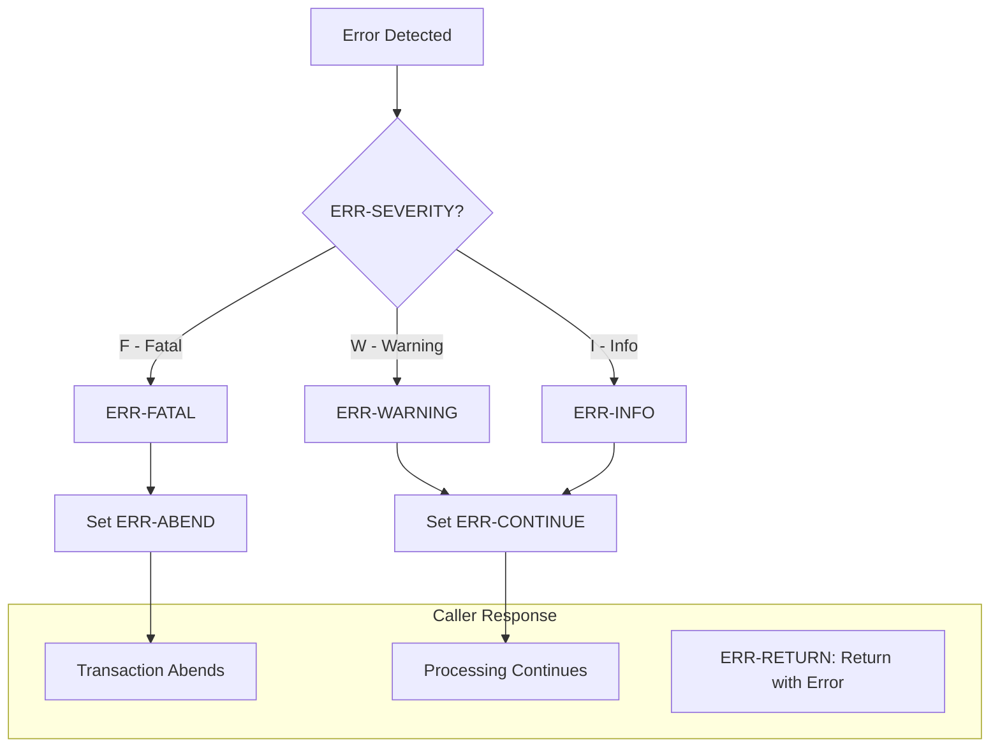
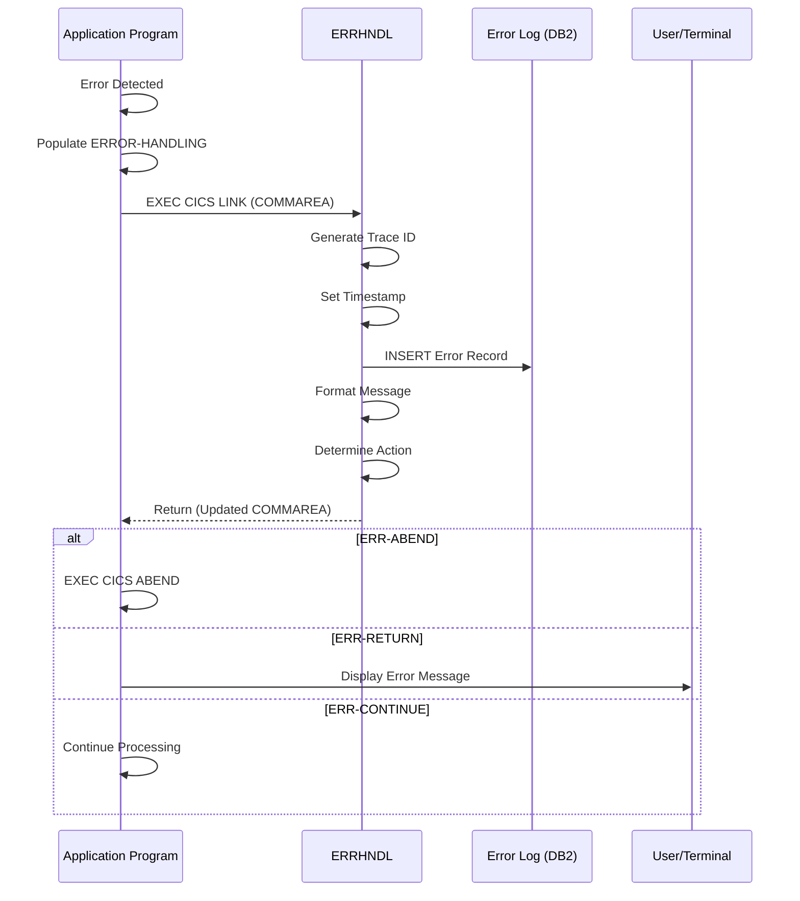

## Overview

ERRHND is a copybook that defines the Online Error Handling structure used by CICS programs for standardized error communication. It provides a comprehensive error record that captures program context, error details (including DB2 and CICS response codes), severity levels, and recommended recovery actions.

The copybook is designed specifically for CICS online transactions and is typically passed through the DFHCOMMAREA to centralized error handling programs like ERRHNDL. It includes trace information (trace ID and timestamp) that enables correlation between user-facing error messages and detailed error logs.

This structure enables consistent error handling across all online programs, supporting the determination of appropriate recovery actions based on error severity.

## Record Layout

```
+------------------------------------------------------------------+
| ERROR-HANDLING (176 bytes)                                        |
+------------------------------------------------------------------+
| ERR-PROGRAM | ERR-PARAGRAPH | ERR-SQLCODE | ERR-CICS-RESP/RESP2 |
|     (8)     |     (30)      |     (4)     |       (8)           |
+------------------------------------------------------------------+
| ERR-SEVERITY | ERR-MESSAGE | ERR-ACTION | ERR-TRACE              |
|     (1)      |    (80)     |    (1)     |   (42)                 |
+------------------------------------------------------------------+
```

**Total Record Length: 176 bytes**

## Data Structure

### ERROR-HANDLING (01 Level)

| Level | Name | Picture | Bytes | Description |
|-------|------|---------|-------|-------------|
| 01 | ERROR-HANDLING | | 176 | Complete error handling record |

### Error Context Fields

| Level | Name | Picture | Bytes | Description |
|-------|------|---------|-------|-------------|
| 05 | ERR-PROGRAM | X(8) | 8 | Program where error occurred |
| 05 | ERR-PARAGRAPH | X(30) | 30 | Paragraph/section name |

### Error Code Fields

| Level | Name | Picture | Bytes | Description |
|-------|------|---------|-------|-------------|
| 05 | ERR-SQLCODE | S9(9) COMP | 4 | DB2 SQLCODE value |
| 05 | ERR-CICS-RESP | S9(8) COMP | 4 | CICS EIBRESP value |
| 05 | ERR-CICS-RESP2 | S9(8) COMP | 4 | CICS EIBRESP2 value |

### ERR-SEVERITY (Error Classification)

| Level | Name | Picture | Bytes | Description |
|-------|------|---------|-------|-------------|
| 05 | ERR-SEVERITY | X | 1 | Error severity level |

**Severity Values (88-level conditions):**

| Value | Condition Name | Description |
|-------|----------------|-------------|
| `F` | ERR-FATAL | Fatal error - cannot continue |
| `W` | ERR-WARNING | Warning - processing can continue |
| `I` | ERR-INFO | Informational - no action required |

### ERR-MESSAGE

| Level | Name | Picture | Bytes | Description |
|-------|------|---------|-------|-------------|
| 05 | ERR-MESSAGE | X(80) | 80 | Error message text |

### ERR-ACTION (Recovery Action)

| Level | Name | Picture | Bytes | Description |
|-------|------|---------|-------|-------------|
| 05 | ERR-ACTION | X | 1 | Recommended recovery action |

**Action Values (88-level conditions):**

| Value | Condition Name | Description |
|-------|----------------|-------------|
| `R` | ERR-RETURN | Return to caller with error status |
| `C` | ERR-CONTINUE | Continue processing |
| `A` | ERR-ABEND | Abend the transaction |

### ERR-TRACE (Correlation Information)

| Level | Name | Picture | Bytes | Description |
|-------|------|---------|-------|-------------|
| 05 | ERR-TRACE | | 42 | Trace/correlation information |
| 10 | ERR-TRACE-ID | X(16) | 16 | Unique trace identifier |
| 10 | ERR-TIMESTAMP | X(26) | 26 | Error occurrence timestamp |

## Severity and Action Relationship



## Error Handling Flow



## Usage Patterns

### Populating Error Information

```cobol
WORKING-STORAGE SECTION.
01  WS-ERROR-AREA.
    COPY ERRHND.

PROCEDURE DIVISION.
* When an error occurs...
    MOVE 'INQONLN ' TO ERR-PROGRAM
    MOVE 'P300-READ-PORTFOLIO' TO ERR-PARAGRAPH
    MOVE SQLCODE TO ERR-SQLCODE
    MOVE EIBRESP TO ERR-CICS-RESP
    MOVE EIBRESP2 TO ERR-CICS-RESP2
    SET ERR-WARNING TO TRUE
    MOVE 'Portfolio not found' TO ERR-MESSAGE
    MOVE SPACES TO ERR-TRACE-ID
    
    EXEC CICS LINK
        PROGRAM('ERRHNDL')
        COMMAREA(WS-ERROR-AREA)
        LENGTH(LENGTH OF WS-ERROR-AREA)
    END-EXEC
```

### Handling Different Severity Levels

```cobol
* Fatal error - DB2 connection lost
SET ERR-FATAL TO TRUE
MOVE 'Database connection failed' TO ERR-MESSAGE

* Warning - data validation issue
SET ERR-WARNING TO TRUE
MOVE 'Invalid account format' TO ERR-MESSAGE

* Informational - non-critical notice
SET ERR-INFO TO TRUE
MOVE 'Using default currency' TO ERR-MESSAGE
```

### Processing Returned Action

```cobol
* After LINK to ERRHNDL, check recommended action
EVALUATE TRUE
    WHEN ERR-ABEND
        EXEC CICS ABEND
            ABCODE('UERR')
        END-EXEC
    WHEN ERR-RETURN
        PERFORM DISPLAY-ERROR-TO-USER
        EXEC CICS RETURN END-EXEC
    WHEN ERR-CONTINUE
        CONTINUE
END-EVALUATE
```

### Capturing DB2 Errors

```cobol
EXEC SQL
    SELECT PORTFOLIO_NAME
    INTO :WS-PORT-NAME
    FROM PORTFOLIO
    WHERE PORTFOLIO_ID = :WS-PORT-ID
END-EXEC

IF SQLCODE NOT = 0
    MOVE 'DB2ONLN ' TO ERR-PROGRAM
    MOVE 'P200-GET-PORTFOLIO' TO ERR-PARAGRAPH
    MOVE SQLCODE TO ERR-SQLCODE
    MOVE 0 TO ERR-CICS-RESP
    MOVE 0 TO ERR-CICS-RESP2
    
    EVALUATE SQLCODE
        WHEN +100
            SET ERR-WARNING TO TRUE
            MOVE 'Portfolio not found' TO ERR-MESSAGE
        WHEN -911
            SET ERR-FATAL TO TRUE
            MOVE 'Database timeout' TO ERR-MESSAGE
        WHEN OTHER
            SET ERR-FATAL TO TRUE
            STRING 'SQL Error: ' DELIMITED SIZE
                   SQLCODE DELIMITED SIZE
              INTO ERR-MESSAGE
    END-EVALUATE
    
    EXEC CICS LINK PROGRAM('ERRHNDL')
        COMMAREA(WS-ERROR-AREA)
        LENGTH(LENGTH OF WS-ERROR-AREA)
    END-EXEC
END-IF
```

### Capturing CICS Errors

```cobol
EXEC CICS READ
    FILE('PORTFILE')
    INTO(WS-PORT-RECORD)
    RIDFLD(WS-PORT-KEY)
    RESP(WS-RESP)
    RESP2(WS-RESP2)
END-EXEC

IF WS-RESP NOT = DFHRESP(NORMAL)
    MOVE 'INQPORT ' TO ERR-PROGRAM
    MOVE 'P100-READ-FILE' TO ERR-PARAGRAPH
    MOVE 0 TO ERR-SQLCODE
    MOVE WS-RESP TO ERR-CICS-RESP
    MOVE WS-RESP2 TO ERR-CICS-RESP2
    
    EVALUATE WS-RESP
        WHEN DFHRESP(NOTFND)
            SET ERR-WARNING TO TRUE
            MOVE 'Record not found' TO ERR-MESSAGE
        WHEN DFHRESP(DISABLED)
            SET ERR-FATAL TO TRUE
            MOVE 'File is disabled' TO ERR-MESSAGE
        WHEN OTHER
            SET ERR-FATAL TO TRUE
            MOVE 'Unexpected file error' TO ERR-MESSAGE
    END-EVALUATE
    
    EXEC CICS LINK PROGRAM('ERRHNDL')
        COMMAREA(WS-ERROR-AREA)
        LENGTH(LENGTH OF WS-ERROR-AREA)
    END-EXEC
END-IF
```

## Common CICS Response Codes

| EIBRESP | Name | Typical Severity |
|---------|------|------------------|
| 0 | NORMAL | N/A |
| 13 | NOTFND | WARNING |
| 14 | DUPREC | WARNING |
| 16 | INVREQ | FATAL |
| 22 | DISABLED | FATAL |
| 26 | FILENOTFOUND | FATAL |
| 27 | NOTOPEN | FATAL |
| 81 | EXPIRED | WARNING |
| 84 | MAPFAIL | WARNING |

## Common DB2 SQLCODEs

| SQLCODE | Description | Typical Severity |
|---------|-------------|------------------|
| 0 | Success | N/A |
| +100 | Not found | WARNING |
| -803 | Duplicate key | WARNING |
| -811 | Multiple rows | WARNING |
| -904 | Unavailable resource | FATAL |
| -911 | Deadlock/timeout | FATAL |
| -922 | Authorization failure | FATAL |

## Programs Using This Copybook

| Program | Description | Usage |
|---------|-------------|-------|
| ERRHNDL | Centralized Error Handler | Processes error records, logs to DB2 |
| DB2ONLN | Online DB2 Operations | Reports DB2 errors |
| DB2RECV | DB2 Recovery Processing | Reports recovery errors |
| INQONLN | Online Inquiry | Reports inquiry errors |
| SECMGR | Security Manager | Reports security errors |

## Related Copybooks

| Copybook | Relationship |
|----------|-------------|
| ERRHAND | Batch error handling (different structure) |
| AUDITLOG | Audit logging (may log errors for audit trail) |
| SQLCA | SQL Communication Area (source of SQLCODE) |

## Comparison: ERRHND vs ERRHAND

| Feature | ERRHND (Online) | ERRHAND (Batch) |
|---------|-----------------|-----------------|
| Environment | CICS | Batch |
| CICS Response | Yes (RESP/RESP2) | No |
| Trace ID | Yes | No |
| Categories | No | Yes (VSAM, VALID, etc.) |
| Details Field | No | Yes (256 bytes) |
| Typical Handler | ERRHNDL | ERRPROC |

## Technical Notes

1. **COMP Fields**: ERR-SQLCODE uses S9(9) COMP (fullword) to accommodate DB2's SQLCODE range. ERR-CICS-RESP and ERR-CICS-RESP2 use S9(8) COMP for CICS response codes.

2. **Trace ID Generation**: The ERR-TRACE-ID is typically generated by ERRHNDL using `FUNCTION RANDOM` or a similar mechanism. Programs should initialize it to SPACES before calling the error handler.

3. **Timestamp Format**: ERR-TIMESTAMP uses the 26-character format from `FUNCTION CURRENT-DATE`, providing microsecond precision with timezone.

4. **COMMAREA Usage**: This structure is designed to be passed via DFHCOMMAREA. Programs should use `LENGTH OF` to ensure correct length specification:
   ```cobol
   EXEC CICS LINK PROGRAM('ERRHNDL')
       COMMAREA(WS-ERROR-AREA)
       LENGTH(LENGTH OF WS-ERROR-AREA)
   END-EXEC
   ```

5. **Message Formatting**: The 80-byte ERR-MESSAGE should be formatted for user display. Include the trace ID in the message for support correlation:
   ```
   Error in INQONLN - Account not found (A1B2C3D4E5F67890)
   ```

6. **Action Determination**: ERRHNDL typically determines ERR-ACTION based on ERR-SEVERITY:
   - ERR-FATAL → ERR-ABEND
   - ERR-WARNING → ERR-CONTINUE
   - ERR-INFO → ERR-CONTINUE

7. **Paragraph Name**: Use meaningful paragraph names in ERR-PARAGRAPH (up to 30 characters) to aid in problem diagnosis. Include the paragraph number if applicable.

8. **Zero Response Codes**: When reporting DB2-only errors, set ERR-CICS-RESP and ERR-CICS-RESP2 to zero. For CICS-only errors, set ERR-SQLCODE to zero.
