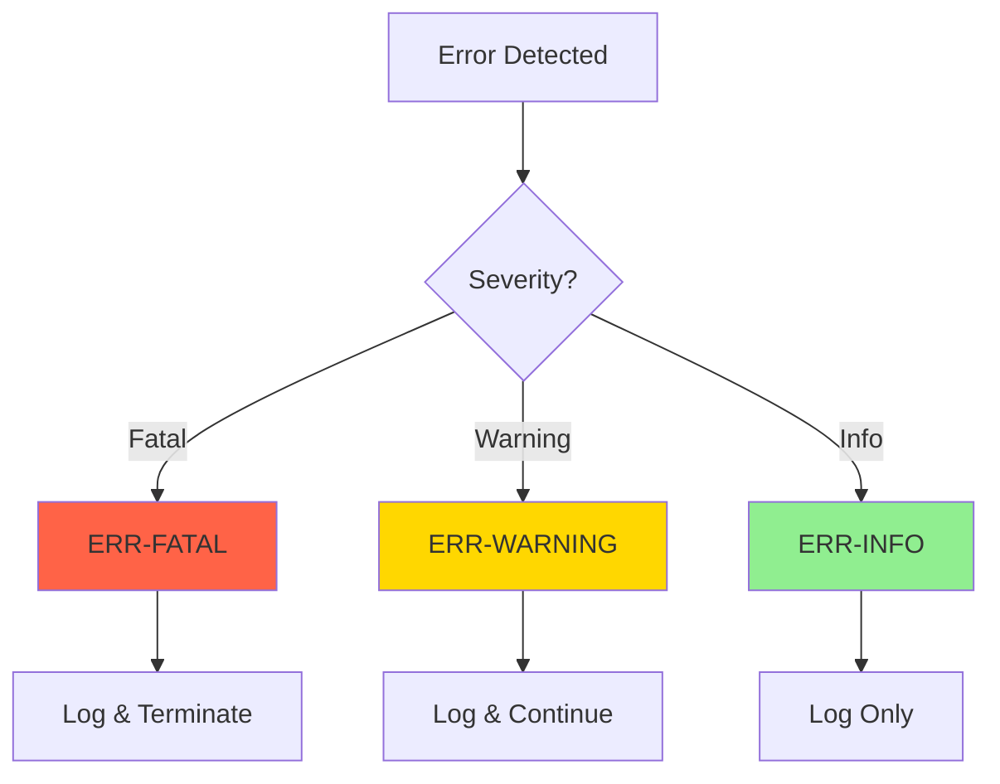
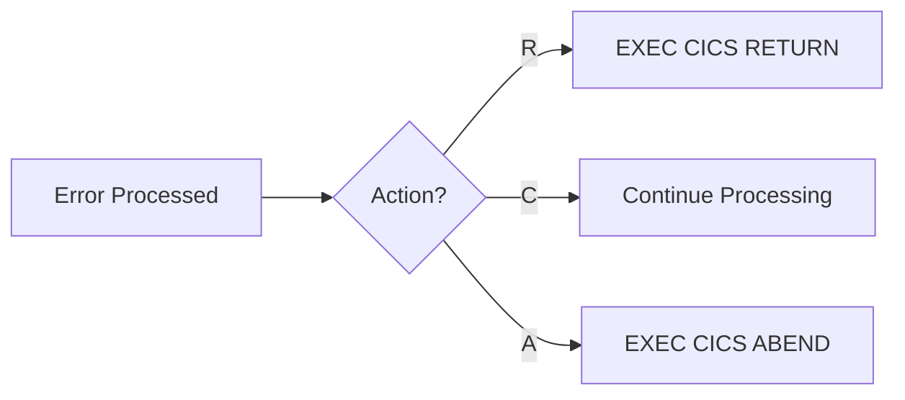
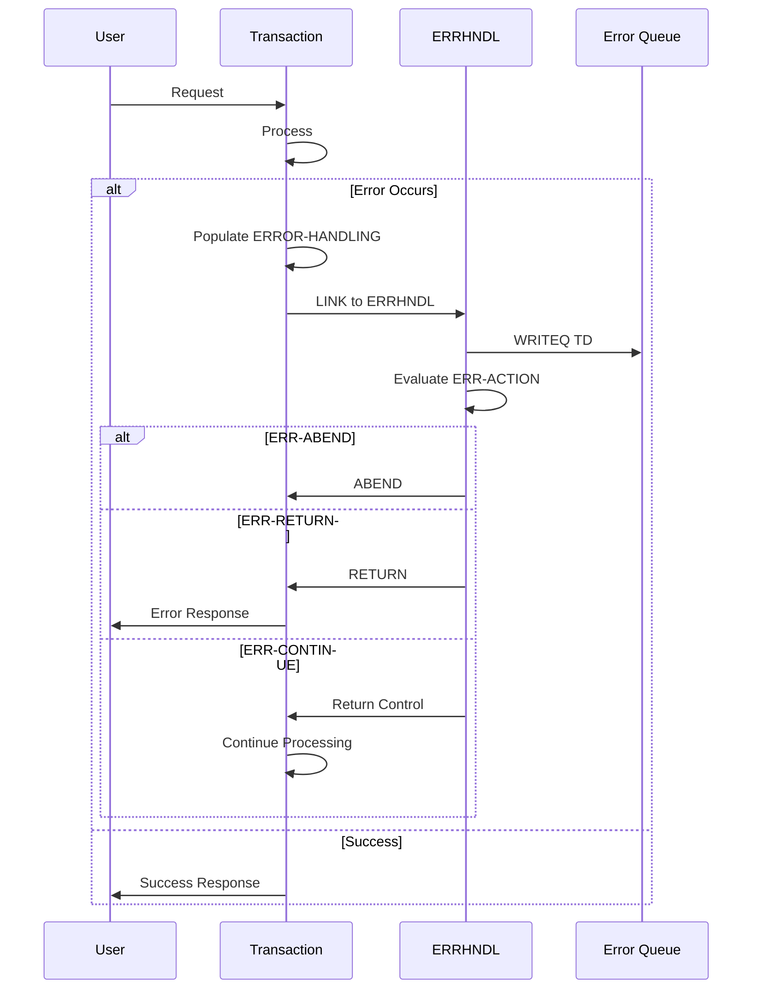

## Overview

ERRHND is a copybook specifically designed for online (CICS) error handling. It provides a comprehensive structure for capturing, categorizing, and responding to errors in CICS transactions, including support for both CICS response codes and DB2 SQLCODEs.

Unlike the batch-oriented ERRHAND copybook, ERRHND is tailored for the unique requirements of online transaction processing:
- CICS RESP and RESP2 code capture
- DB2 SQLCODE integration for database operations
- Severity-based error classification
- Action-oriented error response (return, continue, or abend)
- Transaction tracing with unique IDs and timestamps

## Data Structure

### ERROR-HANDLING

| Level | Name | Picture | Description |
|-------|------|---------|-------------|
| 01 | ERROR-HANDLING | - | Main error handling structure |
| 05 | ERR-PROGRAM | X(8) | Program where error occurred |
| 05 | ERR-PARAGRAPH | X(30) | Paragraph/section where error occurred |
| 05 | ERR-SQLCODE | S9(9) COMP | DB2 SQLCODE value |
| 05 | ERR-CICS-RESP | S9(8) COMP | CICS EIBRESP value |
| 05 | ERR-CICS-RESP2 | S9(8) COMP | CICS EIBRESP2 value |
| 05 | ERR-SEVERITY | X(1) | Error severity level |
| 05 | ERR-MESSAGE | X(80) | Descriptive error message |
| 05 | ERR-ACTION | X(1) | Action to take |
| 05 | ERR-TRACE | - | Tracing information group |
| 10 | ERR-TRACE-ID | X(16) | Unique trace identifier |
| 10 | ERR-TIMESTAMP | X(26) | Error timestamp |

### Record Layout

```
+-------------+----------------+-------------+
| ERR-PROGRAM | ERR-PARAGRAPH  | ERR-SQLCODE |
|   (8)       |     (30)       |    (4)      |
+-------------+----------------+-------------+
| ERR-CICS-RESP | ERR-CICS-RESP2 | ERR-SEVERITY |
|      (4)      |      (4)       |     (1)      |
+-------------+----------------+-------------+
|              ERR-MESSAGE (80)               |
+---------------------------------------------+
| ERR-ACTION | ERR-TRACE-ID | ERR-TIMESTAMP   |
|    (1)     |     (16)     |     (26)        |
+-------------+--------------+-----------------+
```

**Total Length:** Approximately 174 bytes

## Field Details

### ERR-SEVERITY

Classifies the error by its impact on processing.

| Value | Condition | Description | Typical Response |
|-------|-----------|-------------|------------------|
| F | ERR-FATAL | Fatal error | Transaction must terminate |
| W | ERR-WARNING | Warning | Processing can continue with caution |
| I | ERR-INFO | Informational | Logged but no action required |



### ERR-ACTION

Specifies the action to take after error processing.

| Value | Condition | Description | Behavior |
|-------|-----------|-------------|----------|
| R | ERR-RETURN | Return to caller | Clean return with error info |
| C | ERR-CONTINUE | Continue processing | Resume normal flow |
| A | ERR-ABEND | Abend transaction | Force transaction termination |



### CICS Response Codes

The ERR-CICS-RESP and ERR-CICS-RESP2 fields capture CICS exceptional conditions:

| RESP Value | Condition | Description |
|------------|-----------|-------------|
| 0 | NORMAL | Successful completion |
| 12 | FILENOTFOUND | File not defined |
| 13 | NOTFND | Record not found |
| 14 | DUPREC | Duplicate record |
| 16 | DUPKEY | Duplicate key |
| 22 | LENGERR | Length error |
| 26 | ITEMERR | Item error |
| 27 | PGMIDERR | Program not found |
| 28 | TRANSIDERR | Transaction not found |
| 31 | ENDFILE | End of file |
| 70 | TERMERR | Terminal error |
| 81 | DISABLED | Resource disabled |

### ERR-TRACE Fields

Support for distributed tracing and debugging:

| Field | Format | Purpose |
|-------|--------|---------|
| ERR-TRACE-ID | X(16) | Unique identifier linking related transactions |
| ERR-TIMESTAMP | X(26) | ISO timestamp when error occurred |

## Usage Examples

### Basic Error Capture

```cobol
* Capture CICS error after file operation
EXEC CICS READ
    FILE('CUSTFILE')
    INTO(WS-CUSTOMER-RECORD)
    RIDFLD(WS-CUSTOMER-KEY)
    RESP(ERR-CICS-RESP)
    RESP2(ERR-CICS-RESP2)
END-EXEC

IF ERR-CICS-RESP NOT = DFHRESP(NORMAL)
    MOVE 'INQCUST' TO ERR-PROGRAM
    MOVE 'READ-CUSTOMER-FILE' TO ERR-PARAGRAPH
    MOVE ZEROS TO ERR-SQLCODE
    SET ERR-WARNING TO TRUE
    MOVE 'Customer record not found' TO ERR-MESSAGE
    SET ERR-RETURN TO TRUE
    PERFORM FORMAT-ERROR-TRACE
    PERFORM LOG-ERROR
END-IF
```

### DB2 Error Handling in CICS

```cobol
* Capture DB2 error in online transaction
EXEC SQL
    SELECT CUST_NAME, CUST_BALANCE
    INTO :WS-CUST-NAME, :WS-CUST-BALANCE
    FROM CUSTOMER
    WHERE CUST_ID = :WS-CUST-ID
END-EXEC

IF SQLCODE NOT = 0
    MOVE 'DB2ONLN' TO ERR-PROGRAM
    MOVE 'FETCH-CUSTOMER-DATA' TO ERR-PARAGRAPH
    MOVE SQLCODE TO ERR-SQLCODE
    MOVE ZEROS TO ERR-CICS-RESP
    MOVE ZEROS TO ERR-CICS-RESP2
    
    EVALUATE SQLCODE
        WHEN 100
            SET ERR-INFO TO TRUE
            MOVE 'No customer found' TO ERR-MESSAGE
            SET ERR-RETURN TO TRUE
        WHEN -803
            SET ERR-WARNING TO TRUE
            MOVE 'Duplicate customer ID' TO ERR-MESSAGE
            SET ERR-RETURN TO TRUE
        WHEN OTHER
            SET ERR-FATAL TO TRUE
            MOVE 'Unexpected DB2 error' TO ERR-MESSAGE
            SET ERR-ABEND TO TRUE
    END-EVALUATE
    
    PERFORM FORMAT-ERROR-TRACE
    PERFORM LOG-ERROR
END-IF
```

### Error Trace Formatting

```cobol
FORMAT-ERROR-TRACE.
    * Generate unique trace ID
    EXEC CICS ASSIGN
        APPLID(WS-APPLID)
    END-EXEC
    
    EXEC CICS ASKTIME
        ABSTIME(WS-ABSTIME)
    END-EXEC
    
    EXEC CICS FORMATTIME
        ABSTIME(WS-ABSTIME)
        YYYY(WS-YEAR)
        MM(WS-MONTH)
        DD(WS-DAY)
        TIME(WS-TIME)
    END-EXEC
    
    STRING WS-APPLID DELIMITED SPACE
           '-' DELIMITED SIZE
           EIBTRNID DELIMITED SPACE
           '-' DELIMITED SIZE
           EIBTASKN DELIMITED SIZE
           INTO ERR-TRACE-ID
    END-STRING
    
    STRING WS-YEAR '-' WS-MONTH '-' WS-DAY
           'T' WS-TIME
           DELIMITED SIZE
           INTO ERR-TIMESTAMP
    END-STRING
    .
```

### Centralized Error Handler

```cobol
LOG-ERROR.
    * Log to transient data queue
    EXEC CICS WRITEQ TD
        QUEUE('ERRQ')
        FROM(ERROR-HANDLING)
        LENGTH(LENGTH OF ERROR-HANDLING)
        RESP(WS-RESP)
    END-EXEC
    
    * Take appropriate action
    EVALUATE TRUE
        WHEN ERR-ABEND
            EXEC CICS ABEND
                ABCODE('UERR')
            END-EXEC
        WHEN ERR-RETURN
            EXEC CICS RETURN
            END-EXEC
        WHEN ERR-CONTINUE
            CONTINUE
    END-EVALUATE
    .
```

### Error Display to Terminal

```cobol
DISPLAY-ERROR-TO-USER.
    * Format user-friendly error message
    MOVE SPACES TO WS-DISPLAY-MESSAGE
    
    EVALUATE TRUE
        WHEN ERR-FATAL
            STRING 'ERROR: ' DELIMITED SIZE
                   ERR-MESSAGE DELIMITED SPACE
                   ' (Ref: ' DELIMITED SIZE
                   ERR-TRACE-ID DELIMITED SPACE
                   ')' DELIMITED SIZE
                   INTO WS-DISPLAY-MESSAGE
        WHEN ERR-WARNING
            STRING 'WARNING: ' DELIMITED SIZE
                   ERR-MESSAGE DELIMITED SPACE
                   INTO WS-DISPLAY-MESSAGE
        WHEN ERR-INFO
            MOVE ERR-MESSAGE TO WS-DISPLAY-MESSAGE
    END-EVALUATE
    
    EXEC CICS SEND
        FROM(WS-DISPLAY-MESSAGE)
        LENGTH(LENGTH OF WS-DISPLAY-MESSAGE)
        ERASE
    END-EXEC
    .
```

## Programs Using This Copybook

| Program | Description | Primary Usage |
|---------|-------------|---------------|
| DB2ONLN | Online DB2 Connection Manager | DB2 error handling in CICS |
| DB2RECV | DB2 Recovery Handler | Database recovery errors |
| ERRHNDL | Online Error Handler | Centralized error processing |
| INQONLN | Online Inquiry Controller | User-facing error handling |
| SECMGR | Security Manager | Security violation errors |

## Related Copybooks

- **ERRHAND** - Batch error handling (similar purpose for batch programs)
- **INQCOM** - Online inquiry communication area
- **DB2REQ** - DB2 request handling for online programs

## Technical Notes

### Comparison: ERRHND vs ERRHAND

| Feature | ERRHND (Online) | ERRHAND (Batch) |
|---------|-----------------|-----------------|
| Environment | CICS | Batch |
| CICS RESP | Yes | No |
| DB2 SQLCODE | Yes (COMP) | No |
| Error Categories | No | Yes (VS, VL, PR, SY) |
| Severity Levels | F, W, I | Return codes (0,4,8,12,16) |
| Action Codes | R, C, A | N/A |
| Trace Support | Yes | No |

### COMP Field Sizes

| Field | Picture | Bytes | Range |
|-------|---------|-------|-------|
| ERR-SQLCODE | S9(9) COMP | 4 | -999,999,999 to +999,999,999 |
| ERR-CICS-RESP | S9(8) COMP | 4 | -99,999,999 to +99,999,999 |
| ERR-CICS-RESP2 | S9(8) COMP | 4 | -99,999,999 to +99,999,999 |

### Trace ID Format

The recommended format for ERR-TRACE-ID is:

```
AAAA-TTTT-NNNNNNNN
│    │    └── Task number (8 digits)
│    └── Transaction ID (4 chars)
└── Application ID (4 chars)
```

This format enables:
- Correlation of errors across programs
- Tracking through CICS logs
- Support desk reference

### Best Practices

1. **Always capture both RESP and RESP2** - RESP2 provides additional context
2. **Set ERR-PARAGRAPH** - Helps pinpoint exact error location
3. **Generate trace IDs** - Essential for production debugging
4. **Use appropriate severity** - Don't mark everything as fatal
5. **Clear previous values** - Initialize ERROR-HANDLING before each use
6. **Log before action** - Ensure error is logged before ABEND

### Error Flow in CICS Transaction


