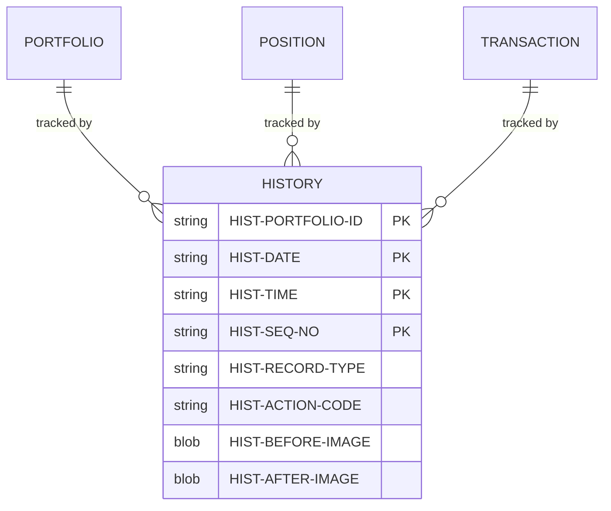
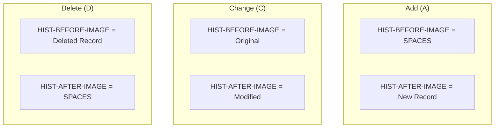

## Overview

HISTREC is a copybook that defines the History Record structure used for maintaining a complete audit trail of changes to portfolio-related data. It captures before and after images of records along with metadata about when and why changes occurred.

The copybook supports three types of historical records: portfolio changes (PT), position changes (PS), and transaction records (TR). Each history record includes 400-byte fields for both the before and after images, allowing the system to store complete snapshots of the original and modified data.

This structure is essential for regulatory compliance, audit requirements, and the ability to reconstruct the state of any portfolio at any point in time.

## Record Layout

```
+---------------------------+----------------------------------------+
| HIST-KEY (26)             | HIST-DATA (807)                        |
+---------------------------+----------------------------------------+
| Port ID | Date | Time|Seq | Type|Act| Before Image | After Image |RC|
|   (8)   | (8)  | (6) |(4) | (2) |(1)|    (400)     |    (400)    |(4)|
+---------------------------+----------------------------------------+
| HIST-AUDIT (34)           | HIST-FILLER (50)                       |
+---------------------------+----------------------------------------+
```

**Total Record Length: ~917 bytes**

## Data Structure

### HISTORY-RECORD (01 Level)

| Level | Name | Picture | Bytes | Description |
|-------|------|---------|-------|-------------|
| 01 | HISTORY-RECORD | | ~917 | Complete history record |

### HIST-KEY (Composite Record Key)

| Level | Name | Picture | Bytes | Description |
|-------|------|---------|-------|-------------|
| 05 | HIST-KEY | | 26 | Composite primary key |
| 10 | HIST-PORTFOLIO-ID | X(8) | 8 | Portfolio identifier |
| 10 | HIST-DATE | X(8) | 8 | History date (YYYYMMDD) |
| 10 | HIST-TIME | X(6) | 6 | History time (HHMMSS) |
| 10 | HIST-SEQ-NO | X(4) | 4 | Sequence number for same timestamp |

### HIST-DATA (Main Data Area)

| Level | Name | Picture | Bytes | Description |
|-------|------|---------|-------|-------------|
| 05 | HIST-DATA | | 807 | Main data area |

#### HIST-RECORD-TYPE

| Level | Name | Picture | Bytes | Description |
|-------|------|---------|-------|-------------|
| 10 | HIST-RECORD-TYPE | X(2) | 2 | Type of record being tracked |

**Record Type Values (88-level conditions):**

| Value | Condition Name | Description |
|-------|----------------|-------------|
| `PT` | HIST-TYPE-PORT | Portfolio record change |
| `PS` | HIST-TYPE-POS | Position record change |
| `TR` | HIST-TYPE-TRN | Transaction record |

#### HIST-ACTION-CODE

| Level | Name | Picture | Bytes | Description |
|-------|------|---------|-------|-------------|
| 10 | HIST-ACTION-CODE | X(1) | 1 | Type of action performed |

**Action Code Values (88-level conditions):**

| Value | Condition Name | Description |
|-------|----------------|-------------|
| `A` | HIST-ACTION-ADD | Record was added/created |
| `C` | HIST-ACTION-CHG | Record was changed/modified |
| `D` | HIST-ACTION-DEL | Record was deleted |

#### Image Fields

| Level | Name | Picture | Bytes | Description |
|-------|------|---------|-------|-------------|
| 10 | HIST-BEFORE-IMAGE | X(400) | 400 | Record state before change |
| 10 | HIST-AFTER-IMAGE | X(400) | 400 | Record state after change |
| 10 | HIST-REASON-CODE | X(4) | 4 | Code indicating reason for change |

### HIST-AUDIT (Audit Information)

| Level | Name | Picture | Bytes | Description |
|-------|------|---------|-------|-------------|
| 05 | HIST-AUDIT | | 34 | Audit trail information |
| 10 | HIST-PROCESS-DATE | X(26) | 26 | Processing timestamp |
| 10 | HIST-PROCESS-USER | X(8) | 8 | User who made the change |

### HIST-FILLER

| Level | Name | Picture | Bytes | Description |
|-------|------|---------|-------|-------------|
| 05 | HIST-FILLER | X(50) | 50 | Reserved for future use |

## Record Type Relationships



## Action Code Usage



| Action | Before Image | After Image |
|--------|--------------|-------------|
| Add (A) | Spaces/Empty | New record data |
| Change (C) | Original record | Modified record |
| Delete (D) | Deleted record | Spaces/Empty |

## Usage Patterns

### Recording a New Portfolio

```cobol
INITIALIZE HISTORY-RECORD

MOVE PORT-ID          TO HIST-PORTFOLIO-ID
MOVE WS-CURRENT-DATE  TO HIST-DATE
MOVE WS-CURRENT-TIME  TO HIST-TIME
MOVE '0001'           TO HIST-SEQ-NO

SET HIST-TYPE-PORT    TO TRUE
SET HIST-ACTION-ADD   TO TRUE

MOVE SPACES           TO HIST-BEFORE-IMAGE
MOVE PORT-RECORD      TO HIST-AFTER-IMAGE
MOVE 'NEW '           TO HIST-REASON-CODE

MOVE FUNCTION CURRENT-DATE TO HIST-PROCESS-DATE
MOVE WS-USER-ID       TO HIST-PROCESS-USER

WRITE HISTORY-RECORD
```

### Recording a Position Change

```cobol
INITIALIZE HISTORY-RECORD

MOVE POS-PORTFOLIO-ID TO HIST-PORTFOLIO-ID
MOVE WS-CURRENT-DATE  TO HIST-DATE
MOVE WS-CURRENT-TIME  TO HIST-TIME
MOVE WS-SEQ-NO        TO HIST-SEQ-NO

SET HIST-TYPE-POS     TO TRUE
SET HIST-ACTION-CHG   TO TRUE

MOVE WS-ORIGINAL-POS  TO HIST-BEFORE-IMAGE
MOVE POS-RECORD       TO HIST-AFTER-IMAGE
MOVE 'TRAD'           TO HIST-REASON-CODE

MOVE FUNCTION CURRENT-DATE TO HIST-PROCESS-DATE
MOVE WS-USER-ID       TO HIST-PROCESS-USER

WRITE HISTORY-RECORD
```

### Recording a Deletion

```cobol
INITIALIZE HISTORY-RECORD

MOVE PORT-ID          TO HIST-PORTFOLIO-ID
MOVE WS-CURRENT-DATE  TO HIST-DATE
MOVE WS-CURRENT-TIME  TO HIST-TIME
MOVE WS-SEQ-NO        TO HIST-SEQ-NO

SET HIST-TYPE-PORT    TO TRUE
SET HIST-ACTION-DEL   TO TRUE

MOVE PORT-RECORD      TO HIST-BEFORE-IMAGE
MOVE SPACES           TO HIST-AFTER-IMAGE
MOVE 'CLOS'           TO HIST-REASON-CODE

MOVE FUNCTION CURRENT-DATE TO HIST-PROCESS-DATE
MOVE WS-USER-ID       TO HIST-PROCESS-USER

WRITE HISTORY-RECORD
```

### Querying History for a Portfolio

```cobol
MOVE WS-PORTFOLIO-ID  TO HIST-PORTFOLIO-ID
MOVE LOW-VALUES       TO HIST-DATE
                         HIST-TIME
                         HIST-SEQ-NO

START HISTORY-FILE KEY >= HIST-KEY
    INVALID KEY
        SET NO-HISTORY-FOUND TO TRUE
END-START

PERFORM UNTIL END-OF-HISTORY
    READ HISTORY-FILE NEXT
        AT END
            SET END-OF-HISTORY TO TRUE
        NOT AT END
            IF HIST-PORTFOLIO-ID = WS-PORTFOLIO-ID
                PERFORM PROCESS-HISTORY-RECORD
            ELSE
                SET END-OF-HISTORY TO TRUE
            END-IF
    END-READ
END-PERFORM
```

## Common Reason Codes

| Code | Description |
|------|-------------|
| `NEW ` | New record created |
| `TRAD` | Trading activity |
| `REBL` | Portfolio rebalance |
| `CLOS` | Account closure |
| `CORR` | Data correction |
| `XFER` | Transfer between accounts |
| `FEE ` | Fee assessment |
| `DIV ` | Dividend processing |
| `MERG` | Corporate merger/acquisition |
| `SPLT` | Stock split |

## File Definition Example

```cobol
INPUT-OUTPUT SECTION.
FILE-CONTROL.
    SELECT HISTORY-FILE
        ASSIGN TO HISTFILE
        ORGANIZATION IS INDEXED
        ACCESS MODE IS DYNAMIC
        RECORD KEY IS HIST-KEY
        FILE STATUS IS WS-HIST-STATUS.

DATA DIVISION.
FILE SECTION.
FD  HISTORY-FILE
    RECORD CONTAINS 917 CHARACTERS.
    COPY HISTREC.
```

## DB2 Table Mapping

The HISTREC structure can also be used with DB2 tables:

```sql
CREATE TABLE PORTFOLIO_HISTORY (
    PORTFOLIO_ID    CHAR(8)     NOT NULL,
    HIST_DATE       CHAR(8)     NOT NULL,
    HIST_TIME       CHAR(6)     NOT NULL,
    SEQ_NO          CHAR(4)     NOT NULL,
    RECORD_TYPE     CHAR(2)     NOT NULL,
    ACTION_CODE     CHAR(1)     NOT NULL,
    BEFORE_IMAGE    VARCHAR(400),
    AFTER_IMAGE     VARCHAR(400),
    REASON_CODE     CHAR(4),
    PROCESS_DATE    TIMESTAMP   NOT NULL,
    PROCESS_USER    CHAR(8)     NOT NULL,
    PRIMARY KEY (PORTFOLIO_ID, HIST_DATE, HIST_TIME, SEQ_NO)
);
```

## Programs Using This Copybook

| Program | Description | Usage |
|---------|-------------|-------|
| HISTLD00 | History Data Loader | Loads and manages history records |

## Related Copybooks

| Copybook | Relationship |
|----------|-------------|
| PORTFLIO | Portfolio record (source for PT type) |
| POSREC | Position record (source for PS type) |
| TRNREC | Transaction record (source for TR type) |
| AUDITLOG | Audit logging (complementary audit trail) |

## Technical Notes

1. **Image Field Size**: The 400-byte before/after image fields are designed to accommodate the largest record types in the system. Smaller records will be left-justified with trailing spaces.

2. **Composite Key**: The 26-byte key (portfolio ID + date + time + sequence) ensures uniqueness even for multiple changes to the same portfolio within the same second.

3. **Sequence Number**: HIST-SEQ-NO handles cases where multiple changes occur within the same second. Start at '0001' and increment for each subsequent change.

4. **Timestamp Format**: 
   - HIST-DATE uses YYYYMMDD format
   - HIST-TIME uses HHMMSS format
   - HIST-PROCESS-DATE uses full 26-character timestamp from `FUNCTION CURRENT-DATE`

5. **Record Reconstruction**: To reconstruct a record's state at any point:
   - Read history records in chronological order
   - Apply HIST-AFTER-IMAGE for each record up to the target timestamp
   - For deleted records, the final state is the HIST-BEFORE-IMAGE of the delete action

6. **Storage Considerations**: With 400-byte image fields, history records are large. Consider:
   - Archiving old history to tape/cheaper storage
   - Compressing image data if supported
   - Implementing retention policies

7. **HIST-FILLER**: The 50-byte filler allows for future enhancements without changing record length, such as:
   - Digital signatures
   - Encryption indicators
   - Extended reason codes

8. **Referential Integrity**: History records should be retained even if the source record is deleted, as they may be needed for:
   - Regulatory audits
   - Legal discovery
   - Dispute resolution
