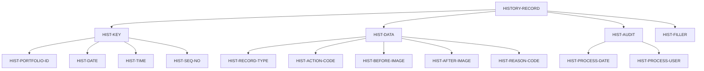

## Overview

HISTREC (History Record) is a copybook that defines the standard structure for history records in the portfolio management system. It provides a comprehensive audit trail by capturing before and after images of data changes, along with metadata about when and why changes occurred.

This copybook is essential for:
- **Audit Compliance**: Maintaining a complete record of all data modifications
- **Change Tracking**: Recording what changed, when, and by whom
- **Data Recovery**: Storing before/after images to support rollback scenarios
- **Historical Analysis**: Enabling point-in-time data reconstruction

## Structure Diagram



## Data Definitions

### HISTORY-RECORD (Level 01)

The main record structure for history entries. Total record length: approximately 920 bytes.

### HIST-KEY - Record Key

The composite key uniquely identifies each history record.

| Level | Name | Picture | Description |
|-------|------|---------|-------------|
| 05 | HIST-KEY | - | Composite primary key (26 bytes) |
| 10 | HIST-PORTFOLIO-ID | X(8) | Portfolio identifier |
| 10 | HIST-DATE | X(8) | History date (YYYYMMDD format) |
| 10 | HIST-TIME | X(6) | History time (HHMMSS format) |
| 10 | HIST-SEQ-NO | X(4) | Sequence number for same timestamp |

**Key Structure:**

```
HIST-KEY (26 bytes)
├── HIST-PORTFOLIO-ID (8)  - e.g., "PORT0001"
├── HIST-DATE (8)          - e.g., "20240315"
├── HIST-TIME (6)          - e.g., "143025"
└── HIST-SEQ-NO (4)        - e.g., "0001"
```

The sequence number ensures uniqueness when multiple changes occur within the same second.

### HIST-DATA - Change Data

Contains the details of what changed.

| Level | Name | Picture | Description |
|-------|------|---------|-------------|
| 05 | HIST-DATA | - | Change data group |
| 10 | HIST-RECORD-TYPE | X(2) | Type of record that changed |
| 10 | HIST-ACTION-CODE | X(1) | Type of action performed |
| 10 | HIST-BEFORE-IMAGE | X(400) | Record content before change |
| 10 | HIST-AFTER-IMAGE | X(400) | Record content after change |
| 10 | HIST-REASON-CODE | X(4) | Reason for the change |

#### HIST-RECORD-TYPE Values (88-levels)

| Condition | Value | Description |
|-----------|-------|-------------|
| HIST-TYPE-PORT | 'PT' | Portfolio master record |
| HIST-TYPE-POS | 'PS' | Position record |
| HIST-TYPE-TRN | 'TR' | Transaction record |

#### HIST-ACTION-CODE Values (88-levels)

| Condition | Value | Description |
|-----------|-------|-------------|
| HIST-ACTION-ADD | 'A' | Record was added |
| HIST-ACTION-CHG | 'C' | Record was changed |
| HIST-ACTION-DEL | 'D' | Record was deleted |

**Before/After Image Usage:**

| Action | HIST-BEFORE-IMAGE | HIST-AFTER-IMAGE |
|--------|-------------------|------------------|
| Add | Spaces (empty) | New record content |
| Change | Original record | Modified record |
| Delete | Deleted record | Spaces (empty) |

### HIST-AUDIT - Audit Information

Captures when and by whom the change was processed.

| Level | Name | Picture | Description |
|-------|------|---------|-------------|
| 05 | HIST-AUDIT | - | Audit information group |
| 10 | HIST-PROCESS-DATE | X(26) | Processing timestamp |
| 10 | HIST-PROCESS-USER | X(8) | User ID who made the change |

The HIST-PROCESS-DATE uses a 26-character timestamp format (typically `YYYY-MM-DD-HH.MM.SS.NNNNNN`) providing microsecond precision.

### HIST-FILLER

| Level | Name | Picture | Description |
|-------|------|---------|-------------|
| 05 | HIST-FILLER | X(50) | Reserved for future use |

## Record Layout

```
Position  Length  Field Name           Description
--------  ------  -------------------  ---------------------------
1-8       8       HIST-PORTFOLIO-ID    Portfolio identifier
9-16      8       HIST-DATE            Date (YYYYMMDD)
17-22     6       HIST-TIME            Time (HHMMSS)
23-26     4       HIST-SEQ-NO          Sequence number
27-28     2       HIST-RECORD-TYPE     Record type (PT/PS/TR)
29        1       HIST-ACTION-CODE     Action (A/C/D)
30-429    400     HIST-BEFORE-IMAGE    Before image
430-829   400     HIST-AFTER-IMAGE     After image
830-833   4       HIST-REASON-CODE     Reason code
834-859   26      HIST-PROCESS-DATE    Process timestamp
860-867   8       HIST-PROCESS-USER    User ID
868-917   50      HIST-FILLER          Reserved
```

**Total Record Length: 917 bytes**

## Usage

### Including the Copybook

```cobol
       FILE SECTION.
       FD  HISTORY-FILE.
           COPY HISTREC.
```

Or in WORKING-STORAGE:

```cobol
       WORKING-STORAGE SECTION.
           COPY HISTREC.
```

### Creating a History Record for an Add

```cobol
       CREATE-ADD-HISTORY.
           INITIALIZE HISTORY-RECORD
           
           MOVE PORT-ID           TO HIST-PORTFOLIO-ID
           MOVE WS-CURRENT-DATE   TO HIST-DATE
           MOVE WS-CURRENT-TIME   TO HIST-TIME
           MOVE WS-SEQ-NUMBER     TO HIST-SEQ-NO
           
           SET HIST-TYPE-PORT     TO TRUE
           SET HIST-ACTION-ADD    TO TRUE
           
           MOVE SPACES            TO HIST-BEFORE-IMAGE
           MOVE PORT-RECORD       TO HIST-AFTER-IMAGE
           MOVE 'NEW '            TO HIST-REASON-CODE
           
           ACCEPT HIST-PROCESS-DATE FROM TIME STAMP
           MOVE WS-USER-ID        TO HIST-PROCESS-USER
           
           WRITE HISTORY-RECORD.
```

### Creating a History Record for a Change

```cobol
       CREATE-CHANGE-HISTORY.
           INITIALIZE HISTORY-RECORD
           
           MOVE PORT-ID           TO HIST-PORTFOLIO-ID
           MOVE WS-CURRENT-DATE   TO HIST-DATE
           MOVE WS-CURRENT-TIME   TO HIST-TIME
           MOVE WS-SEQ-NUMBER     TO HIST-SEQ-NO
           
           SET HIST-TYPE-PORT     TO TRUE
           SET HIST-ACTION-CHG    TO TRUE
           
           MOVE WS-OLD-RECORD     TO HIST-BEFORE-IMAGE
           MOVE PORT-RECORD       TO HIST-AFTER-IMAGE
           MOVE 'MAINT'           TO HIST-REASON-CODE
           
           ACCEPT HIST-PROCESS-DATE FROM TIME STAMP
           MOVE WS-USER-ID        TO HIST-PROCESS-USER
           
           WRITE HISTORY-RECORD.
```

### Creating a History Record for a Delete

```cobol
       CREATE-DELETE-HISTORY.
           INITIALIZE HISTORY-RECORD
           
           MOVE PORT-ID           TO HIST-PORTFOLIO-ID
           MOVE WS-CURRENT-DATE   TO HIST-DATE
           MOVE WS-CURRENT-TIME   TO HIST-TIME
           MOVE WS-SEQ-NUMBER     TO HIST-SEQ-NO
           
           SET HIST-TYPE-PORT     TO TRUE
           SET HIST-ACTION-DEL    TO TRUE
           
           MOVE PORT-RECORD       TO HIST-BEFORE-IMAGE
           MOVE SPACES            TO HIST-AFTER-IMAGE
           MOVE 'CLOS'            TO HIST-REASON-CODE
           
           ACCEPT HIST-PROCESS-DATE FROM TIME STAMP
           MOVE WS-USER-ID        TO HIST-PROCESS-USER
           
           WRITE HISTORY-RECORD.
```

### Querying History by Record Type

```cobol
       READ-PORTFOLIO-HISTORY.
           PERFORM VARYING WS-INDEX FROM 1 BY 1
                   UNTIL END-OF-HISTORY
               READ HISTORY-FILE NEXT
                   AT END
                       SET END-OF-HISTORY TO TRUE
                   NOT AT END
                       IF HIST-TYPE-PORT
                           PERFORM PROCESS-PORT-HISTORY
                       END-IF
               END-READ
           END-PERFORM.
```

## Programs Using This Copybook

| Program | Description |
|---------|-------------|
| HISTLD00 | History load program - loads and manages history records |

## Related Copybooks

| Copybook | Relationship |
|----------|--------------|
| PORTFLIO | Portfolio record layout (stored in before/after images) |
| POSREC | Position record layout (stored in before/after images) |
| TRNREC | Transaction record layout (stored in before/after images) |
| AUDITLOG | Audit trail records (complementary audit information) |

## Reason Codes

Common reason codes used with HIST-REASON-CODE:

| Code | Description |
|------|-------------|
| NEW | New record created |
| MAINT | Maintenance update |
| CLOS | Account/portfolio closed |
| CORR | Correction |
| XFER | Transfer |
| ADJT | Adjustment |
| REBL | Rebalance |
| DIVD | Dividend processing |
| SPLT | Stock split |
| MRGR | Merger/acquisition |

## Design Considerations

### Image Size

The before and after image fields are 400 bytes each:
- Large enough to accommodate portfolio, position, and transaction records
- Fixed size simplifies processing and storage allocation
- Padding with spaces for smaller records

### Key Design

The composite key structure ensures:
- Records are grouped by portfolio for efficient retrieval
- Chronological ordering within each portfolio
- Sequence number handles sub-second granularity

### Timestamp Precision

The 26-character process timestamp provides:
- Microsecond precision for accurate sequencing
- Compatible with DB2 TIMESTAMP format
- Sufficient for high-volume transaction environments

## File Organization

History files using this copybook are typically organized as:

| Property | Recommendation |
|----------|----------------|
| Organization | Indexed (VSAM KSDS) |
| Record Key | HIST-KEY |
| Access Mode | Sequential for batch, Dynamic for inquiry |
| Retention | Per regulatory requirements (typically 7 years) |

## Maintenance Notes

When modifying this copybook:

1. **Changing image size**: Requires data migration for existing history files
2. **Adding record types**: Update all programs that check HIST-RECORD-TYPE
3. **Adding action codes**: Ensure all maintenance programs are updated
4. **Modifying key structure**: Requires complete file rebuild
