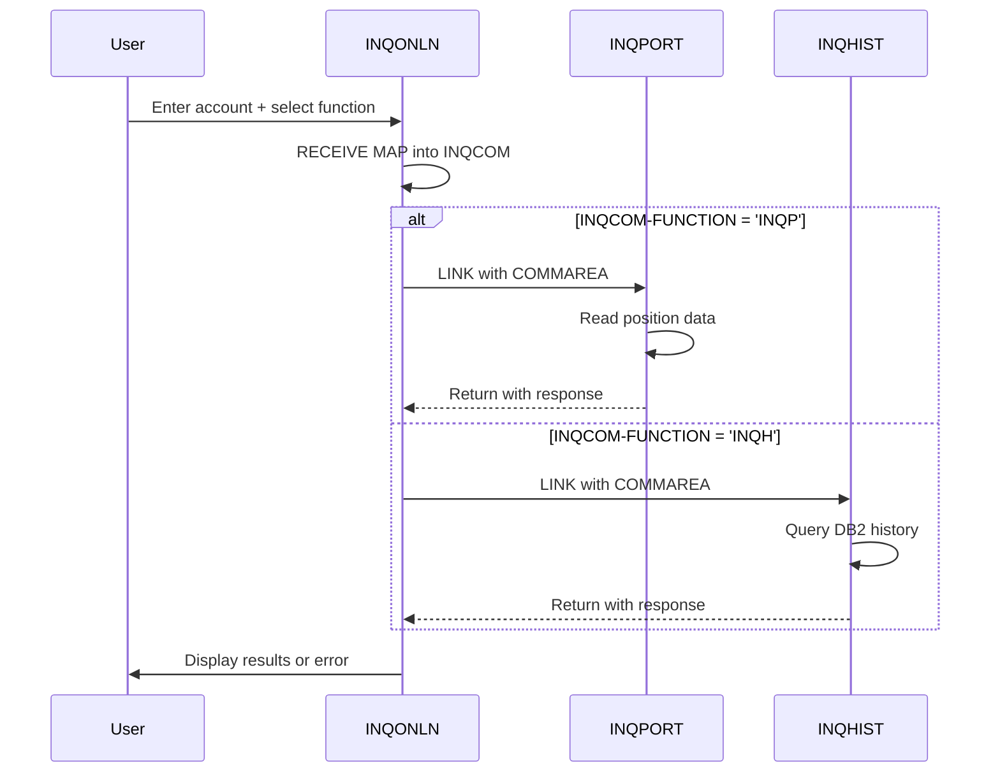

## Overview

INQCOM is a copybook that defines the communication area (COMMAREA) structure used by the online inquiry subsystem in CICS. It provides a standardized interface for passing request parameters and response data between the main inquiry handler and its sub-programs.

The copybook defines a compact structure containing:
- **Function code** - Identifies the type of inquiry operation
- **Account number** - Primary search key for inquiries
- **Response code** - Status of the operation
- **Error message** - Human-readable error description

This structure serves as the contract between:
- **INQONLN** - Main inquiry transaction handler (router)
- **INQPORT** - Portfolio position inquiry
- **INQHIST** - Transaction history inquiry

The COMMAREA pattern is fundamental to CICS pseudo-conversational programming, allowing data to persist across transaction boundaries while minimizing resource usage.

## Data Structure

### INQCOM-AREA

| Level | Name | Picture | Description |
|-------|------|---------|-------------|
| 01 | INQCOM-AREA | - | Main communication area (~96 bytes) |
| 05 | INQCOM-FUNCTION | PIC X(4) | Function/operation code |
| 05 | INQCOM-ACCOUNT-NO | PIC X(10) | Account number for inquiry |
| 05 | INQCOM-RESPONSE-CODE | PIC S9(8) COMP | Operation response code |
| 05 | INQCOM-ERROR-MSG | PIC X(80) | Error message text |

### INQCOM-FUNCTION Values (88-Level Conditions)

| Condition Name | Value | Description |
|----------------|-------|-------------|
| INQCOM-MENU | `MENU` | Display main inquiry menu |
| INQCOM-PORTFOLIO | `INQP` | Portfolio position inquiry |
| INQCOM-HISTORY | `INQH` | Transaction history inquiry |
| INQCOM-EXIT | `EXIT` | Exit inquiry transaction |

### Response Codes

| Code | Meaning |
|------|---------|
| 0 | Success |
| > 0 | CICS RESP code or application error |
| < 0 | DB2 SQLCODE (for history inquiries) |

## Record Layout

```
+------------------------------------------------------------------+
| INQCOM-AREA (Total: ~96 bytes)                                   |
+------------------------------------------------------------------+
| Offset | Length | Field                | Content                 |
+--------+--------+----------------------+-------------------------+
|   0    |   4    | INQCOM-FUNCTION      | 'MENU'/'INQP'/'INQH'/   |
|        |        |                      | 'EXIT'                  |
+--------+--------+----------------------+-------------------------+
|   4    |  10    | INQCOM-ACCOUNT-NO    | Account number          |
+--------+--------+----------------------+-------------------------+
|  14    |   4    | INQCOM-RESPONSE-CODE | Binary response code    |
+--------+--------+----------------------+-------------------------+
|  18    |  80    | INQCOM-ERROR-MSG     | Error message text      |
+--------+--------+----------------------+-------------------------+
```

## Programs Using This Copybook

| Program | Role | Usage |
|---------|------|-------|
| INQONLN | Router | Routes requests based on INQCOM-FUNCTION; receives from BMS map |
| INQPORT | Handler | Receives account number; returns position data or error |
| INQHIST | Handler | Receives account number; returns history data or error |

## Program Interaction Flow



## Usage Examples

### Declaring in Working Storage (Caller)

```cobol
WORKING-STORAGE SECTION.
01  WS-COMMAREA.
    COPY INQCOM.
```

### Declaring in Linkage Section (Called Program)

```cobol
LINKAGE SECTION.
01  DFHCOMMAREA.
    COPY INQCOM.
```

### Receiving Input from BMS Map (INQONLN)

```cobol
EXEC CICS RECEIVE MAP('INQMAP')
          MAPSET('INQSET')
          INTO(WS-COMMAREA)
          RESP(WS-RESPONSE-CODE)
END-EXEC

EVALUATE TRUE
    WHEN INQCOM-MENU
        PERFORM DISPLAY-MENU
    WHEN INQCOM-PORTFOLIO
        PERFORM PORTFOLIO-INQUIRY
    WHEN INQCOM-HISTORY
        PERFORM HISTORY-INQUIRY
    WHEN INQCOM-EXIT
        SET SESSION-TERMINATED TO TRUE
END-EVALUATE
```

### Linking to Sub-Program (INQONLN)

```cobol
* Call portfolio inquiry
EXEC CICS LINK PROGRAM('INQPORT')
          COMMAREA(WS-COMMAREA)
          LENGTH(LENGTH OF WS-COMMAREA)
          RESP(WS-RESPONSE-CODE)
END-EXEC

* Check response
IF INQCOM-RESPONSE-CODE OF WS-COMMAREA NOT = 0
    PERFORM DISPLAY-ERROR
END-IF
```

### Receiving COMMAREA (INQPORT/INQHIST)

```cobol
PROCEDURE DIVISION.
    * Copy COMMAREA to working storage
    MOVE DFHCOMMAREA TO WS-COMMAREA
    
    * Use account number for lookup
    MOVE INQCOM-ACCOUNT-NO OF WS-COMMAREA
      TO WS-SEARCH-KEY
    
    PERFORM LOOKUP-POSITION
    ...
```

### Setting Error Response (Called Program)

```cobol
* Position not found
MOVE 'Position not found for account' 
  TO INQCOM-ERROR-MSG OF WS-COMMAREA
MOVE 8 TO INQCOM-RESPONSE-CODE OF WS-COMMAREA

* Copy back to DFHCOMMAREA for return
MOVE WS-COMMAREA TO DFHCOMMAREA

EXEC CICS RETURN END-EXEC
```

### Setting Success Response

```cobol
* Clear error fields
MOVE ZEROS TO INQCOM-RESPONSE-CODE OF WS-COMMAREA
MOVE SPACES TO INQCOM-ERROR-MSG OF WS-COMMAREA

* Copy back for return
MOVE WS-COMMAREA TO DFHCOMMAREA

EXEC CICS RETURN END-EXEC
```

## CICS COMMAREA Pattern

### Why Use COMMAREA?

| Aspect | Benefit |
|--------|---------|
| **State Preservation** | Data survives across pseudo-conversational transactions |
| **Resource Efficiency** | No files or queues needed for temporary data |
| **Simplicity** | Direct memory-to-memory data passing |
| **Performance** | Fast access without I/O overhead |

### COMMAREA Flow in Pseudo-Conversational Design

```
Transaction 1 (Display Menu):
  ┌─────────────────────────────────────┐
  │ 1. RECEIVE MAP (get user input)     │
  │ 2. Store data in COMMAREA           │
  │ 3. RETURN TRANSID('INQ1')           │
  │    COMMAREA(WS-COMMAREA)            │
  └─────────────────────────────────────┘
                    │
                    ▼ (COMMAREA preserved)
  ┌─────────────────────────────────────┐
Transaction 2 (Process Request):
  │ 1. Access DFHCOMMAREA               │
  │ 2. Process based on function        │
  │ 3. LINK to INQPORT/INQHIST          │
  │ 4. RETURN TRANSID('INQ1')           │
  │    COMMAREA(WS-COMMAREA)            │
  └─────────────────────────────────────┘
```

### Working Storage vs Linkage Section

| Section | Purpose | Qualified Name |
|---------|---------|----------------|
| WORKING-STORAGE | Local copy for manipulation | `INQCOM-FUNCTION OF WS-COMMAREA` |
| LINKAGE | Reference to passed COMMAREA | `INQCOM-FUNCTION OF DFHCOMMAREA` |

Always copy DFHCOMMAREA to working storage before modifying, then copy back before RETURN.

## Best Practices

1. **Always qualify field names** - Use `OF WS-COMMAREA` or `OF DFHCOMMAREA` to avoid ambiguity when copybook is used in both sections

2. **Copy before modifying** - Move DFHCOMMAREA to working storage before changes:
   ```cobol
   MOVE DFHCOMMAREA TO WS-COMMAREA
   ```

3. **Copy back before return** - Ensure changes are returned to caller:
   ```cobol
   MOVE WS-COMMAREA TO DFHCOMMAREA
   ```

4. **Initialize on first call** - Check EIBCALEN to detect first invocation:
   ```cobol
   IF EIBCALEN = 0
       INITIALIZE WS-COMMAREA
   ELSE
       MOVE DFHCOMMAREA TO WS-COMMAREA
   END-IF
   ```

5. **Clear error fields on success** - Always clear error message and set response code to zero on success

6. **Preserve function code** - Don't modify INQCOM-FUNCTION in called programs unless intentionally redirecting

## Field Naming Convention

The copybook uses the `INQCOM-` prefix for all fields:

| Prefix | Meaning |
|--------|---------|
| `INQCOM-` | **INQ**uiry **COM**munication area |

This prevents naming conflicts when the copybook is used alongside other structures.

## Related Copybooks

| Copybook | Relationship |
|----------|--------------|
| ERRHND | Online error handling structure, complements INQCOM-ERROR-MSG |
| POSREC | Position record structure retrieved by INQPORT |
| DBTBLS | DB2 tables queried by INQHIST |

## BMS Map Integration

The INQCOM structure is designed to integrate with BMS maps in the INQSET mapset:

| Map | Purpose | INQCOM Fields Used |
|-----|---------|-------------------|
| INQMAP | Main inquiry input | INQCOM-FUNCTION, INQCOM-ACCOUNT-NO |
| INQMNU | Menu display | - |
| POSMAP | Position display | Results from INQPORT |
| HISMAP | History display | Results from INQHIST |

The function code and account number are typically received from INQMAP, while results are displayed through the appropriate output maps.
