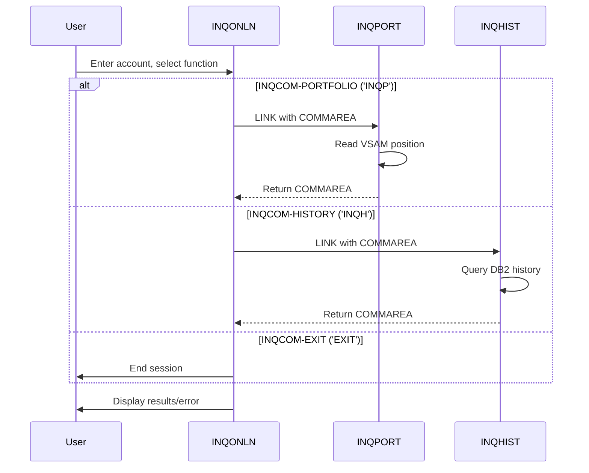

## Overview

INQCOM is a copybook that defines the communication area (COMMAREA) structure used by CICS online inquiry programs in the Portfolio Management System. It provides a standardized interface for passing data between inquiry programs, including function codes, account identifiers, response codes, and error messages.

The copybook serves as the contract between:
- **INQONLN**: The main inquiry handler that routes requests
- **INQPORT**: The portfolio position inquiry handler
- **INQHIST**: The transaction history inquiry handler

By using a common COMMAREA structure, these programs can seamlessly exchange data and maintain conversation state across pseudo-conversational CICS transactions.

## Data Structure

### INQCOM-AREA

The complete communication area structure:

| Level | Name | Picture | Description |
|-------|------|---------|-------------|
| 01 | INQCOM-AREA | Group | Inquiry communication area (98 bytes) |
| 05 | INQCOM-FUNCTION | X(4) | Function/navigation code |
| 88 | INQCOM-MENU | 'MENU' | Return to main menu |
| 88 | INQCOM-PORTFOLIO | 'INQP' | Portfolio position inquiry |
| 88 | INQCOM-HISTORY | 'INQH' | Transaction history inquiry |
| 88 | INQCOM-EXIT | 'EXIT' | Exit the application |
| 05 | INQCOM-ACCOUNT-NO | X(10) | Account number for inquiry |
| 05 | INQCOM-RESPONSE-CODE | S9(8) COMP | Response/return code |
| 05 | INQCOM-ERROR-MSG | X(80) | Error message text |

### Record Layout

```
INQCOM-AREA (98 bytes total)
├── INQCOM-FUNCTION      [4 bytes]   - Function code
├── INQCOM-ACCOUNT-NO    [10 bytes]  - Account number
├── INQCOM-RESPONSE-CODE [4 bytes]   - Response code (COMP)
└── INQCOM-ERROR-MSG     [80 bytes]  - Error message
```

## Field Details

### INQCOM-FUNCTION

A 4-character code that controls navigation and processing:

| Value | 88-Level | Description | Action |
|-------|----------|-------------|--------|
| 'MENU' | INQCOM-MENU | Main menu | Display the main inquiry menu |
| 'INQP' | INQCOM-PORTFOLIO | Portfolio inquiry | Link to INQPORT for position data |
| 'INQH' | INQCOM-HISTORY | History inquiry | Link to INQHIST for transaction history |
| 'EXIT' | INQCOM-EXIT | Exit application | Terminate the CICS conversation |

### INQCOM-ACCOUNT-NO

The 10-character account number used as the key for inquiries:
- Used by INQPORT to look up portfolio positions
- Used by INQHIST to retrieve transaction history
- Typically entered by the user on the inquiry screen
- Should be validated before processing

### INQCOM-RESPONSE-CODE

A signed 8-digit binary field (COMP) for return codes:

| Value | Meaning |
|-------|---------|
| 0 | Success |
| > 0 | Warning or informational |
| < 0 | Error condition |

Common values used in the inquiry subsystem:
- DFHRESP(NORMAL) = 0: Successful completion
- DFHRESP(NOTFND) = 13: Record not found
- SQLCODE values when DB2 errors occur

### INQCOM-ERROR-MSG

An 80-character field for error or informational messages:
- Populated when errors occur during processing
- Displayed to the user on the screen
- Cleared on successful operations

## Usage

### In Working Storage

```cobol
WORKING-STORAGE SECTION.
01  WS-COMMAREA.
    COPY INQCOM.
```

### In Linkage Section (for DFHCOMMAREA)

```cobol
LINKAGE SECTION.
01  DFHCOMMAREA.
    COPY INQCOM.
```

### Processing Function Codes

```cobol
EVALUATE TRUE
    WHEN INQCOM-MENU
        PERFORM DISPLAY-MENU
    WHEN INQCOM-PORTFOLIO
        PERFORM PORTFOLIO-INQUIRY
    WHEN INQCOM-HISTORY
        PERFORM HISTORY-INQUIRY
    WHEN INQCOM-EXIT
        SET SESSION-TERMINATED TO TRUE
    WHEN OTHER
        MOVE 'Invalid function' TO INQCOM-ERROR-MSG
        PERFORM ERROR-ROUTINE
END-EVALUATE
```

### Linking to Sub-Programs

```cobol
* Link to portfolio inquiry
MOVE 'INQP' TO INQCOM-FUNCTION
MOVE WS-ACCOUNT TO INQCOM-ACCOUNT-NO

EXEC CICS LINK PROGRAM('INQPORT')
          COMMAREA(WS-COMMAREA)
          LENGTH(LENGTH OF WS-COMMAREA)
END-EXEC

IF INQCOM-RESPONSE-CODE NOT = 0
    DISPLAY 'Error: ' INQCOM-ERROR-MSG
END-IF
```

### Setting Error Information

```cobol
* On error in sub-program
MOVE 'Position not found for account' 
  TO INQCOM-ERROR-MSG
MOVE DFHRESP(NOTFND) TO INQCOM-RESPONSE-CODE
MOVE WS-COMMAREA TO DFHCOMMAREA
```

### Checking Response

```cobol
* After LINK returns
IF INQCOM-RESPONSE-CODE = 0
    PERFORM DISPLAY-RESULTS
ELSE
    PERFORM DISPLAY-ERROR
END-IF
```

## Programs Using This Copybook

| Program | Role | Usage |
|---------|------|-------|
| INQONLN | Main Handler | Routes requests based on INQCOM-FUNCTION; receives user input; passes COMMAREA to sub-programs |
| INQPORT | Portfolio Inquiry | Receives account number; returns position data or error message |
| INQHIST | History Inquiry | Receives account number; returns transaction history or error message |

## Transaction Flow



## Related Copybooks

| Copybook | Relationship |
|----------|--------------|
| ERRHND | Error handling - used alongside INQCOM for detailed error tracking in INQONLN |
| POSREC | Position record - used by INQPORT for VSAM position data |

## Related BMS Maps

The inquiry programs use maps from the INQSET mapset:

| Map | Purpose |
|-----|---------|
| INQMAP | Input map for receiving inquiry requests |
| INQMNU | Main menu display |
| POSMAP | Portfolio position display (used by INQPORT) |
| HISMAP | Transaction history display (used by INQHIST) |

## Design Notes

### COMMAREA Size

The INQCOM-AREA is 98 bytes, which is well within CICS COMMAREA limits. This compact size:
- Minimizes storage usage
- Enables efficient pseudo-conversational processing
- Leaves room for future field additions

### Pseudo-Conversational Pattern

The copybook supports CICS pseudo-conversational programming:
1. User enters data on screen
2. Program receives COMMAREA from previous interaction
3. Program processes request based on function code
4. Program returns with updated COMMAREA
5. CICS presents next screen to user

### Function Code Design

The 4-character function codes are:
- **Mnemonic**: Easy to remember (MENU, EXIT)
- **Consistent length**: Simplifies EVALUATE logic
- **88-level conditions**: Enable readable code (`WHEN INQCOM-PORTFOLIO`)

### Error Message Capacity

The 80-character error message field:
- Matches typical screen line width
- Provides sufficient space for descriptive messages
- Can be displayed directly on BMS maps

### Extensibility

To add a new inquiry function:
1. Add a new 88-level condition under INQCOM-FUNCTION
2. Add handling in INQONLN's EVALUATE statement
3. Create the new inquiry program using INQCOM for its COMMAREA
4. Add corresponding BMS map if needed
