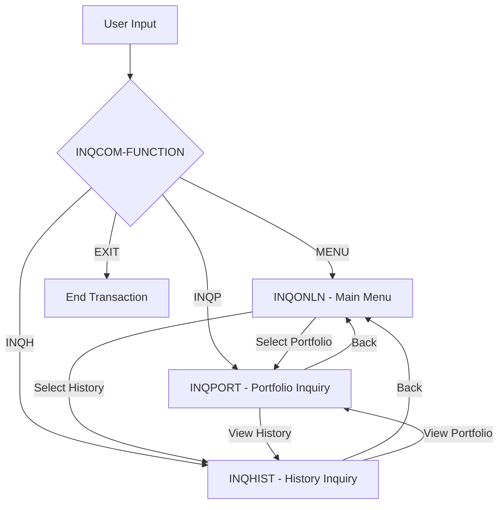

## Overview

INQCOM is a copybook that defines the communication area (COMMAREA) structure used by online inquiry programs in the CICS environment. It provides a standardized interface for passing function codes, account information, and response data between inquiry programs.

This copybook enables a suite of related inquiry transactions to share a common data format, supporting navigation between menu screens, portfolio inquiries, and history lookups while maintaining context across program invocations.

Key features:
- **Function Routing**: 88-level conditions for menu navigation
- **Account Context**: Carries account number across transactions
- **Response Handling**: Standardized response code and error message fields
- **CICS Compatible**: Designed for COMMAREA-based program linking

## Record Layout

```
+------------------------------------------------------------------+
| INQCOM-AREA (96 bytes total)                                      |
+------------------------------------------------------------------+
| INQCOM-FUNCTION (4)                                               |
|   88 INQCOM-MENU      = 'MENU'                                    |
|   88 INQCOM-PORTFOLIO = 'INQP'                                    |
|   88 INQCOM-HISTORY   = 'INQH'                                    |
|   88 INQCOM-EXIT      = 'EXIT'                                    |
+------------------------------------------------------------------+
| INQCOM-ACCOUNT-NO (10)                                            |
+------------------------------------------------------------------+
| INQCOM-RESPONSE-CODE (4 bytes, S9(8) COMP)                        |
+------------------------------------------------------------------+
| INQCOM-ERROR-MSG (80)                                             |
+------------------------------------------------------------------+
```

## Data Structures

### INQCOM-AREA (Level 01)

Main communication area for inquiry programs:

| Level | Name | Picture | Description |
|-------|------|---------|-------------|
| 05 | INQCOM-FUNCTION | X(4) | Function code determining target action |
| 05 | INQCOM-ACCOUNT-NO | X(10) | Account number for inquiry context |
| 05 | INQCOM-RESPONSE-CODE | S9(8) COMP | Return code from operation |
| 05 | INQCOM-ERROR-MSG | X(80) | Error or informational message |

### INQCOM-FUNCTION Values (88-Level Conditions)

| Condition Name | Value | Description |
|----------------|-------|-------------|
| INQCOM-MENU | 'MENU' | Return to or display main menu |
| INQCOM-PORTFOLIO | 'INQP' | Portfolio inquiry function |
| INQCOM-HISTORY | 'INQH' | Transaction history inquiry |
| INQCOM-EXIT | 'EXIT' | Exit the inquiry system |

## Function Flow



## Usage Examples

### Navigating to Portfolio Inquiry

```cobol
* Set up COMMAREA to request portfolio inquiry
SET INQCOM-PORTFOLIO TO TRUE
MOVE WS-ACCOUNT-NUMBER TO INQCOM-ACCOUNT-NO
MOVE ZEROS TO INQCOM-RESPONSE-CODE
MOVE SPACES TO INQCOM-ERROR-MSG

EXEC CICS XCTL
    PROGRAM('INQPORT')
    COMMAREA(INQCOM-AREA)
    LENGTH(LENGTH OF INQCOM-AREA)
END-EXEC
```

### Returning to Menu with Error

```cobol
* Return to menu with error message
SET INQCOM-MENU TO TRUE
MOVE 8 TO INQCOM-RESPONSE-CODE
MOVE 'Account not found - please verify account number'
    TO INQCOM-ERROR-MSG

EXEC CICS XCTL
    PROGRAM('INQONLN')
    COMMAREA(INQCOM-AREA)
    LENGTH(LENGTH OF INQCOM-AREA)
END-EXEC
```

### Processing Incoming Request

```cobol
WORKING-STORAGE SECTION.
    COPY INQCOM.

LINKAGE SECTION.
01  DFHCOMMAREA.
    05  FILLER    PIC X(96).

PROCEDURE DIVISION.
    IF EIBCALEN > 0
        MOVE DFHCOMMAREA TO INQCOM-AREA
    ELSE
        INITIALIZE INQCOM-AREA
        SET INQCOM-MENU TO TRUE
    END-IF
    
    EVALUATE TRUE
        WHEN INQCOM-MENU
            PERFORM DISPLAY-MENU
        WHEN INQCOM-PORTFOLIO
            PERFORM PROCESS-PORTFOLIO-INQUIRY
        WHEN INQCOM-HISTORY
            PERFORM PROCESS-HISTORY-INQUIRY
        WHEN INQCOM-EXIT
            PERFORM EXIT-TRANSACTION
    END-EVALUATE
    .
```

### Handling Navigation with Context

```cobol
* User wants to see history for current portfolio
PRESERVE-CONTEXT-FOR-HISTORY.
    SET INQCOM-HISTORY TO TRUE
*   Account number already in INQCOM-ACCOUNT-NO
    MOVE ZEROS TO INQCOM-RESPONSE-CODE
    MOVE SPACES TO INQCOM-ERROR-MSG
    
    EXEC CICS XCTL
        PROGRAM('INQHIST')
        COMMAREA(INQCOM-AREA)
        LENGTH(LENGTH OF INQCOM-AREA)
    END-EXEC
    .
```

### Validating Function and Displaying Errors

```cobol
CHECK-RESPONSE-AND-DISPLAY.
    IF INQCOM-RESPONSE-CODE NOT = 0
        MOVE INQCOM-ERROR-MSG TO SCREEN-MESSAGE-FIELD
        MOVE DFHRED TO MESSAGE-COLOR
    ELSE
        MOVE 'Ready' TO SCREEN-MESSAGE-FIELD
        MOVE DFHGREEN TO MESSAGE-COLOR
    END-IF
    .
```

## Programs Using This Copybook

| Program | Purpose |
|---------|---------|
| INQONLN | Main online inquiry menu - dispatches to other inquiry functions |
| INQPORT | Portfolio inquiry - displays portfolio details and positions |
| INQHIST | History inquiry - displays transaction history |

## Program Interaction Pattern

```
┌─────────────────────────────────────────────────────────────┐
│                      INQONLN (Menu)                         │
│  - Receives initial transaction                             │
│  - Displays menu options                                    │
│  - Routes to INQPORT or INQHIST based on user selection    │
└─────────────────────────────────────────────────────────────┘
                    │                    │
         INQP      │                    │      INQH
                    ▼                    ▼
┌─────────────────────────┐    ┌─────────────────────────┐
│      INQPORT            │    │      INQHIST            │
│  - Portfolio details    │◄──►│  - Transaction history  │
│  - Position summary     │    │  - Date range filtering │
│  - Can link to INQHIST  │    │  - Can link to INQPORT  │
└─────────────────────────┘    └─────────────────────────┘
```

## Related Copybooks

| Copybook | Relationship |
|----------|--------------|
| ERRHND | Error handling for online programs - used with INQCOM-ERROR-MSG |
| POSREC | Position record - data displayed by INQPORT |
| PORTFLIO | Portfolio record - data displayed by INQPORT |

## Response Codes

| Code | Meaning |
|------|---------|
| 0 | Success - operation completed normally |
| 4 | Warning - operation completed with informational message |
| 8 | Error - operation failed, see INQCOM-ERROR-MSG |
| 12 | Severe - unrecoverable error occurred |

## Best Practices

### 1. Always Initialize on First Entry

```cobol
* Check EIBCALEN to detect first entry vs. return
IF EIBCALEN = 0
    INITIALIZE INQCOM-AREA
    SET INQCOM-MENU TO TRUE
ELSE
    MOVE DFHCOMMAREA TO INQCOM-AREA
END-IF
```

### 2. Use 88-Level Conditions for Readability

```cobol
* Use SET for clear, self-documenting code
SET INQCOM-PORTFOLIO TO TRUE

* NOT this:
MOVE 'INQP' TO INQCOM-FUNCTION
```

### 3. Clear Error Fields Before New Operations

```cobol
PREPARE-FOR-NEW-REQUEST.
    MOVE ZEROS TO INQCOM-RESPONSE-CODE
    MOVE SPACES TO INQCOM-ERROR-MSG
    .
```

### 4. Preserve Account Context During Navigation

```cobol
* Keep account number when switching functions
* Only clear when explicitly requested
IF NOT INQCOM-EXIT
    CONTINUE  *> Preserve INQCOM-ACCOUNT-NO
END-IF
```

### 5. Validate Account Before Inquiry

```cobol
VALIDATE-BEFORE-INQUIRY.
    IF INQCOM-ACCOUNT-NO = SPACES
        MOVE 8 TO INQCOM-RESPONSE-CODE
        MOVE 'Please enter an account number'
            TO INQCOM-ERROR-MSG
        SET INQCOM-MENU TO TRUE
    END-IF
    .
```

## Technical Notes

1. **COMMAREA Size**: The structure is 96 bytes (4 + 10 + 4 + 80), small enough for efficient CICS COMMAREA passing.

2. **S9(8) COMP for Response Code**: Uses 4-byte binary for efficient comparison and arithmetic, compatible with CICS RESP values.

3. **80-Byte Error Message**: Sized to fit standard terminal display width and BMS map fields.

4. **XCTL vs LINK**: Programs typically use XCTL (transfer control) rather than LINK for navigation, as each inquiry is a separate logical unit.

5. **Pseudo-Conversational Design**: This COMMAREA supports pseudo-conversational programming where each user interaction is a separate task, with context preserved in COMMAREA.

6. **Function Code Length**: The 4-character function code allows for expansion (e.g., 'INQ1', 'INQ2') while maintaining readability.

## CICS Transaction Flow

```
1. User enters transaction code (e.g., INQ1)
2. CICS starts INQONLN with empty COMMAREA
3. INQONLN displays menu, user selects Portfolio
4. User presses ENTER, CICS starts new task
5. INQONLN receives COMMAREA, XCTLs to INQPORT
6. INQPORT displays portfolio, user requests history
7. User presses PF key, CICS starts new task
8. INQPORT receives COMMAREA, XCTLs to INQHIST
9. Process continues until INQCOM-EXIT
```

## Extending the Copybook

To add new inquiry functions:

```cobol
* Add new 88-level condition
       05 INQCOM-FUNCTION         PIC X(4).
          88 INQCOM-MENU               VALUE 'MENU'.
          88 INQCOM-PORTFOLIO          VALUE 'INQP'.
          88 INQCOM-HISTORY            VALUE 'INQH'.
          88 INQCOM-POSITIONS          VALUE 'INQS'.  *> New
          88 INQCOM-EXIT               VALUE 'EXIT'.
```

Then update the routing logic in INQONLN to handle the new function.
