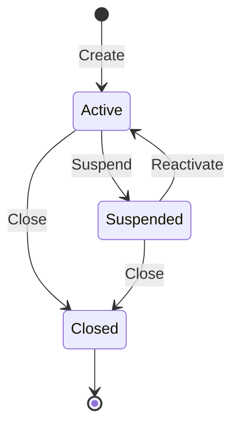

## Overview

PORTFLIO is a COBOL copybook that defines the standard record layout for portfolio master file records. It provides a comprehensive structure for storing portfolio information including:

- **Key fields** - Portfolio ID and account number for unique identification
- **Client information** - Client name and type classification
- **Portfolio details** - Creation date, maintenance date, and status
- **Financial data** - Total portfolio value and cash balance
- **Audit trail** - Last user and transaction tracking

This copybook is used by all programs that need to read, write, or manipulate portfolio master records, ensuring consistent data representation across the application.

## Record Layout

### PORT-RECORD Structure

```
+------------------+------------------+------------------+
|     PORT-KEY     | PORT-CLIENT-INFO |PORT-PORTFOLIO-   |
|    (18 bytes)    |   (31 bytes)     |INFO (17 bytes)   |
+------------------+------------------+------------------+
|PORT-FINANCIAL-   | PORT-AUDIT-INFO  |   PORT-FILLER    |
|INFO (16 bytes)   |   (16 bytes)     |   (50 bytes)     |
+------------------+------------------+------------------+
```

**Total Record Size**: 148 bytes

## Data Structures

### PORT-KEY (Primary Key)

| Level | Name | Picture | Size | Description |
|-------|------|---------|------|-------------|
| 05 | PORT-KEY | - | 18 | Composite primary key |
| 10 | PORT-ID | PIC X(8) | 8 | Portfolio identifier |
| 10 | PORT-ACCOUNT-NO | PIC X(10) | 10 | Associated account number |

**Key Format**: The composite key uniquely identifies each portfolio record. Example: `PORT0001` + `1234567890`

### PORT-CLIENT-INFO (Client Details)

| Level | Name | Picture | Size | Description |
|-------|------|---------|------|-------------|
| 05 | PORT-CLIENT-INFO | - | 31 | Client information group |
| 10 | PORT-CLIENT-NAME | PIC X(30) | 30 | Client's full name |
| 10 | PORT-CLIENT-TYPE | PIC X(1) | 1 | Client classification code |

#### Client Type Codes (88-levels)

| Condition | Value | Description |
|-----------|-------|-------------|
| PORT-INDIVIDUAL | 'I' | Individual/retail client |
| PORT-CORPORATE | 'C' | Corporate/business client |
| PORT-TRUST | 'T' | Trust account |

### PORT-PORTFOLIO-INFO (Portfolio Details)

| Level | Name | Picture | Size | Description |
|-------|------|---------|------|-------------|
| 05 | PORT-PORTFOLIO-INFO | - | 17 | Portfolio information group |
| 10 | PORT-CREATE-DATE | PIC 9(8) | 8 | Creation date (YYYYMMDD) |
| 10 | PORT-LAST-MAINT | PIC 9(8) | 8 | Last maintenance date (YYYYMMDD) |
| 10 | PORT-STATUS | PIC X(1) | 1 | Portfolio status code |

#### Status Codes (88-levels)

| Condition | Value | Description |
|-----------|-------|-------------|
| PORT-ACTIVE | 'A' | Active portfolio - available for transactions |
| PORT-CLOSED | 'C' | Closed portfolio - no longer active |
| PORT-SUSPENDED | 'S' | Suspended portfolio - temporarily inactive |

### PORT-FINANCIAL-INFO (Financial Data)

| Level | Name | Picture | Size | Description |
|-------|------|---------|------|-------------|
| 05 | PORT-FINANCIAL-INFO | - | 16 | Financial information group |
| 10 | PORT-TOTAL-VALUE | PIC S9(13)V99 COMP-3 | 8 | Total portfolio market value |
| 10 | PORT-CASH-BALANCE | PIC S9(13)V99 COMP-3 | 8 | Available cash balance |

#### Packed Decimal (COMP-3) Fields

Both financial fields use COMP-3 (packed decimal) format:
- **Range**: -9,999,999,999,999.99 to +9,999,999,999,999.99
- **Precision**: 2 decimal places
- **Storage**: 8 bytes each (15 digits + sign packed)

### PORT-AUDIT-INFO (Audit Trail)

| Level | Name | Picture | Size | Description |
|-------|------|---------|------|-------------|
| 05 | PORT-AUDIT-INFO | - | 16 | Audit information group |
| 10 | PORT-LAST-USER | PIC X(8) | 8 | User ID of last update |
| 10 | PORT-LAST-TRANS | PIC 9(8) | 8 | Last transaction date (YYYYMMDD) |

### PORT-FILLER (Reserved)

| Level | Name | Picture | Size | Description |
|-------|------|---------|------|-------------|
| 05 | PORT-FILLER | PIC X(50) | 50 | Reserved for future expansion |

## Field Summary Table

| Field | Offset | Size | Type | Description |
|-------|--------|------|------|-------------|
| PORT-ID | 0 | 8 | Alpha | Portfolio ID |
| PORT-ACCOUNT-NO | 8 | 10 | Alpha | Account number |
| PORT-CLIENT-NAME | 18 | 30 | Alpha | Client name |
| PORT-CLIENT-TYPE | 48 | 1 | Alpha | Client type (I/C/T) |
| PORT-CREATE-DATE | 49 | 8 | Numeric | Creation date |
| PORT-LAST-MAINT | 57 | 8 | Numeric | Last maintenance date |
| PORT-STATUS | 65 | 1 | Alpha | Status (A/C/S) |
| PORT-TOTAL-VALUE | 66 | 8 | Packed | Total value |
| PORT-CASH-BALANCE | 74 | 8 | Packed | Cash balance |
| PORT-LAST-USER | 82 | 8 | Alpha | Last user ID |
| PORT-LAST-TRANS | 90 | 8 | Numeric | Last transaction date |
| PORT-FILLER | 98 | 50 | Alpha | Reserved |

## Usage Examples

### Reading a Portfolio Record

```cobol
WORKING-STORAGE SECTION.
    COPY PORTFLIO.

PROCEDURE DIVISION.
    MOVE 'PORT0001' TO PORT-ID
    MOVE '1234567890' TO PORT-ACCOUNT-NO
    
    READ PORTFOLIO-FILE INTO PORT-RECORD
        KEY IS PORT-KEY
        INVALID KEY
            DISPLAY 'Portfolio not found'
        NOT INVALID KEY
            DISPLAY 'Client: ' PORT-CLIENT-NAME
            DISPLAY 'Value: ' PORT-TOTAL-VALUE
    END-READ
```

### Creating a New Portfolio

```cobol
WORKING-STORAGE SECTION.
    COPY PORTFLIO.

PROCEDURE DIVISION.
    INITIALIZE PORT-RECORD
    
    MOVE 'PORT0002' TO PORT-ID
    MOVE '9876543210' TO PORT-ACCOUNT-NO
    MOVE 'SMITH, JOHN Q' TO PORT-CLIENT-NAME
    MOVE 'I' TO PORT-CLIENT-TYPE
    MOVE 20240320 TO PORT-CREATE-DATE
    MOVE 20240320 TO PORT-LAST-MAINT
    SET PORT-ACTIVE TO TRUE
    MOVE 0 TO PORT-TOTAL-VALUE
    MOVE 10000.00 TO PORT-CASH-BALANCE
    MOVE 'ADMIN01' TO PORT-LAST-USER
    MOVE 20240320 TO PORT-LAST-TRANS
    
    WRITE PORT-RECORD
```

### Checking Portfolio Status

```cobol
EVALUATE TRUE
    WHEN PORT-ACTIVE
        PERFORM 1000-PROCESS-ACTIVE-PORTFOLIO
    WHEN PORT-SUSPENDED
        DISPLAY 'Portfolio is suspended - no transactions allowed'
    WHEN PORT-CLOSED
        DISPLAY 'Portfolio is closed'
    WHEN OTHER
        DISPLAY 'Unknown portfolio status: ' PORT-STATUS
END-EVALUATE
```

### Checking Client Type

```cobol
EVALUATE TRUE
    WHEN PORT-INDIVIDUAL
        PERFORM 2000-INDIVIDUAL-PROCESSING
    WHEN PORT-CORPORATE
        PERFORM 2100-CORPORATE-PROCESSING
    WHEN PORT-TRUST
        PERFORM 2200-TRUST-PROCESSING
END-EVALUATE
```

## Programs Using This Copybook

| Program | Description |
|---------|-------------|
| PORTADD | Add new portfolio records |
| PORTDEL | Delete portfolio records |
| PORTREAD | Read/retrieve portfolio records |
| PORTTEST | Portfolio testing program |
| PORTUPDT | Update existing portfolio records |
| TSTGEN00 | Test data generation utility |

## File Definition

Programs using this copybook typically define the portfolio file as:

```cobol
INPUT-OUTPUT SECTION.
FILE-CONTROL.
    SELECT PORTFOLIO-FILE
        ASSIGN TO PORTFILE
        ORGANIZATION IS INDEXED
        ACCESS MODE IS DYNAMIC
        RECORD KEY IS PORT-KEY
        FILE STATUS IS WS-PORT-STATUS.

FILE SECTION.
FD  PORTFOLIO-FILE
    RECORD CONTAINS 148 CHARACTERS.
    COPY PORTFLIO.
```

## Technical Notes

### Record Size Calculation

| Section | Size |
|---------|------|
| PORT-KEY | 18 bytes |
| PORT-CLIENT-INFO | 31 bytes |
| PORT-PORTFOLIO-INFO | 17 bytes |
| PORT-FINANCIAL-INFO | 16 bytes |
| PORT-AUDIT-INFO | 16 bytes |
| PORT-FILLER | 50 bytes |
| **Total** | **148 bytes** |

### COMP-3 Storage

The financial fields use COMP-3 (packed decimal) format which stores two digits per byte plus a sign nibble:
- PIC S9(13)V99 = 15 digits + sign
- Storage = (15 + 1) / 2 = 8 bytes

### Date Format

All date fields use YYYYMMDD format (8 numeric digits):
- Enables proper sorting
- Y2K compliant
- Easy date arithmetic

### Filler Space

The 50-byte PORT-FILLER provides:
- Room for future field additions
- Backward compatibility when new fields are added
- Padding to maintain consistent record size

### Key Design

The composite key (PORT-ID + PORT-ACCOUNT-NO) allows:
- Multiple portfolios per account
- Unique portfolio identification
- Efficient VSAM KSDS access

### Status Transitions



Valid status transitions:
- New portfolios start as Active ('A')
- Active portfolios can be Suspended ('S') or Closed ('C')
- Suspended portfolios can be reactivated to Active or Closed
- Closed is a terminal state (no transitions out)
