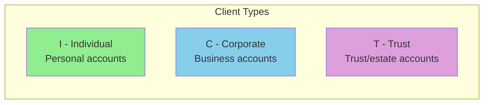
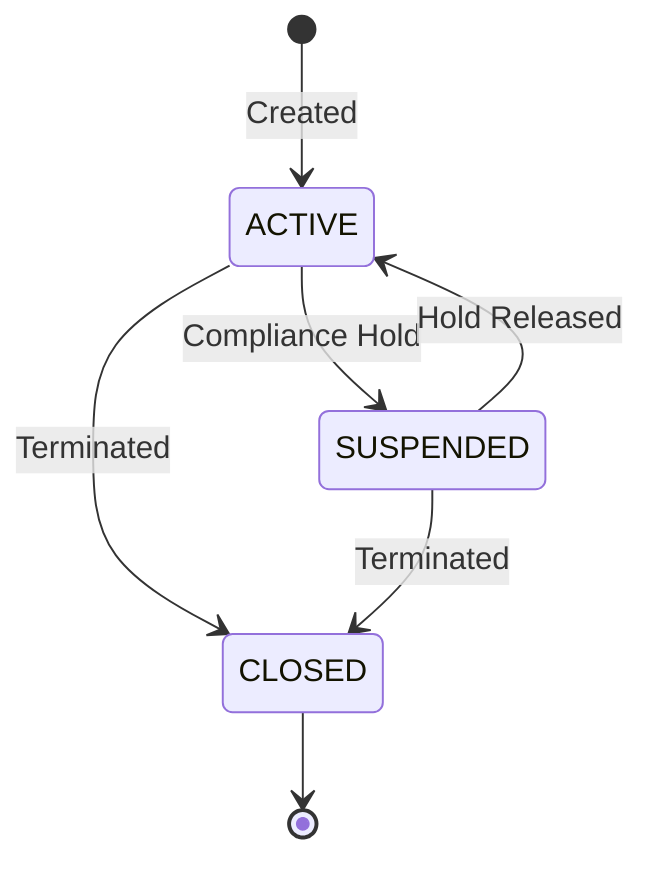

## Overview

PORTFLIO is the master record layout copybook for portfolio accounts in the investment management system. It defines the complete structure for storing and managing portfolio information including client details, account status, financial balances, and audit trail data.

This copybook is fundamental to the portfolio management subsystem and is used by all programs that create, read, update, or delete portfolio records. The record layout supports both VSAM file storage and can be adapted for DB2 table definitions.

## Record Layout

```
01  PORT-RECORD                          (Total: ~137 bytes)
    05  PORT-KEY                         (18 bytes)
        10  PORT-ID                      Portfolio identifier
        10  PORT-ACCOUNT-NO              Account number
    05  PORT-CLIENT-INFO                 (31 bytes)
        10  PORT-CLIENT-NAME             Client name
        10  PORT-CLIENT-TYPE             Client type (I/C/T)
    05  PORT-PORTFOLIO-INFO              (17 bytes)
        10  PORT-CREATE-DATE             Creation date
        10  PORT-LAST-MAINT              Last maintenance date
        10  PORT-STATUS                  Portfolio status (A/C/S)
    05  PORT-FINANCIAL-INFO              (16 bytes)
        10  PORT-TOTAL-VALUE             Total portfolio value
        10  PORT-CASH-BALANCE            Available cash
    05  PORT-AUDIT-INFO                  (16 bytes)
        10  PORT-LAST-USER               Last user to modify
        10  PORT-LAST-TRANS              Last transaction date
    05  PORT-FILLER                      (50 bytes) Reserved
```

## Field Definitions

### PORT-KEY - Primary Key Fields

The composite primary key uniquely identifies each portfolio record.

| Field | Picture | Length | Description |
|-------|---------|--------|-------------|
| PORT-ID | X(8) | 8 | Unique portfolio identifier |
| PORT-ACCOUNT-NO | X(10) | 10 | Associated account number |

**Key Format Example:** `PORT0001` + `ACCT000001` = unique portfolio

### PORT-CLIENT-INFO - Client Information

Client identification and classification data.

| Field | Picture | Length | Description |
|-------|---------|--------|-------------|
| PORT-CLIENT-NAME | X(30) | 30 | Client's full name |
| PORT-CLIENT-TYPE | X(1) | 1 | Client classification code |

#### PORT-CLIENT-TYPE Condition Names (88-levels)

| Condition | Value | Description |
|-----------|-------|-------------|
| PORT-INDIVIDUAL | 'I' | Individual/personal account |
| PORT-CORPORATE | 'C' | Corporate/business account |
| PORT-TRUST | 'T' | Trust account |



### PORT-PORTFOLIO-INFO - Portfolio Status Information

Status and date tracking for the portfolio.

| Field | Picture | Length | Description |
|-------|---------|--------|-------------|
| PORT-CREATE-DATE | 9(8) | 8 | Creation date (YYYYMMDD) |
| PORT-LAST-MAINT | 9(8) | 8 | Last maintenance date (YYYYMMDD) |
| PORT-STATUS | X(1) | 1 | Current portfolio status |

#### PORT-STATUS Condition Names (88-levels)

| Condition | Value | Description |
|-----------|-------|-------------|
| PORT-ACTIVE | 'A' | Portfolio is active and can be traded |
| PORT-CLOSED | 'C' | Portfolio is closed (no trading allowed) |
| PORT-SUSPENDED | 'S' | Portfolio is temporarily suspended |



### PORT-FINANCIAL-INFO - Financial Data

Monetary values for portfolio valuation.

| Field | Picture | Length | Description |
|-------|---------|--------|-------------|
| PORT-TOTAL-VALUE | S9(13)V99 COMP-3 | 8 | Total portfolio market value |
| PORT-CASH-BALANCE | S9(13)V99 COMP-3 | 8 | Available cash balance |

**Value Range:** -9,999,999,999,999.99 to +9,999,999,999,999.99

**Storage:** COMP-3 (Packed Decimal) for efficient storage and decimal arithmetic.

### PORT-AUDIT-INFO - Audit Trail

Tracking information for compliance and audit purposes.

| Field | Picture | Length | Description |
|-------|---------|--------|-------------|
| PORT-LAST-USER | X(8) | 8 | User ID of last modifier |
| PORT-LAST-TRANS | 9(8) | 8 | Date of last transaction (YYYYMMDD) |

### PORT-FILLER - Reserved Space

| Field | Picture | Length | Description |
|-------|---------|--------|-------------|
| PORT-FILLER | X(50) | 50 | Reserved for future expansion |

## Record Size Calculation

| Section | Size (bytes) |
|---------|--------------|
| PORT-KEY | 18 |
| PORT-CLIENT-INFO | 31 |
| PORT-PORTFOLIO-INFO | 17 |
| PORT-FINANCIAL-INFO | 16 |
| PORT-AUDIT-INFO | 16 |
| PORT-FILLER | 50 |
| **Total** | **~148 bytes** |

**Note:** COMP-3 fields use `(n+1)/2` bytes rounded up. S9(13)V99 = 15 digits + sign = 8 bytes each.

## Usage Examples

### Creating a New Portfolio

```cobol
WORKING-STORAGE SECTION.
    COPY PORTFLIO.
    
01  WS-CURRENT-DATE    PIC 9(8).

PROCEDURE DIVISION.
    INITIALIZE PORT-RECORD
    
*   Set key fields
    MOVE 'PORT0001' TO PORT-ID
    MOVE 'ACCT000001' TO PORT-ACCOUNT-NO
    
*   Set client information
    MOVE 'SMITH, JOHN' TO PORT-CLIENT-NAME
    SET PORT-INDIVIDUAL TO TRUE
    
*   Set portfolio info
    ACCEPT WS-CURRENT-DATE FROM DATE YYYYMMDD
    MOVE WS-CURRENT-DATE TO PORT-CREATE-DATE
    MOVE WS-CURRENT-DATE TO PORT-LAST-MAINT
    SET PORT-ACTIVE TO TRUE
    
*   Initialize financial fields
    MOVE ZEROS TO PORT-TOTAL-VALUE
    MOVE ZEROS TO PORT-CASH-BALANCE
    
*   Set audit fields
    MOVE 'NEWUSER' TO PORT-LAST-USER
    MOVE WS-CURRENT-DATE TO PORT-LAST-TRANS
    
    WRITE PORT-RECORD
```

### Reading and Validating a Portfolio

```cobol
*   Read portfolio record
    MOVE 'PORT0001' TO PORT-ID
    MOVE 'ACCT000001' TO PORT-ACCOUNT-NO
    
    READ PORTFOLIO-FILE
        INVALID KEY
            DISPLAY 'Portfolio not found'
            PERFORM ERROR-ROUTINE
    END-READ
    
*   Validate status for trading
    IF NOT PORT-ACTIVE
        EVALUATE TRUE
            WHEN PORT-CLOSED
                MOVE 'Portfolio is closed' TO WS-ERROR-MSG
            WHEN PORT-SUSPENDED
                MOVE 'Portfolio is suspended' TO WS-ERROR-MSG
        END-EVALUATE
        PERFORM REJECT-TRANSACTION
    END-IF
```

### Updating Financial Balances

```cobol
*   Update after a buy transaction
    ADD TXN-AMOUNT TO PORT-TOTAL-VALUE
    SUBTRACT TXN-AMOUNT FROM PORT-CASH-BALANCE
    
*   Update audit trail
    ACCEPT WS-CURRENT-DATE FROM DATE YYYYMMDD
    MOVE WS-CURRENT-DATE TO PORT-LAST-MAINT
    MOVE WS-CURRENT-DATE TO PORT-LAST-TRANS
    MOVE WS-USER-ID TO PORT-LAST-USER
    
    REWRITE PORT-RECORD
        INVALID KEY
            PERFORM REWRITE-ERROR
    END-REWRITE
```

### Validating Client Type

```cobol
*   Apply business rules based on client type
    EVALUATE TRUE
        WHEN PORT-INDIVIDUAL
            PERFORM APPLY-INDIVIDUAL-RULES
            MOVE 'RETAIL' TO WS-FEE-SCHEDULE
        WHEN PORT-CORPORATE
            PERFORM APPLY-CORPORATE-RULES
            MOVE 'INSTIT' TO WS-FEE-SCHEDULE
        WHEN PORT-TRUST
            PERFORM APPLY-TRUST-RULES
            MOVE 'TRUST' TO WS-FEE-SCHEDULE
        WHEN OTHER
            MOVE 'Invalid client type' TO WS-ERROR-MSG
            PERFORM ERROR-ROUTINE
    END-EVALUATE
```

## Programs Using This Copybook

| Program | Description | Operations |
|---------|-------------|------------|
| [PORTADD](/docs/programs/PORTADD) | Portfolio Addition | CREATE |
| [PORTDEL](/docs/programs/PORTDEL) | Portfolio Deletion | DELETE |
| [PORTREAD](/docs/programs/PORTREAD) | Portfolio Inquiry | READ |
| [PORTTEST](/docs/programs/PORTTEST) | Portfolio Testing | ALL |
| [PORTUPDT](/docs/programs/PORTUPDT) | Portfolio Update | UPDATE |
| [TSTGEN00](/docs/programs/TSTGEN00) | Test Data Generator | CREATE |

## Related Copybooks

| Copybook | Relationship |
|----------|--------------|
| [TRNREC](/docs/copybooks/TRNREC) | Transaction records that reference portfolios via TRN-PORTFOLIO-ID |
| [POSREC](/docs/copybooks/POSREC) | Position records linked by portfolio ID |
| [AUDITLOG](/docs/copybooks/AUDITLOG) | Detailed audit logging for portfolio changes |

## VSAM File Definition

Typical VSAM KSDS definition for the portfolio master file:

```jcl
//DEFPORT  EXEC PGM=IDCAMS
//SYSPRINT DD SYSOUT=*
//SYSIN    DD *
  DEFINE CLUSTER (NAME(your.portfolio.master) -
         INDEXED -
         KEYS(18 0) -
         RECORDSIZE(148 148) -
         SHAREOPTIONS(2 3) -
         CYLINDERS(10 5)) -
         DATA (NAME(your.portfolio.master.data)) -
         INDEX (NAME(your.portfolio.master.index))
/*
```

**Key Parameters:**
- KEYS(18 0) - 18-byte key starting at position 0 (PORT-KEY)
- RECORDSIZE(148 148) - Fixed-length records

## DB2 Table Equivalent

```sql
CREATE TABLE PORTFOLIO (
    PORT_ID          CHAR(8)        NOT NULL,
    PORT_ACCOUNT_NO  CHAR(10)       NOT NULL,
    PORT_CLIENT_NAME VARCHAR(30),
    PORT_CLIENT_TYPE CHAR(1),
    PORT_CREATE_DATE DATE,
    PORT_LAST_MAINT  DATE,
    PORT_STATUS      CHAR(1),
    PORT_TOTAL_VALUE DECIMAL(15,2),
    PORT_CASH_BALANCE DECIMAL(15,2),
    PORT_LAST_USER   CHAR(8),
    PORT_LAST_TRANS  DATE,
    PRIMARY KEY (PORT_ID, PORT_ACCOUNT_NO)
);

-- Status check constraint
ALTER TABLE PORTFOLIO ADD CONSTRAINT CHK_STATUS
    CHECK (PORT_STATUS IN ('A', 'C', 'S'));

-- Client type check constraint  
ALTER TABLE PORTFOLIO ADD CONSTRAINT CHK_CLIENT_TYPE
    CHECK (PORT_CLIENT_TYPE IN ('I', 'C', 'T'));
```

## Technical Notes

### COMP-3 (Packed Decimal) Storage

The financial fields use COMP-3 format:

```
PIC S9(13)V99 COMP-3
    |  |    |    |
    |  |    |    +-- Packed decimal format
    |  |    +------- 2 decimal places (implied)
    |  +------------ 13 digits before decimal
    +--------------- Signed (positive/negative)

Storage: (15 digits + 1 sign nibble) / 2 = 8 bytes
```

**Benefits:**
- Efficient storage (8 bytes vs 15 bytes for DISPLAY)
- Precise decimal arithmetic
- Industry standard for financial applications

### Date Fields

Date fields use `PIC 9(8)` format (YYYYMMDD):
- PORT-CREATE-DATE: When portfolio was created
- PORT-LAST-MAINT: Last modification date
- PORT-LAST-TRANS: Last transaction date

**Validation Example:**
```cobol
IF PORT-CREATE-DATE NOT NUMERIC
   OR PORT-CREATE-DATE < 19000101
   OR PORT-CREATE-DATE > 21001231
    MOVE 'Invalid create date' TO WS-ERROR-MSG
    PERFORM ERROR-ROUTINE
END-IF
```

### Filler Field

The 50-byte PORT-FILLER provides:
- Space for future field additions
- Record alignment
- Backward compatibility when expanding the record

## Validation Rules

| Field | Rule | Error Action |
|-------|------|--------------|
| PORT-ID | Must not be spaces | Reject record |
| PORT-ACCOUNT-NO | Must not be spaces | Reject record |
| PORT-CLIENT-NAME | Must not be spaces | Reject record |
| PORT-CLIENT-TYPE | Must be I, C, or T | Reject record |
| PORT-STATUS | Must be A, C, or S | Reject record |
| PORT-CREATE-DATE | Valid date YYYYMMDD | Reject record |
| PORT-TOTAL-VALUE | Numeric | Set to zero |
| PORT-CASH-BALANCE | Numeric | Set to zero |

## Business Rules

1. **New portfolios** must be created with PORT-ACTIVE status
2. **Suspended portfolios** cannot process new transactions
3. **Closed portfolios** are read-only (no modifications allowed)
4. **Individual accounts** have different fee structures than corporate
5. **Trust accounts** require special compliance handling
6. **Cash balance** cannot exceed total portfolio value (logical check)
7. **Audit fields** must be updated on every modification
