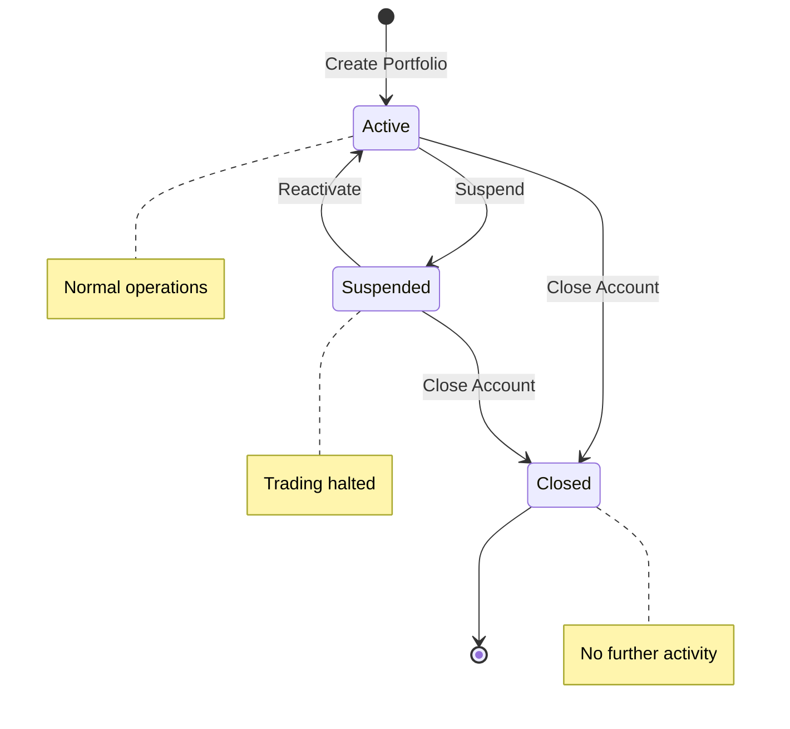
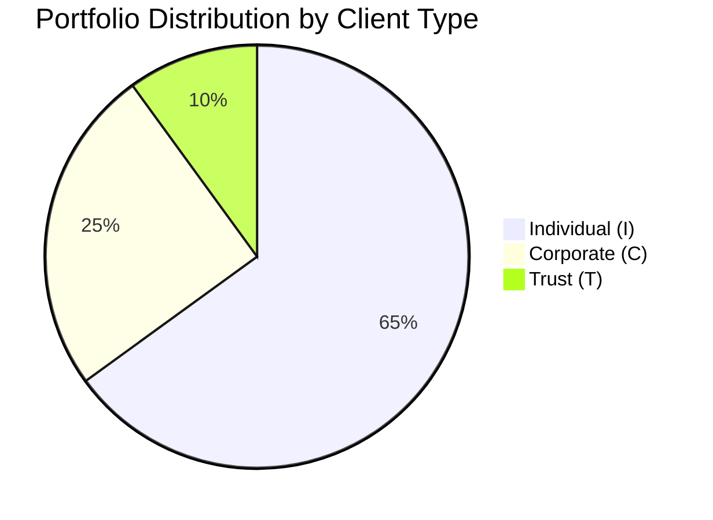
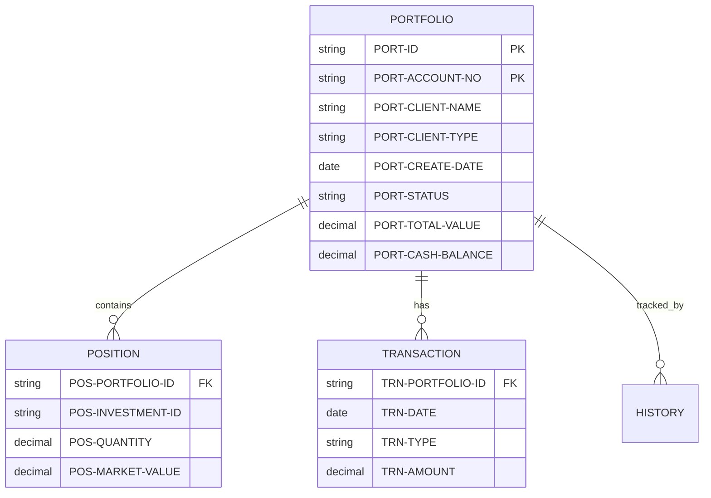

## Overview

PORTFLIO is a copybook that defines the Portfolio Master Record layout used throughout the portfolio management system. It provides a comprehensive structure for storing client portfolio information including identification, client details, portfolio status, financial balances, and audit information.

The copybook serves as the primary data structure for the portfolio master file, which is typically implemented as a VSAM KSDS (Key-Sequenced Data Set) with a composite key of portfolio ID and account number. This record structure is used by multiple programs for portfolio creation, updates, inquiries, and reporting.

This is one of the most widely-used copybooks in the system, shared across batch programs (PORTADD, PORTDEL, PORTUPDT), testing utilities (PORTTEST, TSTGEN00), and read operations (PORTREAD).

## Record Layout

```
+------------------------------------------------------------------+
| PORT-RECORD                                                       |
+------------------------------------------------------------------+
| PORT-KEY (18)      | PORT-CLIENT-INFO (31) | PORT-PORTFOLIO-INFO  |
|                    |                       |        (17)          |
+--------------------+-----------------------+----------------------+
| ID   | Account No  | Client Name | Type    | Create | Maint | Sta |
| (8)  |    (10)     |    (30)     |  (1)    |  (8)   |  (8)  | (1) |
+------------------------------------------------------------------+
| PORT-FINANCIAL-INFO (16) | PORT-AUDIT-INFO (16) | PORT-FILLER    |
|                          |                      |     (50)       |
+--------------------------+----------------------+----------------+
| Total Value | Cash Bal   | Last User | Last Trn | Reserved       |
|    (8)      |    (8)     |    (8)    |   (8)    |    (50)        |
+------------------------------------------------------------------+
```

**Total Record Length: 148 bytes**

## Data Structure

### PORT-RECORD (01 Level)

| Level | Name | Picture | Bytes | Description |
|-------|------|---------|-------|-------------|
| 01 | PORT-RECORD | | 148 | Complete portfolio master record |

### PORT-KEY (Composite Record Key)

| Level | Name | Picture | Bytes | Description |
|-------|------|---------|-------|-------------|
| 05 | PORT-KEY | | 18 | Composite primary key |
| 10 | PORT-ID | X(8) | 8 | Portfolio identifier |
| 10 | PORT-ACCOUNT-NO | X(10) | 10 | Account number |

### PORT-CLIENT-INFO (Client Information)

| Level | Name | Picture | Bytes | Description |
|-------|------|---------|-------|-------------|
| 05 | PORT-CLIENT-INFO | | 31 | Client information group |
| 10 | PORT-CLIENT-NAME | X(30) | 30 | Client/account holder name |
| 10 | PORT-CLIENT-TYPE | X(1) | 1 | Client classification type |

**Client Type Values (88-level conditions):**

| Value | Condition Name | Description |
|-------|----------------|-------------|
| `I` | PORT-INDIVIDUAL | Individual investor account |
| `C` | PORT-CORPORATE | Corporate/business account |
| `T` | PORT-TRUST | Trust or fiduciary account |

### PORT-PORTFOLIO-INFO (Portfolio Status)

| Level | Name | Picture | Bytes | Description |
|-------|------|---------|-------|-------------|
| 05 | PORT-PORTFOLIO-INFO | | 17 | Portfolio status information |
| 10 | PORT-CREATE-DATE | 9(8) | 8 | Creation date (YYYYMMDD) |
| 10 | PORT-LAST-MAINT | 9(8) | 8 | Last maintenance date (YYYYMMDD) |
| 10 | PORT-STATUS | X(1) | 1 | Current portfolio status |

**Status Values (88-level conditions):**

| Value | Condition Name | Description |
|-------|----------------|-------------|
| `A` | PORT-ACTIVE | Portfolio is active and operational |
| `C` | PORT-CLOSED | Portfolio has been closed |
| `S` | PORT-SUSPENDED | Portfolio is temporarily suspended |

### PORT-FINANCIAL-INFO (Financial Data)

| Level | Name | Picture | Bytes | Description |
|-------|------|---------|-------|-------------|
| 05 | PORT-FINANCIAL-INFO | | 16 | Financial information group |
| 10 | PORT-TOTAL-VALUE | S9(13)V99 COMP-3 | 8 | Total portfolio market value |
| 10 | PORT-CASH-BALANCE | S9(13)V99 COMP-3 | 8 | Available cash balance |

### PORT-AUDIT-INFO (Audit Trail)

| Level | Name | Picture | Bytes | Description |
|-------|------|---------|-------|-------------|
| 05 | PORT-AUDIT-INFO | | 16 | Audit trail information |
| 10 | PORT-LAST-USER | X(8) | 8 | User ID of last modifier |
| 10 | PORT-LAST-TRANS | 9(8) | 8 | Date of last transaction (YYYYMMDD) |

### PORT-FILLER

| Level | Name | Picture | Bytes | Description |
|-------|------|---------|-------|-------------|
| 05 | PORT-FILLER | X(50) | 50 | Reserved for future use |

## Portfolio Status Flow



## Client Type Classification



| Type | Typical Characteristics |
|------|------------------------|
| Individual | Personal investment accounts, IRAs, brokerage accounts |
| Corporate | Business accounts, pension funds, corporate treasuries |
| Trust | Estate planning, charitable trusts, custodial accounts |

## Usage Patterns

### Creating a New Portfolio

```cobol
INITIALIZE PORT-RECORD

MOVE 'PORT0001'       TO PORT-ID
MOVE 'ACCT000001'     TO PORT-ACCOUNT-NO
MOVE 'JOHN DOE'       TO PORT-CLIENT-NAME
SET PORT-INDIVIDUAL   TO TRUE
ACCEPT WS-CURRENT-DATE FROM DATE YYYYMMDD
MOVE WS-CURRENT-DATE  TO PORT-CREATE-DATE
MOVE WS-CURRENT-DATE  TO PORT-LAST-MAINT
SET PORT-ACTIVE       TO TRUE
MOVE ZEROS            TO PORT-TOTAL-VALUE
MOVE ZEROS            TO PORT-CASH-BALANCE
MOVE WS-USER-ID       TO PORT-LAST-USER
MOVE WS-CURRENT-DATE  TO PORT-LAST-TRANS

WRITE PORT-RECORD
```

### Reading a Portfolio

```cobol
MOVE 'PORT0001'       TO PORT-ID
MOVE 'ACCT000001'     TO PORT-ACCOUNT-NO

READ PORTFOLIO-FILE INTO PORT-RECORD
    INVALID KEY
        DISPLAY 'Portfolio not found'
END-READ

IF PORT-ACTIVE
    PERFORM PROCESS-ACTIVE-PORTFOLIO
END-IF
```

### Updating Portfolio Financial Data

```cobol
READ PORTFOLIO-FILE INTO PORT-RECORD

ADD WS-TRANSACTION-AMT TO PORT-TOTAL-VALUE
SUBTRACT WS-CASH-USED  FROM PORT-CASH-BALANCE

ACCEPT WS-CURRENT-DATE FROM DATE YYYYMMDD
MOVE WS-CURRENT-DATE   TO PORT-LAST-MAINT
MOVE WS-CURRENT-DATE   TO PORT-LAST-TRANS
MOVE WS-USER-ID        TO PORT-LAST-USER

REWRITE PORT-RECORD
    INVALID KEY
        PERFORM HANDLE-REWRITE-ERROR
END-REWRITE
```

### Closing a Portfolio

```cobol
READ PORTFOLIO-FILE INTO PORT-RECORD

IF PORT-TOTAL-VALUE NOT = ZEROS
    DISPLAY 'Cannot close - balance remaining'
ELSE
    SET PORT-CLOSED    TO TRUE
    ACCEPT WS-CURRENT-DATE FROM DATE YYYYMMDD
    MOVE WS-CURRENT-DATE TO PORT-LAST-MAINT
    MOVE WS-USER-ID      TO PORT-LAST-USER
    
    REWRITE PORT-RECORD
END-IF
```

### Validating Portfolio Data

```cobol
* Validate required fields
IF PORT-ID = SPACES
    MOVE 'Portfolio ID is required' TO WS-ERROR-MSG
    SET VALIDATION-FAILED TO TRUE
END-IF

IF PORT-CLIENT-NAME = SPACES
    MOVE 'Client name is required' TO WS-ERROR-MSG
    SET VALIDATION-FAILED TO TRUE
END-IF

* Validate status for new records
IF PORT-STATUS NOT = 'A'
    MOVE 'New portfolios must be Active' TO WS-ERROR-MSG
    SET VALIDATION-FAILED TO TRUE
END-IF

* Validate client type
EVALUATE PORT-CLIENT-TYPE
    WHEN 'I'
    WHEN 'C'
    WHEN 'T'
        CONTINUE
    WHEN OTHER
        MOVE 'Invalid client type' TO WS-ERROR-MSG
        SET VALIDATION-FAILED TO TRUE
END-EVALUATE
```

## File Definition Example

```cobol
INPUT-OUTPUT SECTION.
FILE-CONTROL.
    SELECT PORTFOLIO-FILE
        ASSIGN TO PORTFILE
        ORGANIZATION IS INDEXED
        ACCESS MODE IS DYNAMIC
        RECORD KEY IS PORT-KEY
        FILE STATUS IS WS-PORT-STATUS.

DATA DIVISION.
FILE SECTION.
FD  PORTFOLIO-FILE.
    COPY PORTFLIO.
```

## DB2 Table Mapping

```sql
CREATE TABLE PORTFOLIO (
    PORTFOLIO_ID     CHAR(8)       NOT NULL,
    ACCOUNT_NO       CHAR(10)      NOT NULL,
    CLIENT_NAME      VARCHAR(30)   NOT NULL,
    CLIENT_TYPE      CHAR(1)       NOT NULL,
    CREATE_DATE      DATE          NOT NULL,
    LAST_MAINT_DATE  DATE          NOT NULL,
    STATUS           CHAR(1)       NOT NULL,
    TOTAL_VALUE      DECIMAL(15,2) NOT NULL DEFAULT 0,
    CASH_BALANCE     DECIMAL(15,2) NOT NULL DEFAULT 0,
    LAST_USER        CHAR(8),
    LAST_TRANS_DATE  DATE,
    PRIMARY KEY (PORTFOLIO_ID, ACCOUNT_NO)
);

CREATE INDEX PORT_CLIENT_IDX ON PORTFOLIO (CLIENT_NAME);
CREATE INDEX PORT_STATUS_IDX ON PORTFOLIO (STATUS, LAST_MAINT_DATE);
```

## Programs Using This Copybook

| Program | Description | Operations |
|---------|-------------|------------|
| PORTADD | Portfolio Addition | Creates new portfolio records |
| PORTDEL | Portfolio Deletion | Deletes portfolio records |
| PORTREAD | Portfolio Read | Reads and displays portfolios |
| PORTUPDT | Portfolio Update | Modifies existing portfolios |
| PORTTEST | Portfolio Testing | Tests portfolio operations |
| TSTGEN00 | Test Data Generator | Generates test portfolio data |

## Related Copybooks

| Copybook | Relationship |
|----------|-------------|
| POSREC | Position records linked to portfolios |
| TRNREC | Transaction records for portfolio activity |
| HISTREC | History records tracking portfolio changes |
| AUDITLOG | Audit trail for portfolio operations |

## Data Relationships



## Technical Notes

1. **Composite Key**: The 18-byte key (PORT-ID + PORT-ACCOUNT-NO) allows multiple accounts per portfolio ID, supporting complex account structures.

2. **COMP-3 Financial Fields**: PORT-TOTAL-VALUE and PORT-CASH-BALANCE use `S9(13)V99 COMP-3` (packed decimal), supporting values up to ±9,999,999,999,999.99 with 2 decimal places. Each field occupies 8 bytes.

3. **Date Format**: All date fields (PORT-CREATE-DATE, PORT-LAST-MAINT, PORT-LAST-TRANS) use `9(8)` format for YYYYMMDD, which is Y2K compliant and sortable.

4. **Status Validation**: Programs should validate PORT-STATUS against the defined 88-level conditions rather than using literal values, ensuring maintainability.

5. **PORT-FILLER**: The 50-byte filler provides room for future enhancements without changing the record length. Potential uses include:
   - Risk classification
   - Fee schedule code
   - Branch/advisor codes
   - Regulatory flags

6. **Active Status Requirement**: The PORTADD program enforces that new portfolios must have PORT-STATUS = 'A'. Closed or suspended status should only be set through updates.

7. **Financial Integrity**: When updating PORT-TOTAL-VALUE or PORT-CASH-BALANCE, programs should:
   - Read the record with locking (if supported)
   - Perform calculations
   - Update audit fields
   - Rewrite immediately

8. **Audit Trail**: PORT-LAST-USER and PORT-LAST-TRANS provide basic audit information. For complete audit trails, use the AUDITLOG or HISTREC structures in conjunction with this copybook.
