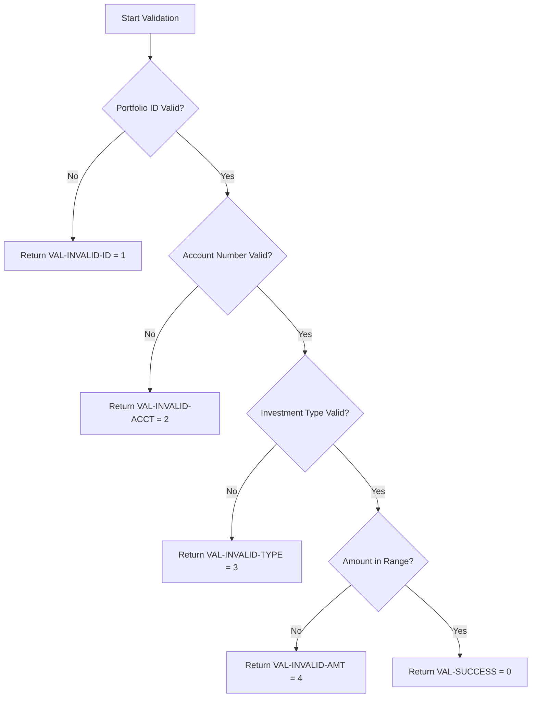

## Overview

PORTVAL is a copybook that defines validation rules, return codes, error messages, and constants for portfolio data validation. It provides a standardized framework for validating portfolio-related data throughout the system.

The copybook includes:
- **Return Codes** - Numeric codes indicating validation results
- **Error Messages** - Human-readable descriptions for each validation failure
- **Constants** - Boundary values and format requirements
- **Work Areas** - Temporary storage for validation processing

This centralized approach ensures consistent validation behavior and error messaging across all programs that handle portfolio data.

## Record Structure

```
PORTVAL Copybook Structure
==========================

VAL-RETURN-CODES          - Validation result codes
  +-- VAL-SUCCESS         - Code 0: Valid
  +-- VAL-INVALID-ID      - Code 1: Bad portfolio ID
  +-- VAL-INVALID-ACCT    - Code 2: Bad account number
  +-- VAL-INVALID-TYPE    - Code 3: Bad investment type
  +-- VAL-INVALID-AMT     - Code 4: Amount out of range

VAL-ERROR-MESSAGES        - Descriptive error texts
  +-- VAL-ERR-ID          - Portfolio ID error message
  +-- VAL-ERR-ACCT        - Account number error message
  +-- VAL-ERR-TYPE        - Investment type error message
  +-- VAL-ERR-AMT         - Amount range error message

VAL-CONSTANTS             - Validation boundaries
  +-- VAL-MIN-AMOUNT      - Minimum allowed amount
  +-- VAL-MAX-AMOUNT      - Maximum allowed amount
  +-- VAL-ID-PREFIX       - Required portfolio ID prefix

VAL-WORK-AREAS            - Processing work fields
  +-- VAL-NUMERIC-CHECK   - Numeric validation scratch
  +-- VAL-TEMP-NUM        - Temporary numeric field
  +-- VAL-ERROR-CODE      - Current error code
  +-- VAL-ERROR-MSG       - Current error message
```

## Field Definitions

### Validation Return Codes (VAL-RETURN-CODES)

| Field | Picture | Value | Description |
|-------|---------|-------|-------------|
| VAL-SUCCESS | S9(4) | +0 | Validation passed successfully |
| VAL-INVALID-ID | S9(4) | +1 | Portfolio ID format is invalid |
| VAL-INVALID-ACCT | S9(4) | +2 | Account number format is invalid |
| VAL-INVALID-TYPE | S9(4) | +3 | Investment type is not recognized |
| VAL-INVALID-AMT | S9(4) | +4 | Amount is outside valid range |

### Validation Error Messages (VAL-ERROR-MESSAGES)

| Field | Picture | Value | Description |
|-------|---------|-------|-------------|
| VAL-ERR-ID | X(50) | 'Invalid Portfolio ID format' | Error message for invalid portfolio ID |
| VAL-ERR-ACCT | X(50) | 'Invalid Account Number format' | Error message for invalid account number |
| VAL-ERR-TYPE | X(50) | 'Invalid Investment Type' | Error message for unrecognized type |
| VAL-ERR-AMT | X(50) | 'Amount outside valid range' | Error message for out-of-range amounts |

### Validation Constants (VAL-CONSTANTS)

| Field | Picture | Value | Description |
|-------|---------|-------|-------------|
| VAL-MIN-AMOUNT | S9(13)V99 | -9999999999999.99 | Minimum valid amount (negative limit) |
| VAL-MAX-AMOUNT | S9(13)V99 | +9999999999999.99 | Maximum valid amount (positive limit) |
| VAL-ID-PREFIX | X(4) | 'PORT' | Required prefix for portfolio IDs |

### Validation Work Areas (VAL-WORK-AREAS)

| Field | Picture | Description |
|-------|---------|-------------|
| VAL-NUMERIC-CHECK | X(10) | Work field for numeric validation tests |
| VAL-TEMP-NUM | S9(13)V99 | Temporary numeric field for calculations |
| VAL-ERROR-CODE | S9(4) | Holds current validation error code |
| VAL-ERROR-MSG | X(50) | Holds current validation error message |

## Usage Examples

### Validating a Portfolio ID

```cobol
PERFORM VALIDATE-PORTFOLIO-ID

VALIDATE-PORTFOLIO-ID.
    MOVE VAL-SUCCESS TO VAL-ERROR-CODE
    MOVE SPACES TO VAL-ERROR-MSG
    
    IF PORT-ID(1:4) NOT = VAL-ID-PREFIX
        MOVE VAL-INVALID-ID TO VAL-ERROR-CODE
        MOVE VAL-ERR-ID TO VAL-ERROR-MSG
    END-IF
    .
```

### Validating an Amount

```cobol
PERFORM VALIDATE-AMOUNT

VALIDATE-AMOUNT.
    MOVE VAL-SUCCESS TO VAL-ERROR-CODE
    MOVE SPACES TO VAL-ERROR-MSG
    
    IF WS-AMOUNT < VAL-MIN-AMOUNT OR
       WS-AMOUNT > VAL-MAX-AMOUNT
        MOVE VAL-INVALID-AMT TO VAL-ERROR-CODE
        MOVE VAL-ERR-AMT TO VAL-ERROR-MSG
    END-IF
    .
```

### Complete Validation Routine

```cobol
PERFORM VALIDATE-PORTFOLIO-DATA

VALIDATE-PORTFOLIO-DATA.
    MOVE VAL-SUCCESS TO VAL-ERROR-CODE
    MOVE SPACES TO VAL-ERROR-MSG
    
*   Validate Portfolio ID
    IF PORT-ID(1:4) NOT = VAL-ID-PREFIX
        MOVE VAL-INVALID-ID TO VAL-ERROR-CODE
        MOVE VAL-ERR-ID TO VAL-ERROR-MSG
        GO TO VALIDATE-PORTFOLIO-DATA-EXIT
    END-IF
    
*   Validate Account Number (must be numeric)
    MOVE PORT-ACCOUNT-NO TO VAL-NUMERIC-CHECK
    INSPECT VAL-NUMERIC-CHECK 
        REPLACING LEADING SPACES BY ZEROS
    IF VAL-NUMERIC-CHECK IS NOT NUMERIC
        MOVE VAL-INVALID-ACCT TO VAL-ERROR-CODE
        MOVE VAL-ERR-ACCT TO VAL-ERROR-MSG
        GO TO VALIDATE-PORTFOLIO-DATA-EXIT
    END-IF
    
*   Validate Amount Range
    IF PORT-TOTAL-VALUE < VAL-MIN-AMOUNT OR
       PORT-TOTAL-VALUE > VAL-MAX-AMOUNT
        MOVE VAL-INVALID-AMT TO VAL-ERROR-CODE
        MOVE VAL-ERR-AMT TO VAL-ERROR-MSG
        GO TO VALIDATE-PORTFOLIO-DATA-EXIT
    END-IF
    
VALIDATE-PORTFOLIO-DATA-EXIT.
    EXIT.
```

### Checking Validation Results

```cobol
PERFORM VALIDATE-PORTFOLIO-DATA

EVALUATE VAL-ERROR-CODE
    WHEN VAL-SUCCESS
        PERFORM PROCESS-VALID-PORTFOLIO
    WHEN VAL-INVALID-ID
        PERFORM HANDLE-ID-ERROR
    WHEN VAL-INVALID-ACCT
        PERFORM HANDLE-ACCOUNT-ERROR
    WHEN VAL-INVALID-TYPE
        PERFORM HANDLE-TYPE-ERROR
    WHEN VAL-INVALID-AMT
        PERFORM HANDLE-AMOUNT-ERROR
    WHEN OTHER
        PERFORM HANDLE-UNKNOWN-ERROR
END-EVALUATE
```

## Programs Using This Copybook

| Program | Description |
|---------|-------------|
| PORTVALD | Portfolio validation program - primary consumer of validation rules |

## Validation Rules Summary

### Portfolio ID Rules

| Rule | Requirement |
|------|-------------|
| Prefix | Must start with 'PORT' |
| Length | Typically 8 characters |
| Format | PREFIX + identifier |

### Account Number Rules

| Rule | Requirement |
|------|-------------|
| Type | Must be numeric |
| Length | Typically 10 digits |
| Leading zeros | Allowed |

### Amount Rules

| Rule | Value |
|------|-------|
| Minimum | -9,999,999,999,999.99 |
| Maximum | +9,999,999,999,999.99 |
| Precision | 2 decimal places |

## Return Code Usage



## Design Considerations

### Error Code Sequence

The return codes are sequenced to support priority-based error reporting:
- Lower numbers indicate earlier validation checks
- Programs can report the first error encountered
- Or accumulate all errors using a separate tracking mechanism

### Amount Range

The amount range (-9,999,999,999,999.99 to +9,999,999,999,999.99) supports:
- Large institutional portfolios
- Both positive (assets) and negative (liabilities) values
- 15-digit precision with 2 decimal places
- COMP-3 storage efficiency in related records

### Message Standardization

The 50-character error messages are:
- User-friendly and descriptive
- Suitable for display on screens or reports
- Consistent in length for formatted output
- Easily extendable by adding new messages

## Technical Notes

1. **S9(4) Return Codes**: The signed 4-digit format allows for future expansion of error codes while maintaining efficient storage.

2. **S9(13)V99 Amount Fields**: This picture supports values up to ±9,999,999,999,999.99, suitable for financial applications. The implied decimal (V) means no actual decimal point is stored.

3. **X(50) Message Fields**: Fixed-length messages simplify report formatting and screen display. Messages shorter than 50 characters are space-padded.

4. **Work Area Purpose**: The VAL-WORK-AREAS group provides scratch space for validation routines, avoiding the need for programs to define their own temporary fields.

5. **Validation Sequence**: The recommended validation order (ID → Account → Type → Amount) follows a logical flow from identification to business rules.

6. **Numeric Validation**: Use VAL-NUMERIC-CHECK with INSPECT and IS NUMERIC test to validate alphanumeric fields that should contain only digits.

7. **Extensibility**: New validation rules can be added by:
   - Adding new return codes to VAL-RETURN-CODES
   - Adding corresponding messages to VAL-ERROR-MESSAGES
   - Adding any new constants to VAL-CONSTANTS
