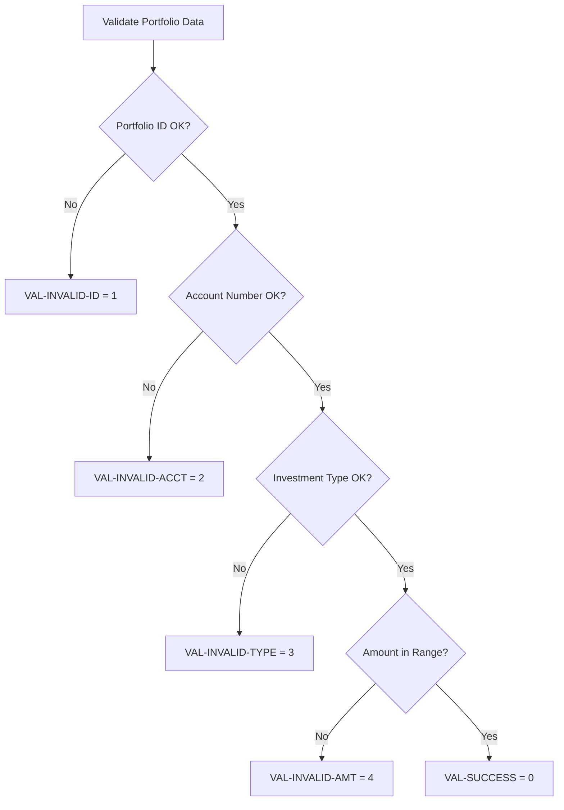
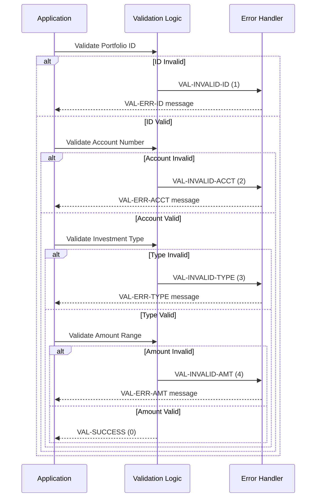

## Overview

PORTVAL is a copybook that defines the validation rules, return codes, error messages, and constants used for validating portfolio data. It provides a standardized framework for data validation across portfolio-related programs, ensuring consistent error handling and user feedback.

The copybook includes predefined return codes for common validation failures, pre-formatted error messages ready for display, validation constants (including amount limits and ID format rules), and working storage areas for validation processing.

This copybook is primarily used by the PORTVALD program for portfolio validation operations, but its constants and error messages can be referenced by any program needing standardized portfolio validation.

## Record Layout

```
+------------------------------------------------------------------+
| VAL-RETURN-CODES (16 bytes)                                       |
+------------------------------------------------------------------+
| SUCCESS | INVALID-ID | INVALID-ACCT | INVALID-TYPE | INVALID-AMT |
|  S9(4)  |   S9(4)    |    S9(4)     |    S9(4)     |    S9(4)    |
+------------------------------------------------------------------+
| VAL-ERROR-MESSAGES (200 bytes)                                    |
+------------------------------------------------------------------+
| VAL-ERR-ID | VAL-ERR-ACCT | VAL-ERR-TYPE | VAL-ERR-AMT           |
|   X(50)    |    X(50)     |    X(50)     |   X(50)               |
+------------------------------------------------------------------+
| VAL-CONSTANTS (23 bytes)       | VAL-WORK-AREAS (77 bytes)       |
+--------------------------------+---------------------------------+
| MIN-AMT | MAX-AMT | ID-PREFIX  | NUM-CHK | TEMP | ERR-CD | MSG   |
|  S9V99  |  S9V99  |   X(4)     | X(10)   | S9V99| S9(4)  | X(50) |
+------------------------------------------------------------------+
```

## Data Structure

### VAL-RETURN-CODES (Validation Result Codes)

| Level | Name | Picture | Value | Description |
|-------|------|---------|-------|-------------|
| 01 | VAL-RETURN-CODES | | | Return code constants |
| 05 | VAL-SUCCESS | S9(4) | +0 | Validation passed |
| 05 | VAL-INVALID-ID | S9(4) | +1 | Portfolio ID validation failed |
| 05 | VAL-INVALID-ACCT | S9(4) | +2 | Account number validation failed |
| 05 | VAL-INVALID-TYPE | S9(4) | +3 | Investment type validation failed |
| 05 | VAL-INVALID-AMT | S9(4) | +4 | Amount validation failed |

### VAL-ERROR-MESSAGES (Predefined Error Messages)

| Level | Name | Picture | Value | Description |
|-------|------|---------|-------|-------------|
| 01 | VAL-ERROR-MESSAGES | | | Error message constants |
| 05 | VAL-ERR-ID | X(50) | 'Invalid Portfolio ID format' | Portfolio ID error message |
| 05 | VAL-ERR-ACCT | X(50) | 'Invalid Account Number format' | Account number error message |
| 05 | VAL-ERR-TYPE | X(50) | 'Invalid Investment Type' | Investment type error message |
| 05 | VAL-ERR-AMT | X(50) | 'Amount outside valid range' | Amount range error message |

### VAL-CONSTANTS (Validation Constants)

| Level | Name | Picture | Value | Description |
|-------|------|---------|-------|-------------|
| 01 | VAL-CONSTANTS | | | Validation constant values |
| 05 | VAL-MIN-AMOUNT | S9(13)V99 | -9999999999999.99 | Minimum allowed amount |
| 05 | VAL-MAX-AMOUNT | S9(13)V99 | +9999999999999.99 | Maximum allowed amount |
| 05 | VAL-ID-PREFIX | X(4) | 'PORT' | Required portfolio ID prefix |

### VAL-WORK-AREAS (Working Storage)

| Level | Name | Picture | Description |
|-------|------|---------|-------------|
| 01 | VAL-WORK-AREAS | | Working storage for validation |
| 05 | VAL-NUMERIC-CHECK | X(10) | Area for numeric validation |
| 05 | VAL-TEMP-NUM | S9(13)V99 | Temporary numeric field |
| 05 | VAL-ERROR-CODE | S9(4) | Current error code |
| 05 | VAL-ERROR-MSG | X(50) | Current error message |

## Return Code Hierarchy



## Validation Rules

### Portfolio ID Validation

The portfolio ID must:
1. Start with the prefix 'PORT' (defined in VAL-ID-PREFIX)
2. Be followed by numeric characters
3. Not be spaces or low-values

```cobol
IF PORT-ID(1:4) NOT = VAL-ID-PREFIX
    MOVE VAL-INVALID-ID TO VAL-ERROR-CODE
    MOVE VAL-ERR-ID     TO VAL-ERROR-MSG
END-IF
```

### Account Number Validation

The account number must:
1. Not be spaces
2. Contain valid characters for account identification

```cobol
IF PORT-ACCOUNT-NO = SPACES
    MOVE VAL-INVALID-ACCT TO VAL-ERROR-CODE
    MOVE VAL-ERR-ACCT     TO VAL-ERROR-MSG
END-IF
```

### Amount Range Validation

Amounts must fall within the defined range:
- Minimum: -9,999,999,999,999.99
- Maximum: +9,999,999,999,999.99

```cobol
IF WS-AMOUNT < VAL-MIN-AMOUNT
    OR WS-AMOUNT > VAL-MAX-AMOUNT
    MOVE VAL-INVALID-AMT TO VAL-ERROR-CODE
    MOVE VAL-ERR-AMT     TO VAL-ERROR-MSG
END-IF
```

## Usage Patterns

### Basic Validation Flow

```cobol
WORKING-STORAGE SECTION.
    COPY PORTVAL.

PROCEDURE DIVISION.
VALIDATE-PORTFOLIO.
    INITIALIZE VAL-WORK-AREAS
    MOVE VAL-SUCCESS TO VAL-ERROR-CODE
    
    PERFORM VALIDATE-PORTFOLIO-ID
    IF VAL-ERROR-CODE = VAL-SUCCESS
        PERFORM VALIDATE-ACCOUNT-NUMBER
    END-IF
    IF VAL-ERROR-CODE = VAL-SUCCESS
        PERFORM VALIDATE-AMOUNTS
    END-IF
    
    IF VAL-ERROR-CODE NOT = VAL-SUCCESS
        PERFORM DISPLAY-VALIDATION-ERROR
    END-IF
    .

VALIDATE-PORTFOLIO-ID.
    IF PORT-ID(1:4) NOT = VAL-ID-PREFIX
        MOVE VAL-INVALID-ID TO VAL-ERROR-CODE
        MOVE VAL-ERR-ID     TO VAL-ERROR-MSG
    ELSE
        IF PORT-ID(5:4) IS NOT NUMERIC
            MOVE VAL-INVALID-ID TO VAL-ERROR-CODE
            MOVE VAL-ERR-ID     TO VAL-ERROR-MSG
        END-IF
    END-IF
    .

VALIDATE-ACCOUNT-NUMBER.
    IF PORT-ACCOUNT-NO = SPACES
        MOVE VAL-INVALID-ACCT TO VAL-ERROR-CODE
        MOVE VAL-ERR-ACCT     TO VAL-ERROR-MSG
    END-IF
    .

VALIDATE-AMOUNTS.
    IF PORT-TOTAL-VALUE < VAL-MIN-AMOUNT
        OR PORT-TOTAL-VALUE > VAL-MAX-AMOUNT
        MOVE VAL-INVALID-AMT TO VAL-ERROR-CODE
        MOVE VAL-ERR-AMT     TO VAL-ERROR-MSG
    END-IF
    .

DISPLAY-VALIDATION-ERROR.
    DISPLAY 'Validation Error: ' VAL-ERROR-MSG
    DISPLAY 'Error Code: ' VAL-ERROR-CODE
    .
```

### Using Return Codes for Program Logic

```cobol
CALL 'PORTVALD' USING PORT-RECORD
                      VAL-ERROR-CODE
                      VAL-ERROR-MSG

EVALUATE VAL-ERROR-CODE
    WHEN VAL-SUCCESS
        PERFORM PROCESS-VALID-PORTFOLIO
    WHEN VAL-INVALID-ID
        PERFORM HANDLE-ID-ERROR
    WHEN VAL-INVALID-ACCT
        PERFORM HANDLE-ACCOUNT-ERROR
    WHEN VAL-INVALID-TYPE
        PERFORM HANDLE-TYPE-ERROR
    WHEN VAL-INVALID-AMT
        PERFORM HANDLE-AMOUNT-ERROR
    WHEN OTHER
        PERFORM HANDLE-UNKNOWN-ERROR
END-EVALUATE
```

### Custom Validation Extension

```cobol
* Extend validation with custom rules
01  CUSTOM-VAL-CODES.
    05  VAL-INVALID-STATUS  PIC S9(4) VALUE +5.
    05  VAL-INVALID-DATE    PIC S9(4) VALUE +6.
    05  VAL-DUPLICATE-KEY   PIC S9(4) VALUE +7.

01  CUSTOM-VAL-MESSAGES.
    05  VAL-ERR-STATUS      PIC X(50) VALUE
        'Invalid portfolio status'.
    05  VAL-ERR-DATE        PIC X(50) VALUE
        'Invalid date format or range'.
    05  VAL-ERR-DUP         PIC X(50) VALUE
        'Portfolio already exists'.
```

## Validation Flow Diagram



## Programs Using This Copybook

| Program | Description | Usage |
|---------|-------------|-------|
| PORTVALD | Portfolio Validation | Primary validation program using all structures |

## Related Copybooks

| Copybook | Relationship |
|----------|-------------|
| PORTFLIO | Portfolio master record (data being validated) |
| ERRHAND | Error handling (complementary error processing) |
| RTNCODE | Return code management (similar return code pattern) |

## Technical Notes

1. **Return Code Convention**: Return codes follow a standard convention where 0 indicates success and non-zero values indicate specific error conditions. Higher codes don't necessarily indicate greater severity.

2. **Early Exit Pattern**: Validation should stop at the first error encountered. This is implemented by checking VAL-ERROR-CODE after each validation step.

3. **Amount Precision**: VAL-MIN-AMOUNT and VAL-MAX-AMOUNT use `S9(13)V99` format, supporting values with 2 decimal places up to ±9,999,999,999,999.99.

4. **ID Prefix Requirement**: The VAL-ID-PREFIX constant ('PORT') defines that all portfolio IDs must begin with these four characters, followed by additional identifying characters.

5. **Message Length**: All error messages are defined as X(50), providing consistent field lengths for display and logging purposes.

6. **Working Storage**: VAL-WORK-AREAS provides scratch space for validation operations:
   - VAL-NUMERIC-CHECK: For testing numeric content
   - VAL-TEMP-NUM: For intermediate calculations
   - VAL-ERROR-CODE: Current validation result
   - VAL-ERROR-MSG: Current error message

7. **Extensibility**: The return code values (1-4) leave room for additional validation rules. Custom validations can use codes 5 and above.

8. **Internationalization**: Error messages are stored as constants, making them easy to modify for different languages or environments without changing validation logic.
