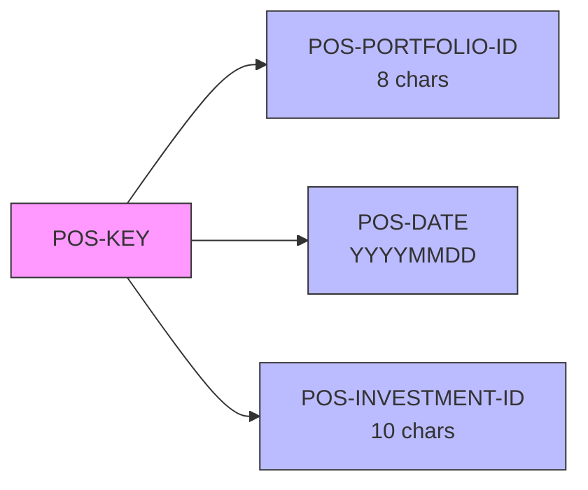
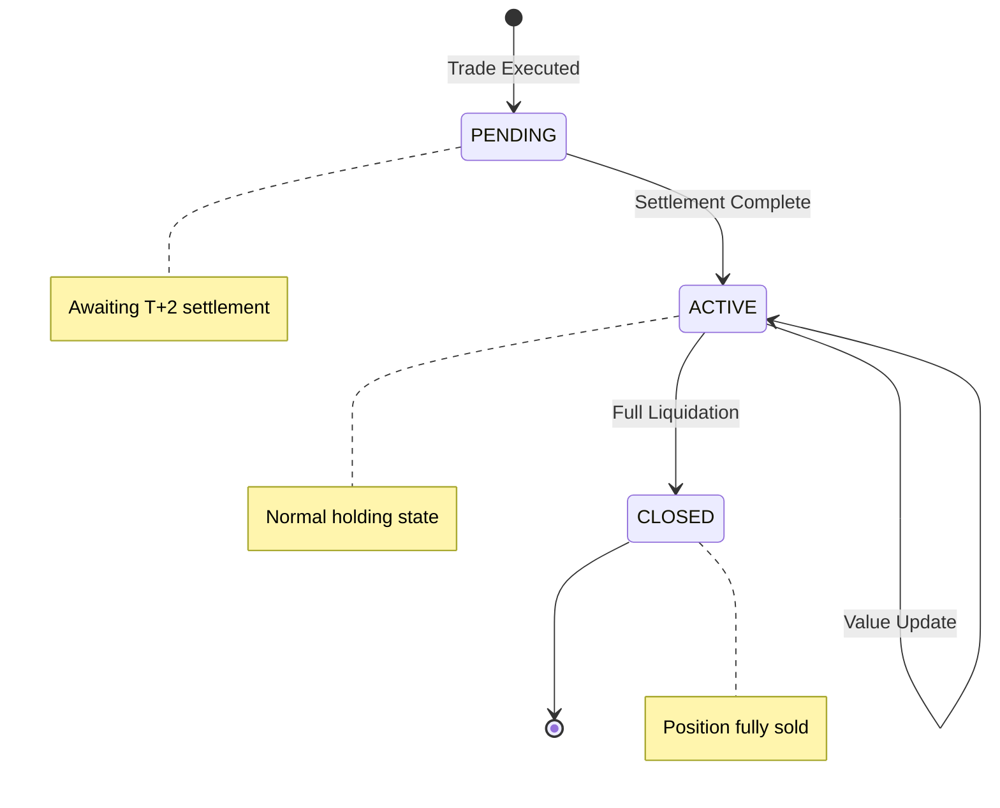

## Overview

POSREC is a copybook that defines the Position Record structure used for tracking investment holdings within portfolios. Each position record represents a specific investment held in a portfolio on a particular date, capturing the quantity held, cost basis, current market value, and status information.

This copybook is fundamental to the portfolio management system, providing the data structure for:
- Recording daily position snapshots
- Tracking investment quantities and values
- Calculating gains/losses (market value vs. cost basis)
- Supporting position inquiries and reporting

## Record Layout

```
+---------------------------+--------------------------------+
|        POS-KEY            |           POS-DATA             |
|       (26 bytes)          |          (~27 bytes)           |
+---------------------------+--------------------------------+
|      POS-AUDIT            |         POS-FILLER             |
|       (34 bytes)          |          (50 bytes)            |
+---------------------------+--------------------------------+
```

**Total Record Length:** Approximately 137 bytes

## Data Structure

### POS-KEY (Record Key)

The composite key uniquely identifies a position by portfolio, date, and investment.

| Level | Name | Picture | Length | Description |
|-------|------|---------|--------|-------------|
| 05 | POS-KEY | - | 26 | Composite record key |
| 10 | POS-PORTFOLIO-ID | X(8) | 8 | Portfolio identifier |
| 10 | POS-DATE | X(8) | 8 | Position date (YYYYMMDD) |
| 10 | POS-INVESTMENT-ID | X(10) | 10 | Investment/security identifier |

The key structure enables:
- Retrieving all positions for a portfolio (partial key)
- Retrieving positions as of a specific date
- Accessing a specific investment within a portfolio on a date



### POS-DATA (Position Information)

Contains the financial details of the position.

| Level | Name | Picture | Length | Description |
|-------|------|---------|--------|-------------|
| 05 | POS-DATA | - | ~27 | Position data group |
| 10 | POS-QUANTITY | S9(11)V9(4) COMP-3 | 8 | Holding quantity (4 decimals) |
| 10 | POS-COST-BASIS | S9(13)V9(2) COMP-3 | 8 | Total cost basis (2 decimals) |
| 10 | POS-MARKET-VALUE | S9(13)V9(2) COMP-3 | 8 | Current market value (2 decimals) |
| 10 | POS-CURRENCY | X(3) | 3 | Currency code (ISO 4217) |
| 10 | POS-STATUS | X(1) | 1 | Position status |

#### Position Status Values

| Condition Name | Value | Description |
|----------------|-------|-------------|
| POS-STATUS-ACTIVE | A | Active position, currently held |
| POS-STATUS-CLOSED | C | Closed position, fully liquidated |
| POS-STATUS-PEND | P | Pending position, awaiting settlement |



### POS-AUDIT (Audit Information)

Tracks when and by whom the record was last modified.

| Level | Name | Picture | Length | Description |
|-------|------|---------|--------|-------------|
| 05 | POS-AUDIT | - | 34 | Audit information group |
| 10 | POS-LAST-MAINT-DATE | X(26) | 26 | Last maintenance timestamp |
| 10 | POS-LAST-MAINT-USER | X(8) | 8 | User ID of last modifier |

### POS-FILLER

| Level | Name | Picture | Length | Description |
|-------|------|---------|--------|-------------|
| 05 | POS-FILLER | X(50) | 50 | Reserved for future use |

## Field Details

### Numeric Field Formats

The financial fields use COMP-3 (packed decimal) format for efficient storage and precise decimal arithmetic:

| Field | Format | Range | Example |
|-------|--------|-------|---------|
| POS-QUANTITY | S9(11)V9(4) | ±99,999,999,999.9999 | 1,000.5000 shares |
| POS-COST-BASIS | S9(13)V9(2) | ±9,999,999,999,999.99 | $125,500.00 |
| POS-MARKET-VALUE | S9(13)V9(2) | ±9,999,999,999,999.99 | $132,750.50 |

### Currency Codes

The POS-CURRENCY field uses ISO 4217 three-character currency codes:

| Code | Currency |
|------|----------|
| USD | US Dollar |
| EUR | Euro |
| GBP | British Pound |
| JPY | Japanese Yen |
| CAD | Canadian Dollar |

### Date Formats

| Field | Format | Example |
|-------|--------|---------|
| POS-DATE | YYYYMMDD | 20240315 |
| POS-LAST-MAINT-DATE | Timestamp (26 chars) | 2024-03-15-14.30.45.123456 |

## Usage Examples

### Reading a Position Record

```cobol
* Set up key for position lookup
MOVE 'PORT0001' TO POS-PORTFOLIO-ID
MOVE '20240315' TO POS-DATE
MOVE 'AAPL      ' TO POS-INVESTMENT-ID

READ POSITION-FILE
    KEY IS POS-KEY
    
IF WS-FILE-STATUS = '00'
    DISPLAY 'Quantity: ' POS-QUANTITY
    DISPLAY 'Cost Basis: ' POS-COST-BASIS
    DISPLAY 'Market Value: ' POS-MARKET-VALUE
    
    COMPUTE WS-GAIN-LOSS = 
        POS-MARKET-VALUE - POS-COST-BASIS
END-IF
```

### Creating a New Position

```cobol
* Initialize the position record
INITIALIZE POSITION-RECORD

* Set key fields
MOVE WS-PORTFOLIO-ID TO POS-PORTFOLIO-ID
MOVE WS-POSITION-DATE TO POS-DATE
MOVE WS-SECURITY-ID TO POS-INVESTMENT-ID

* Set data fields
MOVE WS-SHARES TO POS-QUANTITY
MOVE WS-TOTAL-COST TO POS-COST-BASIS
MOVE WS-CURRENT-VALUE TO POS-MARKET-VALUE
MOVE 'USD' TO POS-CURRENCY
SET POS-STATUS-ACTIVE TO TRUE

* Set audit fields
ACCEPT POS-LAST-MAINT-DATE FROM TIME STAMP
MOVE WS-USER-ID TO POS-LAST-MAINT-USER

WRITE POSITION-RECORD
```

### Reading All Positions for a Portfolio

```cobol
* Position to first record for portfolio
MOVE 'PORT0001' TO POS-PORTFOLIO-ID
MOVE LOW-VALUES TO POS-DATE
MOVE LOW-VALUES TO POS-INVESTMENT-ID

START POSITION-FILE
    KEY IS >= POS-KEY

PERFORM UNTIL WS-END-OF-FILE OR 
              POS-PORTFOLIO-ID NOT = 'PORT0001'
    READ POSITION-FILE NEXT
        AT END
            SET WS-END-OF-FILE TO TRUE
        NOT AT END
            IF POS-PORTFOLIO-ID = 'PORT0001'
                PERFORM PROCESS-POSITION
            END-IF
    END-READ
END-PERFORM
```

### Calculating Portfolio Value

```cobol
* Sum all active positions for a portfolio
MOVE ZEROS TO WS-TOTAL-COST
MOVE ZEROS TO WS-TOTAL-VALUE

PERFORM VARYING WS-IDX FROM 1 BY 1
        UNTIL WS-END-OF-PORTFOLIO
    READ POSITION-FILE NEXT
        AT END
            SET WS-END-OF-PORTFOLIO TO TRUE
        NOT AT END
            IF POS-STATUS-ACTIVE
                ADD POS-COST-BASIS TO WS-TOTAL-COST
                ADD POS-MARKET-VALUE TO WS-TOTAL-VALUE
            END-IF
    END-READ
END-PERFORM

COMPUTE WS-TOTAL-GAIN-LOSS = 
    WS-TOTAL-VALUE - WS-TOTAL-COST
COMPUTE WS-RETURN-PCT = 
    (WS-TOTAL-GAIN-LOSS / WS-TOTAL-COST) * 100
```

## Programs Using This Copybook

| Program | Description | Usage |
|---------|-------------|-------|
| RPTPOS00 | Position Report Generator | Reads positions for reporting |
| INQPORT | Portfolio Inquiry (Online) | Displays position information |
| UTLVAL00 | Validation Utility | Validates position data integrity |

## Related Copybooks

- **PORTFLIO** - Portfolio master record (parent record)
- **TRNREC** - Transaction record (creates/modifies positions)
- **HISTREC** - Historical position data

## Technical Notes

### COMP-3 (Packed Decimal) Format

The financial fields use COMP-3 format which stores two digits per byte (plus sign):

| Field | Picture | Bytes | Calculation |
|-------|---------|-------|-------------|
| POS-QUANTITY | S9(11)V9(4) | 8 | (15 digits + sign) / 2 = 8 |
| POS-COST-BASIS | S9(13)V9(2) | 8 | (15 digits + sign) / 2 = 8 |
| POS-MARKET-VALUE | S9(13)V9(2) | 8 | (15 digits + sign) / 2 = 8 |

COMP-3 advantages:
- Precise decimal arithmetic (no floating-point errors)
- Compact storage (half the space of display numeric)
- Direct use in COMPUTE statements

### File Organization

The position file is typically organized as:

```cobol
SELECT POSITION-FILE
    ASSIGN TO POSFILE
    ORGANIZATION IS INDEXED
    ACCESS MODE IS DYNAMIC
    RECORD KEY IS POS-KEY
    FILE STATUS IS WS-POS-STATUS.
```

### Key Design Rationale

The three-part key design supports common access patterns:

| Access Pattern | Key Fields Used |
|----------------|-----------------|
| Single position | Full key |
| Portfolio on date | POS-PORTFOLIO-ID + POS-DATE |
| All portfolio history | POS-PORTFOLIO-ID only |
| Date range query | START with partial key, sequential read |

### Data Integrity Considerations

1. **POS-DATE** should always be a valid business date
2. **POS-QUANTITY** can be negative for short positions
3. **POS-COST-BASIS** should be positive (absolute cost)
4. **POS-MARKET-VALUE** can be negative for liability positions
5. **POS-STATUS** should transition through valid states only

### Gain/Loss Calculation

```
Unrealized Gain/Loss = POS-MARKET-VALUE - POS-COST-BASIS

Return Percentage = ((POS-MARKET-VALUE - POS-COST-BASIS) 
                     / POS-COST-BASIS) × 100
```
