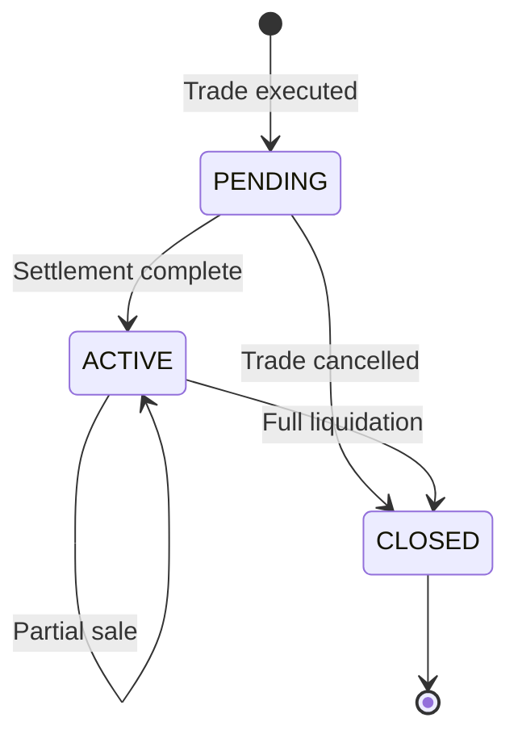

## Overview

POSREC is a copybook that defines the standard record layout for investment position data. A position represents a holding of a specific investment within a portfolio on a given date, tracking quantity, cost basis, and current market value.

This copybook is fundamental to the portfolio management system, providing the data structure used for position tracking, valuation reporting, and portfolio inquiries. The composite key structure (portfolio + date + investment) enables both current position lookups and historical position tracking.

## Data Structure

```
01  POSITION-RECORD
    05  POS-KEY                    - Composite record key
        10  POS-PORTFOLIO-ID       - Portfolio identifier
        10  POS-DATE               - Position date
        10  POS-INVESTMENT-ID      - Investment identifier
    05  POS-DATA                   - Position data
        10  POS-QUANTITY           - Holding quantity
        10  POS-COST-BASIS         - Total cost basis
        10  POS-MARKET-VALUE       - Current market value
        10  POS-CURRENCY           - Currency code
        10  POS-STATUS             - Position status
    05  POS-AUDIT                  - Audit information
        10  POS-LAST-MAINT-DATE    - Last maintenance timestamp
        10  POS-LAST-MAINT-USER    - Last maintenance user
    05  POS-FILLER                 - Reserved space
```

## Field Definitions

### Key Fields (POS-KEY)

The composite key uniquely identifies a position:

| Field | Picture | Description |
|-------|---------|-------------|
| POS-PORTFOLIO-ID | X(8) | Portfolio identifier |
| POS-DATE | X(8) | Position date (YYYYMMDD format) |
| POS-INVESTMENT-ID | X(10) | Investment/security identifier |

**Key Structure:**
```
POS-KEY (26 bytes total)
├── POS-PORTFOLIO-ID (8)  - e.g., "PORT0001"
├── POS-DATE (8)          - e.g., "20240115"
└── POS-INVESTMENT-ID (10) - e.g., "AAPL      "
```

**Usage:** Build keys for position lookups.

```cobol
MOVE 'PORT0001' TO POS-PORTFOLIO-ID
MOVE '20240115' TO POS-DATE
MOVE 'AAPL'     TO POS-INVESTMENT-ID

READ POSITION-FILE KEY IS POS-KEY
    INVALID KEY
        PERFORM POSITION-NOT-FOUND
END-READ
```

### Data Fields (POS-DATA)

Financial and status information for the position:

| Field | Picture | Description |
|-------|---------|-------------|
| POS-QUANTITY | S9(11)V9(4) COMP-3 | Number of units/shares held |
| POS-COST-BASIS | S9(13)V9(2) COMP-3 | Total acquisition cost |
| POS-MARKET-VALUE | S9(13)V9(2) COMP-3 | Current market value |
| POS-CURRENCY | X(3) | ISO currency code (e.g., USD) |
| POS-STATUS | X(1) | Position status code |

#### Field Details

**POS-QUANTITY**
- Format: Signed numeric with 4 decimal places
- Range: -99,999,999,999.9999 to +99,999,999,999.9999
- Supports fractional shares for mutual funds
- Negative values indicate short positions

**POS-COST-BASIS**
- Format: Signed numeric with 2 decimal places
- Range: -9,999,999,999,999.99 to +9,999,999,999,999.99
- Represents total cost of acquiring the position
- Used for gain/loss calculations

**POS-MARKET-VALUE**
- Format: Signed numeric with 2 decimal places
- Range: -9,999,999,999,999.99 to +9,999,999,999,999.99
- Current value based on latest market prices
- Updated by valuation processes

**POS-CURRENCY**
- 3-character ISO 4217 currency code
- Examples: USD, EUR, GBP, JPY

### Status Values (POS-STATUS)

| Value | 88-Level Condition | Description |
|-------|-------------------|-------------|
| `'A'` | POS-STATUS-ACTIVE | Position is active and held |
| `'C'` | POS-STATUS-CLOSED | Position has been fully liquidated |
| `'P'` | POS-STATUS-PEND | Position is pending settlement |

**Usage:** Check and set position status.

```cobol
IF POS-STATUS-ACTIVE
    PERFORM CALCULATE-GAIN-LOSS
END-IF

IF POS-QUANTITY = ZERO
    SET POS-STATUS-CLOSED TO TRUE
END-IF
```

**Status Lifecycle:**



### Audit Fields (POS-AUDIT)

Tracking information for data governance:

| Field | Picture | Description |
|-------|---------|-------------|
| POS-LAST-MAINT-DATE | X(26) | Last update timestamp (ISO format) |
| POS-LAST-MAINT-USER | X(8) | User ID of last update |

**Usage:** Track changes for audit purposes.

```cobol
MOVE FUNCTION CURRENT-DATE TO POS-LAST-MAINT-DATE
ACCEPT POS-LAST-MAINT-USER FROM ENVIRONMENT 'USER'
```

### Reserved Space (POS-FILLER)

| Field | Picture | Description |
|-------|---------|-------------|
| POS-FILLER | X(50) | Reserved for future use |

## Record Layout

```
Offset  Length  Field                Format
------  ------  -------------------  ----------------
0       8       POS-PORTFOLIO-ID     Alphanumeric
8       8       POS-DATE             YYYYMMDD
16      10      POS-INVESTMENT-ID    Alphanumeric
26      9       POS-QUANTITY         Packed S9(11)V9(4)
35      8       POS-COST-BASIS       Packed S9(13)V9(2)
43      8       POS-MARKET-VALUE     Packed S9(13)V9(2)
51      3       POS-CURRENCY         Alphanumeric
54      1       POS-STATUS           Alphanumeric
55      26      POS-LAST-MAINT-DATE  ISO Timestamp
81      8       POS-LAST-MAINT-USER  Alphanumeric
89      50      POS-FILLER           Reserved
------  ------
Total:  139 bytes
```

## Calculated Values

Common calculations using position fields:

### Unrealized Gain/Loss

```cobol
COMPUTE WS-UNREALIZED-GAIN =
    POS-MARKET-VALUE - POS-COST-BASIS
```

### Gain/Loss Percentage

```cobol
IF POS-COST-BASIS NOT = ZERO
    COMPUTE WS-GAIN-PERCENT =
        ((POS-MARKET-VALUE - POS-COST-BASIS) 
         / POS-COST-BASIS) * 100
END-IF
```

### Average Cost Per Share

```cobol
IF POS-QUANTITY NOT = ZERO
    COMPUTE WS-AVG-COST =
        POS-COST-BASIS / POS-QUANTITY
END-IF
```

### Current Price Per Share

```cobol
IF POS-QUANTITY NOT = ZERO
    COMPUTE WS-CURRENT-PRICE =
        POS-MARKET-VALUE / POS-QUANTITY
END-IF
```

## Usage

### Including the Copybook

For file definitions:
```cobol
FILE SECTION.
FD  POSITION-FILE.
    COPY POSREC.
```

For working storage:
```cobol
WORKING-STORAGE SECTION.
01  WS-POSITION-RECORD.
    COPY POSREC.
```

### Common Patterns

#### Reading a Position by Key

```cobol
MOVE WS-PORTFOLIO    TO POS-PORTFOLIO-ID
MOVE WS-POSITION-DT  TO POS-DATE
MOVE WS-INVESTMENT   TO POS-INVESTMENT-ID

READ POSITION-FILE
    INVALID KEY
        SET POSITION-NOT-FOUND TO TRUE
    NOT INVALID KEY
        PERFORM PROCESS-POSITION
END-READ
```

#### Browsing Positions for a Portfolio

```cobol
MOVE WS-PORTFOLIO TO POS-PORTFOLIO-ID
MOVE LOW-VALUES   TO POS-DATE
MOVE LOW-VALUES   TO POS-INVESTMENT-ID

START POSITION-FILE KEY >= POS-KEY
    INVALID KEY
        SET NO-POSITIONS TO TRUE
END-START

PERFORM UNTIL END-OF-POSITIONS
    READ POSITION-FILE NEXT
        AT END
            SET END-OF-POSITIONS TO TRUE
        NOT AT END
            IF POS-PORTFOLIO-ID = WS-PORTFOLIO
                PERFORM PROCESS-POSITION
            ELSE
                SET END-OF-POSITIONS TO TRUE
            END-IF
    END-READ
END-PERFORM
```

#### Updating Position After Trade

```cobol
* For a buy transaction
ADD TRN-QUANTITY TO POS-QUANTITY
ADD TRN-AMOUNT   TO POS-COST-BASIS

* Update audit trail
MOVE FUNCTION CURRENT-DATE TO POS-LAST-MAINT-DATE
MOVE WS-USER-ID TO POS-LAST-MAINT-USER

REWRITE POSITION-RECORD
    INVALID KEY
        PERFORM POSITION-UPDATE-ERROR
END-REWRITE
```

#### Creating a New Position

```cobol
INITIALIZE POSITION-RECORD

MOVE WS-PORTFOLIO    TO POS-PORTFOLIO-ID
MOVE WS-TRADE-DATE   TO POS-DATE
MOVE WS-INVESTMENT   TO POS-INVESTMENT-ID
MOVE TRN-QUANTITY    TO POS-QUANTITY
MOVE TRN-AMOUNT      TO POS-COST-BASIS
MOVE TRN-AMOUNT      TO POS-MARKET-VALUE
MOVE 'USD'           TO POS-CURRENCY
SET POS-STATUS-PEND  TO TRUE

MOVE FUNCTION CURRENT-DATE TO POS-LAST-MAINT-DATE
MOVE WS-USER-ID TO POS-LAST-MAINT-USER

WRITE POSITION-RECORD
    INVALID KEY
        PERFORM POSITION-WRITE-ERROR
END-WRITE
```

## Programs Using This Copybook

| Program | Description |
|---------|-------------|
| [RPTPOS00](/docs/programs/RPTPOS00) | Position Reporting - generates position reports |
| [INQPORT](/docs/programs/INQPORT) | Portfolio Inquiry - displays portfolio positions |
| [UTLVAL00](/docs/programs/UTLVAL00) | Validation Utility - validates position data |

## Related Copybooks

| Copybook | Relationship |
|----------|--------------|
| PORTFLIO | Portfolio master - parent record for positions |
| TRNREC | Transaction record - source of position changes |
| HISTREC | History record - historical position snapshots |
| COMMON | Common definitions - status codes, currency codes |

## File Organization

When used with VSAM KSDS files:

```cobol
SELECT POSITION-FILE
    ASSIGN TO POSFILE
    ORGANIZATION IS INDEXED
    ACCESS MODE IS DYNAMIC
    RECORD KEY IS POS-KEY
    FILE STATUS IS WS-POS-STATUS.
```

**Recommended VSAM Definition:**
```
DEFINE CLUSTER (NAME(position.file) -
    INDEXED -
    KEYS(26 0) -
    RECORDSIZE(139 139) -
    FREESPACE(20 10))
```

## Technical Notes

- **COMP-3** (packed decimal) is used for all financial fields to maintain decimal precision and storage efficiency
- The 4 decimal places in POS-QUANTITY support fractional shares common in mutual fund holdings
- The composite key structure enables efficient browsing of all positions within a portfolio
- POS-DATE in the key allows historical position tracking (positions as of a specific date)
- The 50-byte filler provides room for future field additions without changing record length
- Status uses 88-level conditions for readable conditional logic
- The record length of 139 bytes is fixed, making it suitable for both VSAM and sequential files
- Currency is stored at the position level to support multi-currency portfolios
