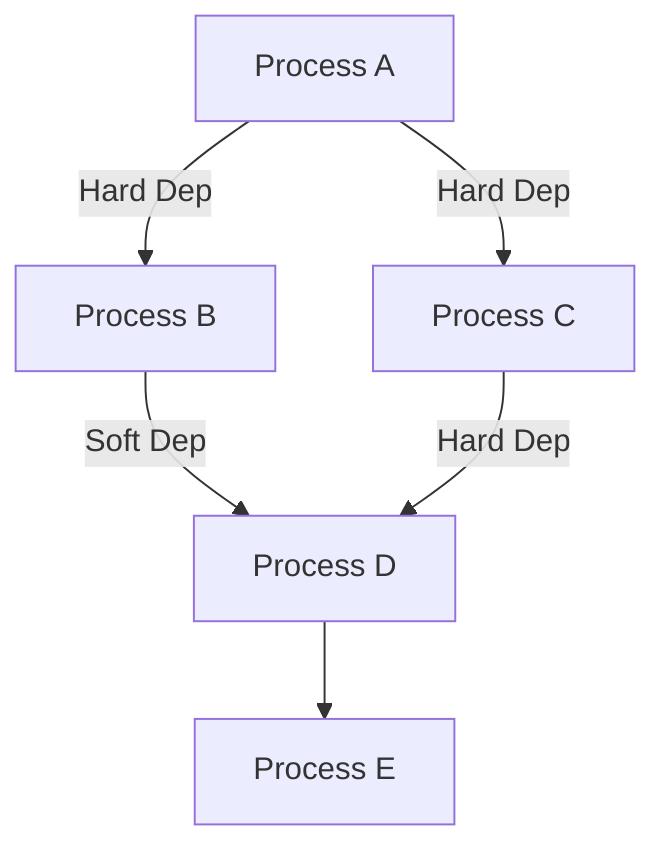

## Overview

PRCSEQ is a copybook that defines the data structures for batch process sequencing and scheduling in the Investment Portfolio Management System. It provides:

- **Process Sequence Records**: Complete definition of individual batch processes
- **Dependency Management**: Hard and soft dependency tracking between processes
- **Scheduling Configuration**: Timing, frequency, and calendar-based scheduling
- **Recovery Information**: Recovery program definitions and error limits
- **Standard Sequences**: Pre-defined process sequences for daily operations

This copybook is fundamental to the batch control framework, enabling automated job sequencing, dependency resolution, and process recovery.

## Record Structure

### Process Sequence Record (PROCESS-SEQUENCE-RECORD)

The main record structure defining a batch process:

```
+------------------+----------------------------------------+
| PSR-KEY (10)     | PSR-DATA (variable)                    |
+------------------+----------------------------------------+
| Process ID | Ver | Description | Type | Timing | Deps... |
+------------------+----------------------------------------+
```

## Field Definitions

### Key Fields (PSR-KEY)

| Level | Name | Picture | Description |
|-------|------|---------|-------------|
| 05 | PSR-KEY | - | Composite record key |
| 10 | PSR-PROCESS-ID | X(8) | Unique process identifier |
| 10 | PSR-VERSION | 9(2) | Process definition version |

### Process Data (PSR-DATA)

| Level | Name | Picture | Description |
|-------|------|---------|-------------|
| 05 | PSR-DATA | - | Process definition data |
| 10 | PSR-DESCRIPTION | X(30) | Human-readable description |
| 10 | PSR-TYPE | X(3) | Process type code |

#### Process Type Values

| Code | 88-Level | Description |
|------|----------|-------------|
| `INI` | PSR-TYPE-INIT | Initialization process |
| `PRC` | PSR-TYPE-PROC | Main processing |
| `RPT` | PSR-TYPE-RPT | Report generation |
| `TRM` | PSR-TYPE-TERM | Termination/cleanup |

### Timing Configuration (PSR-TIMING)

| Level | Name | Picture | Description |
|-------|------|---------|-------------|
| 10 | PSR-TIMING | - | Timing parameters |
| 15 | PSR-FREQ | X(1) | Execution frequency |
| 15 | PSR-START-TIME | 9(4) | Earliest start time (HHMM) |
| 15 | PSR-MAX-TIME | 9(4) | Maximum run time (minutes) |

#### Frequency Values

| Code | 88-Level | Description |
|------|----------|-------------|
| `D` | PSR-DAILY | Run daily |
| `W` | PSR-WEEKLY | Run weekly |
| `M` | PSR-MONTHLY | Run monthly |

### Dependencies (PSR-DEPENDENCIES)

| Level | Name | Picture | Description |
|-------|------|---------|-------------|
| 10 | PSR-DEPENDENCIES | - | Dependency configuration |
| 15 | PSR-DEP-COUNT | 9(2) COMP | Number of dependencies |
| 15 | PSR-DEP-ENTRY | OCCURS 10 | Dependency array |
| 20 | PSR-DEP-ID | X(8) | Dependent process ID |
| 20 | PSR-DEP-TYPE | X(1) | Dependency type |
| 20 | PSR-DEP-RC | S9(4) COMP | Max acceptable return code |

#### Dependency Type Values

| Code | 88-Level | Description |
|------|----------|-------------|
| `H` | PSR-DEP-HARD | Hard dependency - must complete successfully |
| `S` | PSR-DEP-SOFT | Soft dependency - completion preferred but not required |

### Process Control (PSR-CONTROL)

| Level | Name | Picture | Description |
|-------|------|---------|-------------|
| 10 | PSR-CONTROL | - | Execution control |
| 15 | PSR-PROGRAM | X(8) | Program name to execute |
| 15 | PSR-PARM | X(50) | Program parameters |
| 15 | PSR-MAX-RC | S9(4) COMP | Maximum acceptable return code |
| 15 | PSR-RESTART | X(1) | Restart capability flag |

#### Restart Values

| Code | 88-Level | Description |
|------|----------|-------------|
| `Y` | PSR-RESTARTABLE | Process can be restarted |
| `N` | PSR-NO-RESTART | Process cannot be restarted |

### Schedule Configuration (PSR-SCHEDULE)

| Level | Name | Picture | Description |
|-------|------|---------|-------------|
| 05 | PSR-SCHEDULE | - | Calendar scheduling |
| 10 | PSR-ACTIVE-DAYS | X(7) | Active days (Mon-Sun as Y/N) |
| 10 | PSR-MONTH-END | X(1) | Month-end only flag |
| 10 | PSR-HOLIDAY-RUN | X(1) | Holiday execution flag |

#### Active Days Pattern

Position 1-7 represents Monday through Sunday:
- `Y` = Run on this day
- `N` = Do not run on this day

| Pattern | 88-Level | Description |
|---------|----------|-------------|
| `YYYYYNN` | PSR-WEEKDAY | Weekdays only (Mon-Fri) |
| `NNNNNYY` | PSR-WEEKEND | Weekend only (Sat-Sun) |
| `YYYYYYY` | PSR-ALL-DAYS | Every day |

#### Month-End Flag

| Code | 88-Level | Description |
|------|----------|-------------|
| `Y` | PSR-LAST-DAY | Run on last day of month only |

#### Holiday Run Flag

| Code | 88-Level | Description |
|------|----------|-------------|
| `Y` | PSR-RUN-HOL | Run on holidays |
| `N` | PSR-SKIP-HOL | Skip on holidays |

### Recovery Configuration (PSR-RECOVERY)

| Level | Name | Picture | Description |
|-------|------|---------|-------------|
| 05 | PSR-RECOVERY | - | Recovery settings |
| 10 | PSR-RECOVERY-PGM | X(8) | Recovery program name |
| 10 | PSR-RECOVERY-PARM | X(50) | Recovery parameters |
| 10 | PSR-ERROR-LIMIT | 9(4) COMP | Error threshold before abort |

### Audit Information (PSR-AUDIT)

| Level | Name | Picture | Description |
|-------|------|---------|-------------|
| 05 | PSR-AUDIT | - | Audit trail |
| 10 | PSR-CREATE-DATE | X(10) | Record creation date |
| 10 | PSR-CREATE-USER | X(8) | Creating user ID |
| 10 | PSR-UPDATE-DATE | X(10) | Last update date |
| 10 | PSR-UPDATE-USER | X(8) | Last updating user ID |

### Reserved Space

| Level | Name | Picture | Description |
|-------|------|---------|-------------|
| 05 | PSR-FILLER | X(50) | Reserved for future use |

## Standard Sequences

The copybook also defines pre-configured standard process sequences:

### STANDARD-SEQUENCES Structure

```cobol
01  STANDARD-SEQUENCES.
    05  SEQ-START-OF-DAY.
        10  FILLER  PIC X(8) VALUE 'INITDAY '.
        10  FILLER  PIC X(8) VALUE 'CKPCLR  '.
        10  FILLER  PIC X(8) VALUE 'DATEVAL '.
    05  SEQ-MAIN-PROCESS.
        10  FILLER  PIC X(8) VALUE 'TRNVAL00'.
        10  FILLER  PIC X(8) VALUE 'POSUPD00'.
        10  FILLER  PIC X(8) VALUE 'HISTLD00'.
    05  SEQ-END-OF-DAY.
        10  FILLER  PIC X(8) VALUE 'RPTGEN00'.
        10  FILLER  PIC X(8) VALUE 'BCKLOD00'.
        10  FILLER  PIC X(8) VALUE 'ENDDAY  '.
```

### Start-of-Day Sequence (SEQ-START-OF-DAY)

| Program | Purpose |
|---------|---------|
| INITDAY | Initialize daily processing |
| CKPCLR | Clear checkpoint files |
| DATEVAL | Validate processing date |

### Main Processing Sequence (SEQ-MAIN-PROCESS)

| Program | Purpose |
|---------|---------|
| TRNVAL00 | Transaction validation |
| POSUPD00 | Position updates |
| HISTLD00 | History loading to DB2 |

### End-of-Day Sequence (SEQ-END-OF-DAY)

| Program | Purpose |
|---------|---------|
| RPTGEN00 | Report generation |
| BCKLOD00 | Backup/archive loading |
| ENDDAY | End-of-day cleanup |

## Usage

### In PRCSEQ00 (Process Sequence Manager)

```cobol
FILE SECTION.
FD  PROCESS-SEQ-FILE.
    COPY PRCSEQ.
```

PRCSEQ00 uses this copybook to:
- Define the process sequence file record layout
- Build execution sequences based on process type
- Check dependencies using PSR-DEP-ENTRY
- Determine restart capability via PSR-RESTART

### In RCVPRC00 (Process Recovery Handler)

```cobol
FD  PROCESS-SEQ-FILE.
    COPY PRCSEQ.
```

RCVPRC00 uses this copybook to:
- Read process definitions for recovery decisions
- Check PSR-RESTARTABLE flag for restart eligibility
- Access PSR-RECOVERY-PGM for recovery program invocation

## Programs Using This Copybook

| Program | Usage |
|---------|-------|
| PRCSEQ00 | Process Sequence Manager - builds and manages execution sequences |
| RCVPRC00 | Process Recovery Handler - handles failed process recovery |

## Record Layout Diagram

```
PROCESS-SEQUENCE-RECORD
├── PSR-KEY (10 bytes)
│   ├── PSR-PROCESS-ID    X(8)
│   └── PSR-VERSION       9(2)
├── PSR-DATA
│   ├── PSR-DESCRIPTION   X(30)
│   ├── PSR-TYPE          X(3)   [INI/PRC/RPT/TRM]
│   ├── PSR-TIMING
│   │   ├── PSR-FREQ      X(1)   [D/W/M]
│   │   ├── PSR-START-TIME 9(4)
│   │   └── PSR-MAX-TIME   9(4)
│   ├── PSR-DEPENDENCIES
│   │   ├── PSR-DEP-COUNT  9(2) COMP
│   │   └── PSR-DEP-ENTRY (x10)
│   │       ├── PSR-DEP-ID    X(8)
│   │       ├── PSR-DEP-TYPE  X(1)   [H/S]
│   │       └── PSR-DEP-RC    S9(4) COMP
│   └── PSR-CONTROL
│       ├── PSR-PROGRAM    X(8)
│       ├── PSR-PARM       X(50)
│       ├── PSR-MAX-RC     S9(4) COMP
│       └── PSR-RESTART    X(1)   [Y/N]
├── PSR-SCHEDULE
│   ├── PSR-ACTIVE-DAYS   X(7)
│   ├── PSR-MONTH-END     X(1)
│   └── PSR-HOLIDAY-RUN   X(1)
├── PSR-RECOVERY
│   ├── PSR-RECOVERY-PGM  X(8)
│   ├── PSR-RECOVERY-PARM X(50)
│   └── PSR-ERROR-LIMIT   9(4) COMP
├── PSR-AUDIT
│   ├── PSR-CREATE-DATE   X(10)
│   ├── PSR-CREATE-USER   X(8)
│   ├── PSR-UPDATE-DATE   X(10)
│   └── PSR-UPDATE-USER   X(8)
└── PSR-FILLER            X(50)
```

## Dependency Resolution

The dependency system supports complex process relationships:



**Hard Dependencies (PSR-DEP-HARD)**:
- Dependent process must complete successfully
- Return code must be ≤ PSR-DEP-RC
- Blocks execution if not satisfied

**Soft Dependencies (PSR-DEP-SOFT)**:
- Dependent process should complete
- Execution proceeds even if not satisfied
- Warning logged if dependency not met

## Example Process Definition

```cobol
MOVE 'HISTLD00' TO PSR-PROCESS-ID
MOVE 01         TO PSR-VERSION
MOVE 'Load history to DB2' TO PSR-DESCRIPTION
SET PSR-TYPE-PROC TO TRUE
SET PSR-DAILY     TO TRUE
MOVE 0600         TO PSR-START-TIME
MOVE 0120         TO PSR-MAX-TIME
MOVE 2            TO PSR-DEP-COUNT
MOVE 'POSUPD00'   TO PSR-DEP-ID(1)
SET PSR-DEP-HARD(1) TO TRUE
MOVE 4            TO PSR-DEP-RC(1)
MOVE 'TRNVAL00'   TO PSR-DEP-ID(2)
SET PSR-DEP-HARD(2) TO TRUE
MOVE 0            TO PSR-DEP-RC(2)
MOVE 'HISTLD00'   TO PSR-PROGRAM
MOVE SPACES       TO PSR-PARM
MOVE 8            TO PSR-MAX-RC
SET PSR-RESTARTABLE TO TRUE
SET PSR-WEEKDAY   TO TRUE
SET PSR-SKIP-HOL  TO TRUE
```

## Related Copybooks

| Copybook | Relationship |
|----------|--------------|
| BCHCTL | Batch control records - tracks execution status |
| BCHCON | Batch constants - defines status codes and return codes |
| CKPRST | Checkpoint/restart - program-level checkpointing |
| ERRHAND | Error handling - error message structures |

## Technical Notes

### COMP Fields

The copybook uses `COMP` (binary) for numeric fields:
- `PSR-DEP-COUNT`: 9(2) COMP - Supports up to 99 dependencies (10 actually used)
- `PSR-DEP-RC`: S9(4) COMP - Signed for return code comparison
- `PSR-MAX-RC`: S9(4) COMP - Maximum acceptable return code
- `PSR-ERROR-LIMIT`: 9(4) COMP - Up to 9999 errors before abort

### Active Days Encoding

The 7-character `PSR-ACTIVE-DAYS` field provides flexible day-of-week scheduling:
- Position 1 = Monday
- Position 2 = Tuesday
- Position 3 = Wednesday
- Position 4 = Thursday
- Position 5 = Friday
- Position 6 = Saturday
- Position 7 = Sunday

### File Organization

When used as a file record:
- Organization: Indexed (VSAM KSDS)
- Primary Key: PSR-KEY (PSR-PROCESS-ID + PSR-VERSION)
- Access Mode: Dynamic (sequential and random)
