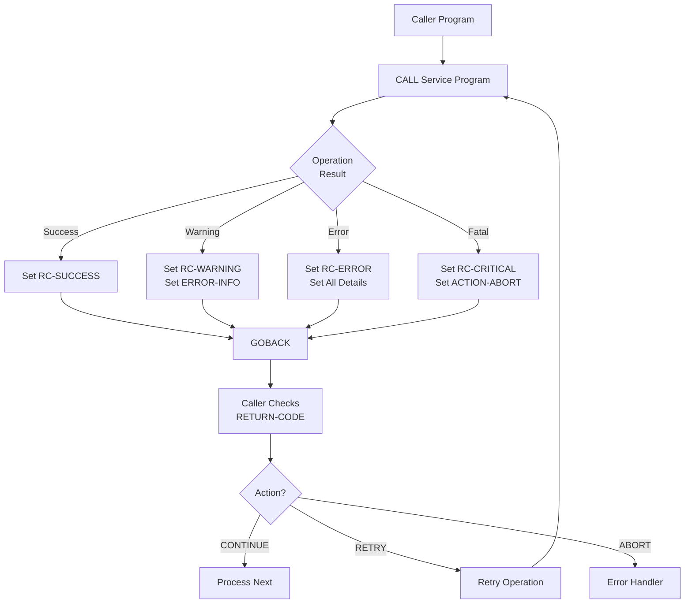

## Overview

RETHND is a copybook that provides a standardized structure for return code handling and error communication between COBOL programs. It defines a comprehensive framework for passing status information, error details, and recommended actions from called programs back to their callers.

The copybook contains two main structures:
- **RETURN-HANDLING** - Complete return status structure with codes, details, and actions
- **STD-ERROR-CODES** - Predefined standard error code constants

Key features include:
- **Hierarchical return codes** - Success, Warning, Error, Severe, and Critical levels
- **Error categorization** - Validation, Processing, Database, File, and Security error types
- **Location tracking** - Captures program, paragraph, and routine where error occurred
- **Action directives** - Specifies whether to Continue, Abort, or Retry
- **Retry management** - Built-in retry counting with configurable maximum

This copybook enables consistent error handling patterns across the application, making it easier to diagnose issues and implement appropriate recovery strategies.

## Data Structures

### RETURN-HANDLING (Main Structure)

The primary structure for communicating return status between programs.

#### RETURN-STATUS

Core return code information.

| Level | Name | Picture | Description |
|-------|------|---------|-------------|
| 05 | RETURN-STATUS | - | Return status group |
| 10 | RETURN-CODE | PIC S9(4) COMP | Numeric return code |
| 10 | REASON-CODE | PIC S9(4) COMP | Additional reason/sub-code |
| 10 | MODULE-ID | PIC X(8) | Module/program that set the status |
| 10 | FUNCTION-ID | PIC X(8) | Function within the module |

##### RETURN-CODE Values (88-Level Conditions)

| Condition Name | Value | Description |
|----------------|-------|-------------|
| RC-SUCCESS | +0 | Successful completion |
| RC-WARNING | +4 | Warning - processing continued with issues |
| RC-ERROR | +8 | Error - processing may have partially failed |
| RC-SEVERE | +12 | Severe error - significant failure |
| RC-CRITICAL | +16 | Critical error - immediate abort required |

##### Return Code Hierarchy

```
+0  RC-SUCCESS   ──► Normal completion, no issues
+4  RC-WARNING   ──► Minor issues, results may need review
+8  RC-ERROR     ──► Significant issues, some processing failed
+12 RC-SEVERE    ──► Major failure, most processing failed
+16 RC-CRITICAL  ──► Fatal error, immediate termination
```

#### RETURN-DETAILS

Detailed error information for diagnostics.

| Level | Name | Picture | Description |
|-------|------|---------|-------------|
| 05 | RETURN-DETAILS | - | Error details group |
| 10 | ERROR-LOCATION | - | Where the error occurred |
| 15 | PROGRAM-NAME | PIC X(8) | Program name |
| 15 | PARAGRAPH-NAME | PIC X(8) | Paragraph name |
| 15 | ERROR-ROUTINE | PIC X(8) | Error handling routine |
| 10 | ERROR-INFO | - | Error specifics |
| 15 | ERROR-TYPE | PIC X(1) | Error category code |
| 15 | ERROR-CODE | PIC X(4) | Specific error code |
| 15 | ERROR-TEXT | PIC X(80) | Human-readable error message |
| 10 | SYSTEM-INFO | - | System-level information |
| 15 | SYSTEM-CODE | PIC X(4) | System/subsystem code |
| 15 | SYSTEM-MSG | PIC X(80) | System error message |

##### ERROR-TYPE Values (88-Level Conditions)

| Condition Name | Value | Description |
|----------------|-------|-------------|
| ERR-VALIDATION | `V` | Data validation error |
| ERR-PROCESSING | `P` | Processing/logic error |
| ERR-DATABASE | `D` | Database (DB2) error |
| ERR-FILE | `F` | File I/O (VSAM) error |
| ERR-SECURITY | `S` | Security/authorization error |

#### RETURN-ACTIONS

Recommended actions for the caller.

| Level | Name | Picture | Default | Description |
|-------|------|---------|---------|-------------|
| 05 | RETURN-ACTIONS | - | - | Action directives group |
| 10 | ACTION-FLAG | PIC X(1) | - | Recommended action |
| 10 | RETRY-COUNT | PIC 9(2) COMP | - | Current retry attempt number |
| 10 | MAX-RETRIES | PIC 9(2) COMP | 3 | Maximum retry attempts allowed |

##### ACTION-FLAG Values (88-Level Conditions)

| Condition Name | Value | Description |
|----------------|-------|-------------|
| ACTION-CONTINUE | `C` | Continue processing (ignore or handle error) |
| ACTION-ABORT | `A` | Abort processing immediately |
| ACTION-RETRY | `R` | Retry the operation |

### STD-ERROR-CODES (Standard Error Codes)

Predefined error code constants for consistent error identification.

| Name | Value | Description |
|------|-------|-------------|
| ERR-INVALID-DATA | `E001` | Invalid or malformed data |
| ERR-NOT-FOUND | `E002` | Requested record/resource not found |
| ERR-DUPLICATE | `E003` | Duplicate key or record exists |
| ERR-FILE-ERROR | `E004` | File I/O error |
| ERR-DB-ERROR | `E005` | Database error |
| ERR-SECURITY | `E006` | Security/authorization failure |
| ERR-PROCESSING | `E007` | General processing error |
| ERR-VALIDATION | `E008` | Validation rule failure |
| ERR-VERSION | `E009` | Version mismatch or incompatibility |
| ERR-TIMEOUT | `E010` | Operation timed out |

## Programs Using This Copybook

| Program | Usage |
|---------|-------|
| CKPRST | Used in linkage section for returning checkpoint operation status to callers |

## Usage Examples

### Setting a Successful Return

```cobol
INITIALIZE RETURN-HANDLING

SET RC-SUCCESS TO TRUE
MOVE 'CKPRST'     TO MODULE-ID
MOVE 'INIT'       TO FUNCTION-ID
MOVE SPACES       TO ERROR-TEXT
SET ACTION-CONTINUE TO TRUE
```

### Setting an Error Return

```cobol
* Set return code
SET RC-ERROR TO TRUE
MOVE +1001        TO REASON-CODE
MOVE 'PORTMSTR'   TO MODULE-ID
MOVE 'VALIDATE'   TO FUNCTION-ID

* Set error location
MOVE 'PORTMSTR'   TO PROGRAM-NAME
MOVE '2100-VAL'   TO PARAGRAPH-NAME
MOVE '9000-ERR'   TO ERROR-ROUTINE

* Set error details
SET ERR-VALIDATION TO TRUE
MOVE ERR-INVALID-DATA TO ERROR-CODE
MOVE 'Invalid portfolio ID format' TO ERROR-TEXT

* Set action
SET ACTION-ABORT TO TRUE
```

### Handling Return Status in Caller

```cobol
CALL 'CKPRST' USING CHECKPOINT-CONTROL
                    RETURN-HANDLING

EVALUATE TRUE
    WHEN RC-SUCCESS
        CONTINUE
    WHEN RC-WARNING
        PERFORM LOG-WARNING
        CONTINUE
    WHEN RC-ERROR
        PERFORM LOG-ERROR
        IF ACTION-RETRY AND RETRY-COUNT < MAX-RETRIES
            ADD 1 TO RETRY-COUNT
            PERFORM RETRY-OPERATION
        ELSE
            PERFORM ERROR-RECOVERY
        END-IF
    WHEN RC-SEVERE
    WHEN RC-CRITICAL
        PERFORM EMERGENCY-ABORT
END-EVALUATE
```

### Implementing Retry Logic

```cobol
PERFORM UNTIL RC-SUCCESS OR RETRY-COUNT >= MAX-RETRIES
    CALL 'DBUPDATE' USING UPDATE-REQUEST
                          RETURN-HANDLING
    
    IF ACTION-RETRY
        ADD 1 TO RETRY-COUNT
        CALL 'DELAY' USING RETRY-DELAY
    END-IF
END-PERFORM

IF NOT RC-SUCCESS
    SET ACTION-ABORT TO TRUE
    MOVE 'Max retries exceeded' TO ERROR-TEXT
END-IF
```

### Propagating Errors to Caller

```cobol
* Called program encounters error
CALL 'SUBROUTINE' USING DATA-AREA
                        SUB-RETURN-STATUS

* Check and propagate if error
IF NOT RC-SUCCESS IN SUB-RETURN-STATUS
    MOVE SUB-RETURN-STATUS TO RETURN-STATUS
    MOVE 'MAINPROG' TO PROGRAM-NAME
    MOVE '3000-PROC' TO PARAGRAPH-NAME
    GOBACK
END-IF
```

## Return Code Decision Matrix

| Return Code | Error Type | Typical Action | Retry? |
|-------------|------------|----------------|--------|
| RC-SUCCESS | - | Continue | No |
| RC-WARNING | Any | Log and continue | No |
| RC-ERROR | ERR-VALIDATION | Reject record, continue batch | No |
| RC-ERROR | ERR-DATABASE | Retry, then abort | Yes |
| RC-ERROR | ERR-FILE | Retry, then abort | Yes |
| RC-SEVERE | Any | Abort with recovery | No |
| RC-CRITICAL | Any | Immediate abort | No |

## Integration Pattern

### Typical Call Flow



## Best Practices

1. **Always initialize** - Use `INITIALIZE RETURN-HANDLING` before setting values to clear previous state

2. **Set complete information** - Populate all relevant fields for easier debugging:
   - MODULE-ID and FUNCTION-ID identify the source
   - PROGRAM-NAME and PARAGRAPH-NAME pinpoint location
   - ERROR-CODE and ERROR-TEXT describe the issue

3. **Use standard error codes** - Prefer the predefined `STD-ERROR-CODES` for consistency across programs

4. **Match action to severity**:
   - RC-SUCCESS/RC-WARNING → ACTION-CONTINUE
   - RC-ERROR → ACTION-RETRY or ACTION-CONTINUE
   - RC-SEVERE/RC-CRITICAL → ACTION-ABORT

5. **Implement retry limits** - Always check `RETRY-COUNT < MAX-RETRIES` before retrying to prevent infinite loops

6. **Preserve original error** - When propagating errors, keep the original ERROR-CODE and ERROR-TEXT but update location fields

7. **Log before acting** - Log error details before taking recovery actions for audit trail

## Related Copybooks

| Copybook | Relationship |
|----------|--------------|
| CKPRST | Uses RETHND to return checkpoint operation status |
| ERRHAND | Alternative error handling structure for batch programs |
| RTNCODE | Return code management with analysis capabilities |
