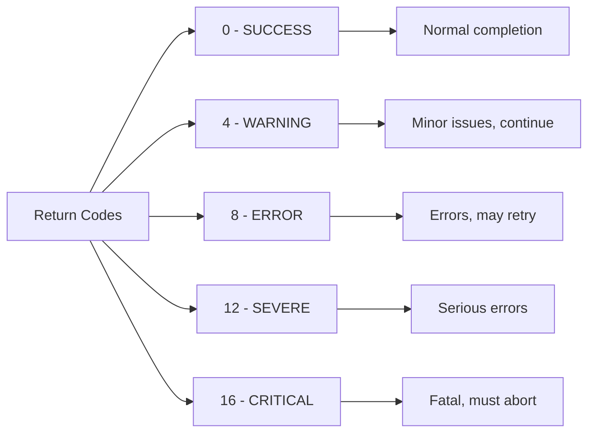
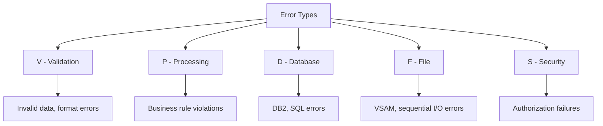
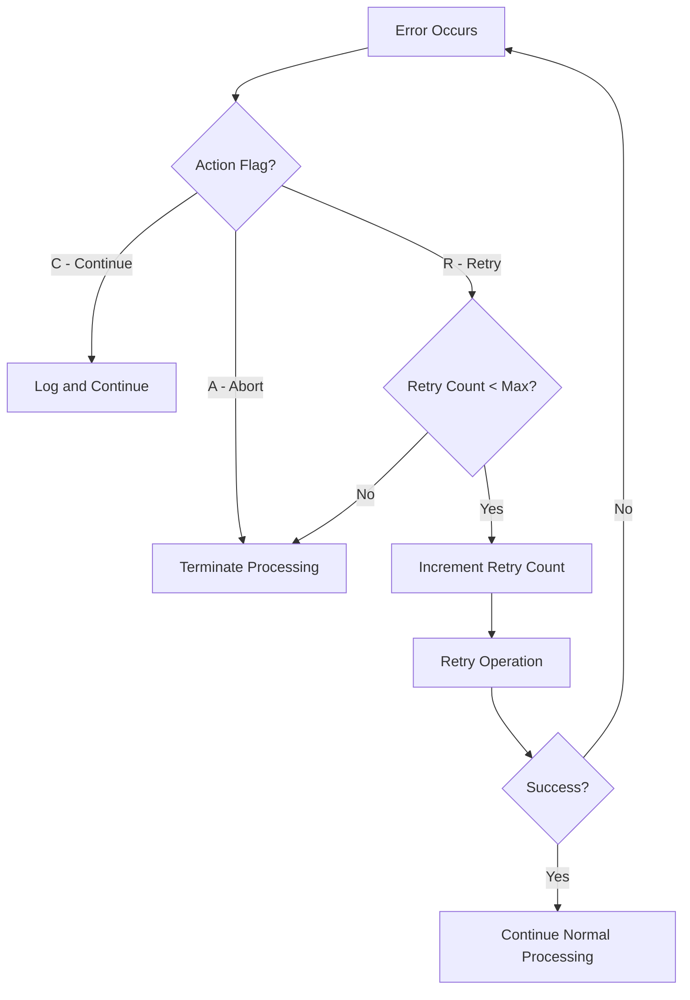

## Overview

RETHND is a copybook that provides comprehensive return code handling definitions for COBOL programs. It defines a structured approach to capturing and communicating error information, including return codes, reason codes, error locations, error types, and recovery actions.

Unlike simpler error handling copybooks that only define constants, RETHND provides a complete error context structure that captures where an error occurred, what type of error it is, and what action should be taken in response. This makes it particularly useful for complex batch processing scenarios where detailed error tracking and retry logic are required.

## Usage

```cobol
WORKING-STORAGE SECTION.
    COPY RETHND.
```

## Used By

| Program | Description |
|---------|-------------|
| CKPRST | Checkpoint/Restart Processing - uses RETURN-STATUS for checkpoint operation results |

## Data Structures

### RETURN-HANDLING (01 Level)

The main structure containing all return code handling fields.

```
+------------------+------------------+------------------+
|  RETURN-STATUS   | RETURN-DETAILS   | RETURN-ACTIONS   |
|   (22 bytes)     |   (113 bytes)    |    (5 bytes)     |
+------------------+------------------+------------------+
```

### RETURN-STATUS

Core return code information:

| Level | Name | Picture | Bytes | Description |
|-------|------|---------|-------|-------------|
| 05 | RETURN-STATUS | - | 22 | Return status group |
| 10 | RETURN-CODE | S9(4) COMP | 2 | Primary return code |
| 10 | REASON-CODE | S9(4) COMP | 2 | Secondary reason code |
| 10 | MODULE-ID | X(8) | 8 | Module/program identifier |
| 10 | FUNCTION-ID | X(8) | 8 | Function being performed |

**Return Code Conditions (88-Levels)**:

| Condition | Value | Description |
|-----------|-------|-------------|
| RC-SUCCESS | +0 | Successful completion |
| RC-WARNING | +4 | Warning condition |
| RC-ERROR | +8 | Error condition |
| RC-SEVERE | +12 | Severe error |
| RC-CRITICAL | +16 | Critical/fatal error |



### RETURN-DETAILS

Detailed error context information:

| Level | Name | Picture | Bytes | Description |
|-------|------|---------|-------|-------------|
| 05 | RETURN-DETAILS | - | 113 | Error details group |

#### ERROR-LOCATION

| Level | Name | Picture | Bytes | Description |
|-------|------|---------|-------|-------------|
| 10 | ERROR-LOCATION | - | 24 | Error location group |
| 15 | PROGRAM-NAME | X(8) | 8 | Program where error occurred |
| 15 | PARAGRAPH-NAME | X(8) | 8 | Paragraph where error occurred |
| 15 | ERROR-ROUTINE | X(8) | 8 | Error handling routine name |

#### ERROR-INFO

| Level | Name | Picture | Bytes | Description |
|-------|------|---------|-------|-------------|
| 10 | ERROR-INFO | - | 85 | Error information group |
| 15 | ERROR-TYPE | X(1) | 1 | Error type code |
| 15 | ERROR-CODE | X(4) | 4 | Specific error code |
| 15 | ERROR-TEXT | X(80) | 80 | Error message text |

**Error Type Conditions (88-Levels)**:

| Condition | Value | Description |
|-----------|-------|-------------|
| ERR-VALIDATION | 'V' | Data validation error |
| ERR-PROCESSING | 'P' | Processing/business logic error |
| ERR-DATABASE | 'D' | Database operation error |
| ERR-FILE | 'F' | File I/O error |
| ERR-SECURITY | 'S' | Security/authorization error |



#### SYSTEM-INFO

| Level | Name | Picture | Bytes | Description |
|-------|------|---------|-------|-------------|
| 10 | SYSTEM-INFO | - | 84 | System error information |
| 15 | SYSTEM-CODE | X(4) | 4 | System return/status code |
| 15 | SYSTEM-MSG | X(80) | 80 | System error message |

### RETURN-ACTIONS

Recovery action controls:

| Level | Name | Picture | Bytes | Description |
|-------|------|---------|-------|-------------|
| 05 | RETURN-ACTIONS | - | 5 | Action control group |
| 10 | ACTION-FLAG | X(1) | 1 | Action to take |
| 10 | RETRY-COUNT | 9(2) COMP | 2 | Current retry count |
| 10 | MAX-RETRIES | 9(2) COMP | 2 | Maximum retries allowed (default: 3) |

**Action Flag Conditions (88-Levels)**:

| Condition | Value | Description |
|-----------|-------|-------------|
| ACTION-CONTINUE | 'C' | Continue processing |
| ACTION-ABORT | 'A' | Abort processing |
| ACTION-RETRY | 'R' | Retry the operation |



### STD-ERROR-CODES

Predefined standard error codes:

| Level | Name | Picture | Value | Description |
|-------|------|---------|-------|-------------|
| 01 | STD-ERROR-CODES | - | - | Standard error code constants |
| 05 | ERR-INVALID-DATA | X(4) | 'E001' | Invalid data error |
| 05 | ERR-NOT-FOUND | X(4) | 'E002' | Record not found |
| 05 | ERR-DUPLICATE | X(4) | 'E003' | Duplicate record |
| 05 | ERR-FILE-ERROR | X(4) | 'E004' | File operation error |
| 05 | ERR-DB-ERROR | X(4) | 'E005' | Database error |
| 05 | ERR-SECURITY | X(4) | 'E006' | Security violation |
| 05 | ERR-PROCESSING | X(4) | 'E007' | Processing error |
| 05 | ERR-VALIDATION | X(4) | 'E008' | Validation failure |
| 05 | ERR-VERSION | X(4) | 'E009' | Version mismatch |
| 05 | ERR-TIMEOUT | X(4) | 'E010' | Timeout error |

## Usage Examples

### Basic Error Setup

```cobol
* Set up a validation error
MOVE 'PORTMSTR' TO MODULE-ID
MOVE 'VALIDATE' TO FUNCTION-ID
MOVE ERR-INVALID-DATA TO ERROR-CODE
SET ERR-VALIDATION TO TRUE
SET RC-ERROR TO TRUE
MOVE 'Invalid portfolio ID format' TO ERROR-TEXT

* Set location information
MOVE 'PORTVAL0' TO PROGRAM-NAME
MOVE '2100-VAL' TO PARAGRAPH-NAME
MOVE '9000-ERR' TO ERROR-ROUTINE
```

### Implementing Retry Logic

```cobol
* Initialize retry handling
MOVE ZERO TO RETRY-COUNT
MOVE 3 TO MAX-RETRIES
SET ACTION-RETRY TO TRUE

* Retry loop
PERFORM UNTIL ACTION-CONTINUE OR ACTION-ABORT
    PERFORM 2000-PROCESS-RECORD
    
    IF RC-SUCCESS
        SET ACTION-CONTINUE TO TRUE
    ELSE
        ADD 1 TO RETRY-COUNT
        IF RETRY-COUNT >= MAX-RETRIES
            SET ACTION-ABORT TO TRUE
            MOVE 'Max retries exceeded' TO ERROR-TEXT
        END-IF
    END-IF
END-PERFORM
```

### Database Error Handling

```cobol
* Handle DB2 error
IF SQLCODE NOT = 0
    SET ERR-DATABASE TO TRUE
    SET RC-ERROR TO TRUE
    MOVE ERR-DB-ERROR TO ERROR-CODE
    MOVE SQLCODE TO SYSTEM-CODE
    MOVE 'DB2 error occurred' TO ERROR-TEXT
    
    EVALUATE SQLCODE
        WHEN -803
            MOVE ERR-DUPLICATE TO ERROR-CODE
            MOVE 'Duplicate key violation' TO ERROR-TEXT
        WHEN -204
            MOVE ERR-NOT-FOUND TO ERROR-CODE
            MOVE 'Table not found' TO ERROR-TEXT
    END-EVALUATE
END-IF
```

### File Error Handling

```cobol
* Handle VSAM error
IF WS-FILE-STATUS NOT = '00'
    SET ERR-FILE TO TRUE
    SET RC-ERROR TO TRUE
    MOVE ERR-FILE-ERROR TO ERROR-CODE
    MOVE WS-FILE-STATUS TO SYSTEM-CODE
    
    EVALUATE WS-FILE-STATUS
        WHEN '23'
            MOVE ERR-NOT-FOUND TO ERROR-CODE
            MOVE 'Record not found' TO ERROR-TEXT
        WHEN '22'
            MOVE ERR-DUPLICATE TO ERROR-CODE
            MOVE 'Duplicate key' TO ERROR-TEXT
        WHEN OTHER
            MOVE 'Unexpected file error' TO ERROR-TEXT
    END-EVALUATE
END-IF
```

### Integration with Checkpoint/Restart

```cobol
* Call checkpoint routine with return status
CALL 'CKPTAKE' USING CHECKPOINT-CONTROL
                     RETURN-STATUS

IF NOT RC-SUCCESS
    MOVE 'CKPRST00' TO PROGRAM-NAME
    MOVE 'CKPTAKE ' TO PARAGRAPH-NAME
    
    IF RC-WARNING
        SET ACTION-CONTINUE TO TRUE
    ELSE
        SET ACTION-ABORT TO TRUE
        PERFORM 9000-ERROR-HANDLER
    END-IF
END-IF
```

## Error Code Reference

| Code | Name | Type | Description |
|------|------|------|-------------|
| E001 | ERR-INVALID-DATA | V | Invalid data format or content |
| E002 | ERR-NOT-FOUND | F/D | Record not found in file or database |
| E003 | ERR-DUPLICATE | F/D | Duplicate key or record |
| E004 | ERR-FILE-ERROR | F | General file I/O error |
| E005 | ERR-DB-ERROR | D | Database operation error |
| E006 | ERR-SECURITY | S | Security or authorization failure |
| E007 | ERR-PROCESSING | P | Business logic or processing error |
| E008 | ERR-VALIDATION | V | Data validation failure |
| E009 | ERR-VERSION | P | Version or compatibility mismatch |
| E010 | ERR-TIMEOUT | P | Operation timeout |

## Related Copybooks

| Copybook | Relationship |
|----------|-------------|
| **ERRHAND** | Simpler error constants (categories, return codes, VSAM status) |
| **RTNCODE** | Return code management with DB2 logging |
| **CKPRST** | Checkpoint/restart - primary consumer of RETHND |

## Design Notes

1. **Structured Context**: Unlike flat error codes, RETHND captures complete error context including location, type, and recovery action.

2. **Retry Support**: Built-in retry counter and maximum with action flags enable automatic retry logic.

3. **Dual Codes**: Both RETURN-CODE (severity) and ERROR-CODE (specific error) allow filtering by severity while identifying exact issues.

4. **System Integration**: SYSTEM-CODE and SYSTEM-MSG fields capture underlying system errors (SQLCODE, file status).

5. **Module Tracking**: MODULE-ID and FUNCTION-ID identify what operation was being performed when the error occurred.

6. **COMP Fields**: Return codes use binary (COMP) for efficient comparison and direct use with RETURN-CODE register.

## Best Practices

1. **Always Set Location**: Populate PROGRAM-NAME, PARAGRAPH-NAME, and ERROR-ROUTINE for debugging.

2. **Use Standard Codes**: Reference STD-ERROR-CODES constants instead of hard-coding values.

3. **Match Types**: Ensure ERROR-TYPE matches the nature of the error (V for validation, D for database, etc.).

4. **Capture System Info**: Always copy SQLCODE or file status to SYSTEM-CODE for diagnostics.

5. **Initialize on Entry**: Clear RETURN-HANDLING at program start to avoid residual data.

6. **Check Before Retry**: Always verify RETRY-COUNT < MAX-RETRIES before attempting retry.
