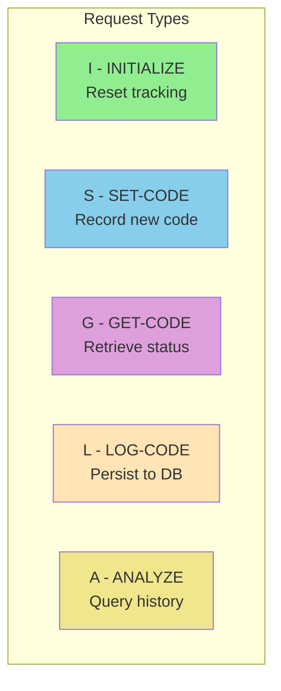
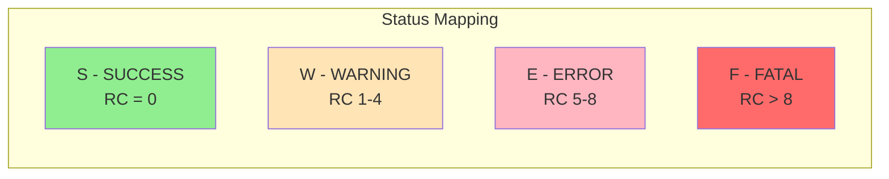
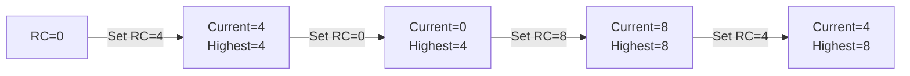

## Overview

RTNCODE is the communication area copybook for the centralized return code management system. It defines the data structure used to interact with the RTNCDE00 program, which provides standardized return code handling across all batch and utility programs.

This copybook enables programs to:
- Initialize return code tracking at program start
- Set and track return codes during execution
- Maintain a "high-water mark" of the worst return code encountered
- Log return codes to a database for audit and analysis
- Query historical return code statistics

The centralized approach ensures consistent return code handling, comprehensive audit trails, and operational visibility into batch job health.

## Record Layout

```
01  RETURN-CODE-AREA                     (Total: ~155 bytes)
    05  RC-REQUEST-TYPE                  Function code (I/S/G/L/A)
    05  RC-PROGRAM-ID                    Calling program name
    05  RC-CODES-AREA                    Return code values
        10  RC-CURRENT-CODE              Current return code
        10  RC-HIGHEST-CODE              Highest code so far
        10  RC-NEW-CODE                  New code to set
        10  RC-STATUS                    Status indicator
    05  RC-MESSAGE                       Associated message text
    05  RC-RESPONSE-CODE                 Response from RTNCDE00
    05  RC-ANALYSIS-DATA                 Analysis request/response
        10  RC-START-TIME                Analysis start timestamp
        10  RC-END-TIME                  Analysis end timestamp
        10  RC-TOTAL-CODES               Count of codes analyzed
        10  RC-MAX-CODE                  Maximum code found
        10  RC-MIN-CODE                  Minimum code found
    05  RC-RETURN-DATA                   Get code response area
        10  RC-RETURN-VALUE              Retrieved current code
        10  RC-HIGHEST-RETURN            Retrieved highest code
        10  RC-RETURN-STATUS             Retrieved status
```

## Field Definitions

### RC-REQUEST-TYPE - Function Code

Specifies the operation to perform when calling RTNCDE00.

| Field | Picture | Description |
|-------|---------|-------------|
| RC-REQUEST-TYPE | X(1) | Function request code |

#### Condition Names (88-levels)

| Condition | Value | Description |
|-----------|-------|-------------|
| RC-INITIALIZE | 'I' | Initialize return code tracking |
| RC-SET-CODE | 'S' | Set a new return code |
| RC-GET-CODE | 'G' | Get current return code info |
| RC-LOG-CODE | 'L' | Log return code to database |
| RC-ANALYZE | 'A' | Analyze historical return codes |



### RC-PROGRAM-ID - Program Identifier

| Field | Picture | Length | Description |
|-------|---------|--------|-------------|
| RC-PROGRAM-ID | X(8) | 8 | Name of the calling program |

### RC-CODES-AREA - Return Code Values

Core return code tracking fields.

| Field | Picture | Length | Description |
|-------|---------|--------|-------------|
| RC-CURRENT-CODE | S9(4) COMP | 2 | Current active return code |
| RC-HIGHEST-CODE | S9(4) COMP | 2 | Highest (worst) code encountered |
| RC-NEW-CODE | S9(4) COMP | 2 | New code to set (input for SET) |
| RC-STATUS | X(1) | 1 | Current status indicator |

#### RC-STATUS Condition Names (88-levels)

| Condition | Value | Description |
|-----------|-------|-------------|
| RC-STATUS-SUCCESS | 'S' | Success (code = 0) |
| RC-STATUS-WARNING | 'W' | Warning (code 1-4) |
| RC-STATUS-ERROR | 'E' | Error (code 5-8) |
| RC-STATUS-SEVERE | 'F' | Fatal/Severe (code > 8) |



### RC-MESSAGE - Message Text

| Field | Picture | Length | Description |
|-------|---------|--------|-------------|
| RC-MESSAGE | X(80) | 80 | Descriptive message for logging |

### RC-RESPONSE-CODE - Service Response

| Field | Picture | Length | Description |
|-------|---------|--------|-------------|
| RC-RESPONSE-CODE | S9(8) COMP | 4 | Response from RTNCDE00 (0=success) |

### RC-ANALYSIS-DATA - Analysis Request/Response

Fields used for the ANALYZE function to query historical return codes.

| Field | Picture | Length | Description |
|-------|---------|--------|-------------|
| RC-START-TIME | X(26) | 26 | Analysis period start timestamp |
| RC-END-TIME | X(26) | 26 | Analysis period end timestamp |
| RC-TOTAL-CODES | S9(8) COMP | 4 | Count of return codes in period |
| RC-MAX-CODE | S9(4) COMP | 2 | Maximum return code found |
| RC-MIN-CODE | S9(4) COMP | 2 | Minimum return code found |

**Timestamp Format:** `YYYY-MM-DD-HH.MM.SS.MMMMMM` (DB2 compatible)

### RC-RETURN-DATA - Get Code Response

Fields populated by the GET-CODE function.

| Field | Picture | Length | Description |
|-------|---------|--------|-------------|
| RC-RETURN-VALUE | S9(4) COMP | 2 | Current return code value |
| RC-HIGHEST-RETURN | S9(4) COMP | 2 | Highest return code value |
| RC-RETURN-STATUS | X(1) | 1 | Current status character |

## Function Reference

### INITIALIZE (RC-INITIALIZE = 'I')

Resets all return code tracking for a new program execution.

**Input Fields:**
- RC-PROGRAM-ID (required)

**Output Fields:**
- RC-CURRENT-CODE = 0
- RC-HIGHEST-CODE = 0
- RC-STATUS = 'S'
- RC-RESPONSE-CODE = 0

### SET-CODE (RC-SET-CODE = 'S')

Records a new return code and updates the high-water mark.

**Input Fields:**
- RC-PROGRAM-ID
- RC-NEW-CODE (the code to set)
- RC-MESSAGE (optional descriptive text)

**Output Fields:**
- RC-CURRENT-CODE = RC-NEW-CODE
- RC-HIGHEST-CODE = MAX(RC-HIGHEST-CODE, RC-NEW-CODE)
- RC-STATUS = derived from RC-NEW-CODE
- RC-RESPONSE-CODE = 0

**Status Derivation:**
| Code Range | Status Set |
|------------|------------|
| 0 | RC-STATUS-SUCCESS ('S') |
| 1-4 | RC-STATUS-WARNING ('W') |
| 5-8 | RC-STATUS-ERROR ('E') |
| > 8 | RC-STATUS-SEVERE ('F') |

### GET-CODE (RC-GET-CODE = 'G')

Retrieves the current return code tracking information.

**Input Fields:**
- RC-PROGRAM-ID

**Output Fields:**
- RC-RETURN-VALUE = current code
- RC-HIGHEST-RETURN = highest code
- RC-RETURN-STATUS = current status
- RC-RESPONSE-CODE = 0

### LOG-CODE (RC-LOG-CODE = 'L')

Persists the current return code to the RTNCODES database table.

**Input Fields:**
- RC-PROGRAM-ID
- RC-MESSAGE

**Output Fields:**
- RC-RESPONSE-CODE = 0 (success) or 8 (DB error)

### ANALYZE (RC-ANALYZE = 'A')

Queries historical return codes for a program within a date range.

**Input Fields:**
- RC-PROGRAM-ID
- RC-START-TIME
- RC-END-TIME

**Output Fields:**
- RC-TOTAL-CODES = count of records
- RC-MAX-CODE = worst return code in period
- RC-MIN-CODE = best return code in period
- RC-RESPONSE-CODE = 0 (success) or 8 (DB error)

## Usage Examples

### Basic Program Flow

```cobol
WORKING-STORAGE SECTION.
    COPY RTNCODE.

PROCEDURE DIVISION.
0000-MAIN.
*   Initialize at program start
    SET RC-INITIALIZE TO TRUE
    MOVE 'MYPROG01' TO RC-PROGRAM-ID
    CALL 'RTNCDE00' USING RETURN-CODE-AREA
    
    PERFORM 1000-PROCESS
    
*   Get final return code
    SET RC-GET-CODE TO TRUE
    CALL 'RTNCDE00' USING RETURN-CODE-AREA
    
    MOVE RC-HIGHEST-RETURN TO RETURN-CODE
    GOBACK.
```

### Setting Return Codes

```cobol
2000-VALIDATE-DATA.
*   Validation found a warning condition
    SET RC-SET-CODE TO TRUE
    MOVE 4 TO RC-NEW-CODE
    MOVE 'Data validation warning - missing optional field'
      TO RC-MESSAGE
    CALL 'RTNCDE00' USING RETURN-CODE-AREA
    .

2100-PROCESS-ERROR.
*   Processing error occurred
    SET RC-SET-CODE TO TRUE
    MOVE 8 TO RC-NEW-CODE
    MOVE 'File processing error - invalid record format'
      TO RC-MESSAGE
    CALL 'RTNCDE00' USING RETURN-CODE-AREA
    
*   Log the error
    SET RC-LOG-CODE TO TRUE
    CALL 'RTNCDE00' USING RETURN-CODE-AREA
    .
```

### Analyzing Historical Data

```cobol
3000-ANALYZE-HISTORY.
*   Check last month's return codes for BATCHJOB
    SET RC-ANALYZE TO TRUE
    MOVE 'BATCHJOB' TO RC-PROGRAM-ID
    MOVE '2024-01-01-00.00.00.000000' TO RC-START-TIME
    MOVE '2024-01-31-23.59.59.999999' TO RC-END-TIME
    
    CALL 'RTNCDE00' USING RETURN-CODE-AREA
    
    IF RC-RESPONSE-CODE = 0
        DISPLAY 'Analysis for BATCHJOB:'
        DISPLAY '  Total executions: ' RC-TOTAL-CODES
        DISPLAY '  Worst return code: ' RC-MAX-CODE
        DISPLAY '  Best return code: ' RC-MIN-CODE
        
        IF RC-MAX-CODE > 4
            DISPLAY '  WARNING: Errors detected in period'
        END-IF
    ELSE
        DISPLAY 'Analysis query failed'
    END-IF
    .
```

### Conditional Logging

```cobol
4000-CONDITIONAL-LOG.
*   Only log if there was an error
    SET RC-GET-CODE TO TRUE
    CALL 'RTNCDE00' USING RETURN-CODE-AREA
    
    IF RC-RETURN-VALUE > 0
        MOVE 'Process completed with issues' TO RC-MESSAGE
        SET RC-LOG-CODE TO TRUE
        CALL 'RTNCDE00' USING RETURN-CODE-AREA
    END-IF
    .
```

## Programs Using This Copybook

| Program | Description | Primary Functions Used |
|---------|-------------|------------------------|
| [RTNCDE00](/docs/programs/RTNCDE00) | Return Code Handler | Service provider |
| [RPTAUD00](/docs/programs/RPTAUD00) | Audit Report | SET, LOG |
| [RPTPOS00](/docs/programs/RPTPOS00) | Position Report | SET, GET |
| [RPTSTA00](/docs/programs/RPTSTA00) | Status Report | SET, GET, LOG |
| [TSTGEN00](/docs/programs/TSTGEN00) | Test Data Generator | INIT, SET, GET |
| [TSTVAL00](/docs/programs/TSTVAL00) | Test Validation | INIT, SET, GET |
| [UTLMNT00](/docs/programs/UTLMNT00) | Maintenance Utility | INIT, SET, GET |
| [UTLMON00](/docs/programs/UTLMON00) | Monitoring Utility | ANALYZE |
| [UTLVAL00](/docs/programs/UTLVAL00) | Validation Utility | SET, LOG |

## Related Copybooks

| Copybook | Relationship |
|----------|--------------|
| [ERRHAND](/docs/copybooks/ERRHAND) | Error handling (complementary) |
| [BCHCON](/docs/copybooks/BCHCON) | Batch constants (similar RC values) |
| [COMMON](/docs/copybooks/COMMON) | Common definitions (similar RC values) |

## Database Table

The LOG-CODE and ANALYZE functions interact with the RTNCODES table:

```sql
CREATE TABLE RTNCODES (
    TIMESTAMP      CHAR(26)     NOT NULL,
    PROGRAM_ID     CHAR(8)      NOT NULL,
    RETURN_CODE    SMALLINT     NOT NULL,
    HIGHEST_CODE   SMALLINT     NOT NULL,
    STATUS_CODE    CHAR(1)      NOT NULL,
    MESSAGE_TEXT   CHAR(80)
);

CREATE INDEX RTNCODES_IX1 
    ON RTNCODES (PROGRAM_ID, TIMESTAMP);
```

## Technical Notes

### COMP Fields

Binary fields for efficient arithmetic and storage:

| Field | PIC Clause | Bytes | Range |
|-------|------------|-------|-------|
| S9(4) COMP | Halfword | 2 | -32,768 to +32,767 |
| S9(8) COMP | Fullword | 4 | -2.1B to +2.1B |

### High-Water Mark Pattern

The RC-HIGHEST-CODE field implements a "high-water mark" pattern:
- Always tracks the worst (highest) return code
- Never decreases during program execution
- Used for final RETURN-CODE at program end
- Ensures batch schedulers see the worst outcome



### Timestamp Format

The 26-character timestamp format is DB2 compatible:
```
YYYY-MM-DD-HH.MM.SS.MMMMMM
2024-03-15-14.30.45.123456
```

### Response Codes

| RC-RESPONSE-CODE | Meaning |
|------------------|---------|
| 0 | Operation successful |
| 8 | Database error (LOG or ANALYZE) |

## Best Practices

1. **Always initialize** at program start with RC-INITIALIZE
2. **Set codes immediately** when conditions are detected
3. **Include meaningful messages** for LOG operations
4. **Use high-water mark** (RC-HIGHEST-RETURN) for final RETURN-CODE
5. **Log significant events** (errors, warnings) for audit trail
6. **Check RC-RESPONSE-CODE** after LOG and ANALYZE calls

## Typical Program Pattern

```cobol
PROCEDURE DIVISION.
0000-MAIN.
*   1. Initialize
    SET RC-INITIALIZE TO TRUE
    MOVE 'PROGNAME' TO RC-PROGRAM-ID
    CALL 'RTNCDE00' USING RETURN-CODE-AREA
    
*   2. Process (set codes as needed)
    PERFORM 1000-PROCESS
    
*   3. Log if errors
    IF RC-HIGHEST-CODE > 0
        SET RC-LOG-CODE TO TRUE
        CALL 'RTNCDE00' USING RETURN-CODE-AREA
    END-IF
    
*   4. Return highest code
    SET RC-GET-CODE TO TRUE
    CALL 'RTNCDE00' USING RETURN-CODE-AREA
    MOVE RC-HIGHEST-RETURN TO RETURN-CODE
    
    GOBACK.
```
