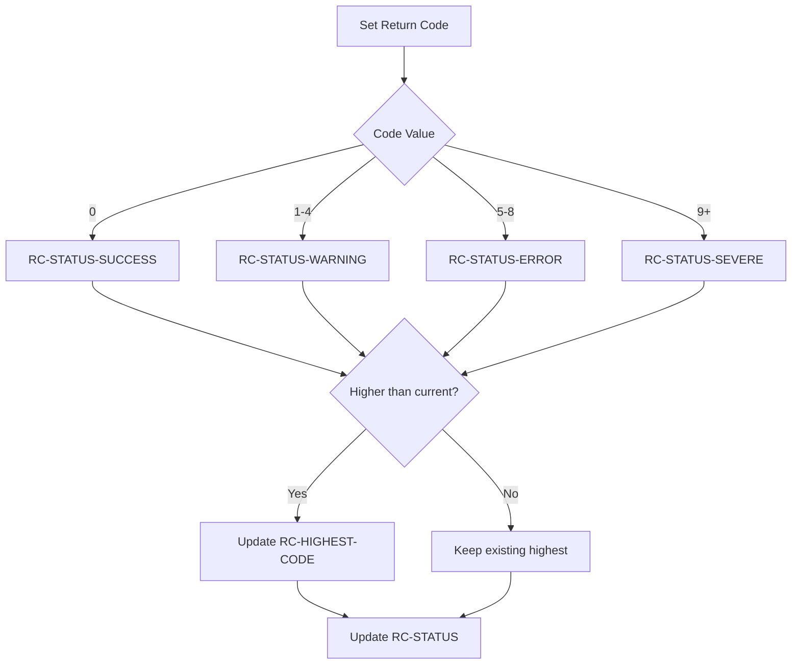

## Overview

RTNCODE (Return Code) is a copybook that provides a comprehensive structure for managing return codes across batch programs. It supports multiple operations including initialization, setting codes, retrieving codes, logging, and analysis of return code patterns.

The copybook enables programs to track not just the current return code but also the highest code encountered during execution, providing valuable information for job scheduling decisions and error analysis. It includes support for timestamped analysis data and status categorization.

RTNCODE is designed to work with a return code management service (typically RTNCDE00) that processes requests based on the RC-REQUEST-TYPE field.

## Data Structure

### Structure Overview

```
01  RETURN-CODE-AREA
    05  RC-REQUEST-TYPE      - Operation to perform
    05  RC-PROGRAM-ID        - Program identifier
    05  RC-CODES-AREA        - Current/highest codes and status
    05  RC-MESSAGE           - Associated message text
    05  RC-RESPONSE-CODE     - Service response code
    05  RC-ANALYSIS-DATA     - Timing and statistics
    05  RC-RETURN-DATA       - Final return values
```

## Field Definitions

### Request Type (RC-REQUEST-TYPE)

Controls the operation performed by the return code service:

| Field | Picture | Description |
|-------|---------|-------------|
| RC-REQUEST-TYPE | X | Operation code |

**88-Level Conditions:**

| Condition | Value | Description |
|-----------|-------|-------------|
| RC-INITIALIZE | 'I' | Initialize return code tracking |
| RC-SET-CODE | 'S' | Set/update return code |
| RC-GET-CODE | 'G' | Retrieve current return code |
| RC-LOG-CODE | 'L' | Log return code to audit trail |
| RC-ANALYZE | 'A' | Analyze return code patterns |

### Program Identification

| Field | Picture | Description |
|-------|---------|-------------|
| RC-PROGRAM-ID | X(8) | Program name for tracking |

### Codes Area (RC-CODES-AREA)

Core return code tracking fields:

| Field | Picture | Description |
|-------|---------|-------------|
| RC-CURRENT-CODE | S9(4) COMP | Current return code value |
| RC-HIGHEST-CODE | S9(4) COMP | Highest code encountered |
| RC-NEW-CODE | S9(4) COMP | New code being set |
| RC-STATUS | X | Status category |

**RC-STATUS Values (88-level conditions):**

| Condition | Value | Meaning | Typical RC Range |
|-----------|-------|---------|------------------|
| RC-STATUS-SUCCESS | 'S' | Successful | 0 |
| RC-STATUS-WARNING | 'W' | Warning | 1-4 |
| RC-STATUS-ERROR | 'E' | Error | 5-8 |
| RC-STATUS-SEVERE | 'F' | Severe/Fatal | 9-16+ |

### Message Field

| Field | Picture | Description |
|-------|---------|-------------|
| RC-MESSAGE | X(80) | Descriptive message for the return code |

### Response Code

| Field | Picture | Description |
|-------|---------|-------------|
| RC-RESPONSE-CODE | S9(8) COMP | Response from RC service |

### Analysis Data (RC-ANALYSIS-DATA)

Fields for return code analysis and timing:

| Field | Picture | Description |
|-------|---------|-------------|
| RC-START-TIME | X(26) | Processing start timestamp |
| RC-END-TIME | X(26) | Processing end timestamp |
| RC-TOTAL-CODES | S9(8) COMP | Total codes recorded |
| RC-MAX-CODE | S9(4) COMP | Maximum code in analysis |
| RC-MIN-CODE | S9(4) COMP | Minimum code in analysis |

### Return Data (RC-RETURN-DATA)

Final return values for program termination:

| Field | Picture | Description |
|-------|---------|-------------|
| RC-RETURN-VALUE | S9(4) COMP | Value to return to OS/caller |
| RC-HIGHEST-RETURN | S9(4) COMP | Highest return in job step |
| RC-RETURN-STATUS | X | Final status indicator |

## Usage

### Including the Copybook

```cobol
WORKING-STORAGE SECTION.
    COPY RTNCODE.
```

### Example: Initializing Return Code Tracking

```cobol
INITIALIZE RETURN-CODE-AREA
SET RC-INITIALIZE TO TRUE
MOVE 'MYPROGRAM' TO RC-PROGRAM-ID
ACCEPT RC-START-TIME FROM TIME STAMP

CALL 'RTNCDE00' USING RETURN-CODE-AREA

IF RC-RESPONSE-CODE NOT = 0
    DISPLAY 'RC initialization failed'
END-IF
```

### Example: Setting a Return Code

```cobol
SET RC-SET-CODE TO TRUE
MOVE 'MYPROGRAM' TO RC-PROGRAM-ID
MOVE 4 TO RC-NEW-CODE
MOVE 'Warning: Some records skipped' TO RC-MESSAGE

CALL 'RTNCDE00' USING RETURN-CODE-AREA

* After call, RC-CURRENT-CODE and RC-HIGHEST-CODE are updated
* RC-STATUS is set based on the code value
```

### Example: Getting the Highest Return Code

```cobol
SET RC-GET-CODE TO TRUE
MOVE 'MYPROGRAM' TO RC-PROGRAM-ID

CALL 'RTNCDE00' USING RETURN-CODE-AREA

EVALUATE TRUE
    WHEN RC-STATUS-SUCCESS
        DISPLAY 'Processing completed successfully'
    WHEN RC-STATUS-WARNING
        DISPLAY 'Completed with warnings, RC=' RC-HIGHEST-CODE
    WHEN RC-STATUS-ERROR
        DISPLAY 'Errors occurred, RC=' RC-HIGHEST-CODE
    WHEN RC-STATUS-SEVERE
        DISPLAY 'Severe errors, RC=' RC-HIGHEST-CODE
END-EVALUATE
```

### Example: Logging Return Code

```cobol
SET RC-LOG-CODE TO TRUE
MOVE 'MYPROGRAM' TO RC-PROGRAM-ID
MOVE 8 TO RC-NEW-CODE
MOVE 'File not found: INPUTFILE' TO RC-MESSAGE

CALL 'RTNCDE00' USING RETURN-CODE-AREA

* Return code and message are written to audit log
```

### Example: Program Termination Pattern

```cobol
3000-TERMINATE.
    SET RC-GET-CODE TO TRUE
    MOVE 'MYPROGRAM' TO RC-PROGRAM-ID
    ACCEPT RC-END-TIME FROM TIME STAMP
    
    CALL 'RTNCDE00' USING RETURN-CODE-AREA
    
    MOVE RC-HIGHEST-CODE TO RC-RETURN-VALUE
    MOVE RC-RETURN-VALUE TO RETURN-CODE
    
    DISPLAY 'Program ended with RC=' RC-RETURN-VALUE
    DISPLAY 'Status: ' RC-STATUS
    .
```

### Example: Analyzing Return Codes

```cobol
SET RC-ANALYZE TO TRUE
MOVE 'MYPROGRAM' TO RC-PROGRAM-ID

CALL 'RTNCDE00' USING RETURN-CODE-AREA

DISPLAY 'Analysis Results:'
DISPLAY '  Start Time:   ' RC-START-TIME
DISPLAY '  End Time:     ' RC-END-TIME
DISPLAY '  Total Codes:  ' RC-TOTAL-CODES
DISPLAY '  Maximum Code: ' RC-MAX-CODE
DISPLAY '  Minimum Code: ' RC-MIN-CODE
```

## Return Code Standards

### Standard Return Code Values

| Code | Status | Meaning | Job Scheduler Action |
|------|--------|---------|---------------------|
| 0 | Success | Normal completion | Continue |
| 4 | Warning | Minor issues, processing complete | Continue, review log |
| 8 | Error | Significant errors occurred | May hold dependent jobs |
| 12 | Severe | Severe error, partial processing | Hold job stream |
| 16 | Critical | Fatal error, no processing | Abort job stream |

### Return Code Decision Logic



## Programs Using This Copybook

| Program | Description |
|---------|-------------|
| RPTAUD00 | Audit report generator |
| RPTPOS00 | Position report generator |
| RPTSTA00 | Status report generator |
| RTNCDE00 | Return code management service |
| TSTGEN00 | Test data generator |
| TSTVAL00 | Test validation program |
| UTLMNT00 | Maintenance utility |
| UTLMON00 | System monitoring utility |
| UTLVAL00 | Validation utility |

## Related Copybooks

| Copybook | Relationship |
|----------|--------------|
| ERRHAND | Error handling - works alongside RTNCODE for error management |
| BCHCON | Batch constants - defines standard return code thresholds |

## Design Patterns

### Highest Code Tracking

The structure maintains both RC-CURRENT-CODE and RC-HIGHEST-CODE. This allows programs to:
- Track the most recent operation's return code
- Remember the worst condition encountered
- Make final return code decisions based on overall execution

```cobol
* Pattern: Always return highest code encountered
IF RC-NEW-CODE > RC-HIGHEST-CODE
    MOVE RC-NEW-CODE TO RC-HIGHEST-CODE
END-IF
```

### Status Categorization

The RC-STATUS field provides a simplified view of the return code:
- Useful for EVALUATE statements
- Simplifies conditional logic
- Provides consistent status reporting

### Message Association

The RC-MESSAGE field allows descriptive text to accompany each return code:
- Aids in debugging and log analysis
- Provides context for non-zero return codes
- Can be written to logs or displayed

## Technical Notes

### COMP Fields

All numeric codes use `S9(4) COMP` (binary halfword):
- Efficient for comparisons
- Standard format for system return codes
- Range: -32768 to +32767

### Timestamp Format

RC-START-TIME and RC-END-TIME use X(26) to hold ISO timestamps:
- Format: YYYY-MM-DD-HH.MM.SS.ffffff
- Obtained via `ACCEPT ... FROM TIME STAMP`

### Service-Oriented Design

The copybook is designed for use with a return code service:
- Set RC-REQUEST-TYPE to indicate operation
- CALL the service program
- Check RC-RESPONSE-CODE for success
- Access updated fields

### Thread Safety Considerations

Each program should have its own RETURN-CODE-AREA:
- Do not share across programs without synchronization
- Initialize at program start
- Finalize at program end

## Version History

| Version | Date | Description |
|---------|------|-------------|
| 1.0 | 2024 | Initial creation |
