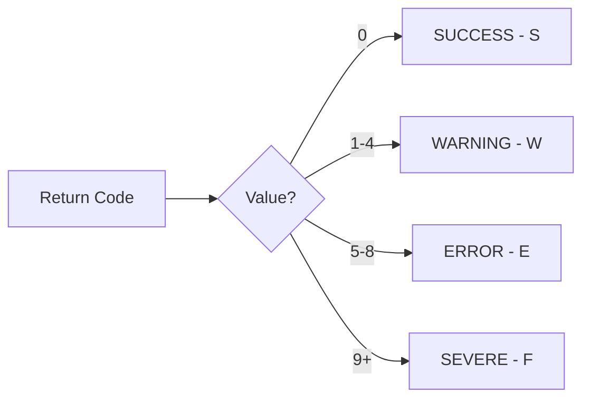

## Overview

RTNCODE (Return Code) is a copybook that provides a comprehensive framework for managing return codes across batch and utility programs in the portfolio management system. It supports multiple operations including initialization, setting codes, retrieving codes, logging, and analysis of return code patterns.

This copybook enables:
- **Centralized Return Code Management**: Consistent handling of return codes across programs
- **Highest Code Tracking**: Automatically tracks the highest (most severe) return code encountered
- **Return Code Analysis**: Supports statistical analysis of return codes over time
- **Status Classification**: Maps numeric codes to status categories (Success/Warning/Error/Severe)
- **Logging Integration**: Provides structures for return code logging and reporting

## Structure Diagram

```mermaid
graph TD
    A[RETURN-CODE-AREA] --> B[RC-REQUEST-TYPE]
    A --> C[RC-PROGRAM-ID]
    A --> D[RC-CODES-AREA]
    A --> E[RC-MESSAGE]
    A --> F[RC-RESPONSE-CODE]
    A --> G[RC-ANALYSIS-DATA]
    A --> H[RC-RETURN-DATA]
    
    B --> B1[RC-INITIALIZE]
    B --> B2[RC-SET-CODE]
    B --> B3[RC-GET-CODE]
    B --> B4[RC-LOG-CODE]
    B --> B5[RC-ANALYZE]
    
    D --> D1[RC-CURRENT-CODE]
    D --> D2[RC-HIGHEST-CODE]
    D --> D3[RC-NEW-CODE]
    D --> D4[RC-STATUS]
    
    G --> G1[RC-START-TIME]
    G --> G2[RC-END-TIME]
    G --> G3[RC-TOTAL-CODES]
    G --> G4[RC-MAX-CODE]
    G --> G5[RC-MIN-CODE]
    
    H --> H1[RC-RETURN-VALUE]
    H --> H2[RC-HIGHEST-RETURN]
    H --> H3[RC-RETURN-STATUS]
```



## Data Definitions

### RETURN-CODE-AREA (Level 01)

The main structure for return code management operations.

### RC-REQUEST-TYPE - Operation Type

Specifies the operation to perform on the return code area.

| Level | Name | Picture | Description |
|-------|------|---------|-------------|
| 05 | RC-REQUEST-TYPE | X | Operation type code |

**Request Type Values (88-levels):**

| Condition | Value | Description |
|-----------|-------|-------------|
| RC-INITIALIZE | 'I' | Initialize return code tracking |
| RC-SET-CODE | 'S' | Set a new return code |
| RC-GET-CODE | 'G' | Get current return code |
| RC-LOG-CODE | 'L' | Log the return code |
| RC-ANALYZE | 'A' | Analyze return code history |

### RC-PROGRAM-ID - Program Identifier

| Level | Name | Picture | Description |
|-------|------|---------|-------------|
| 05 | RC-PROGRAM-ID | X(8) | Program name for tracking |

### RC-CODES-AREA - Return Code Values

Contains the current state of return codes.

| Level | Name | Picture | Description |
|-------|------|---------|-------------|
| 05 | RC-CODES-AREA | - | Return codes group |
| 10 | RC-CURRENT-CODE | S9(4) COMP | Current return code |
| 10 | RC-HIGHEST-CODE | S9(4) COMP | Highest code encountered |
| 10 | RC-NEW-CODE | S9(4) COMP | New code to set |
| 10 | RC-STATUS | X | Status classification |

**RC-STATUS Values (88-levels):**

| Condition | Value | Code Range | Description |
|-----------|-------|------------|-------------|
| RC-STATUS-SUCCESS | 'S' | 0 | Successful completion |
| RC-STATUS-WARNING | 'W' | 1-4 | Completed with warnings |
| RC-STATUS-ERROR | 'E' | 5-8 | Error occurred |
| RC-STATUS-SEVERE | 'F' | 9+ | Severe/fatal error |

### RC-MESSAGE - Message Text

| Level | Name | Picture | Description |
|-------|------|---------|-------------|
| 05 | RC-MESSAGE | X(80) | Descriptive message for the return code |

### RC-RESPONSE-CODE - Response Code

| Level | Name | Picture | Description |
|-------|------|---------|-------------|
| 05 | RC-RESPONSE-CODE | S9(8) COMP | Extended response code |

### RC-ANALYSIS-DATA - Analysis Information

Statistical data for return code analysis.

| Level | Name | Picture | Description |
|-------|------|---------|-------------|
| 05 | RC-ANALYSIS-DATA | - | Analysis data group |
| 10 | RC-START-TIME | X(26) | Analysis start timestamp |
| 10 | RC-END-TIME | X(26) | Analysis end timestamp |
| 10 | RC-TOTAL-CODES | S9(8) COMP | Total codes processed |
| 10 | RC-MAX-CODE | S9(4) COMP | Maximum code in range |
| 10 | RC-MIN-CODE | S9(4) COMP | Minimum code in range |

### RC-RETURN-DATA - Return Information

Final return values for program completion.

| Level | Name | Picture | Description |
|-------|------|---------|-------------|
| 05 | RC-RETURN-DATA | - | Return data group |
| 10 | RC-RETURN-VALUE | S9(4) COMP | Return value to use |
| 10 | RC-HIGHEST-RETURN | S9(4) COMP | Highest return across calls |
| 10 | RC-RETURN-STATUS | X | Final return status |

## Record Layout

```
Position  Length  Field Name           Format       Description
--------  ------  -------------------  -----------  -------------------------
1         1       RC-REQUEST-TYPE      X            Operation type
2-9       8       RC-PROGRAM-ID        X(8)         Program identifier
10-11     2       RC-CURRENT-CODE      S9(4) COMP   Current code
12-13     2       RC-HIGHEST-CODE      S9(4) COMP   Highest code
14-15     2       RC-NEW-CODE          S9(4) COMP   New code to set
16        1       RC-STATUS            X            Status classification
17-96     80      RC-MESSAGE           X(80)        Message text
97-100    4       RC-RESPONSE-CODE     S9(8) COMP   Extended response
101-126   26      RC-START-TIME        X(26)        Start timestamp
127-152   26      RC-END-TIME          X(26)        End timestamp
153-156   4       RC-TOTAL-CODES       S9(8) COMP   Total codes
157-158   2       RC-MAX-CODE          S9(4) COMP   Maximum code
159-160   2       RC-MIN-CODE          S9(4) COMP   Minimum code
161-162   2       RC-RETURN-VALUE      S9(4) COMP   Return value
163-164   2       RC-HIGHEST-RETURN    S9(4) COMP   Highest return
165       1       RC-RETURN-STATUS     X            Return status
```

**Total Structure Length: 165 bytes**

## Usage

### Including the Copybook

```cobol
       WORKING-STORAGE SECTION.
           COPY RTNCODE.
```

### Initializing Return Code Tracking

```cobol
       INIT-RETURN-CODES.
           INITIALIZE RETURN-CODE-AREA
           SET RC-INITIALIZE TO TRUE
           MOVE 'MYPROG  ' TO RC-PROGRAM-ID
           ACCEPT RC-START-TIME FROM TIME STAMP
           MOVE ZEROS TO RC-CURRENT-CODE
           MOVE ZEROS TO RC-HIGHEST-CODE
           SET RC-STATUS-SUCCESS TO TRUE.
```

### Setting a Return Code

```cobol
       SET-RETURN-CODE.
           SET RC-SET-CODE TO TRUE
           MOVE WS-NEW-CODE TO RC-NEW-CODE
           
           IF RC-NEW-CODE > RC-HIGHEST-CODE
               MOVE RC-NEW-CODE TO RC-HIGHEST-CODE
           END-IF
           
           MOVE RC-NEW-CODE TO RC-CURRENT-CODE
           
           EVALUATE TRUE
               WHEN RC-CURRENT-CODE = 0
                   SET RC-STATUS-SUCCESS TO TRUE
               WHEN RC-CURRENT-CODE <= 4
                   SET RC-STATUS-WARNING TO TRUE
               WHEN RC-CURRENT-CODE <= 8
                   SET RC-STATUS-ERROR TO TRUE
               WHEN OTHER
                   SET RC-STATUS-SEVERE TO TRUE
           END-EVALUATE
           
           ADD 1 TO RC-TOTAL-CODES.
```

### Getting Current Return Code

```cobol
       GET-RETURN-CODE.
           SET RC-GET-CODE TO TRUE
           MOVE RC-CURRENT-CODE TO WS-PROGRAM-RC
           MOVE RC-HIGHEST-CODE TO WS-HIGHEST-RC
           MOVE RC-STATUS TO WS-STATUS-FLAG.
```

### Logging Return Code

```cobol
       LOG-RETURN-CODE.
           SET RC-LOG-CODE TO TRUE
           STRING 'Program ' DELIMITED SIZE
                  RC-PROGRAM-ID DELIMITED SPACE
                  ' ended with RC=' DELIMITED SIZE
                  RC-CURRENT-CODE DELIMITED SIZE
             INTO RC-MESSAGE
           DISPLAY RC-MESSAGE.
```

### Analyzing Return Codes

```cobol
       ANALYZE-RETURN-CODES.
           SET RC-ANALYZE TO TRUE
           ACCEPT RC-END-TIME FROM TIME STAMP
           
           DISPLAY 'Return Code Analysis for ' RC-PROGRAM-ID
           DISPLAY '  Start Time:    ' RC-START-TIME
           DISPLAY '  End Time:      ' RC-END-TIME
           DISPLAY '  Total Codes:   ' RC-TOTAL-CODES
           DISPLAY '  Highest Code:  ' RC-HIGHEST-CODE
           DISPLAY '  Final Status:  ' RC-STATUS.
```

### Complete Return Code Management Example

```cobol
       PROCEDURE DIVISION.
       0000-MAIN.
           PERFORM 1000-INITIALIZE
           PERFORM 2000-PROCESS
           PERFORM 3000-TERMINATE
           GOBACK.
           
       1000-INITIALIZE.
           INITIALIZE RETURN-CODE-AREA
           SET RC-INITIALIZE TO TRUE
           MOVE 'MYPROG  ' TO RC-PROGRAM-ID
           ACCEPT RC-START-TIME FROM TIME STAMP.
           
       2000-PROCESS.
           * Processing that may set various return codes
           PERFORM 2100-STEP-ONE
           PERFORM 2200-STEP-TWO
           PERFORM 2300-STEP-THREE.
           
       2100-STEP-ONE.
           * Successful step
           MOVE 0 TO RC-NEW-CODE
           PERFORM UPDATE-RETURN-CODE.
           
       2200-STEP-TWO.
           * Step with warning
           MOVE 4 TO RC-NEW-CODE
           MOVE 'Minor data issue detected' TO RC-MESSAGE
           PERFORM UPDATE-RETURN-CODE.
           
       2300-STEP-THREE.
           * Step completes OK
           MOVE 0 TO RC-NEW-CODE
           PERFORM UPDATE-RETURN-CODE.
           
       UPDATE-RETURN-CODE.
           SET RC-SET-CODE TO TRUE
           IF RC-NEW-CODE > RC-HIGHEST-CODE
               MOVE RC-NEW-CODE TO RC-HIGHEST-CODE
           END-IF
           MOVE RC-NEW-CODE TO RC-CURRENT-CODE
           ADD 1 TO RC-TOTAL-CODES.
           
       3000-TERMINATE.
           ACCEPT RC-END-TIME FROM TIME STAMP
           MOVE RC-HIGHEST-CODE TO RC-RETURN-VALUE
           MOVE RC-RETURN-VALUE TO RETURN-CODE
           
           DISPLAY 'Program complete. Highest RC: ' 
                   RC-HIGHEST-CODE.
```

## Programs Using This Copybook

| Program | Description |
|---------|-------------|
| RPTAUD00 | Audit report generator |
| RPTPOS00 | Position report generator |
| RPTSTA00 | Status report generator |
| RTNCDE00 | Return code management utility |
| TSTGEN00 | Test data generation program |
| TSTVAL00 | Test validation program |
| UTLMNT00 | Maintenance utility |
| UTLMON00 | System monitoring utility |
| UTLVAL00 | Validation utility |

## Related Copybooks

| Copybook | Relationship |
|----------|--------------|
| ERRHAND | Error handling definitions (complementary error codes) |
| BCHCON | Batch control constants (includes return code thresholds) |

## Return Code Standards

### IBM z/OS Conventions

| Code | Meaning | Typical Action |
|------|---------|----------------|
| 0 | Success | Continue normally |
| 4 | Warning | Log and continue |
| 8 | Error | Review, may continue |
| 12 | Severe | Stop processing |
| 16 | Critical | Immediate attention |

### Status Mapping



## Design Considerations

### COMP Fields

Numeric fields use `COMP` (binary) format for:
- Efficient arithmetic operations
- Compatibility with system return codes
- Proper handling of signed values
- Compact storage

### Highest Code Tracking

The RC-HIGHEST-CODE field implements a "high-water mark" pattern:
- Tracks the most severe condition encountered
- Never decreases during program execution
- Used for final program return code
- Enables accurate job step condition code checking

### Analysis Support

The RC-ANALYSIS-DATA group supports:
- Performance monitoring (start/end times)
- Volume tracking (total codes processed)
- Range analysis (min/max codes)
- Historical trending

### Message Field

The 80-character RC-MESSAGE field:
- Matches standard line width
- Provides context for return codes
- Supports display and logging
- Can be concatenated with other information

## Maintenance Notes

When modifying this copybook:

1. **Adding request types**: Update all programs that check RC-REQUEST-TYPE
2. **Changing status mappings**: Review threshold logic in all using programs
3. **Extending analysis data**: Ensure backward compatibility with existing programs
4. **Modifying field sizes**: Consider impact on existing data and reports
