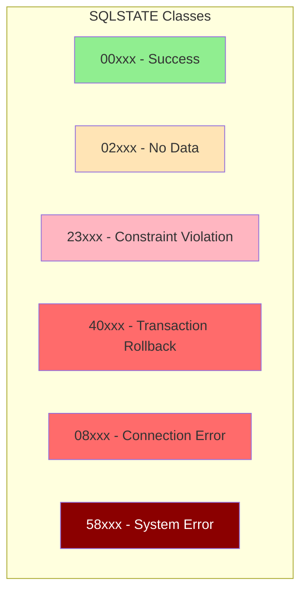

## Overview

SQLCA (SQL Communication Area) is a copybook that provides the interface for DB2 database operation feedback. It consists of two parts:

1. **Standard DB2 SQLCA** - Included via `EXEC SQL INCLUDE SQLCA END-EXEC`, this is the IBM-provided structure that DB2 populates after every SQL statement execution.

2. **SQL-STATUS-CODES** - A custom extension providing named constants for commonly-used SQLSTATE values, enabling readable condition checking in COBOL programs.

This copybook is essential for any program that performs DB2 database operations, as it provides the mechanism to determine whether SQL statements executed successfully and to diagnose any errors that occurred.

## Copybook Contents

```cobol
*================================================================*
* SQL Communication Area
*================================================================*
     EXEC SQL INCLUDE SQLCA END-EXEC.

 01  SQL-STATUS-CODES.
     05  SQL-SUCCESS           PIC X(5) VALUE '00000'.
     05  SQL-NOT-FOUND         PIC X(5) VALUE '02000'.
     05  SQL-DUP-KEY           PIC X(5) VALUE '23505'.
     05  SQL-DEADLOCK          PIC X(5) VALUE '40001'.
     05  SQL-TIMEOUT           PIC X(5) VALUE '40003'.
     05  SQL-CONNECTION-ERROR  PIC X(5) VALUE '08001'.
     05  SQL-DB-ERROR          PIC X(5) VALUE '58004'.
```

## Standard SQLCA Structure

The `EXEC SQL INCLUDE SQLCA END-EXEC` statement includes the IBM-standard SQLCA, which has the following structure:

```
01  SQLCA.
    05  SQLCAID        PIC X(8)      "SQLCA" identifier
    05  SQLCABC        PIC S9(9) COMP-4   Length of SQLCA
    05  SQLCODE        PIC S9(9) COMP-4   SQL return code
    05  SQLERRM                      Error message area
        49  SQLERRML   PIC S9(4) COMP-4   Length of SQLERRMC
        49  SQLERRMC   PIC X(70)     Error message text
    05  SQLERRP        PIC X(8)      Product ID
    05  SQLERRD        OCCURS 6 TIMES    Diagnostic info
                       PIC S9(9) COMP-4
    05  SQLWARN                      Warning flags
        10  SQLWARN0   PIC X(1)      Warning indicator
        10  SQLWARN1   PIC X(1)      String truncation
        10  SQLWARN2   PIC X(1)      Null eliminated
        10  SQLWARN3   PIC X(1)      Column count mismatch
        10  SQLWARN4   PIC X(1)      UPDATE/DELETE without WHERE
        10  SQLWARN5   PIC X(1)      Reserved
        10  SQLWARN6   PIC X(1)      Date arithmetic
        10  SQLWARN7   PIC X(1)      Reserved
    05  SQLEXT         PIC X(8)      Reserved
    05  SQLSTATE       PIC X(5)      SQLSTATE code
```

## Key SQLCA Fields

### SQLCODE

The primary return code from DB2 operations.

| Value | Meaning | Description |
|-------|---------|-------------|
| 0 | Success | SQL statement executed successfully |
| > 0 | Warning | Statement completed with a warning condition |
| < 0 | Error | Statement failed |
| +100 | Not found | No rows matched (SELECT, FETCH, UPDATE, DELETE) |

#### Common SQLCODE Values

| SQLCODE | Description |
|---------|-------------|
| 0 | Successful execution |
| +100 | Row not found / End of cursor |
| -180 | Invalid date/time value |
| -181 | Invalid date/time format |
| -204 | Object not defined |
| -206 | Column not in table |
| -305 | Null value not allowed |
| -501 | Cursor not open |
| -502 | Cursor already open |
| -530 | Referential integrity violation |
| -532 | Delete restricted by referential constraint |
| -803 | Duplicate key on INSERT or UPDATE |
| -811 | Multiple rows returned for SELECT INTO |
| -818 | Timestamp mismatch |
| -904 | Resource unavailable |
| -911 | Deadlock or timeout |
| -913 | Deadlock detected |

### SQLSTATE

A 5-character status code providing more specific error classification.

| Class (XX) | Meaning |
|------------|---------|
| 00 | Success |
| 01 | Warning |
| 02 | No data |
| 21 | Cardinality violation |
| 22 | Data exception |
| 23 | Constraint violation |
| 24 | Invalid cursor state |
| 26 | Invalid SQL statement |
| 40 | Transaction rollback |
| 42 | Access rule violation |
| 51 | Invalid application state |
| 54 | SQL limit exceeded |
| 57 | Resource unavailable |
| 58 | System error |

### SQLERRD Array

Diagnostic information array (6 elements):

| Element | Description |
|---------|-------------|
| SQLERRD(1) | Reserved |
| SQLERRD(2) | Reserved |
| SQLERRD(3) | Number of rows affected (INSERT, UPDATE, DELETE) |
| SQLERRD(4) | Relative cost estimate (PREPARE) |
| SQLERRD(5) | Position of error in SQL statement |
| SQLERRD(6) | Reserved |

### SQLWARN Flags

Warning indicators set when SQLWARN0 = 'W':

| Flag | Meaning when 'W' |
|------|------------------|
| SQLWARN0 | At least one warning exists |
| SQLWARN1 | String value truncated |
| SQLWARN2 | NULL values eliminated from function |
| SQLWARN3 | Number of columns doesn't match variables |
| SQLWARN4 | UPDATE/DELETE without WHERE clause |
| SQLWARN5 | Reserved |
| SQLWARN6 | Date arithmetic resulted in end-of-month adjustment |
| SQLWARN7 | Reserved |

## SQL-STATUS-CODES Constants

Pre-defined SQLSTATE constants for common conditions:

| Constant | Value | Description |
|----------|-------|-------------|
| SQL-SUCCESS | '00000' | Successful completion |
| SQL-NOT-FOUND | '02000' | No data found |
| SQL-DUP-KEY | '23505' | Unique constraint violation |
| SQL-DEADLOCK | '40001' | Transaction deadlock |
| SQL-TIMEOUT | '40003' | Statement timeout |
| SQL-CONNECTION-ERROR | '08001' | Connection failure |
| SQL-DB-ERROR | '58004' | System error |



## Usage Examples

### Basic SQL Status Checking

```cobol
WORKING-STORAGE SECTION.
    COPY SQLCA.

PROCEDURE DIVISION.
    EXEC SQL
        SELECT CUST_NAME, CUST_BALANCE
        INTO :WS-CUST-NAME, :WS-CUST-BALANCE
        FROM CUSTOMER
        WHERE CUST_ID = :WS-CUST-ID
    END-EXEC
    
    EVALUATE SQLCODE
        WHEN 0
            PERFORM PROCESS-CUSTOMER
        WHEN +100
            MOVE 'Customer not found' TO WS-ERROR-MSG
            PERFORM CUSTOMER-NOT-FOUND
        WHEN OTHER
            PERFORM SQL-ERROR-HANDLER
    END-EVALUATE
```

### Using SQLSTATE Constants

```cobol
    EXEC SQL
        INSERT INTO ORDERS
        (ORDER_ID, CUST_ID, ORDER_DATE)
        VALUES
        (:WS-ORDER-ID, :WS-CUST-ID, CURRENT DATE)
    END-EXEC
    
    IF SQLSTATE = SQL-SUCCESS
        DISPLAY 'Order created successfully'
    ELSE IF SQLSTATE = SQL-DUP-KEY
        DISPLAY 'Duplicate order ID - already exists'
    ELSE IF SQLSTATE = SQL-DEADLOCK
        DISPLAY 'Deadlock detected - retrying'
        PERFORM RETRY-TRANSACTION
    ELSE
        DISPLAY 'SQL Error: ' SQLSTATE
        PERFORM SQL-ERROR-HANDLER
    END-IF
```

### Checking Rows Affected

```cobol
    EXEC SQL
        UPDATE INVENTORY
        SET QTY_ON_HAND = QTY_ON_HAND - :WS-ORDER-QTY
        WHERE PRODUCT_ID = :WS-PRODUCT-ID
          AND QTY_ON_HAND >= :WS-ORDER-QTY
    END-EXEC
    
    IF SQLCODE = 0
        IF SQLERRD(3) = 0
            DISPLAY 'No inventory updated - insufficient stock'
        ELSE
            DISPLAY 'Updated ' SQLERRD(3) ' rows'
        END-IF
    ELSE
        PERFORM SQL-ERROR-HANDLER
    END-IF
```

### Checking Warning Flags

```cobol
    EXEC SQL
        SELECT DESCRIPTION
        INTO :WS-SHORT-DESC
        FROM PRODUCTS
        WHERE PRODUCT_ID = :WS-PRODUCT-ID
    END-EXEC
    
    IF SQLCODE = 0
        IF SQLWARN0 = 'W'
            IF SQLWARN1 = 'W'
                DISPLAY 'Warning: Description truncated'
            END-IF
        END-IF
        PERFORM PROCESS-PRODUCT
    END-IF
```

### Comprehensive Error Handler

```cobol
9000-SQL-ERROR-HANDLER.
    DISPLAY '*** SQL ERROR ***'
    DISPLAY 'SQLCODE:  ' SQLCODE
    DISPLAY 'SQLSTATE: ' SQLSTATE
    DISPLAY 'SQLERRMC: ' SQLERRMC
    DISPLAY 'SQLERRD3: ' SQLERRD(3)
    
    EVALUATE TRUE
        WHEN SQLSTATE = SQL-CONNECTION-ERROR
            MOVE 'Database connection failed' TO ERR-MESSAGE
        WHEN SQLSTATE = SQL-DEADLOCK
            MOVE 'Transaction deadlock - please retry' TO ERR-MESSAGE
        WHEN SQLSTATE = SQL-TIMEOUT
            MOVE 'Database timeout - please retry' TO ERR-MESSAGE
        WHEN SQLSTATE = SQL-DUP-KEY
            MOVE 'Duplicate key violation' TO ERR-MESSAGE
        WHEN SQLSTATE = SQL-DB-ERROR
            MOVE 'Database system error' TO ERR-MESSAGE
        WHEN OTHER
            STRING 'SQL Error: ' SQLSTATE
                   ' Code: ' SQLCODE
                   DELIMITED BY SIZE
                   INTO ERR-MESSAGE
    END-EVALUATE
    
    EXEC SQL ROLLBACK END-EXEC
    .
```

## Programs Using This Copybook

| Program | Description | Primary DB2 Operations |
|---------|-------------|------------------------|
| [HISTLD00](/docs/programs/HISTLD00) | History Load | INSERT, bulk loading |
| [DB2CMT](/docs/programs/DB2CMT) | DB2 Commit Handler | COMMIT, ROLLBACK |
| [DB2CONN](/docs/programs/DB2CONN) | DB2 Connection Manager | CONNECT, DISCONNECT |
| [DB2ERR](/docs/programs/DB2ERR) | DB2 Error Handler | Error diagnosis |
| [DB2STAT](/docs/programs/DB2STAT) | DB2 Statistics Collector | SELECT, INSERT, UPDATE |

## Related Copybooks

| Copybook | Relationship |
|----------|--------------|
| [DBPROC](/docs/copybooks/DBPROC) | DB2 standard procedures (uses SQLCA for error checking) |
| [ERRHAND](/docs/copybooks/ERRHAND) | Error handling (receives SQL errors) |

## Technical Notes

### EXEC SQL INCLUDE vs COPY

The copybook uses `EXEC SQL INCLUDE SQLCA END-EXEC` rather than a standard COBOL COPY statement because:

1. The SQLCA structure is provided by the DB2 precompiler
2. It ensures compatibility with the DB2 version being used
3. The precompiler generates the appropriate structure at precompile time

### SQLCODE vs SQLSTATE

| Aspect | SQLCODE | SQLSTATE |
|--------|---------|----------|
| Format | Integer | 5-char string |
| Standard | IBM proprietary | ISO/ANSI SQL standard |
| Portability | DB2 specific | Cross-platform |
| Granularity | General categories | Specific conditions |
| Recommended | Legacy code | New development |

**Best Practice:** Use SQLSTATE for new development as it's more portable and provides finer-grained error classification.

### Checking for Success

```cobol
*   Option 1: Check SQLCODE (traditional)
    IF SQLCODE = 0
        ...
    END-IF
    
*   Option 2: Check SQLSTATE (recommended)
    IF SQLSTATE = SQL-SUCCESS
        ...
    END-IF
    
*   Option 3: Check for any non-error
    IF SQLCODE >= 0
        ...
    END-IF
```

### Thread Safety

In CICS or multi-threaded environments, each task/thread has its own SQLCA. No explicit thread synchronization is needed for SQLCA access.

## Error Handling Best Practices

1. **Always check SQLCODE/SQLSTATE** after every SQL statement
2. **Use named constants** (SQL-SUCCESS, etc.) for readability
3. **Log diagnostic information** including SQLCODE, SQLSTATE, and SQLERRMC
4. **Handle common conditions explicitly** (not found, duplicate key, deadlock)
5. **Implement retry logic** for deadlock and timeout conditions
6. **ROLLBACK on errors** to maintain data integrity
7. **Check SQLERRD(3)** for row counts on INSERT/UPDATE/DELETE

## SQLSTATE Quick Reference

### Success Class (00)

| SQLSTATE | Meaning |
|----------|---------|
| 00000 | Successful completion |

### Warning Class (01)

| SQLSTATE | Meaning |
|----------|---------|
| 01002 | Disconnect error |
| 01004 | String data truncated |
| 01503 | Number of result columns exceeds host variables |

### No Data Class (02)

| SQLSTATE | Meaning |
|----------|---------|
| 02000 | No data found |

### Constraint Violation Class (23)

| SQLSTATE | Meaning |
|----------|---------|
| 23502 | Null value not allowed |
| 23503 | Foreign key violation |
| 23505 | Unique constraint violation |
| 23514 | Check constraint violation |

### Transaction Rollback Class (40)

| SQLSTATE | Meaning |
|----------|---------|
| 40001 | Serialization failure (deadlock) |
| 40003 | Statement completion unknown (timeout) |

### Connection Exception Class (08)

| SQLSTATE | Meaning |
|----------|---------|
| 08001 | Connection failed |
| 08003 | Connection does not exist |
| 08004 | Connection rejected |

### System Error Class (58)

| SQLSTATE | Meaning |
|----------|---------|
| 58004 | System error |
| 58005 | Internal DB2 error |
