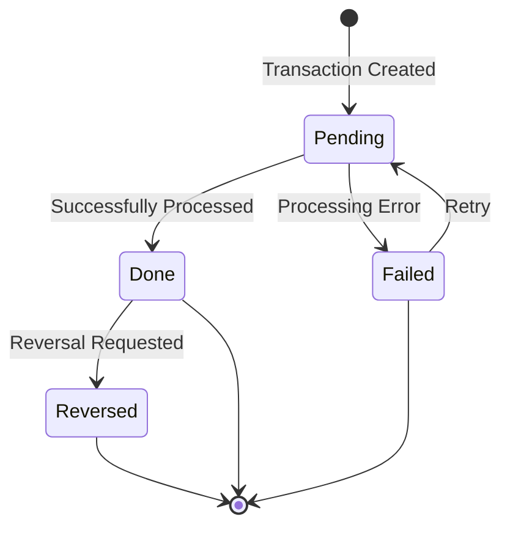

## Overview

TRNREC is a copybook that defines the standard transaction record structure used throughout the portfolio management system. It provides a comprehensive format for recording financial transactions including securities purchases, sales, transfers, and fee assessments.

The transaction record captures:
- **Transaction Identity** - Date, time, portfolio, and sequence number forming a unique key
- **Transaction Details** - Investment ID, type, quantity, price, and amount
- **Currency Information** - Support for multi-currency transactions
- **Status Tracking** - Lifecycle status from pending through completion or reversal
- **Audit Trail** - Processing timestamp and user identification

This copybook is essential for maintaining accurate transaction history and supporting portfolio valuation, reporting, and reconciliation processes.

## Record Structure

```
+------------------------------------------------------------------+
|                      TRANSACTION-RECORD                           |
+------------------------------------------------------------------+
| TRN-KEY (28 bytes)                                               |
|   +-- TRN-DATE (8)          - Transaction date YYYYMMDD          |
|   +-- TRN-TIME (6)          - Transaction time HHMMSS            |
|   +-- TRN-PORTFOLIO-ID (8)  - Portfolio identifier               |
|   +-- TRN-SEQUENCE-NO (6)   - Sequence for same date/time        |
+------------------------------------------------------------------+
| TRN-DATA (35 bytes)                                              |
|   +-- TRN-INVESTMENT-ID (10)- Security/investment identifier     |
|   +-- TRN-TYPE (2)          - Transaction type code              |
|   +-- TRN-QUANTITY (8)      - Number of units (COMP-3)           |
|   +-- TRN-PRICE (8)         - Price per unit (COMP-3)            |
|   +-- TRN-AMOUNT (8)        - Total amount (COMP-3)              |
|   +-- TRN-CURRENCY (3)      - ISO currency code                  |
|   +-- TRN-STATUS (1)        - Transaction status                 |
+------------------------------------------------------------------+
| TRN-AUDIT (34 bytes)                                             |
|   +-- TRN-PROCESS-DATE (26) - Processing timestamp               |
|   +-- TRN-PROCESS-USER (8)  - Processing user ID                 |
+------------------------------------------------------------------+
| TRN-FILLER (50 bytes)       - Reserved for future use            |
+------------------------------------------------------------------+
Total Record Length: 147 bytes
```

## Field Definitions

### Key Section (TRN-KEY)

The composite key uniquely identifies each transaction:

| Field | Picture | Format | Description |
|-------|---------|--------|-------------|
| TRN-DATE | X(8) | YYYYMMDD | Transaction date |
| TRN-TIME | X(6) | HHMMSS | Transaction time |
| TRN-PORTFOLIO-ID | X(8) | Alphanumeric | Portfolio identifier |
| TRN-SEQUENCE-NO | X(6) | Numeric | Sequence number for multiple transactions at same date/time |

### Data Section (TRN-DATA)

#### TRN-INVESTMENT-ID

| Field | Picture | Description |
|-------|---------|-------------|
| TRN-INVESTMENT-ID | X(10) | Security or investment identifier (CUSIP, ISIN, or internal ID) |

#### TRN-TYPE - Transaction Type

| Field | Picture | Description |
|-------|---------|-------------|
| TRN-TYPE | X(2) | Two-character transaction type code |

**Condition Names:**

| Level-88 | Value | Description |
|----------|-------|-------------|
| TRN-TYPE-BUY | 'BU' | Purchase of securities |
| TRN-TYPE-SELL | 'SL' | Sale of securities |
| TRN-TYPE-TRANS | 'TR' | Transfer between portfolios/accounts |
| TRN-TYPE-FEE | 'FE' | Fee or expense assessment |

#### Financial Fields

| Field | Picture | Storage | Description |
|-------|---------|---------|-------------|
| TRN-QUANTITY | S9(11)V9(4) COMP-3 | 8 bytes | Number of units (supports fractional shares) |
| TRN-PRICE | S9(11)V9(4) COMP-3 | 8 bytes | Price per unit |
| TRN-AMOUNT | S9(13)V9(2) COMP-3 | 8 bytes | Total transaction amount |
| TRN-CURRENCY | X(3) | 3 bytes | ISO 4217 currency code (e.g., USD, EUR, GBP) |

#### TRN-STATUS - Transaction Status

| Field | Picture | Description |
|-------|---------|-------------|
| TRN-STATUS | X(1) | Single-character status code |

**Condition Names:**

| Level-88 | Value | Description |
|----------|-------|-------------|
| TRN-STATUS-PEND | 'P' | Pending - awaiting processing |
| TRN-STATUS-DONE | 'D' | Done - successfully completed |
| TRN-STATUS-FAIL | 'F' | Failed - processing error |
| TRN-STATUS-REV | 'R' | Reversed - transaction reversed/cancelled |

### Audit Section (TRN-AUDIT)

| Field | Picture | Description |
|-------|---------|-------------|
| TRN-PROCESS-DATE | X(26) | Processing timestamp (ISO format or DB2 timestamp) |
| TRN-PROCESS-USER | X(8) | User ID who processed the transaction |

### Reserved Space

| Field | Picture | Description |
|-------|---------|-------------|
| TRN-FILLER | X(50) | Reserved for future enhancements |

## Usage Examples

### Creating a Buy Transaction

```cobol
INITIALIZE TRANSACTION-RECORD

MOVE WS-CURRENT-DATE TO TRN-DATE
MOVE WS-CURRENT-TIME TO TRN-TIME
MOVE WS-PORTFOLIO-ID TO TRN-PORTFOLIO-ID
MOVE WS-NEXT-SEQUENCE TO TRN-SEQUENCE-NO

MOVE WS-SECURITY-ID TO TRN-INVESTMENT-ID
SET TRN-TYPE-BUY TO TRUE
MOVE WS-SHARES TO TRN-QUANTITY
MOVE WS-SHARE-PRICE TO TRN-PRICE
COMPUTE TRN-AMOUNT = TRN-QUANTITY * TRN-PRICE
MOVE 'USD' TO TRN-CURRENCY
SET TRN-STATUS-PEND TO TRUE

ACCEPT TRN-PROCESS-DATE FROM TIME STAMP
MOVE WS-USER-ID TO TRN-PROCESS-USER

WRITE TRANSACTION-RECORD
```

### Creating a Sell Transaction

```cobol
INITIALIZE TRANSACTION-RECORD

MOVE WS-CURRENT-DATE TO TRN-DATE
MOVE WS-CURRENT-TIME TO TRN-TIME
MOVE WS-PORTFOLIO-ID TO TRN-PORTFOLIO-ID
MOVE WS-NEXT-SEQUENCE TO TRN-SEQUENCE-NO

MOVE WS-SECURITY-ID TO TRN-INVESTMENT-ID
SET TRN-TYPE-SELL TO TRUE
COMPUTE TRN-QUANTITY = WS-SHARES * -1
MOVE WS-SHARE-PRICE TO TRN-PRICE
COMPUTE TRN-AMOUNT = TRN-QUANTITY * TRN-PRICE
MOVE 'USD' TO TRN-CURRENCY
SET TRN-STATUS-PEND TO TRUE

ACCEPT TRN-PROCESS-DATE FROM TIME STAMP
MOVE WS-USER-ID TO TRN-PROCESS-USER

WRITE TRANSACTION-RECORD
```

### Recording a Fee

```cobol
INITIALIZE TRANSACTION-RECORD

MOVE WS-CURRENT-DATE TO TRN-DATE
MOVE WS-CURRENT-TIME TO TRN-TIME
MOVE WS-PORTFOLIO-ID TO TRN-PORTFOLIO-ID
MOVE WS-NEXT-SEQUENCE TO TRN-SEQUENCE-NO

MOVE 'MGMTFEE' TO TRN-INVESTMENT-ID
SET TRN-TYPE-FEE TO TRUE
MOVE 1 TO TRN-QUANTITY
MOVE WS-FEE-AMOUNT TO TRN-PRICE
MOVE WS-FEE-AMOUNT TO TRN-AMOUNT
MOVE 'USD' TO TRN-CURRENCY
SET TRN-STATUS-DONE TO TRUE

ACCEPT TRN-PROCESS-DATE FROM TIME STAMP
MOVE 'FEESYS' TO TRN-PROCESS-USER

WRITE TRANSACTION-RECORD
```

### Processing Transactions by Type

```cobol
READ TRANSACTION-FILE INTO TRANSACTION-RECORD

EVALUATE TRUE
    WHEN TRN-TYPE-BUY
        PERFORM PROCESS-BUY-TRANSACTION
    WHEN TRN-TYPE-SELL
        PERFORM PROCESS-SELL-TRANSACTION
    WHEN TRN-TYPE-TRANS
        PERFORM PROCESS-TRANSFER-TRANSACTION
    WHEN TRN-TYPE-FEE
        PERFORM PROCESS-FEE-TRANSACTION
    WHEN OTHER
        PERFORM HANDLE-UNKNOWN-TYPE
END-EVALUATE
```

### Updating Transaction Status

```cobol
READ TRANSACTION-FILE INTO TRANSACTION-RECORD
    KEY IS TRN-KEY

IF TRN-STATUS-PEND
    PERFORM EXECUTE-TRANSACTION
    IF WS-EXECUTION-SUCCESS
        SET TRN-STATUS-DONE TO TRUE
    ELSE
        SET TRN-STATUS-FAIL TO TRUE
    END-IF
    ACCEPT TRN-PROCESS-DATE FROM TIME STAMP
    REWRITE TRANSACTION-RECORD
END-IF
```

## Programs Using This Copybook

| Program | Description |
|---------|-------------|
| RPTPOS00 | Position report generator - reads transactions for position calculations |
| PORTTRAN | Portfolio transaction processor - creates and manages transactions |
| TSTGEN00 | Test data generator - creates sample transaction records |
| UTLVAL00 | Validation utility - validates transaction data integrity |

## Transaction Lifecycle



## Key Design

The composite key structure ensures uniqueness and efficient access:

```
TRN-KEY = TRN-DATE + TRN-TIME + TRN-PORTFOLIO-ID + TRN-SEQUENCE-NO
          (8)        (6)        (8)                (6)
          
Example: 20240320 + 143052 + PORT0001 + 000001
         = "20240320143052PORT0001000001"
```

This design supports:
- **Chronological ordering** - Date and time as leading key components
- **Portfolio partitioning** - Easy retrieval of all transactions for a portfolio
- **High-volume processing** - Sequence number handles multiple transactions per second

## Record Layout Diagram

```
Offset  Length  Field               Format
------  ------  ------------------  ----------------
0       8       TRN-DATE            YYYYMMDD
8       6       TRN-TIME            HHMMSS
14      8       TRN-PORTFOLIO-ID    Alphanumeric
22      6       TRN-SEQUENCE-NO     Numeric
28      10      TRN-INVESTMENT-ID   Alphanumeric
38      2       TRN-TYPE            BU/SL/TR/FE
40      8       TRN-QUANTITY        COMP-3 S9(11)V9(4)
48      8       TRN-PRICE           COMP-3 S9(11)V9(4)
56      8       TRN-AMOUNT          COMP-3 S9(13)V9(2)
64      3       TRN-CURRENCY        ISO 4217
67      1       TRN-STATUS          P/D/F/R
68      26      TRN-PROCESS-DATE    Timestamp
94      8       TRN-PROCESS-USER    User ID
102     50      TRN-FILLER          Reserved
------  ------  ------------------
Total:  152 bytes (note: includes padding)
```

## Technical Notes

1. **COMP-3 (Packed Decimal)**: Financial fields use COMP-3 format for:
   - Efficient storage (2 digits per byte plus sign)
   - Precise decimal arithmetic without floating-point errors
   - Direct use in COBOL COMPUTE statements

2. **Quantity Precision**: `S9(11)V9(4)` supports:
   - Up to 99,999,999,999.9999 units
   - 4 decimal places for fractional share support
   - Signed values (negative for sells/withdrawals)

3. **Amount Precision**: `S9(13)V9(2)` supports:
   - Up to ±9,999,999,999,999.99
   - Standard 2-decimal currency precision
   - Large institutional transaction amounts

4. **Currency Code**: The 3-character field accommodates ISO 4217 codes:
   - USD (US Dollar)
   - EUR (Euro)
   - GBP (British Pound)
   - JPY (Japanese Yen)
   - etc.

5. **Sequence Number**: The 6-digit sequence allows 999,999 transactions per portfolio per second - more than sufficient for any processing scenario.

6. **Timestamp Format**: The 26-character process date field supports:
   - DB2 timestamp format: `YYYY-MM-DD-HH.MM.SS.FFFFFF`
   - High-precision audit trail
   - Timezone-aware timestamps if needed

7. **Filler Field**: The 50-byte filler provides:
   - Room for future field additions
   - Record alignment options
   - Backward compatibility when extended

8. **Level-88 Conditions**: Using condition names improves code readability:
   ```cobol
   IF TRN-TYPE-BUY        (readable)
   vs
   IF TRN-TYPE = 'BU'     (less clear)
   ```
