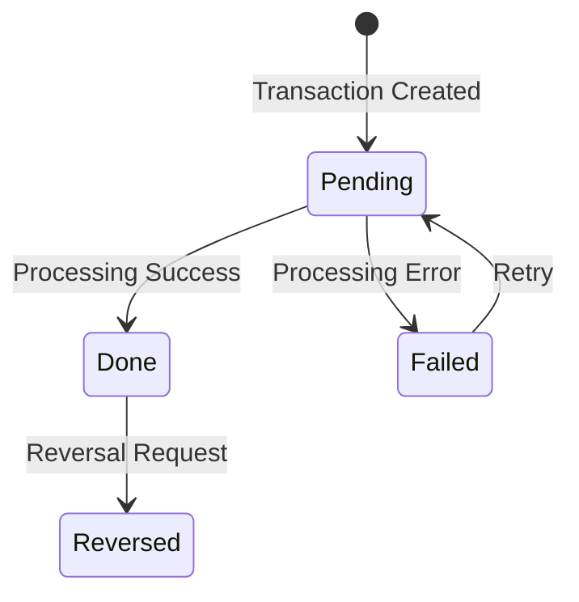

## Overview

TRNREC (Transaction Record) is a copybook that defines the standard record structure for investment transactions in the portfolio management system. It provides a comprehensive layout for capturing all aspects of a financial transaction including identification, pricing, amounts, and processing status.

The copybook supports four transaction types: Buy, Sell, Transfer, and Fee. Each transaction is uniquely identified by a composite key of date, time, portfolio ID, and sequence number, allowing multiple transactions per portfolio on the same day.

This record structure is used across multiple programs for transaction processing, position reporting, test data generation, and data validation.

## Data Structures

### TRANSACTION-RECORD (Main Structure)

```cobol
01  TRANSACTION-RECORD.
    05  TRN-KEY.
        10  TRN-DATE           PIC X(08).
        10  TRN-TIME           PIC X(06).
        10  TRN-PORTFOLIO-ID   PIC X(08).
        10  TRN-SEQUENCE-NO    PIC X(06).
    05  TRN-DATA.
        10  TRN-INVESTMENT-ID  PIC X(10).
        10  TRN-TYPE           PIC X(02).
        10  TRN-QUANTITY       PIC S9(11)V9(4) COMP-3.
        10  TRN-PRICE          PIC S9(11)V9(4) COMP-3.
        10  TRN-AMOUNT         PIC S9(13)V9(2) COMP-3.
        10  TRN-CURRENCY       PIC X(03).
        10  TRN-STATUS         PIC X(01).
    05  TRN-AUDIT.
        10  TRN-PROCESS-DATE   PIC X(26).
        10  TRN-PROCESS-USER   PIC X(08).
    05  TRN-FILLER             PIC X(50).
```

### TRN-KEY Group (Record Key)

| Level | Name | Picture | Description |
|-------|------|---------|-------------|
| 05 | TRN-KEY | - | Composite primary key (28 bytes) |
| 10 | TRN-DATE | X(08) | Transaction date (YYYYMMDD) |
| 10 | TRN-TIME | X(06) | Transaction time (HHMMSS) |
| 10 | TRN-PORTFOLIO-ID | X(08) | Portfolio identifier |
| 10 | TRN-SEQUENCE-NO | X(06) | Sequence number for same-day transactions |

### TRN-DATA Group (Transaction Details)

| Level | Name | Picture | Description |
|-------|------|---------|-------------|
| 05 | TRN-DATA | - | Core transaction data |
| 10 | TRN-INVESTMENT-ID | X(10) | Security/investment identifier |
| 10 | TRN-TYPE | X(02) | Transaction type code |
| 10 | TRN-QUANTITY | S9(11)V9(4) COMP-3 | Number of units/shares |
| 10 | TRN-PRICE | S9(11)V9(4) COMP-3 | Price per unit |
| 10 | TRN-AMOUNT | S9(13)V9(2) COMP-3 | Total transaction amount |
| 10 | TRN-CURRENCY | X(03) | ISO currency code (e.g., USD, EUR) |
| 10 | TRN-STATUS | X(01) | Processing status |

### Transaction Type Values (88-level conditions)

| Value | Condition Name | Description |
|-------|----------------|-------------|
| 'BU' | TRN-TYPE-BUY | Purchase of securities |
| 'SL' | TRN-TYPE-SELL | Sale of securities |
| 'TR' | TRN-TYPE-TRANS | Transfer between portfolios |
| 'FE' | TRN-TYPE-FEE | Fee or expense charge |

### Transaction Status Values (88-level conditions)

| Value | Condition Name | Description |
|-------|----------------|-------------|
| 'P' | TRN-STATUS-PEND | Pending - awaiting processing |
| 'D' | TRN-STATUS-DONE | Done - successfully completed |
| 'F' | TRN-STATUS-FAIL | Failed - error during processing |
| 'R' | TRN-STATUS-REV | Reversed - transaction was reversed |

### TRN-AUDIT Group (Audit Trail)

| Level | Name | Picture | Description |
|-------|------|---------|-------------|
| 05 | TRN-AUDIT | - | Processing audit information |
| 10 | TRN-PROCESS-DATE | X(26) | Timestamp when processed (ISO format) |
| 10 | TRN-PROCESS-USER | X(08) | User ID who processed transaction |

### TRN-FILLER

| Level | Name | Picture | Description |
|-------|------|---------|-------------|
| 05 | TRN-FILLER | X(50) | Reserved for future use |

## Record Layout

```
+------------------------------------------------------------------+
| TRANSACTION-RECORD                                                |
+------------------------------------------------------------------+
| TRN-KEY (28 bytes)                                               |
|   TRN-DATE (8) | TRN-TIME (6) | TRN-PORTFOLIO-ID (8) |           |
|   TRN-SEQUENCE-NO (6)                                            |
+------------------------------------------------------------------+
| TRN-DATA (~40 bytes)                                             |
|   TRN-INVESTMENT-ID (10) | TRN-TYPE (2)                          |
|   TRN-QUANTITY (8 packed) | TRN-PRICE (8 packed)                 |
|   TRN-AMOUNT (8 packed) | TRN-CURRENCY (3) | TRN-STATUS (1)      |
+------------------------------------------------------------------+
| TRN-AUDIT (34 bytes)                                             |
|   TRN-PROCESS-DATE (26) | TRN-PROCESS-USER (8)                   |
+------------------------------------------------------------------+
| TRN-FILLER (50 bytes)                                            |
+------------------------------------------------------------------+
Total: ~152 bytes
```

## Usage Examples

### Creating a Buy Transaction

```cobol
INITIALIZE TRANSACTION-RECORD

* Set key fields
MOVE FUNCTION CURRENT-DATE(1:8) TO TRN-DATE
MOVE FUNCTION CURRENT-DATE(9:6) TO TRN-TIME
MOVE WS-PORTFOLIO-ID TO TRN-PORTFOLIO-ID
MOVE WS-NEXT-SEQUENCE TO TRN-SEQUENCE-NO

* Set transaction details
MOVE WS-SECURITY-ID TO TRN-INVESTMENT-ID
SET TRN-TYPE-BUY TO TRUE
MOVE WS-SHARES TO TRN-QUANTITY
MOVE WS-SHARE-PRICE TO TRN-PRICE
COMPUTE TRN-AMOUNT = TRN-QUANTITY * TRN-PRICE
MOVE 'USD' TO TRN-CURRENCY
SET TRN-STATUS-PEND TO TRUE

* Set audit fields
MOVE FUNCTION CURRENT-DATE TO TRN-PROCESS-DATE
ACCEPT TRN-PROCESS-USER FROM ENVIRONMENT 'USER'
```

### Validating a Transaction

```cobol
* Check transaction type
EVALUATE TRUE
    WHEN TRN-TYPE-BUY
    WHEN TRN-TYPE-SELL
    WHEN TRN-TYPE-TRANS
    WHEN TRN-TYPE-FEE
        CONTINUE
    WHEN OTHER
        MOVE 'Invalid transaction type' TO WS-ERROR-MSG
        PERFORM ERROR-ROUTINE
END-EVALUATE

* Validate amounts
IF TRN-QUANTITY <= ZERO
    MOVE 'Quantity must be positive' TO WS-ERROR-MSG
    PERFORM ERROR-ROUTINE
END-IF

IF TRN-PRICE <= ZERO AND NOT TRN-TYPE-TRANS
    MOVE 'Price must be positive' TO WS-ERROR-MSG
    PERFORM ERROR-ROUTINE
END-IF

IF TRN-AMOUNT <= ZERO AND NOT TRN-TYPE-TRANS
    MOVE 'Amount must be positive' TO WS-ERROR-MSG
    PERFORM ERROR-ROUTINE
END-IF
```

### Processing Transaction Status Updates

```cobol
* Mark transaction as completed
SET TRN-STATUS-DONE TO TRUE
MOVE FUNCTION CURRENT-DATE TO TRN-PROCESS-DATE

* Or mark as failed
SET TRN-STATUS-FAIL TO TRUE
MOVE FUNCTION CURRENT-DATE TO TRN-PROCESS-DATE

* Or mark as reversed
SET TRN-STATUS-REV TO TRUE
MOVE FUNCTION CURRENT-DATE TO TRN-PROCESS-DATE
```

### Reading Transactions for Reporting

```cobol
* Read transaction file
READ TRANSACTION-FILE INTO TRANSACTION-RECORD
    AT END
        SET END-OF-FILE TO TRUE
    NOT AT END
        EVALUATE TRUE
            WHEN TRN-STATUS-DONE
                ADD TRN-AMOUNT TO WS-COMPLETED-TOTAL
            WHEN TRN-STATUS-PEND
                ADD TRN-AMOUNT TO WS-PENDING-TOTAL
            WHEN TRN-STATUS-FAIL
                ADD 1 TO WS-FAILED-COUNT
        END-EVALUATE
END-READ
```

## Programs Using This Copybook

| Program | Usage | Description |
|---------|-------|-------------|
| PORTTRAN | INPUT | Portfolio Transaction Processing - validates and applies transactions |
| RPTPOS00 | INPUT | Position Report - reads transactions for reporting |
| TSTGEN00 | OUTPUT | Test Data Generator - creates test transaction records |
| UTLVAL00 | INPUT | Validation Utility - validates transaction data integrity |

## Related Copybooks

| Copybook | Relationship |
|----------|--------------|
| POSREC | Position record - updated by transactions |
| PORTREC | Portfolio record - updated by transactions |
| PORTFLIO | Portfolio master - contains account information |
| AUDITLOG | Audit log - records transaction processing events |

## Technical Notes

### Composite Key Design

The TRN-KEY is designed for uniqueness and efficient sorting:

```
TRN-DATE (8) + TRN-TIME (6) + TRN-PORTFOLIO-ID (8) + TRN-SEQUENCE-NO (6) = 28 bytes
```

This design ensures:
- Chronological ordering by date/time
- Grouping by portfolio for efficient position processing
- Sequence numbers handle multiple simultaneous transactions

### Numeric Precision

| Field | Picture | Bytes | Range | Decimal Places |
|-------|---------|-------|-------|----------------|
| TRN-QUANTITY | S9(11)V9(4) COMP-3 | 8 | ±99,999,999,999.9999 | 4 |
| TRN-PRICE | S9(11)V9(4) COMP-3 | 8 | ±99,999,999,999.9999 | 4 |
| TRN-AMOUNT | S9(13)V9(2) COMP-3 | 8 | ±9,999,999,999,999.99 | 2 |

The 4-decimal precision for quantity and price supports fractional shares and precise pricing, while the amount field uses 2 decimals for currency representation.

### COMP-3 Storage

Packed decimal (COMP-3) format:
- Stores two digits per byte plus a half-byte sign
- S9(11)V9(4) = 16 digits = 8 bytes
- S9(13)V9(2) = 16 digits = 8 bytes
- Efficient for financial calculations

### Date/Time Formats

| Field | Format | Example |
|-------|--------|---------|
| TRN-DATE | YYYYMMDD | 20240320 |
| TRN-TIME | HHMMSS | 143052 |
| TRN-PROCESS-DATE | ISO 8601 (26 chars) | 2024-03-20-14.30.52.123456 |

### Transaction Type Processing

| Type | Position Effect | Amount Sign | Notes |
|------|-----------------|-------------|-------|
| BU (Buy) | Add units | Positive | Adds to cost basis |
| SL (Sell) | Subtract units | Positive | Reduces cost basis |
| TR (Transfer) | Move units | Zero | Between portfolios |
| FE (Fee) | No change | Positive | Reduces value |

### Status Workflow



### Currency Codes

TRN-CURRENCY uses ISO 4217 three-letter codes:

| Code | Currency |
|------|----------|
| USD | US Dollar |
| EUR | Euro |
| GBP | British Pound |
| JPY | Japanese Yen |
| CAD | Canadian Dollar |

### File Organization Options

The TRNREC copybook can be used with various file organizations:

| Organization | Key | Use Case |
|--------------|-----|----------|
| Sequential | N/A | Batch input processing |
| Indexed (KSDS) | TRN-KEY | Random access, updates |
| ESDS | N/A | Append-only logging |

### Validation Rules

Standard validation checks for transactions:

1. **Required Fields**: TRN-DATE, TRN-PORTFOLIO-ID, TRN-TYPE must be non-empty
2. **Date Validity**: TRN-DATE must be valid YYYYMMDD format
3. **Type Validity**: TRN-TYPE must be BU, SL, TR, or FE
4. **Amount Consistency**: TRN-AMOUNT ≈ TRN-QUANTITY × TRN-PRICE (for BU/SL)
5. **Currency**: TRN-CURRENCY must be valid ISO code
6. **Status**: TRN-STATUS must be P, D, F, or R

### COBOL Features Used

- **88-level condition names**: For transaction types (TRN-TYPE-BUY, etc.) and status values (TRN-STATUS-PEND, etc.)
- **COMP-3 (PACKED-DECIMAL)**: Efficient storage for numeric financial fields
- **Implied decimal (V)**: Defines decimal position without storing decimal point
- **FILLER**: Reserved space for future enhancements
