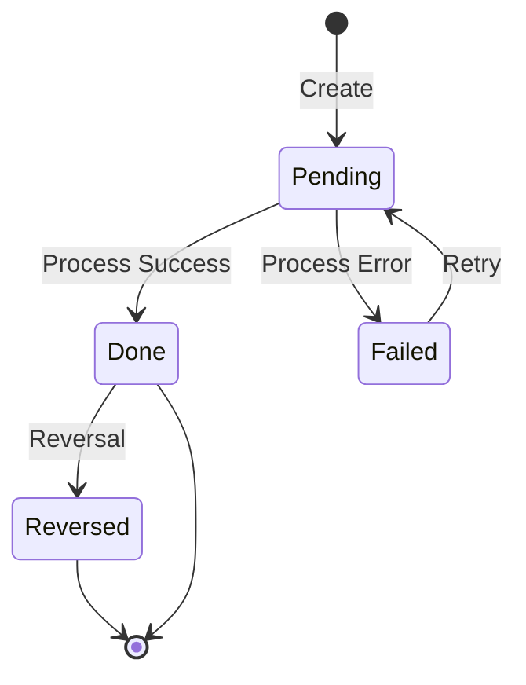
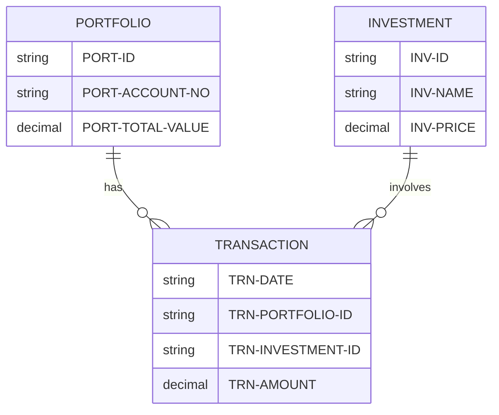

## Overview

TRNREC is a COBOL copybook that defines the standard record layout for investment transaction records. It provides a comprehensive structure for capturing all aspects of portfolio transactions including:

- **Transaction identification** - Date, time, portfolio, and sequence number
- **Transaction details** - Investment ID, type, quantity, price, and amount
- **Currency information** - Multi-currency support
- **Status tracking** - Pending, done, failed, or reversed states
- **Audit trail** - Processing timestamp and user identification

This copybook is essential for programs that process, report on, or validate investment transactions across the portfolio management system.

## Record Layout

```
+------------------+------------------+------------------+
|     TRN-KEY      |    TRN-DATA      |   TRN-AUDIT      |
|    (28 bytes)    |   (48 bytes)     |   (34 bytes)     |
+------------------+------------------+------------------+
|              TRN-FILLER (50 bytes)                     |
+-------------------------------------------------------+
```

**Total Record Size**: 160 bytes

## Data Structures

### TRN-KEY (Primary Key)

The composite key uniquely identifies each transaction record.

| Level | Name | Picture | Size | Description |
|-------|------|---------|------|-------------|
| 05 | TRN-KEY | - | 28 | Composite primary key |
| 10 | TRN-DATE | PIC X(08) | 8 | Transaction date (YYYYMMDD) |
| 10 | TRN-TIME | PIC X(06) | 6 | Transaction time (HHMMSS) |
| 10 | TRN-PORTFOLIO-ID | PIC X(08) | 8 | Portfolio identifier |
| 10 | TRN-SEQUENCE-NO | PIC X(06) | 6 | Sequence number for ordering |

**Key Format Example**: `20240320` + `143052` + `PORT0001` + `000001`

### TRN-DATA (Transaction Details)

| Level | Name | Picture | Size | Description |
|-------|------|---------|------|-------------|
| 05 | TRN-DATA | - | 48 | Transaction data group |
| 10 | TRN-INVESTMENT-ID | PIC X(10) | 10 | Security/investment identifier |
| 10 | TRN-TYPE | PIC X(02) | 2 | Transaction type code |
| 10 | TRN-QUANTITY | PIC S9(11)V9(4) COMP-3 | 8 | Number of shares/units |
| 10 | TRN-PRICE | PIC S9(11)V9(4) COMP-3 | 8 | Price per share/unit |
| 10 | TRN-AMOUNT | PIC S9(13)V9(2) COMP-3 | 8 | Total transaction amount |
| 10 | TRN-CURRENCY | PIC X(03) | 3 | ISO currency code |
| 10 | TRN-STATUS | PIC X(01) | 1 | Transaction status |

#### Transaction Type Codes (88-levels)

| Condition | Value | Description |
|-----------|-------|-------------|
| TRN-TYPE-BUY | 'BU' | Buy/purchase transaction |
| TRN-TYPE-SELL | 'SL' | Sell transaction |
| TRN-TYPE-TRANS | 'TR' | Transfer between portfolios |
| TRN-TYPE-FEE | 'FE' | Fee or charge transaction |

#### Transaction Status Codes (88-levels)

| Condition | Value | Description |
|-----------|-------|-------------|
| TRN-STATUS-PEND | 'P' | Pending - awaiting processing |
| TRN-STATUS-DONE | 'D' | Done - successfully completed |
| TRN-STATUS-FAIL | 'F' | Failed - processing error |
| TRN-STATUS-REV | 'R' | Reversed - transaction reversed |

### TRN-AUDIT (Audit Information)

| Level | Name | Picture | Size | Description |
|-------|------|---------|------|-------------|
| 05 | TRN-AUDIT | - | 34 | Audit information group |
| 10 | TRN-PROCESS-DATE | PIC X(26) | 26 | Processing timestamp |
| 10 | TRN-PROCESS-USER | PIC X(08) | 8 | User ID who processed |

**Timestamp Format**: DB2 compatible format `YYYY-MM-DD-HH.MM.SS.NNNNNN`

### TRN-FILLER (Reserved)

| Level | Name | Picture | Size | Description |
|-------|------|---------|------|-------------|
| 05 | TRN-FILLER | PIC X(50) | 50 | Reserved for future expansion |

## Field Summary Table

| Field | Offset | Size | Type | Description |
|-------|--------|------|------|-------------|
| TRN-DATE | 0 | 8 | Alpha | Transaction date |
| TRN-TIME | 8 | 6 | Alpha | Transaction time |
| TRN-PORTFOLIO-ID | 14 | 8 | Alpha | Portfolio ID |
| TRN-SEQUENCE-NO | 22 | 6 | Alpha | Sequence number |
| TRN-INVESTMENT-ID | 28 | 10 | Alpha | Investment/security ID |
| TRN-TYPE | 38 | 2 | Alpha | Type code (BU/SL/TR/FE) |
| TRN-QUANTITY | 40 | 8 | Packed | Quantity |
| TRN-PRICE | 48 | 8 | Packed | Unit price |
| TRN-AMOUNT | 56 | 8 | Packed | Total amount |
| TRN-CURRENCY | 64 | 3 | Alpha | Currency code |
| TRN-STATUS | 67 | 1 | Alpha | Status (P/D/F/R) |
| TRN-PROCESS-DATE | 68 | 26 | Alpha | Processing timestamp |
| TRN-PROCESS-USER | 94 | 8 | Alpha | Processing user |
| TRN-FILLER | 102 | 50 | Alpha | Reserved |

## Packed Decimal Fields

### TRN-QUANTITY
- **Picture**: PIC S9(11)V9(4) COMP-3
- **Range**: ±99,999,999,999.9999
- **Precision**: 4 decimal places (for fractional shares)
- **Storage**: 8 bytes

### TRN-PRICE
- **Picture**: PIC S9(11)V9(4) COMP-3
- **Range**: ±99,999,999,999.9999
- **Precision**: 4 decimal places (for precise pricing)
- **Storage**: 8 bytes

### TRN-AMOUNT
- **Picture**: PIC S9(13)V9(2) COMP-3
- **Range**: ±9,999,999,999,999.99
- **Precision**: 2 decimal places (for currency amounts)
- **Storage**: 8 bytes

## Usage Examples

### Creating a Buy Transaction

```cobol
WORKING-STORAGE SECTION.
    COPY TRNREC.
    
01  WS-CURRENT-DATE    PIC X(8).
01  WS-CURRENT-TIME    PIC X(6).

PROCEDURE DIVISION.
    INITIALIZE TRANSACTION-RECORD
    
    ACCEPT WS-CURRENT-DATE FROM DATE YYYYMMDD
    ACCEPT WS-CURRENT-TIME FROM TIME
    
    MOVE WS-CURRENT-DATE TO TRN-DATE
    MOVE WS-CURRENT-TIME TO TRN-TIME
    MOVE 'PORT0001' TO TRN-PORTFOLIO-ID
    MOVE '000001' TO TRN-SEQUENCE-NO
    
    MOVE 'AAPL      ' TO TRN-INVESTMENT-ID
    SET TRN-TYPE-BUY TO TRUE
    MOVE 100.0000 TO TRN-QUANTITY
    MOVE 175.5000 TO TRN-PRICE
    COMPUTE TRN-AMOUNT = TRN-QUANTITY * TRN-PRICE
    MOVE 'USD' TO TRN-CURRENCY
    SET TRN-STATUS-PEND TO TRUE
    
    MOVE FUNCTION CURRENT-DATE TO TRN-PROCESS-DATE
    MOVE 'TRADER01' TO TRN-PROCESS-USER
    
    WRITE TRANSACTION-RECORD
```

### Processing Transaction by Type

```cobol
EVALUATE TRUE
    WHEN TRN-TYPE-BUY
        PERFORM 1000-PROCESS-BUY
    WHEN TRN-TYPE-SELL
        PERFORM 1100-PROCESS-SELL
    WHEN TRN-TYPE-TRANS
        PERFORM 1200-PROCESS-TRANSFER
    WHEN TRN-TYPE-FEE
        PERFORM 1300-PROCESS-FEE
    WHEN OTHER
        MOVE 'Invalid transaction type' TO WS-ERROR-MSG
        PERFORM 9000-ERROR-HANDLER
END-EVALUATE
```

### Checking Transaction Status

```cobol
EVALUATE TRUE
    WHEN TRN-STATUS-PEND
        DISPLAY 'Transaction pending processing'
    WHEN TRN-STATUS-DONE
        DISPLAY 'Transaction completed successfully'
    WHEN TRN-STATUS-FAIL
        DISPLAY 'Transaction failed - requires review'
    WHEN TRN-STATUS-REV
        DISPLAY 'Transaction has been reversed'
END-EVALUATE
```

### Reading Transactions for a Portfolio

```cobol
*> Position to start of portfolio's transactions
MOVE '00000000' TO TRN-DATE
MOVE '000000' TO TRN-TIME
MOVE 'PORT0001' TO TRN-PORTFOLIO-ID
MOVE '000000' TO TRN-SEQUENCE-NO

START TRANSACTION-FILE
    KEY IS >= TRN-KEY
    INVALID KEY
        SET NO-MORE-TRANSACTIONS TO TRUE
END-START

PERFORM UNTIL NO-MORE-TRANSACTIONS
    READ TRANSACTION-FILE NEXT
        AT END
            SET NO-MORE-TRANSACTIONS TO TRUE
        NOT AT END
            IF TRN-PORTFOLIO-ID NOT = 'PORT0001'
                SET NO-MORE-TRANSACTIONS TO TRUE
            ELSE
                PERFORM 2000-PROCESS-TRANSACTION
            END-IF
    END-READ
END-PERFORM
```

## Programs Using This Copybook

| Program | Description |
|---------|-------------|
| RPTPOS00 | Daily Position Report Generator - reads transactions for reporting |
| PORTTRAN | Portfolio Transaction Processing - creates and updates transactions |
| TSTGEN00 | Test Data Generation - generates test transaction records |
| UTLVAL00 | Data Validation Utility - validates transaction data integrity |

## File Definition

Programs using this copybook typically define the transaction file as:

```cobol
INPUT-OUTPUT SECTION.
FILE-CONTROL.
    SELECT TRANSACTION-FILE
        ASSIGN TO TRANFILE
        ORGANIZATION IS INDEXED
        ACCESS MODE IS DYNAMIC
        RECORD KEY IS TRN-KEY
        FILE STATUS IS WS-TRAN-STATUS.

FILE SECTION.
FD  TRANSACTION-FILE
    RECORD CONTAINS 160 CHARACTERS.
    COPY TRNREC.
```

## Technical Notes

### Record Size Calculation

| Section | Size |
|---------|------|
| TRN-KEY | 28 bytes |
| TRN-DATA | 48 bytes |
| TRN-AUDIT | 34 bytes |
| TRN-FILLER | 50 bytes |
| **Total** | **160 bytes** |

### Key Design

The composite key design enables:
- **Chronological ordering**: Date + Time ensures transactions sort by occurrence
- **Portfolio grouping**: Portfolio ID allows efficient retrieval of all transactions for a portfolio
- **Uniqueness**: Sequence number handles multiple transactions at the same time

### Sequence Number Usage

The 6-digit sequence number (000001-999999) supports:
- Up to 999,999 transactions per portfolio per second
- Ordering of simultaneous transactions
- Batch transaction numbering

### Currency Support

TRN-CURRENCY uses ISO 4217 3-character codes:
- USD - US Dollar
- EUR - Euro
- GBP - British Pound
- JPY - Japanese Yen
- etc.

### Transaction Lifecycle



### Relationship to Other Records



### Amount Calculation

For buy/sell transactions:
```
TRN-AMOUNT = TRN-QUANTITY × TRN-PRICE
```

For fee transactions:
```
TRN-AMOUNT = fee amount (TRN-QUANTITY and TRN-PRICE may be zero)
```

### Sign Conventions

| Transaction Type | TRN-QUANTITY | TRN-AMOUNT |
|------------------|--------------|------------|
| Buy | Positive | Negative (cash outflow) |
| Sell | Negative | Positive (cash inflow) |
| Transfer In | Positive | Zero |
| Transfer Out | Negative | Zero |
| Fee | Zero | Negative (cash outflow) |
