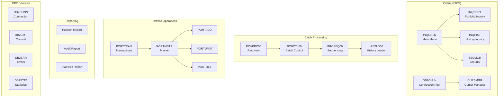

# Investment Portfolio Management System

Welcome to the technical documentation for the **Investment Portfolio Management System** (IPMS). This documentation covers all COBOL programs and copybooks that make up the system.

## System Overview

The Investment Portfolio Management System is an enterprise mainframe application built with COBOL, CICS, and DB2. It provides comprehensive portfolio tracking, transaction processing, and reporting capabilities for financial institutions.

## Program Categories

### Batch Processing (5 programs)
Programs that manage batch job execution, sequencing, and checkpoint/restart capabilities:
- [BCHCTL00](/docs/programs/BCHCTL00) - Batch Control Processor
- [CKPRST](/docs/programs/CKPRST) - Checkpoint/Restart Utility
- [HISTLD00](/docs/programs/HISTLD00) - History Data Loader
- [PRCSEQ00](/docs/programs/PRCSEQ00) - Process Sequence Manager
- [RCVPRC00](/docs/programs/RCVPRC00) - Process Recovery Handler

### CICS Online (8 programs)
Online transaction programs running under CICS:
- [CURSMGR](/docs/programs/CURSMGR) - DB2 Cursor Manager
- [DB2ONLN](/docs/programs/DB2ONLN) - Online DB2 Connection Pool
- [DB2RECV](/docs/programs/DB2RECV) - Online DB2 Recovery
- [ERRHNDL](/docs/programs/ERRHNDL) - Online Error Handler
- [INQHIST](/docs/programs/INQHIST) - History Inquiry
- [INQONLN](/docs/programs/INQONLN) - Main Online Menu
- [INQPORT](/docs/programs/INQPORT) - Portfolio Inquiry
- [SECMGR](/docs/programs/SECMGR) - Security Manager

### DB2 Database (4 programs)
Reusable DB2 service programs:
- [DB2CMT](/docs/programs/DB2CMT) - Commit Controller
- [DB2CONN](/docs/programs/DB2CONN) - Connection Manager
- [DB2ERR](/docs/programs/DB2ERR) - Error Handler
- [DB2STAT](/docs/programs/DB2STAT) - Statistics Collector

### Portfolio Management (9 programs)
Core business logic for portfolio operations:
- [PORTADD](/docs/programs/PORTADD) - Add Portfolio Records
- [PORTDEL](/docs/programs/PORTDEL) - Delete Portfolio Records
- [PORTMSTR](/docs/programs/PORTMSTR) - Portfolio Master Maintenance
- [PORTREAD](/docs/programs/PORTREAD) - Read Portfolio Records
- [PORTTEST](/docs/programs/PORTTEST) - Generate Test Data
- [PORTTRAN](/docs/programs/PORTTRAN) - Transaction Processing
- [PORTUPDT](/docs/programs/PORTUPDT) - Update Portfolio Records
- [PORTVALD](/docs/programs/PORTVALD) - Portfolio Validation
- [POSUPDT](/docs/programs/POSUPDT) - Position Update (stub)

### Reporting (5 programs)
Report generation programs:
- [RPTAUD00](/docs/programs/RPTAUD00) - Audit Report Generator
- [RPTPOS00](/docs/programs/RPTPOS00) - Position Report Generator
- [RPTSTA00](/docs/programs/RPTSTA00) - Statistics Report Generator
- [RTNANA00](/docs/programs/RTNANA00) - Return Code Analyzer
- [RTNCDE00](/docs/programs/RTNCDE00) - Return Code Handler

### Error Handling (2 programs)
Centralized error processing:
- [AUDPROC](/docs/programs/AUDPROC) - Audit Processor
- [ERRPROC](/docs/programs/ERRPROC) - Error Processor

### Testing & Utilities (5 programs)
Test and maintenance utilities:
- [TSTGEN00](/docs/programs/TSTGEN00) - Test Data Generator
- [TSTVAL00](/docs/programs/TSTVAL00) - Test Validation Suite
- [UTLMNT00](/docs/programs/UTLMNT00) - File Maintenance Utility
- [UTLMON00](/docs/programs/UTLMON00) - System Monitor
- [UTLVAL00](/docs/programs/UTLVAL00) - Data Validation Utility

### Templates (4 programs)
Reference implementations and starting points:
- [DB2-HANDLING](/docs/programs/DB2-HANDLING) - DB2 Operations Template
- [ERRHANDL](/docs/programs/ERRHANDL) - Error Handling Template
- [FILE-HANDLING](/docs/programs/FILE-HANDLING) - File I/O Template
- [PROGNAME](/docs/programs/PROGNAME) - Standard Program Template

## Copybooks

The system uses 21 shared copybooks organized by function:

### Batch Copybooks
- [BCHCTL](/docs/copybooks/BCHCTL) - Batch Control Record
- [BCHCON](/docs/copybooks/BCHCON) - Batch Constants
- [CKPRST](/docs/copybooks/CKPRST) - Checkpoint/Restart Structure
- [PRCSEQ](/docs/copybooks/PRCSEQ) - Process Sequence Record

### Common Copybooks
- [AUDITLOG](/docs/copybooks/AUDITLOG) - Audit Trail Record
- [ERRHAND](/docs/copybooks/ERRHAND) - Error Handling (Batch)
- [HISTREC](/docs/copybooks/HISTREC) - History Record
- [PORTFLIO](/docs/copybooks/PORTFLIO) - Portfolio Master Record
- [PORTVAL](/docs/copybooks/PORTVAL) - Portfolio Validation Rules
- [POSREC](/docs/copybooks/POSREC) - Position Record
- [RETHND](/docs/copybooks/RETHND) - Return Handling
- [RTNCODE](/docs/copybooks/RTNCODE) - Return Code Management
- [TRNREC](/docs/copybooks/TRNREC) - Transaction Record

### DB2 Copybooks
- [DBPROC](/docs/copybooks/DBPROC) - DB2 Standard Procedures
- [DBTBLS](/docs/copybooks/DBTBLS) - DB2 Table Definitions
- [SQLCA](/docs/copybooks/SQLCA) - SQL Communication Area

### Online Copybooks
- [DB2REQ](/docs/copybooks/DB2REQ) - DB2 Request Area
- [DB2STAT](/docs/copybooks/DB2STAT) - DB2 Statistics Record
- [ERRHND](/docs/copybooks/ERRHND) - Error Handling (Online)
- [INQCOM](/docs/copybooks/INQCOM) - Inquiry Communication Area
- [PORTREC](/docs/copybooks/PORTREC) - Portfolio Position Record

## Technology Stack

| Component | Technology |
|-----------|------------|
| Language | COBOL (IBM Enterprise COBOL) |
| Transaction Monitor | CICS |
| Database | DB2 |
| File System | VSAM (KSDS, ESDS) |
| Job Scheduling | JCL with JES2 |
| Operating System | z/OS |

## Getting Started

1. **For Developers**: Start with the [Templates](#templates-4-programs) section to understand the standard patterns used throughout the system.

2. **For Analysts**: Review the [Portfolio Management](#portfolio-management-9-programs) programs to understand the core business logic.

3. **For Operations**: Check the [Batch Processing](#batch-processing-5-programs) programs for job sequencing and recovery procedures.

## Key Concepts

### VSAM File Organization
Most data files use VSAM KSDS (Key-Sequenced Data Set) organization with composite keys for efficient access patterns.

### Checkpoint/Restart
Long-running batch programs implement checkpoint/restart using [CKPRST](/docs/programs/CKPRST) for recovery after failures.

### Centralized Error Handling
All programs use standardized error handling via [ERRPROC](/docs/programs/ERRPROC) (batch) or [ERRHNDL](/docs/programs/ERRHNDL) (online).

### Return Code Standards
| Code | Meaning |
|------|---------|
| 0 | Success |
| 4 | Warning |
| 8 | Error |
| 12 | Severe Error |
| 16 | Critical Error |
