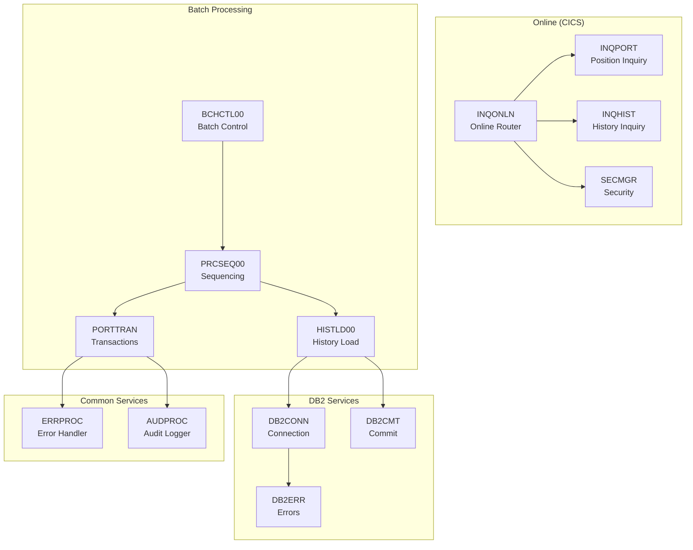
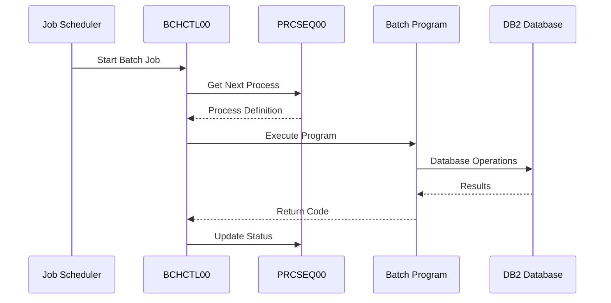
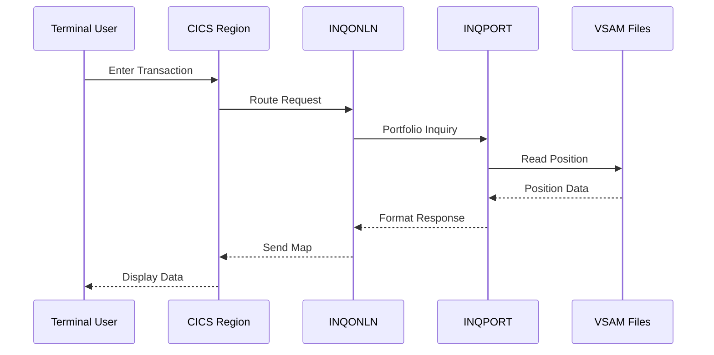

# Investment Portfolio Management System

Welcome to the technical documentation for the **Investment Portfolio Management System (IPMS)** - a comprehensive COBOL-based application for managing investment portfolios, transactions, and reporting.

## System Overview

The Investment Portfolio Management System is a mainframe application built with **COBOL**, **DB2**, and **CICS** that provides:

- **Portfolio Management**: Create, read, update, and delete portfolio records
- **Transaction Processing**: Handle buy, sell, transfer, and fee transactions
- **Position Tracking**: Maintain current position records with cost basis and market value
- **History Management**: Archive and query historical transaction data
- **Reporting**: Generate audit, position, and status reports
- **Online Inquiry**: CICS-based real-time portfolio and history inquiries

## Architecture

## Program Categories

The system consists of **42 programs** organized into functional categories:

| Category | Programs | Description |
|----------|:--------:|-------------|
| [Batch Control](/docs/category/batch-control-programs) | 4 | Job control, sequencing, and recovery |
| [Batch Processing](/docs/category/batch-processing-programs) | 2 | Data loading and position updates |
| [Batch Reporting](/docs/category/batch-reporting-programs) | 5 | Audit, position, and status reports |
| [CICS Online](/docs/category/cics-online-programs) | 6 | Online inquiry transactions |
| [DB2 Services](/docs/category/db2-service-programs) | 6 | Database connection and transaction management |
| [Portfolio Management](/docs/category/portfolio-management-programs) | 8 | Portfolio CRUD operations |
| [Common Services](/docs/category/common-service-programs) | 2 | Shared error and audit services |
| [Utilities](/docs/category/utility-programs) | 3 | System maintenance and monitoring |
| [Testing](/docs/category/testing-programs) | 2 | Test data generation and validation |
| [Templates](/docs/category/template-programs) | 4 | Reference implementation patterns |

## Copybooks

The system uses **21 shared copybooks** that define common data structures:

| Category | Copybooks | Purpose |
|----------|:---------:|---------|
| [Batch](/docs/category/batch-copybooks) | 4 | Batch control and sequencing structures |
| [Common](/docs/category/common-copybooks) | 10 | Shared records, error handling, validation |
| [DB2](/docs/category/db2-copybooks) | 3 | SQLCA, host variables, table definitions |
| [Online](/docs/category/online-copybooks) | 3 | CICS communication areas |

## Key Data Flows

### Batch Processing Flow

### Online Inquiry Flow

## Technology Stack

| Component | Technology |
|-----------|------------|
| Language | COBOL (Enterprise COBOL for z/OS) |
| Database | IBM DB2 for z/OS |
| Transaction Manager | IBM CICS Transaction Server |
| File System | VSAM (KSDS, ESDS) |
| Reporting | Sequential files with 132-byte records |
| Job Scheduling | JCL with conditional execution |

## Getting Started

### For Developers
1. Start with the [Templates](/docs/category/template-programs) to understand coding patterns
2. Review the [Common Copybooks](/docs/category/common-copybooks) for shared data structures
3. Explore specific program categories based on your area of work

### For Operations
1. Review [Batch Control](/docs/category/batch-control-programs) for job scheduling
2. Check [Utilities](/docs/category/utility-programs) for maintenance procedures
3. See [Batch Reporting](/docs/category/batch-reporting-programs) for output specifications

### For Analysts
1. Explore [Portfolio Management](/docs/category/portfolio-management-programs) for business logic
2. Review the copybooks for data structure definitions
3. Check the data flow diagrams in this introduction

## Documentation Conventions

Throughout this documentation:

- **Program names** are shown in CAPS (e.g., `BCHCTL00`)
- **Copybook names** are shown in CAPS (e.g., `ERRHAND`)
- **Field names** use their COBOL names with hyphens (e.g., `WS-RETURN-CODE`)
- **88-level conditions** are documented with their valid values
- **Mermaid diagrams** visualize program structure and data flows
- **Code examples** demonstrate proper usage patterns

## Return Code Standards

All batch programs follow standard return code conventions:

| Code | Meaning | Action |
|:----:|---------|--------|
| 0 | Success | Continue processing |
| 4 | Warning | Continue with caution |
| 8 | Error | Stop current step |
| 12 | Severe Error | Abort job |
| 16 | Critical | Immediate termination |

## Support

For questions about this documentation or the system itself, contact the development team or refer to the operational runbooks.
