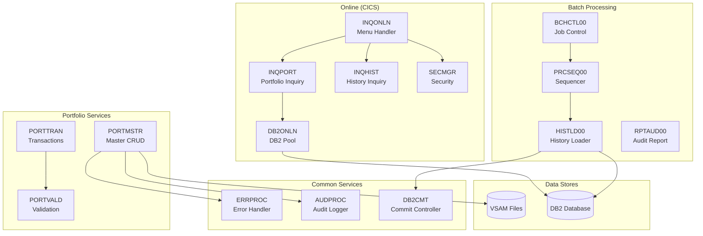

# Portfolio Management System

Welcome to the documentation for the **Portfolio Management System**, a comprehensive COBOL-based application for managing investment portfolios, processing transactions, and generating reports.

## System Overview

This system consists of **42 COBOL programs** and **21 copybooks** organized into the following functional areas:

### Batch Processing

The batch subsystem handles scheduled processing, including:

- **Job Control**: [BCHCTL00](/docs/programs/BCHCTL00) - Batch control processor for job lifecycle management
- **Checkpoint/Restart**: [CKPRST](/docs/programs/CKPRST) - Checkpoint/restart services for recovery
- **Process Sequencing**: [PRCSEQ00](/docs/programs/PRCSEQ00) - Process sequence manager for job orchestration
- **Recovery**: [RCVPRC00](/docs/programs/RCVPRC00) - Process recovery handler for failed jobs
- **History Loading**: [HISTLD00](/docs/programs/HISTLD00) - Position history DB2 loader
- **Reporting**: [RPTAUD00](/docs/programs/RPTAUD00), [RPTPOS00](/docs/programs/RPTPOS00), [RPTSTA00](/docs/programs/RPTSTA00) - Audit, position, and statistics reports
- **Return Code Management**: [RTNANA00](/docs/programs/RTNANA00), [RTNCDE00](/docs/programs/RTNCDE00) - Return code analysis and handling

### CICS Online Programs

The online subsystem provides real-time transaction processing:

- **Inquiry**: [INQONLN](/docs/programs/INQONLN), [INQPORT](/docs/programs/INQPORT), [INQHIST](/docs/programs/INQHIST) - Online inquiry handlers
- **DB2 Services**: [DB2ONLN](/docs/programs/DB2ONLN), [DB2RECV](/docs/programs/DB2RECV), [CURSMGR](/docs/programs/CURSMGR) - DB2 connection and cursor management
- **Security**: [SECMGR](/docs/programs/SECMGR) - Security manager for authentication and authorization
- **Error Handling**: [ERRHNDL](/docs/programs/ERRHNDL) - Centralized CICS error handler

### Portfolio Management

Core portfolio operations are handled by:

- **CRUD Operations**: [PORTADD](/docs/programs/PORTADD), [PORTREAD](/docs/programs/PORTREAD), [PORTUPDT](/docs/programs/PORTUPDT), [PORTDEL](/docs/programs/PORTDEL) - Portfolio record management
- **Master Service**: [PORTMSTR](/docs/programs/PORTMSTR) - Portfolio master CRUD subprogram
- **Transactions**: [PORTTRAN](/docs/programs/PORTTRAN) - Transaction processor for buy/sell/transfer
- **Validation**: [PORTVALD](/docs/programs/PORTVALD) - Portfolio data validation
- **Testing**: [PORTTEST](/docs/programs/PORTTEST) - Test data generator

### Common Services

Reusable service components include:

- **Audit**: [AUDPROC](/docs/programs/AUDPROC) - Audit trail logging service
- **DB2 Services**: [DB2CMT](/docs/programs/DB2CMT), [DB2CONN](/docs/programs/DB2CONN), [DB2ERR](/docs/programs/DB2ERR), [DB2STAT](/docs/programs/DB2STAT) - DB2 commit, connection, error, and statistics handling
- **Error Processing**: [ERRPROC](/docs/programs/ERRPROC) - Centralized error processor

### Utilities

System utilities for maintenance and monitoring:

- **Maintenance**: [UTLMNT00](/docs/programs/UTLMNT00) - File maintenance utility
- **Monitoring**: [UTLMON00](/docs/programs/UTLMON00) - System monitoring utility
- **Validation**: [UTLVAL00](/docs/programs/UTLVAL00) - Data validation utility

### Testing Programs

Quality assurance support:

- **Test Generation**: [TSTGEN00](/docs/programs/TSTGEN00) - Test data generator
- **Test Validation**: [TSTVAL00](/docs/programs/TSTVAL00) - Test validation suite

### Templates

Development templates for new programs:

- **DB2 Handling**: [DB2-HANDLING](/docs/programs/DB2-HANDLING) - DB2 operations template
- **Error Handling**: [ERRHANDL](/docs/programs/ERRHANDL) - Error handling template
- **File Handling**: [FILE-HANDLING](/docs/programs/FILE-HANDLING) - File I/O template
- **Program Structure**: [PROGNAME](/docs/programs/PROGNAME) - Standard program template

## Copybook Library

The system uses shared copybooks organized by function:

### Batch Copybooks
- [BCHCTL](/docs/copybooks/BCHCTL) - Batch control record
- [BCHCON](/docs/copybooks/BCHCON) - Batch constants
- [CKPRST](/docs/copybooks/CKPRST) - Checkpoint/restart control
- [PRCSEQ](/docs/copybooks/PRCSEQ) - Process sequence record

### Common Copybooks
- [AUDITLOG](/docs/copybooks/AUDITLOG) - Audit trail record
- [COMMON](/docs/copybooks/COMMON) - Common definitions
- [ERRHAND](/docs/copybooks/ERRHAND) - Error handling (batch)
- [HISTREC](/docs/copybooks/HISTREC) - History record
- [PORTFLIO](/docs/copybooks/PORTFLIO) - Portfolio master record
- [PORTVAL](/docs/copybooks/PORTVAL) - Portfolio validation
- [POSREC](/docs/copybooks/POSREC) - Position record
- [RETHND](/docs/copybooks/RETHND) - Return handling
- [RTNCODE](/docs/copybooks/RTNCODE) - Return code management
- [TRNREC](/docs/copybooks/TRNREC) - Transaction record

### DB2 Copybooks
- [DBPROC](/docs/copybooks/DBPROC) - DB2 procedures
- [DBTBLS](/docs/copybooks/DBTBLS) - DB2 table definitions
- [SQLCA](/docs/copybooks/SQLCA) - SQL communication area

### Online Copybooks
- [DB2REQ](/docs/copybooks/DB2REQ) - DB2 request structure
- [ERRHND](/docs/copybooks/ERRHND) - Error handling (online)
- [INQCOM](/docs/copybooks/INQCOM) - Inquiry communication area

## Architecture

## Getting Started

1. **Browse Programs**: Use the sidebar to navigate to individual program documentation
2. **Understand Data Structures**: Review the [copybook documentation](/docs/copybooks/PORTFLIO) to understand data layouts
3. **Follow Dependencies**: Each program document lists its dependencies and related programs
4. **Use Templates**: Start new development using the [template programs](/docs/programs/PROGNAME)

## Technology Stack

| Component | Technology |
|-----------|------------|
| Language | COBOL (IBM Enterprise COBOL) |
| Database | IBM DB2 |
| Online | IBM CICS |
| Files | VSAM (KSDS, ESDS) |
| JCL | IBM z/OS JCL |
| Platform | IBM z/OS Mainframe |
