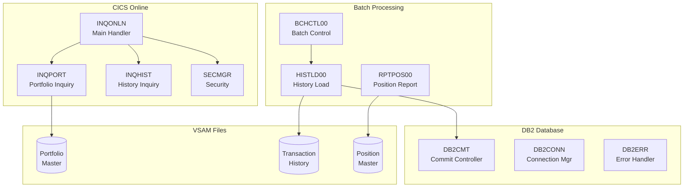

# Portfolio Management System

Welcome to the technical documentation for the Portfolio Management System COBOL application suite. This documentation provides comprehensive details about the programs, copybooks, and data structures that make up the system.

## System Overview

The Portfolio Management System is an enterprise-grade financial application built on IBM mainframe technology. It handles:

- **Portfolio Management** - Creation, maintenance, and deletion of investment portfolios
- **Transaction Processing** - Buy, sell, transfer, and fee transactions
- **Position Tracking** - Real-time and historical position management
- **Reporting** - Daily reports, audit trails, and statistical analysis
- **Online Inquiry** - CICS-based user interfaces for portfolio lookup

## Architecture

## Program Categories

### Batch Programs (6 programs)
Programs that run in batch mode for scheduled processing, data loads, and checkpoint/restart operations.

| Program | Description |
|---------|-------------|
| [BCHCTL00](programs/BCHCTL00) | Batch Control Processor |
| [CKPRST](programs/CKPRST) | Checkpoint/Restart Utility |
| [HISTLD00](programs/HISTLD00) | Position History DB2 Load Program |
| [PRCSEQ00](programs/PRCSEQ00) | Process Sequence Manager |
| [RCVPRC00](programs/RCVPRC00) | Process Recovery Handler |
| [POSUPDT](programs/POSUPDT) | Position Update |

### CICS/Online Programs (8 programs)
Programs that handle real-time user interactions through CICS terminals.

| Program | Description |
|---------|-------------|
| [CURSMGR](programs/CURSMGR) | Cursor Management for Online Programs |
| [DB2ONLN](programs/DB2ONLN) | Online DB2 Connection Manager |
| [DB2RECV](programs/DB2RECV) | DB2 Recovery Manager for Online Programs |
| [ERRHNDL](programs/ERRHNDL) | Centralized Error Handler (CICS) |
| [INQHIST](programs/INQHIST) | Transaction History Inquiry Handler |
| [INQONLN](programs/INQONLN) | Portfolio Online Inquiry Main Handler |
| [INQPORT](programs/INQPORT) | Portfolio Position Inquiry Handler |
| [SECMGR](programs/SECMGR) | Security Manager for Online Programs |

### DB2/Database Programs (4 programs)
Programs that manage database connections, transactions, and error handling.

| Program | Description |
|---------|-------------|
| [DB2CMT](programs/DB2CMT) | DB2 Commit Controller |
| [DB2CONN](programs/DB2CONN) | DB2 Connection Manager |
| [DB2ERR](programs/DB2ERR) | DB2 SQL Error Handler |
| [DB2STAT](programs/DB2STAT) | DB2 Statistics Collector |

### Portfolio Programs (7 programs)
Core programs for portfolio data management and transaction processing.

| Program | Description |
|---------|-------------|
| [PORTADD](programs/PORTADD) | Portfolio Addition Program |
| [PORTDEL](programs/PORTDEL) | Portfolio Deletion Program |
| [PORTMSTR](programs/PORTMSTR) | Portfolio Master File Maintenance |
| [PORTREAD](programs/PORTREAD) | Portfolio Record Reading Program |
| [PORTTRAN](programs/PORTTRAN) | Portfolio Transaction Processing |
| [PORTUPDT](programs/PORTUPDT) | Portfolio Update Program |
| [PORTVALD](programs/PORTVALD) | Portfolio Validation Subroutine |

### Reporting Programs (4 programs)
Programs that generate reports for operations, audit, and analysis.

| Program | Description |
|---------|-------------|
| [RPTAUD00](programs/RPTAUD00) | Audit Report Generator |
| [RPTPOS00](programs/RPTPOS00) | Daily Position Report Generator |
| [RPTSTA00](programs/RPTSTA00) | System Statistics Report Generator |
| [RTNANA00](programs/RTNANA00) | Return Code Analysis Utility |

### Utility Programs (6 programs)
Common utilities for error handling, validation, and system maintenance.

| Program | Description |
|---------|-------------|
| [AUDPROC](programs/AUDPROC) | Audit Trail Processing Subroutine |
| [ERRPROC](programs/ERRPROC) | Error Processing Subroutine |
| [RTNCDE00](programs/RTNCDE00) | Standard Return Code Handler |
| [UTLMNT00](programs/UTLMNT00) | File Maintenance Utility |
| [UTLMON00](programs/UTLMON00) | System Monitoring Utility |
| [UTLVAL00](programs/UTLVAL00) | Data Validation Utility |

### Testing Programs (3 programs)
Programs for test data generation and validation.

| Program | Description |
|---------|-------------|
| [PORTTEST](programs/PORTTEST) | Portfolio Test Data Generator |
| [TSTGEN00](programs/TSTGEN00) | Test Data Generator |
| [TSTVAL00](programs/TSTVAL00) | Test Validation Suite |

## Key Copybooks

Copybooks define reusable data structures shared across programs:

### Data Records
- [PORTFLIO](copybooks/PORTFLIO) - Portfolio master record layout
- [TRNREC](copybooks/TRNREC) - Transaction record structure
- [POSREC](copybooks/POSREC) - Position record structure

### Error Handling
- [ERRHAND](copybooks/ERRHAND) - Batch error handling structures
- [ERRHND](copybooks/ERRHND) - Online (CICS) error handling structures

### Database
- [SQLCA](copybooks/SQLCA) - SQL Communication Area
- [DBPROC](copybooks/DBPROC) - Database procedure definitions

### Batch Control
- [CKPRST](copybooks/CKPRST) - Checkpoint/restart control structure
- [BCHCTL](copybooks/BCHCTL) - Batch control record layout

## Technology Stack

| Component | Technology |
|-----------|------------|
| Language | COBOL (Enterprise COBOL for z/OS) |
| Database | IBM DB2 for z/OS |
| Transaction Monitor | IBM CICS |
| File System | VSAM (KSDS, ESDS, RRDS) |
| Job Control | JCL (Job Control Language) |
| Operating System | z/OS |

## Documentation Conventions

Throughout this documentation:

- **Program names** are shown in uppercase (e.g., `HISTLD00`)
- **Copybook names** are shown in uppercase (e.g., `PORTFLIO`)
- **Field names** use their COBOL names (e.g., `PORT-ACCOUNT-NO`)
- **88-level conditions** are documented with their values
- **Mermaid diagrams** illustrate program flow and relationships

## Getting Started

1. **New to the system?** Start with the [Portfolio Programs](programs/PORTMSTR) to understand core data structures
2. **Working on batch jobs?** Review [Batch Programs](programs/BCHCTL00) and [CKPRST](copybooks/CKPRST) copybook
3. **Developing online screens?** See [CICS/Online Programs](programs/INQONLN) section
4. **Debugging errors?** Check [ERRHAND](copybooks/ERRHAND) and [DB2ERR](programs/DB2ERR)

## Statistics

| Metric | Count |
|--------|-------|
| Total Programs | 42 |
| Total Copybooks | 20 |
| Batch Programs | 6 |
| Online Programs | 8 |
| Database Programs | 4 |
| Portfolio Programs | 7 |
| Reporting Programs | 4 |
| Utility Programs | 6 |
| Testing Programs | 3 |
| Template Programs | 4 |
