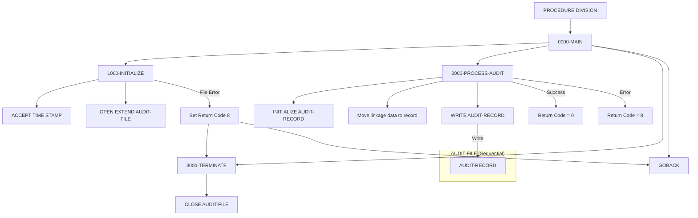

## Overview

AUDPROC is a reusable subroutine that provides centralized audit trail logging services. It accepts audit information from calling programs through the linkage section and writes formatted audit records to a sequential audit log file.

The program serves as a standardized audit service that can be called by any application program needing to log:
- User actions (login, logout, data access)
- Transaction events (create, update, delete operations)
- System events (startup, shutdown, processing milestones)

By centralizing audit logging in a single subroutine, the system ensures consistent audit record formatting, timestamp handling, and file management across all applications.

## Program Structure



## Data Structures

### Working Storage

| Level | Name | Picture | Description |
|-------|------|---------|-------------|
| 01 | WS-FILE-STATUS | X(2) | File status code for AUDIT-FILE |
| 01 | WS-FORMATTED-TIME | X(26) | Formatted timestamp from system |

### Linkage Section

The `LS-AUDIT-REQUEST` structure is passed by calling programs:

| Level | Name | Picture | Description |
|-------|------|---------|-------------|
| 01 | LS-AUDIT-REQUEST | - | Audit request input structure |
| 05 | LS-SYSTEM-INFO | - | System context information |
| 10 | LS-SYSTEM-ID | X(8) | System identifier |
| 10 | LS-USER-ID | X(8) | User identifier |
| 10 | LS-PROGRAM | X(8) | Calling program name |
| 10 | LS-TERMINAL | X(8) | Terminal/session ID |
| 05 | LS-TYPE | X(4) | Audit type code |
| 05 | LS-ACTION | X(8) | Action being audited |
| 05 | LS-STATUS | X(4) | Status of the action |
| 05 | LS-KEY-INFO | - | Business key information |
| 10 | LS-PORT-ID | X(8) | Portfolio ID |
| 10 | LS-ACCT-NO | X(10) | Account number |
| 05 | LS-BEFORE-IMAGE | X(100) | Data before change |
| 05 | LS-AFTER-IMAGE | X(100) | Data after change |
| 05 | LS-MESSAGE | X(100) | Additional message text |
| 05 | LS-RETURN-CODE | S9(4) COMP | Return code (output) |

### File Section (AUDITLOG Copybook)

The `AUDIT-RECORD` structure defines the audit log record format:

| Level | Name | Picture | Description |
|-------|------|---------|-------------|
| 01 | AUDIT-RECORD | - | Audit log record |
| 05 | AUD-HEADER | - | Record header |
| 10 | AUD-TIMESTAMP | X(26) | Event timestamp |
| 10 | AUD-SYSTEM-ID | X(8) | System identifier |
| 10 | AUD-USER-ID | X(8) | User identifier |
| 10 | AUD-PROGRAM | X(8) | Program name |
| 10 | AUD-TERMINAL | X(8) | Terminal ID |
| 05 | AUD-TYPE | X(4) | Audit type |
| 05 | AUD-ACTION | X(8) | Action code |
| 05 | AUD-STATUS | X(4) | Status code |
| 05 | AUD-KEY-INFO | - | Key information |
| 10 | AUD-PORTFOLIO-ID | X(8) | Portfolio ID |
| 10 | AUD-ACCOUNT-NO | X(10) | Account number |
| 05 | AUD-BEFORE-IMAGE | X(100) | Before image |
| 05 | AUD-AFTER-IMAGE | X(100) | After image |
| 05 | AUD-MESSAGE | X(100) | Message text |

#### Audit Type Values (AUD-TYPE)

| Value | 88-Level Name | Meaning |
|-------|---------------|---------|
| `'TRAN'` | AUD-TRANSACTION | Transaction event |
| `'USER'` | AUD-USER-ACTION | User-initiated action |
| `'SYST'` | AUD-SYSTEM-EVENT | System event |

#### Audit Action Values (AUD-ACTION)

| Value | 88-Level Name | Meaning |
|-------|---------------|---------|
| `'CREATE'` | AUD-CREATE | Record created |
| `'UPDATE'` | AUD-UPDATE | Record updated |
| `'DELETE'` | AUD-DELETE | Record deleted |
| `'INQUIRE'` | AUD-INQUIRE | Record viewed |
| `'LOGIN'` | AUD-LOGIN | User login |
| `'LOGOUT'` | AUD-LOGOUT | User logout |
| `'STARTUP'` | AUD-STARTUP | System startup |
| `'SHUTDOWN'` | AUD-SHUTDOWN | System shutdown |

#### Audit Status Values (AUD-STATUS)

| Value | 88-Level Name | Meaning |
|-------|---------------|---------|
| `'SUCC'` | AUD-SUCCESS | Successful operation |
| `'FAIL'` | AUD-FAILURE | Failed operation |
| `'WARN'` | AUD-WARNING | Warning issued |

## File I/O

### AUDIT-FILE

| Property | Value |
|----------|-------|
| DD Name | AUDFILE |
| Organization | SEQUENTIAL |
| Recording Mode | F (Fixed) |
| Access Mode | EXTEND (append) |
| File Status | WS-FILE-STATUS |

The audit file is opened in EXTEND mode, which positions the file pointer at the end of the file so new records are appended rather than overwriting existing records. This preserves the complete audit trail.

### File Operations

| Paragraph | Operation | Description |
|-----------|-----------|-------------|
| 1000-INITIALIZE | OPEN EXTEND | Opens file for appending |
| 2000-PROCESS-AUDIT | WRITE | Writes the audit record |
| 3000-TERMINATE | CLOSE | Closes the audit file |

## Control Flow

### 0000-MAIN

The main entry point that orchestrates the three processing phases sequentially:
1. Initialize - Set up timestamp and open file
2. Process - Build and write the audit record
3. Terminate - Close the file
4. Return to caller via GOBACK

### 1000-INITIALIZE

Performs startup activities:
1. **ACCEPT WS-FORMATTED-TIME FROM TIME STAMP**: Retrieves the current system timestamp in ISO format (26 characters: `YYYY-MM-DD-HH.MM.SS.FFFFFF`)
2. **OPEN EXTEND AUDIT-FILE**: Opens the audit file in extend mode for appending
3. **Error Handling**: If the file fails to open:
   - Displays an error message with the file status code
   - Sets LS-RETURN-CODE to 8
   - Performs 3000-TERMINATE to close resources
   - Returns to caller immediately via GOBACK

### 2000-PROCESS-AUDIT

Builds and writes the audit record:
1. **INITIALIZE AUDIT-RECORD**: Clears the record area to spaces/zeros
2. **Move data from linkage to record**:
   - Timestamp from working storage
   - System info, type, action, status from linkage
   - Key info, before/after images, message from linkage
3. **WRITE AUDIT-RECORD**: Writes the record to the file
4. **Set return code**: 0 for success, 8 for write error

### 3000-TERMINATE

Closes the audit file. This paragraph is called both at normal completion and during error recovery.

## Usage Example

Calling programs should use AUDPROC as follows:

```cobol
WORKING-STORAGE SECTION.
01  WS-AUDIT-REQUEST.
    05  WS-SYSTEM-INFO.
        10  WS-SYSTEM-ID    PIC X(8).
        10  WS-USER-ID      PIC X(8).
        10  WS-PROGRAM      PIC X(8).
        10  WS-TERMINAL     PIC X(8).
    05  WS-TYPE            PIC X(4).
    05  WS-ACTION          PIC X(8).
    05  WS-STATUS          PIC X(4).
    05  WS-KEY-INFO.
        10  WS-PORT-ID     PIC X(8).
        10  WS-ACCT-NO     PIC X(10).
    05  WS-BEFORE-IMAGE    PIC X(100).
    05  WS-AFTER-IMAGE     PIC X(100).
    05  WS-MESSAGE         PIC X(100).
    05  WS-RETURN-CODE     PIC S9(4) COMP.

PROCEDURE DIVISION.
    ...
    * Log a successful portfolio update
    MOVE 'PMSYSTEM' TO WS-SYSTEM-ID
    MOVE 'JSMITH'   TO WS-USER-ID
    MOVE 'PORTMSTR' TO WS-PROGRAM
    MOVE 'TRM001'   TO WS-TERMINAL
    MOVE 'TRAN'     TO WS-TYPE
    MOVE 'UPDATE'   TO WS-ACTION
    MOVE 'SUCC'     TO WS-STATUS
    MOVE 'PORT001'  TO WS-PORT-ID
    MOVE '1234567890' TO WS-ACCT-NO
    MOVE OLD-PORTFOLIO-DATA TO WS-BEFORE-IMAGE
    MOVE NEW-PORTFOLIO-DATA TO WS-AFTER-IMAGE
    MOVE 'Portfolio balance updated' TO WS-MESSAGE
    
    CALL 'AUDPROC' USING WS-AUDIT-REQUEST
    
    IF WS-RETURN-CODE NOT = 0
        DISPLAY 'Audit logging failed'
    END-IF
    ...
```

## Dependencies

### Copybooks

- **AUDITLOG** - Audit trail record structure with type codes, action codes, and status values

### Called Programs

None - AUDPROC is a leaf-level service module.

### Related Programs

- **RPTAUD00** - Reads the audit file generated by AUDPROC to produce audit reports

Any program that needs to log audit events will call AUDPROC. Programs using the AUDITLOG copybook format are potential callers.

## Return Codes

| Code | Meaning |
|------|---------|
| 0 | Successful - audit record written |
| 8 | Error - file open or write failed |

## Technical Notes

### COBOL Constructs Used

- **ACCEPT FROM TIME STAMP**: An IBM extension that retrieves the current system timestamp in a 26-character ISO format (`YYYY-MM-DD-HH.MM.SS.FFFFFF`). This provides microsecond precision for audit timestamps.

- **OPEN EXTEND**: Opens a sequential file for output, positioning at the end of existing data. New records are appended rather than overwriting. This is essential for audit logs where historical records must be preserved.

- **INITIALIZE**: Sets all elementary items in a group to their default values (spaces for alphanumeric, zeros for numeric). This ensures no residual data from previous operations appears in the audit record.

- **PROCEDURE DIVISION USING**: Defines the linkage section parameter(s) that the program receives when called. The calling program passes LS-AUDIT-REQUEST by reference.

- **GOBACK**: Returns control to the calling program. Unlike STOP RUN, GOBACK preserves the run unit, allowing the calling program to continue execution.

### Configuration Section

The program specifies IBM z/OS as both source and object computer:
```cobol
SOURCE-COMPUTER. IBM-ZOS.
OBJECT-COMPUTER. IBM-ZOS.
```

This indicates the program is designed for mainframe execution.

### Record Layout Mapping

The linkage section fields map directly to the AUDIT-RECORD fields:

| Linkage Field | Audit Record Field |
|---------------|-------------------|
| (system timestamp) | AUD-TIMESTAMP |
| LS-SYSTEM-INFO | AUD-HEADER (partial) |
| LS-TYPE | AUD-TYPE |
| LS-ACTION | AUD-ACTION |
| LS-STATUS | AUD-STATUS |
| LS-KEY-INFO | AUD-KEY-INFO |
| LS-BEFORE-IMAGE | AUD-BEFORE-IMAGE |
| LS-AFTER-IMAGE | AUD-AFTER-IMAGE |
| LS-MESSAGE | AUD-MESSAGE |
